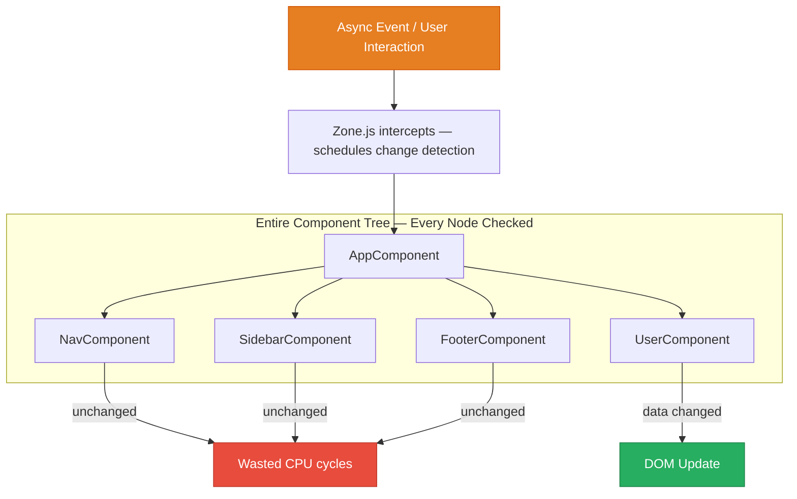
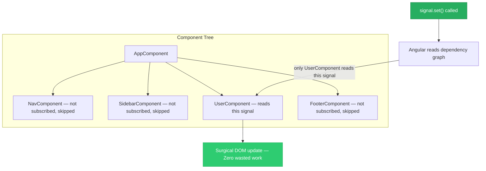

# 06 — Angular Signals (Fine-Grained Reactivity)

> **TL;DR:** Signals are Angular's modern reactive primitive — synchronous, fine-grained, and Zone.js-independent. Use them for local component state and derived values. Bridge to RxJS with `toSignal()` and `toObservable()`. NgRx Signal Store brings signals to global state.

---

## 1. Why Signals Exist

### The Problem with Zone.js-Based Change Detection



Angular doesn't know WHICH component's data changed — it checks all of them.

### What Signals Solve



Signals create an explicit dependency graph. Angular tracks which template reads which signal, and updates only the relevant parts.

---

## 2. Core Primitives

### `signal()` — Writable Reactive Value

```typescript
import { signal } from '@angular/core';

@Component({
  template: `
    <p>Count: {{ count() }}</p>
    <button (click)="increment()">+</button>
  `
})
export class CounterComponent {
  count = signal(0);  // Initial value: 0

  increment() {
    this.count.update(c => c + 1);  // Immutable update
    // or:
    this.count.set(this.count() + 1);  // Direct set
  }
}
```

Signal API:
- `signal(initialValue)` — create signal
- `mySignal()` — read value (the `()` call registers a dependency)
- `mySignal.set(value)` — replace value
- `mySignal.update(fn)` — transform current value
- `mySignal.asReadonly()` — expose read-only version

### `computed()` — Derived Values (Memoized)

```typescript
import { signal, computed } from '@angular/core';

@Component({
  template: `
    <p>Items: {{ itemCount() }}</p>
    <p>Total: {{ total() | currency }}</p>
    <p>Tax: {{ tax() | currency }}</p>
  `
})
export class CartComponent {
  cartItems = signal<CartItem[]>([]);

  // Automatically recomputes when cartItems changes
  itemCount = computed(() => this.cartItems().length);

  total = computed(() =>
    this.cartItems().reduce((sum, item) => sum + item.price * item.qty, 0)
  );

  // Computed can use other computed values
  tax = computed(() => this.total() * 0.18);

  addItem(item: CartItem) {
    this.cartItems.update(items => [...items, item]);
    // itemCount, total, tax all auto-update
  }
}
```

`computed()` is:
- Lazy (only runs when read)
- Memoized (returns same value if dependencies unchanged)
- Read-only (cannot set a computed signal directly)

### `effect()` — Side Effects on Signal Change

```typescript
import { signal, effect } from '@angular/core';

@Component({ template: `` })
export class ThemeComponent {
  theme = signal<'light' | 'dark'>('light');

  constructor() {
    // Runs automatically when theme signal changes
    effect(() => {
      document.body.setAttribute('data-bs-theme', this.theme());
      localStorage.setItem('theme', this.theme());
    });
  }
}
```

`effect()` rules:
- Runs once immediately on creation
- Re-runs whenever any signal it reads changes
- Cleanup: `effect()` is automatically cleaned up when the component destroys
- Do NOT use for updating other signals (use `computed` instead)
- Use for: DOM side effects, localStorage, logging, analytics

---

## 3. Signal-Based Components (Zoneless-Ready)

Modern components built entirely with signals don't need Zone.js:

```typescript
@Component({
  standalone: true,
  changeDetection: ChangeDetectionStrategy.OnPush,
  template: `
    <div class="card">
      <div class="card-header">
        <h5>{{ title() }}</h5>
        <span class="badge bg-primary">{{ itemCount() }}</span>
      </div>
      <div class="card-body">
        @if (loading()) {
          <div class="spinner-border text-primary"></div>
        } @else if (error()) {
          <div class="alert alert-danger">{{ error() }}</div>
        } @else {
          @for (item of items(); track item.id) {
            <app-item-row [item]="item" />
          }
        }
      </div>
    </div>
  `
})
export class ItemsComponent implements OnInit {
  // Signals — reactive state
  items = signal<Item[]>([]);
  loading = signal(false);
  error = signal<string | null>(null);
  searchTerm = signal('');

  // Computed — derived state
  itemCount = computed(() => this.items().length);
  title = computed(() =>
    this.searchTerm() ? `Results for "${this.searchTerm()}"` : 'All Items'
  );
  filteredItems = computed(() => {
    const term = this.searchTerm().toLowerCase();
    return term
      ? this.items().filter(i => i.name.toLowerCase().includes(term))
      : this.items();
  });

  private itemsService = inject(ItemsService);

  ngOnInit() {
    this.loadItems();
  }

  async loadItems() {
    this.loading.set(true);
    this.error.set(null);
    try {
      const items = await firstValueFrom(this.itemsService.getItems());
      this.items.set(items);
    } catch (e: any) {
      this.error.set(e.message);
    } finally {
      this.loading.set(false);
    }
  }
}
```

---

## 4. Input Signals (Angular 17.1+)

Modern way to declare component inputs using signals:

```typescript
import { input, output, model } from '@angular/core';

@Component({
  standalone: true,
  selector: 'app-product-card',
  template: `
    <div class="card">
      <h5>{{ product().name }}</h5>
      <p>{{ product().price | currency }}</p>
      <button
        class="btn btn-primary"
        [disabled]="!inStock()"
        (click)="addToCart.emit(product())"
      >
        Add to Cart
      </button>
    </div>
  `
})
export class ProductCardComponent {
  // Required input — runtime error if not provided
  product = input.required<Product>();

  // Optional input with default
  inStock = input(true);

  // Output
  addToCart = output<Product>();

  // Two-way binding signal
  quantity = model(1);
}
```

```html
<!-- Usage -->
<app-product-card
  [product]="selectedProduct"
  [inStock]="isAvailable"
  [(quantity)]="orderQuantity"
  (addToCart)="onAddToCart($event)"
/>
```

Advantages of `input()` over `@Input()`:
- Type-safe required check at runtime
- Works with `computed()` and `effect()` directly
- No need for `ngOnChanges` — just `computed(() => this.myInput())`

---

## 5. Bridging Signals and RxJS

### `toSignal()` — Observable to Signal

```typescript
import { toSignal } from '@angular/core/rxjs-interop';

@Component({
  template: `{{ orders() | json }}`
})
export class OrdersComponent {
  private store = inject(Store);

  // Convert NgRx selector (Observable) to Signal
  orders = toSignal(
    this.store.select(selectAllOrders),
    { initialValue: [] }
  );

  loading = toSignal(
    this.store.select(selectOrdersLoading),
    { initialValue: false }
  );
}
```

`toSignal()` options:
- `initialValue` — value before first emission
- `requireSync` — assert observable is synchronous
- `injector` — provide injection context

### `toObservable()` — Signal to Observable

```typescript
import { toObservable } from '@angular/core/rxjs-interop';

@Component({ template: `` })
export class SearchComponent {
  searchTerm = signal('');

  // Convert signal to observable for RxJS operators
  searchResults$ = toObservable(this.searchTerm).pipe(
    debounceTime(300),
    distinctUntilChanged(),
    filter(term => term.length >= 2),
    switchMap(term => this.api.search(term))
  );

  // Then back to signal for template
  results = toSignal(this.searchResults$, { initialValue: [] });
}
```

### Practical Bridge Pattern

```typescript
@Component({
  standalone: true,
  changeDetection: ChangeDetectionStrategy.OnPush,
  template: `
    <input
      class="form-control"
      [value]="searchTerm()"
      (input)="searchTerm.set($event.target.value)"
    />
    @for (result of results(); track result.id) {
      <div>{{ result.name }}</div>
    }
  `
})
export class SearchComponent {
  searchTerm = signal('');

  results = toSignal(
    toObservable(this.searchTerm).pipe(
      debounceTime(300),
      distinctUntilChanged(),
      filter(t => t.length > 1),
      switchMap(t => inject(SearchApi).search(t)),
      catchError(() => of([]))
    ),
    { initialValue: [] }
  );
}
```

---

## 6. NgRx Signal Store (Modern Alternative to NgRx)

For smaller features or when you want signals throughout:

```typescript
// features/cart/cart.store.ts
import { signalStore, withState, withComputed, withMethods } from '@ngrx/signals';
import { withEntities } from '@ngrx/signals/entities';

interface CartState {
  loading: boolean;
  error: string | null;
}

export const CartStore = signalStore(
  { providedIn: 'root' },

  withState<CartState>({ loading: false, error: null }),

  withEntities<CartItem>(),

  withComputed(({ entities }) => ({
    totalItems: computed(() => entities().length),
    totalPrice: computed(() =>
      entities().reduce((sum, item) => sum + item.price * item.qty, 0)
    )
  })),

  withMethods((store, cartApi = inject(CartApiService)) => ({
    loadCart: rxMethod<void>(
      switchMap(() => {
        patchState(store, { loading: true });
        return cartApi.getCart().pipe(
          tapResponse(
            items => patchState(store, setAllEntities(items), { loading: false }),
            error => patchState(store, { error: error.message, loading: false })
          )
        );
      })
    ),

    addItem(item: CartItem) {
      patchState(store, addEntity(item));
    },

    removeItem(id: string) {
      patchState(store, removeEntity(id));
    }
  }))
);
```

```typescript
// Component using SignalStore
@Component({
  template: `
    <span class="badge">{{ cart.totalItems() }}</span>
    <span>{{ cart.totalPrice() | currency }}</span>
  `
})
export class CartIconComponent {
  cart = inject(CartStore);
}
```

---

## 7. Signals vs NgRx — When to Use Which

| Scenario | Use |
|----------|-----|
| Local component state | `signal()` |
| Derived/computed values | `computed()` |
| Side effects on state change | `effect()` |
| Small feature state (1-2 components) | `signalStore` |
| Cross-feature shared state | NgRx (classic or SignalStore) |
| Time-travel debugging needed | NgRx with DevTools |
| Async streams, HTTP composition | RxJS + `toSignal` bridge |
| Complex event-driven flows | NgRx Effects + RxJS |

---

## 8. Zoneless Application (Angular 18+)

```typescript
// app.config.ts
export const appConfig: ApplicationConfig = {
  providers: [
    provideExperimentalZonelessChangeDetection(),
    // Remove Zone.js from angular.json polyfills too
  ]
};
```

```json
// angular.json — remove zone.js
"polyfills": [
  // Remove "zone.js" from this array
]
```

In zoneless mode:
- Signals drive all change detection
- No Zone.js overhead (-30KB bundle)
- No false positives from 3rd-party library async code
- Faster, more predictable updates
- All components must use signals or `async` pipe with explicit `markForCheck`

---

## 9. Interview-Ready Answers

**"What are Signals and why were they introduced?"**

> Signals are a fine-grained reactive primitive introduced in Angular 16. They solve the inefficiency of Zone.js-based change detection, which checks the entire component tree on every async event regardless of what changed. Signals create an explicit dependency graph — Angular knows exactly which template nodes read which signal, and updates only those when the signal changes. This enables surgical DOM updates, zoneless applications, and better performance at scale.

**"Should we replace NgRx with Signals?"**

> No — they serve different purposes. Signals are excellent for local component state, derived values, and small feature state. NgRx is better for predictable, globally shared, business-critical state that needs time-travel debugging, Redux DevTools integration, and auditable action history. In modern Angular, they complement each other: use `toSignal()` to consume NgRx selectors in signal-based components, giving you the best of both worlds.

---

## Next Topic

→ [07-security-auth.md](07-security-auth.md) — JWT flow, HTTP interceptors, refresh token strategy, route guards, and XSS/CSRF prevention.
