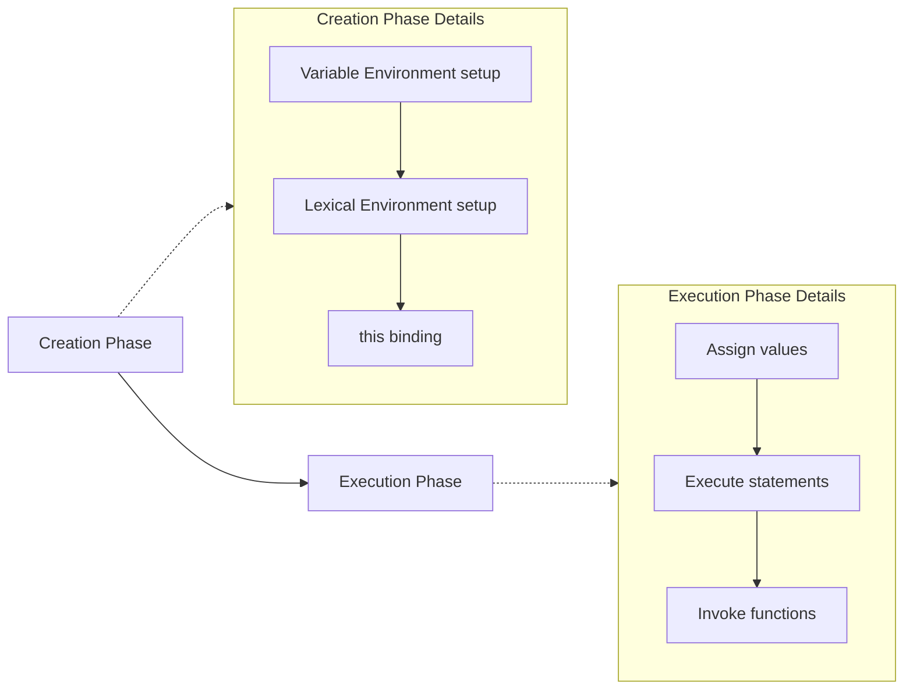
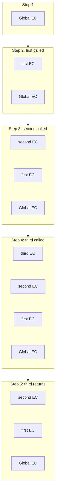
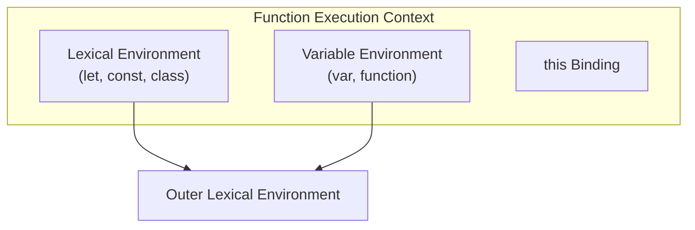
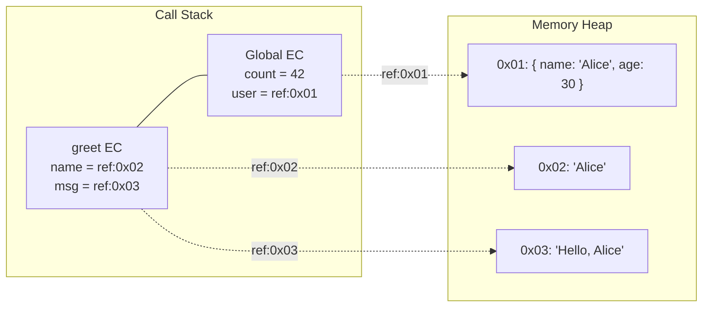
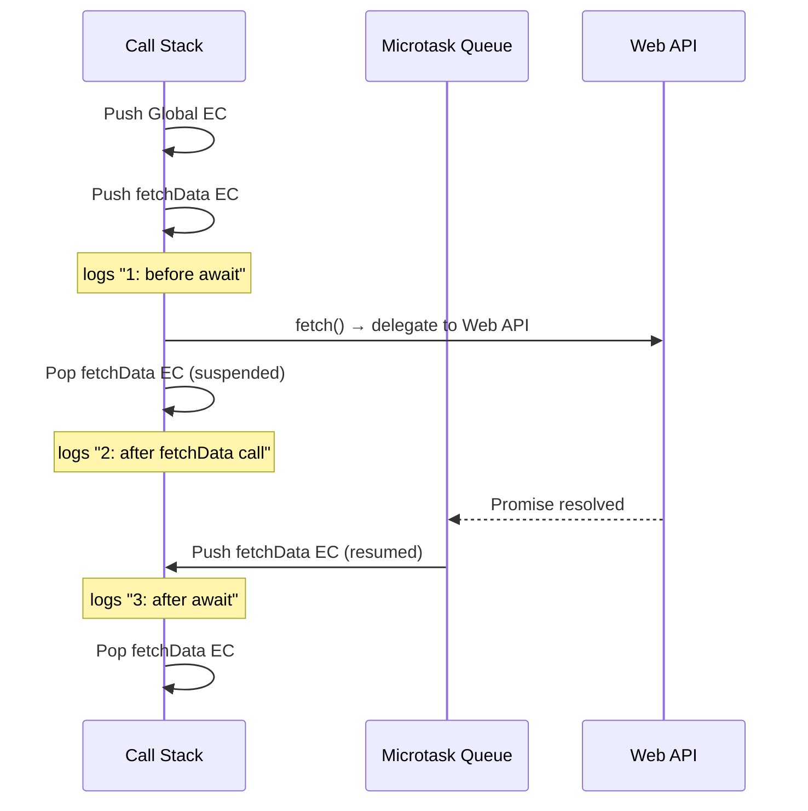

# 01 — Execution Context & Call Stack

> **TL;DR** — Every time JavaScript runs code it creates an *Execution Context* (EC). The engine pushes each EC onto a **Call Stack** (LIFO). During the **Creation Phase** it sets up the Variable Environment, Lexical Environment, and `this` binding. During the **Execution Phase** it runs code line-by-line. Understanding this mechanism is the key to mastering hoisting, closures, scope, and async behavior.

---

## 1. What Is an Execution Context?

An Execution Context is an abstract concept defined by the ECMAScript spec that describes the **environment** in which JavaScript code is evaluated and executed. Every piece of running code has an associated EC.

There are three types:

| Type | Created When | `this` Value |
|---|---|---|
| **Global EC** | Script first loads | `globalThis` (`window` / `global`) |
| **Function EC** | A function is invoked | Depends on call-site |
| **Eval EC** | `eval()` is called | Inherits from caller |

### Global Execution Context

- Created **once** per program.
- Sets up the global object and binds `this` to it.
- Any code not inside a function lives here.

```javascript
// Global EC
var appName = "MFE Hub";
console.log(this.appName); // "MFE Hub" (non-strict, browser)
```

### Function Execution Context

A new EC is created on **every invocation**, even for the same function:

```javascript
function greet(name) {
  // New Function EC created each call
  var message = `Hello, ${name}`;
  return message;
}

greet("Alice"); // EC #1
greet("Bob");   // EC #2 — completely separate
```

### Eval Execution Context

Created when code runs inside `eval()`. It inherits the calling context's variable and lexical environments. Avoid in production code — it defeats engine optimizations and is a security risk.

---

## 2. Creation Phase vs Execution Phase

Every Execution Context goes through two distinct phases:



### 2.1 Creation Phase

The engine scans the code **without executing** it and performs three tasks:

1. **Creates the Variable Environment (VE)** — allocates memory for `var` declarations and function declarations. Variables declared with `var` are initialized to `undefined`; function declarations are stored in full.
2. **Creates the Lexical Environment (LE)** — records `let`/`const` bindings as *uninitialized* (this is the Temporal Dead Zone).
3. **Determines `this`** — sets the value of `this` based on how the function was called.

```javascript
console.log(x);   // undefined  (var — hoisted, initialized to undefined)
console.log(y);   // ReferenceError: Cannot access 'y' before initialization
console.log(add); // [Function: add] (fully hoisted)

var x = 10;
let y = 20;

function add(a, b) {
  return a + b;
}
```

### 2.2 Execution Phase

The engine runs statements **line-by-line**, assigns values, evaluates expressions, and invokes functions. Each function call creates a brand-new EC with its own Creation → Execution cycle.

```javascript
var count = 0;          // Creation: count = undefined → Execution: count = 0
count = count + 1;      // Execution: count = 1

function increment() {
  // New EC → Creation Phase → Execution Phase
  count++;
}

increment();            // count = 2
```

---

## 3. The Call Stack

The Call Stack is the engine's mechanism for tracking which Execution Context is currently running.

- It is a **LIFO** (Last-In, First-Out) data structure.
- The **Global EC** sits at the bottom and is never popped until the program exits.
- Every function call **pushes** a new EC; every `return` (or end of function) **pops** it.

### Nested Call Example

```javascript
function first() {
  console.log("first start");
  second();
  console.log("first end");
}

function second() {
  console.log("second start");
  third();
  console.log("second end");
}

function third() {
  console.log("third");
}

first();
// Output:
// first start
// second start
// third
// second end
// first end
```



### Key Rules

1. JavaScript is **single-threaded** — only one EC executes at a time.
2. The currently running EC is always at the **top** of the stack.
3. When the top EC finishes, it is popped and control returns to the EC below it.

---

## 4. Hoisting Explained

Hoisting is not a physical movement of code. It is a **consequence of the Creation Phase** scanning declarations before execution.

### Comparison Table

| Declaration | Hoisted? | Initialized During Creation? | TDZ? | Scope |
|---|---|---|---|---|
| `var x = 1` | Yes | `undefined` | No | Function |
| `let x = 1` | Yes (but uninitialized) | No | **Yes** | Block |
| `const x = 1` | Yes (but uninitialized) | No | **Yes** | Block |
| `function f() {}` | Yes | **Full function body** | No | Function (or Block in strict) |
| `class C {}` | Yes (but uninitialized) | No | **Yes** | Block |
| `var f = () => {}` | Yes | `undefined` (arrow not hoisted) | No | Function |

### Temporal Dead Zone (TDZ)

The TDZ is the region between the start of the enclosing block and the point where `let`/`const` is declared. Accessing the binding in the TDZ throws a `ReferenceError`.

```javascript
{
  // --- TDZ for `name` starts ---
  console.log(name); // ReferenceError
  // --- TDZ for `name` ends ---
  let name = "Alice";
  console.log(name); // "Alice"
}
```

### Function Hoisting vs Expression Hoisting

```javascript
// Function declaration — fully hoisted
sayHello(); // "Hello!"
function sayHello() {
  console.log("Hello!");
}

// Function expression — only the variable is hoisted
sayBye(); // TypeError: sayBye is not a function
var sayBye = function () {
  console.log("Bye!");
};
```

### Hoisting Within Functions

Each Function EC has its **own** Creation Phase:

```javascript
function demo() {
  console.log(a); // undefined (var hoisted inside this EC)
  console.log(b); // ReferenceError (let TDZ)

  var a = 1;
  let b = 2;
}
demo();
```

---

## 5. Variable Environment vs Lexical Environment

The ECMAScript specification defines two environment components inside every EC:

| Component | Stores | Outer Reference |
|---|---|---|
| **Variable Environment** | `var` declarations, `function` declarations | Points to outer VE |
| **Lexical Environment** | `let`, `const`, `class`, block-scoped functions | Points to outer LE |



### Why Two Environments?

When a block statement (`if`, `for`, `{}`) is entered, the engine creates a **new Lexical Environment** for that block, chaining it to the enclosing one. The Variable Environment stays the **same** for the entire function, because `var` is function-scoped.

```javascript
function example() {
  var x = 1;       // Variable Environment
  let y = 2;       // Lexical Environment (function-level)

  if (true) {
    var x2 = 10;   // Same Variable Environment (function-scoped)
    let y2 = 20;   // NEW Lexical Environment (block-scoped)
    console.log(y); // 2 — looks up outer LE chain
  }

  console.log(x2);  // 10 — var is function-scoped
  console.log(y2);  // ReferenceError — block-scoped, LE was popped
}
example();
```

### The Scope Chain

When a variable is accessed, the engine walks the **Lexical Environment chain** (current LE → outer LE → … → Global LE). This chain is determined **at authoring time** (lexical/static scoping), not at call time.

---

## 6. Stack Overflow

A stack overflow occurs when the Call Stack exceeds the engine's maximum depth, typically from **unbounded recursion**.

```javascript
function recurse() {
  recurse(); // No base case — infinite recursion
}

recurse();
// Uncaught RangeError: Maximum call stack size exceeded
```

### Safe Recursion With a Base Case

```javascript
function factorial(n) {
  if (n <= 1) return 1; // base case
  return n * factorial(n - 1);
}

console.log(factorial(5)); // 120
```

### Call Stack Depth

Different engines have different limits:

| Engine | Approximate Limit |
|---|---|
| V8 (Chrome/Node) | ~10,000 – 15,000 frames |
| SpiderMonkey (Firefox) | ~10,000 – 50,000 frames |
| JavaScriptCore (Safari) | ~30,000 – 65,000 frames |

### Tail Call Optimization (TCO)

ES2015 specifies TCO (also called Proper Tail Calls). If a function's **last action** is a function call, the engine can reuse the current stack frame instead of pushing a new one.

```javascript
// Tail-recursive factorial
function factorialTCO(n, acc = 1) {
  if (n <= 1) return acc;
  return factorialTCO(n - 1, n * acc); // tail position
}
```

> **Reality check:** Only **Safari/JavaScriptCore** implements TCO in production. V8 and SpiderMonkey do not. For deep recursion in Node.js/Chrome, convert to an iterative approach or use a trampoline pattern.

### Trampoline Pattern

```javascript
function trampoline(fn) {
  let result = fn();
  while (typeof result === "function") {
    result = result();
  }
  return result;
}

function factorialTramp(n, acc = 1) {
  if (n <= 1) return acc;
  return () => factorialTramp(n - 1, n * acc);
}

console.log(trampoline(() => factorialTramp(100000))); // No stack overflow
```

---

## 7. Memory Heap vs Call Stack

JavaScript uses two main memory regions:

| Region | Stores | Access Pattern | Lifecycle |
|---|---|---|---|
| **Call Stack** | Primitives, references, stack frames | LIFO, fast | Freed when EC pops |
| **Memory Heap** | Objects, arrays, functions, closures | Unordered, GC-managed | Freed by garbage collector |



### Primitives vs References

```javascript
// Primitives — stored directly on the stack (value copy)
let a = 10;
let b = a;
b = 20;
console.log(a); // 10 — unchanged

// Objects — reference on stack, data on heap
let obj1 = { value: 10 };
let obj2 = obj1;         // copies the REFERENCE, not the object
obj2.value = 20;
console.log(obj1.value); // 20 — same heap object
```

### Garbage Collection

When an EC pops off the stack and no remaining references point to a heap object, the garbage collector (Mark-and-Sweep in V8) reclaims that memory.

```javascript
function createUser() {
  const user = { name: "Alice" }; // allocated on heap
  return user;                     // reference escapes → survives GC
}

function createTemp() {
  const temp = { data: "gone" };   // allocated on heap
  // no return → reference lost when EC pops → eligible for GC
}

const alice = createUser(); // heap object persists
createTemp();               // heap object collected
```

---

## 8. Execution Context in Async Code

Async operations do **not** block the Call Stack. They rely on the **Event Loop**, **Microtask Queue**, and **Macrotask Queue**.

### Async/Await Under the Hood

An `async` function returns a Promise. When `await` is encountered:

1. The current function EC is **suspended** (popped from the stack).
2. The awaited Promise is registered in the Microtask Queue.
3. The engine continues executing whatever is next on the stack.
4. When the Promise resolves, the function EC is **re-created** and pushed back onto the stack to continue execution after the `await`.

```javascript
async function fetchData() {
  console.log("1: before await");
  const data = await fetch("/api/data"); // EC suspended here
  console.log("3: after await");         // new EC created to resume
  return data.json();
}

console.log("0: start");
fetchData();
console.log("2: after fetchData call");

// Output order: 0 → 1 → 2 → 3
```



### Promise Chains Create Multiple Contexts

```javascript
function step1() {
  console.log("step1");
  return Promise.resolve("data");
}

function step2(data) {
  console.log("step2:", data);
  return Promise.resolve("result");
}

step1()
  .then(step2)     // New EC for step2 in microtask
  .then((result) => {
    console.log("step3:", result); // Another new EC
  });

console.log("sync done");
// Output: step1 → sync done → step2: data → step3: result
```

### setTimeout vs Promise Ordering

```javascript
console.log("1: sync");

setTimeout(() => console.log("4: macrotask"), 0);

Promise.resolve().then(() => console.log("3: microtask"));

console.log("2: sync");

// Output: 1 → 2 → 3 → 4
// Microtasks (Promises) always drain before the next macrotask (setTimeout)
```

---

## 9. Common Mistakes

### Mistake 1: Assuming `var` is block-scoped

```javascript
for (var i = 0; i < 3; i++) {
  setTimeout(() => console.log(i), 100);
}
// Prints: 3, 3, 3 — not 0, 1, 2
// Fix: use `let` which creates a new LE per iteration
for (let i = 0; i < 3; i++) {
  setTimeout(() => console.log(i), 100);
}
// Prints: 0, 1, 2
```

### Mistake 2: Calling function expressions before declaration

```javascript
greet(); // TypeError: greet is not a function
var greet = function () {
  console.log("Hi");
};
// The variable `greet` is hoisted as undefined, but the function is not.
```

### Mistake 3: Ignoring `this` binding in the Creation Phase

```javascript
const obj = {
  name: "Hub",
  getName: function () {
    return this.name;
  },
  getNameArrow: () => {
    return this.name; // `this` is lexically bound to outer EC (Global)
  },
};

console.log(obj.getName());      // "Hub"
console.log(obj.getNameArrow()); // undefined (or "" in browser)
```

### Mistake 4: Stack overflow from forgotten base case

```javascript
function flatten(arr) {
  // Bug: no check for non-array elements
  return arr.reduce((acc, item) => acc.concat(flatten(item)), []);
}
// Fix:
function flattenSafe(arr) {
  return arr.reduce(
    (acc, item) =>
      acc.concat(Array.isArray(item) ? flattenSafe(item) : item),
    []
  );
}
```

### Mistake 5: Misunderstanding async EC creation

```javascript
async function process() {
  // This creates TWO execution contexts:
  // EC1: from function start → first await
  // EC2: from after await → function end
  const result = await heavyComputation();
  return transform(result);
}
```

---

## 10. Interview-Ready Answers

> **Q: What are the three types of Execution Context in JavaScript?**
>
> There are three types: **Global EC** (created once when the script loads, sets up the global object and `this`), **Function EC** (created on every function invocation with its own variable/lexical environment and `this` binding), and **Eval EC** (created when `eval()` is called, inheriting the calling context's environments). In practice, you'll almost exclusively deal with Global and Function ECs.

> **Q: Explain the difference between the Creation Phase and Execution Phase.**
>
> During the **Creation Phase**, the engine scans declarations without executing code — it allocates memory for `var` (initialized to `undefined`) and function declarations (stored in full), sets up `let`/`const` bindings as uninitialized (creating the TDZ), establishes the scope chain via the outer environment reference, and determines the `this` binding. During the **Execution Phase**, the engine runs code line-by-line, assigns values, evaluates expressions, and invokes functions, each of which triggers its own EC lifecycle.

> **Q: Why does `var` behave differently from `let` inside a `for` loop with closures?**
>
> `var` is function-scoped — a single binding exists for the entire function. All closures capture the **same** variable. `let` is block-scoped — the spec mandates that each loop iteration creates a **new Lexical Environment** with a fresh binding. So each closure captures its own independent copy of the variable.

> **Q: What is the Temporal Dead Zone (TDZ) and why does it exist?**
>
> The TDZ is the region from the start of a block to the lexical declaration of a `let` or `const` variable. During this zone the binding exists but is **uninitialized** — any access throws a `ReferenceError`. It exists to catch bugs: using a variable before its declaration is almost always a mistake. With `var` the silent `undefined` initialization masked these bugs for years.

> **Q: How does the Call Stack relate to the Event Loop?**
>
> The Call Stack executes synchronous code in LIFO order. The Event Loop checks the stack: when it's **empty**, it first drains the **Microtask Queue** (Promises, `queueMicrotask`, `MutationObserver`), then picks one task from the **Macrotask Queue** (`setTimeout`, `setInterval`, I/O). An `async` function EC is suspended at `await` and later re-pushed onto the stack by the Event Loop when the awaited Promise settles.

> **Q: Does JavaScript have Tail Call Optimization?**
>
> The ES2015 spec defines Proper Tail Calls (PTC), where a call in tail position can reuse the current frame, enabling O(1) stack growth for recursive functions. However, only **Safari's JavaScriptCore** implements PTC. V8 and SpiderMonkey intentionally chose not to, citing debugging difficulty and implicit performance cliffs. For portable code, convert tail recursion to iteration or use a trampoline pattern.

> **Q: Explain the difference between Variable Environment and Lexical Environment.**
>
> Both are Environment Records in the spec. The **Variable Environment** holds `var` and function declarations and stays the same for the entire function execution. The **Lexical Environment** starts as a copy of the VE but gets swapped out at every block boundary (`if`, `for`, `{}`) to create a new scope for `let`/`const`. This is how block scoping is implemented without affecting `var` behavior. Each new block LE chains to the enclosing LE via an outer reference.

---

> Next → [02-scope-closures.md](02-scope-closures.md)
