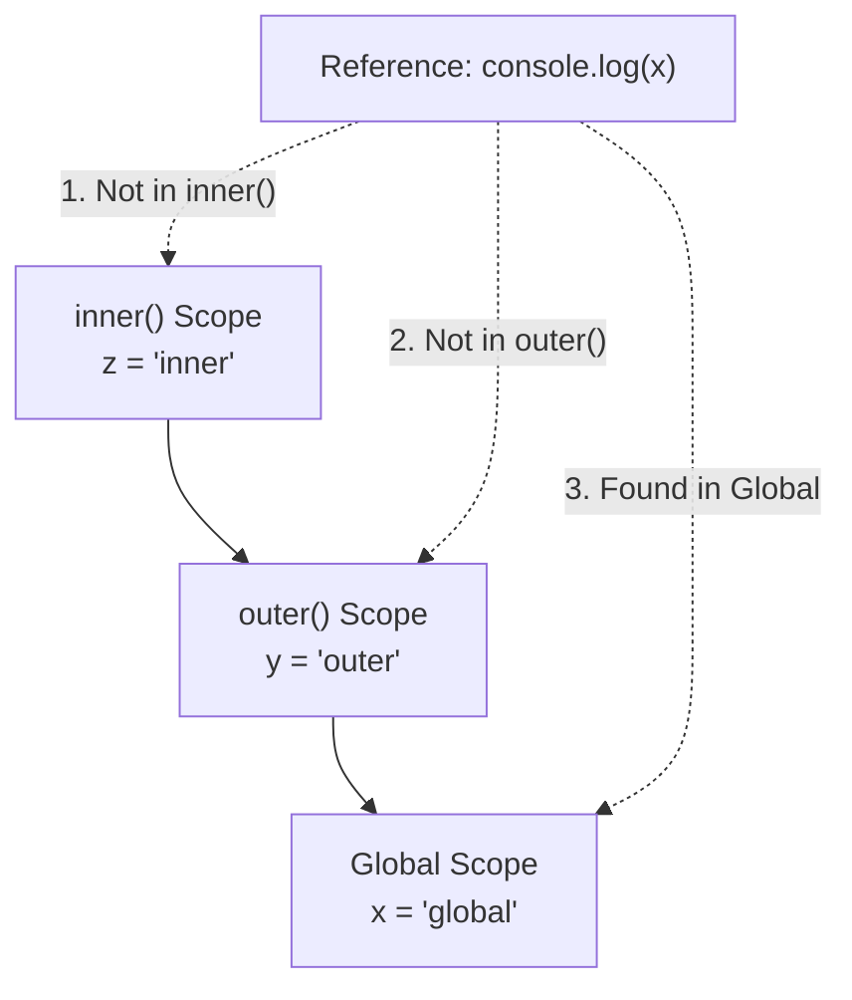
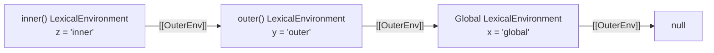
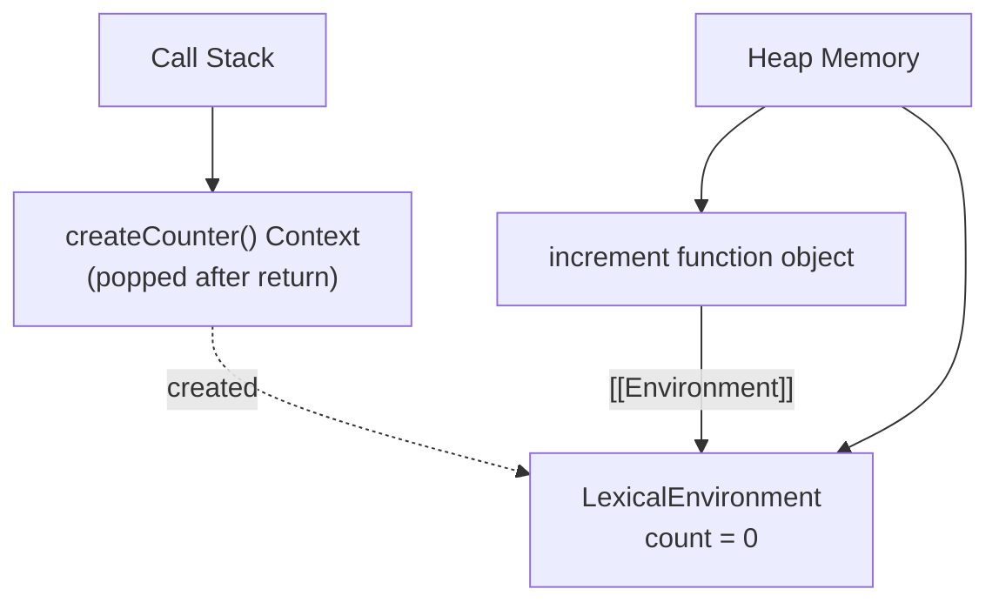
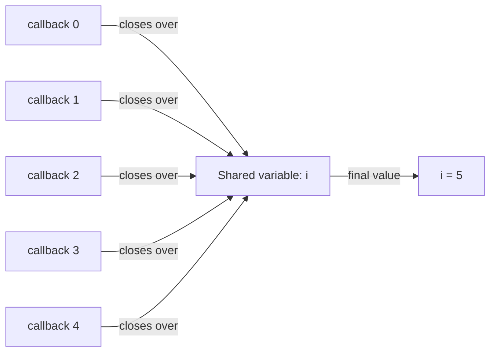
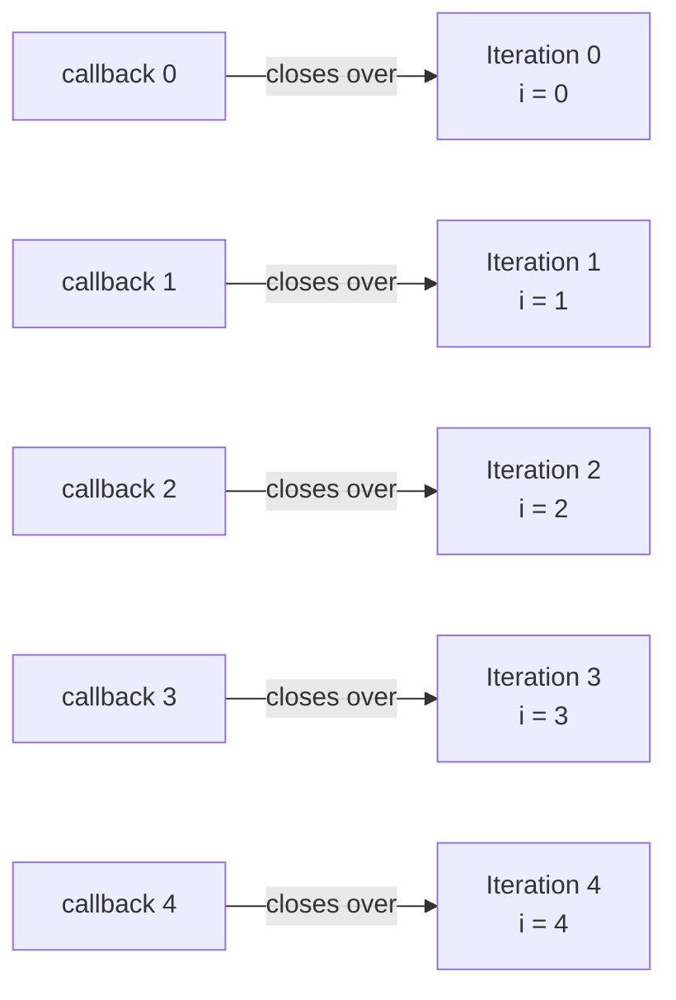

# 02 — Scope & Closures

> **TL;DR** — Scope determines where variables are accessible. JavaScript uses **lexical (static) scoping**, meaning scope is determined at author-time, not at runtime. A **closure** is a function bundled together with references to its surrounding lexical environment — it "remembers" variables from the scope in which it was created, even after that scope has exited. Mastering closures unlocks patterns like data privacy, memoization, partial application, and the classic module pattern.

---

## 1. Types of Scope

JavaScript has three primary scope types: **global**, **function**, and **block**.

### 1.1 Global Scope

Variables declared outside any function or block live in the global scope. In browsers they attach to `window`; in Node.js to `globalThis`.

```javascript
var globalVar = "I am global";
let globalLet = "I am also global but not on window";

console.log(window.globalVar);  // "I am global"
console.log(window.globalLet);  // undefined — let/const don't create window properties
```

### 1.2 Function Scope

Variables declared with `var` are scoped to the nearest enclosing **function**, not block.

```javascript
function greet() {
  var message = "Hello";
  if (true) {
    var message = "Hi"; // same variable — function-scoped
  }
  console.log(message); // "Hi"
}
greet();
```

### 1.3 Block Scope

`let` and `const` (ES6+) are scoped to the nearest enclosing **block** (`{}`).

```javascript
function greet() {
  let message = "Hello";
  if (true) {
    let message = "Hi"; // different variable — block-scoped
    console.log(message); // "Hi"
  }
  console.log(message); // "Hello"
}
greet();
```

### Comparison Table

| Feature | `var` | `let` | `const` |
|---|---|---|---|
| Scope | Function | Block | Block |
| Hoisted | Yes (initialized to `undefined`) | Yes (TDZ — uninitialized) | Yes (TDZ — uninitialized) |
| Re-declarable in same scope | Yes | No | No |
| Reassignable | Yes | Yes | No |
| Creates `window` property (global) | Yes | No | No |

---

## 2. Lexical Scope

JavaScript uses **lexical (static) scoping**: the scope of a variable is determined by its position in the source code at write-time, not by the call-site at runtime.

```javascript
const x = "global";

function outer() {
  const x = "outer";

  function inner() {
    console.log(x); // "outer" — resolved lexically, not dynamically
  }

  return inner;
}

const fn = outer();
fn(); // "outer" — even though called from global scope
```

### Static vs Dynamic Scoping

| Aspect | Lexical (Static) Scoping | Dynamic Scoping |
|---|---|---|
| Scope determined by | Source code structure | Call stack at runtime |
| Variable lookup | Walks up author-time nesting | Walks up the call chain |
| Used by | JavaScript, Python, C, Java | Bash, some Lisps, Perl (with `local`) |
| Predictability | High — analyzable at compile time | Low — depends on runtime call path |

> **Key insight:** The JS engine resolves variable references during the **compilation phase** by examining the lexical nesting of scopes. This is why closures work — the engine knows *at parse time* which scope a variable belongs to.

---

## 3. Scope Chain

When the engine encounters a variable reference, it walks up the **scope chain** — from the current scope outward through each enclosing scope until it finds the binding or reaches global scope.



```javascript
const x = "global";

function outer() {
  const y = "outer";

  function inner() {
    const z = "inner";
    console.log(x); // walks: inner → outer → global ✓
    console.log(y); // walks: inner → outer ✓
    console.log(z); // walks: inner ✓
  }

  inner();
}

outer();
```

### How the Engine Resolves Variables

1. **Compile phase** — the parser identifies all declarations and builds a scope tree (lexical environments).
2. **Execution phase** — when a variable is referenced, the engine checks the current `LexicalEnvironment`, then follows the `[[OuterEnv]]` reference up the chain.



> If the engine reaches `null` without finding the variable, a `ReferenceError` is thrown (in strict mode) or an implicit global is created (in sloppy mode with `var`-style assignment).

---

## 4. Closures In-Depth

### What a Closure Really Is

A **closure** is the combination of a function and the **lexical environment** in which that function was declared. The environment consists of any variables that were in scope at the time the closure was created.

```javascript
function createCounter() {
  let count = 0; // captured by closure

  return function increment() {
    count += 1;
    return count;
  };
}

const counter = createCounter();
console.log(counter()); // 1
console.log(counter()); // 2
console.log(counter()); // 3
```

After `createCounter()` returns, its execution context is popped off the call stack — but the `count` variable is **not** garbage collected because `increment` holds a reference to the lexical environment that contains `count`.

### How the Engine Preserves Scope



Internally, every function object has a hidden `[[Environment]]` slot pointing to the lexical environment where it was defined. When a closure is invoked, the engine:

1. Creates a new execution context for the function.
2. Sets the outer environment reference to the stored `[[Environment]]`.
3. Resolves free variables through the scope chain as usual.

### Every Function is a Closure

Technically, *every* function in JavaScript is a closure — it always closes over the scope in which it was defined. The term "closure" is most meaningful when a function is used **outside** its original scope.

```javascript
function makeGreeter(greeting) {
  return function (name) {
    return `${greeting}, ${name}!`;
  };
}

const hello = makeGreeter("Hello");
const hola = makeGreeter("Hola");

console.log(hello("Alice")); // "Hello, Alice!"
console.log(hola("Bob"));    // "Hola, Bob!"
```

Each returned function closes over a *different* instance of the `greeting` parameter.

---

## 5. Closure Patterns

### 5.1 Data Privacy & Encapsulation

Closures provide **true private state** — there is no other way to access the enclosed variables.

```javascript
function createBankAccount(initialBalance) {
  let balance = initialBalance;

  return {
    deposit(amount) {
      if (amount <= 0) throw new Error("Deposit must be positive");
      balance += amount;
      return balance;
    },
    withdraw(amount) {
      if (amount > balance) throw new Error("Insufficient funds");
      balance -= amount;
      return balance;
    },
    getBalance() {
      return balance;
    },
  };
}

const account = createBankAccount(100);
account.deposit(50);    // 150
account.withdraw(30);   // 120
account.getBalance();   // 120
// account.balance       → undefined (truly private)
```

### 5.2 Factory Functions

```javascript
function createLogger(prefix) {
  return {
    log: (msg) => console.log(`[${prefix}] ${msg}`),
    warn: (msg) => console.warn(`[${prefix}] ⚠ ${msg}`),
    error: (msg) => console.error(`[${prefix}] ✖ ${msg}`),
  };
}

const dbLogger = createLogger("DB");
const apiLogger = createLogger("API");
dbLogger.log("Connected");   // [DB] Connected
apiLogger.warn("Timeout");   // [API] ⚠ Timeout
```

### 5.3 Partial Application

```javascript
function partial(fn, ...presetArgs) {
  return function (...laterArgs) {
    return fn(...presetArgs, ...laterArgs);
  };
}

function add(a, b, c) {
  return a + b + c;
}

const add10 = partial(add, 10);
console.log(add10(5, 3)); // 18
```

### 5.4 Memoization

```javascript
function memoize(fn) {
  const cache = new Map();

  return function (...args) {
    const key = JSON.stringify(args);
    if (cache.has(key)) return cache.get(key);

    const result = fn.apply(this, args);
    cache.set(key, result);
    return result;
  };
}

const factorial = memoize(function f(n) {
  return n <= 1 ? 1 : n * f(n - 1);
});

console.log(factorial(5));  // 120 — computed
console.log(factorial(5));  // 120 — cached
```

### 5.5 Event Handlers

Closures are the backbone of event-driven JavaScript:

```javascript
function setupButton(buttonId, message) {
  const btn = document.getElementById(buttonId);
  let clickCount = 0;

  btn.addEventListener("click", function handler() {
    clickCount++;
    console.log(`${message} (clicked ${clickCount} times)`);
  });
}

setupButton("save-btn", "Saving document...");
```

The `handler` function closes over both `message` and `clickCount`, maintaining state across clicks.

### 5.6 Iterator Pattern

```javascript
function range(start, end, step = 1) {
  let current = start;

  return {
    next() {
      if (current >= end) return { value: undefined, done: true };
      const value = current;
      current += step;
      return { value, done: false };
    },
    [Symbol.iterator]() {
      return this;
    },
  };
}

const nums = range(0, 5);
console.log(nums.next()); // { value: 0, done: false }
console.log(nums.next()); // { value: 1, done: false }

for (const n of range(10, 15)) {
  console.log(n); // 10, 11, 12, 13, 14
}
```

---

## 6. The Classic Loop Problem

This is arguably the most famous closure gotcha in JavaScript interviews.

### The Bug with `var`

```javascript
for (var i = 0; i < 5; i++) {
  setTimeout(function () {
    console.log(i);
  }, i * 100);
}
// Output: 5, 5, 5, 5, 5 — NOT 0, 1, 2, 3, 4
```

**Why?** `var` is function-scoped (or global-scoped here). All five callbacks close over the *same* `i`. By the time the timeouts fire, the loop has finished and `i` is `5`.



### Solution 1: IIFE (Pre-ES6)

Create a new scope per iteration by immediately invoking a function:

```javascript
for (var i = 0; i < 5; i++) {
  (function (j) {
    setTimeout(function () {
      console.log(j);
    }, j * 100);
  })(i);
}
// Output: 0, 1, 2, 3, 4
```

Each IIFE creates a new function scope with its own `j`, capturing the current value of `i`.

### Solution 2: `let` (ES6+)

`let` creates a **new binding per iteration** — the spec explicitly defines this behavior for `for` loops.

```javascript
for (let i = 0; i < 5; i++) {
  setTimeout(function () {
    console.log(i);
  }, i * 100);
}
// Output: 0, 1, 2, 3, 4
```



---

## 7. Closures and Memory

### When Closures Cause Memory Leaks

Closures retain references to their entire lexical environment. If large objects are in scope, they stay in memory as long as the closure exists.

```javascript
function processData() {
  const hugeArray = new Array(1_000_000).fill("data");

  return function summary() {
    return hugeArray.length; // holds reference to entire hugeArray
  };
}

const getSummary = processData();
// hugeArray (millions of entries) is retained in memory
```

### How to Avoid Leaks

**Extract only what you need:**

```javascript
function processData() {
  const hugeArray = new Array(1_000_000).fill("data");
  const length = hugeArray.length; // extract the needed value

  return function summary() {
    return length; // closes over a primitive — hugeArray can be GC'd
  };
}
```

**Nullify references when done:**

```javascript
function createHandler() {
  let cache = {};

  return {
    handle(data) {
      cache[data.id] = data;
    },
    destroy() {
      cache = null; // allow GC to reclaim
    },
  };
}
```

### Garbage Collection Interaction

Modern engines (V8, SpiderMonkey) are smart about closures:

- **Variable pruning** — if a closed-over variable is never referenced inside the closure, the engine *may* exclude it from the retained environment.
- **Shared environment records** — multiple closures from the same scope share one environment object. If *any* of them references a variable, it stays alive for all of them.

```javascript
function example() {
  const a = "used";
  const b = new Array(1_000_000); // potentially retained

  function closureA() {
    return a; // only references 'a'
  }

  function closureB() {
    return b.length; // references 'b'
  }

  // Both closures share the same environment record.
  // Even if you only keep closureA, 'b' MAY be retained
  // because the environment is shared.
  return closureA;
}
```

> **Rule of thumb:** If you return multiple closures from the same scope, be mindful that the shared environment can prevent GC of variables referenced by *any* sibling closure.

---

## 8. Module Pattern

Before ES6 modules, closures powered the **IIFE-based module pattern** — still relevant for understanding legacy code and the conceptual foundation of modules.

```javascript
const UserModule = (function () {
  // Private state
  let users = [];
  let nextId = 1;

  // Private function
  function validate(user) {
    if (!user.name) throw new Error("Name required");
    if (!user.email) throw new Error("Email required");
  }

  // Public API (revealing module pattern)
  return {
    addUser(name, email) {
      const user = { id: nextId++, name, email };
      validate(user);
      users.push(user);
      return user;
    },
    getUser(id) {
      return users.find((u) => u.id === id) ?? null;
    },
    getCount() {
      return users.length;
    },
  };
})();

UserModule.addUser("Alice", "alice@example.com");
UserModule.getCount(); // 1
// UserModule.users     → undefined (private)
// UserModule.validate  → undefined (private)
```

### Module Pattern vs ES6 Modules

| Aspect | IIFE Module Pattern | ES6 Modules |
|---|---|---|
| Privacy mechanism | Closure | File scope + `export` |
| Loading | Script tag / concatenation | `import` / `export` with bundler |
| Static analysis | Not possible | Tree-shakable |
| Singleton by default | Yes (IIFE runs once) | Yes (modules are cached) |
| Circular dependencies | Manual management | Handled by spec (live bindings) |

---

## 9. Real-World Closure Examples

### 9.1 Debounce

Delays execution until a pause in calls — essential for search inputs, resize handlers.

```javascript
function debounce(fn, delay) {
  let timerId = null;

  return function debounced(...args) {
    clearTimeout(timerId);
    timerId = setTimeout(() => {
      fn.apply(this, args);
    }, delay);
  };
}

const search = debounce((query) => {
  console.log(`Searching: ${query}`);
}, 300);

search("J");
search("Ja");
search("Jav");
search("Java"); // only this one fires (after 300ms pause)
```

### 9.2 Throttle

Ensures a function runs at most once per interval — useful for scroll and mousemove handlers.

```javascript
function throttle(fn, interval) {
  let lastTime = 0;
  let timerId = null;

  return function throttled(...args) {
    const now = Date.now();
    const remaining = interval - (now - lastTime);

    if (remaining <= 0) {
      clearTimeout(timerId);
      lastTime = now;
      fn.apply(this, args);
    } else if (!timerId) {
      timerId = setTimeout(() => {
        lastTime = Date.now();
        timerId = null;
        fn.apply(this, args);
      }, remaining);
    }
  };
}

window.addEventListener(
  "scroll",
  throttle(() => console.log("scroll event"), 200)
);
```

### 9.3 Once

Guarantees a function executes only a single time, regardless of how many times it's called.

```javascript
function once(fn) {
  let called = false;
  let result;

  return function (...args) {
    if (called) return result;
    called = true;
    result = fn.apply(this, args);
    fn = null; // release reference for GC
    return result;
  };
}

const initialize = once(() => {
  console.log("Initialized!");
  return { ready: true };
});

initialize(); // "Initialized!" → { ready: true }
initialize(); // → { ready: true } (no log, cached result)
initialize(); // → { ready: true }
```

### 9.4 Curry

Transforms a multi-argument function into a chain of single-argument functions.

```javascript
function curry(fn) {
  return function curried(...args) {
    if (args.length >= fn.length) {
      return fn.apply(this, args);
    }
    return function (...moreArgs) {
      return curried.apply(this, [...args, ...moreArgs]);
    };
  };
}

const multiply = curry((a, b, c) => a * b * c);

console.log(multiply(2)(3)(4));    // 24
console.log(multiply(2, 3)(4));    // 24
console.log(multiply(2)(3, 4));    // 24
console.log(multiply(2, 3, 4));    // 24

const double = multiply(2)(1);
console.log(double(5));            // 10
```

### 9.5 Pipe / Compose with Closures

```javascript
function pipe(...fns) {
  return function piped(value) {
    return fns.reduce((acc, fn) => fn(acc), value);
  };
}

const transform = pipe(
  (x) => x * 2,
  (x) => x + 10,
  (x) => `Result: ${x}`
);

console.log(transform(5)); // "Result: 20"
```

---

## 10. Common Mistakes

### Mistake 1: Accidental Closure Over Mutable Variable

```javascript
// BUG: all handlers log the same value
const buttons = document.querySelectorAll(".btn");
for (var i = 0; i < buttons.length; i++) {
  buttons[i].addEventListener("click", function () {
    console.log("Button index:", i); // always buttons.length
  });
}

// FIX: use let
for (let i = 0; i < buttons.length; i++) {
  buttons[i].addEventListener("click", function () {
    console.log("Button index:", i); // correct index
  });
}
```

### Mistake 2: Closure Inside `forEach` vs `for`

```javascript
// This already works — forEach callback gets its own parameter scope
[10, 20, 30].forEach(function (val, idx) {
  setTimeout(() => console.log(idx, val), 100);
});
// 0 10, 1 20, 2 30 ✓
```

### Mistake 3: Returning Functions Without Understanding Shared Environments

```javascript
function makeAdders() {
  const adders = [];
  for (var i = 1; i <= 3; i++) {
    adders.push(() => i); // all close over the same 'i'
  }
  return adders;
}

makeAdders().map((fn) => fn()); // [4, 4, 4] — not [1, 2, 3]
```

### Mistake 4: Memory Leaks from Forgotten Event Listeners

```javascript
function attach(element) {
  const heavyData = loadHeavyPayload();

  function handler() {
    process(heavyData);
  }

  element.addEventListener("click", handler);

  // If element is removed from DOM but handler is not removed,
  // heavyData stays in memory forever.
  // FIX: return a cleanup function
  return () => element.removeEventListener("click", handler);
}
```

### Mistake 5: Assuming Closures Copy Values

```javascript
let count = 0;

function getCounter() {
  return () => count; // closes over the REFERENCE, not the value
}

const fn = getCounter();
count = 42;
console.log(fn()); // 42, not 0 — closures capture references
```

---

## 11. Interview-Ready Answers

> **Q: What is a closure in JavaScript?**
> A closure is a function that retains access to its lexical scope even when executed outside that scope. Technically, it is the combination of a function and the environment (set of variable bindings) in which it was defined. Every function in JS forms a closure, but the term is most meaningful when a function references free variables from an outer scope that has already returned.

> **Q: How does JavaScript's scope chain work?**
> When a variable is referenced, the engine first looks in the current execution context's lexical environment. If not found, it follows the `[[OuterEnv]]` reference to the parent environment, and so on up the chain until it reaches the global environment. If the variable isn't found anywhere, a `ReferenceError` is thrown in strict mode. This chain is established at parse time based on lexical nesting, not at runtime.

> **Q: Why does `var` in a for-loop not behave as expected with closures?**
> `var` is function-scoped, so there is only one `i` variable shared across all iterations. Closures created inside the loop all reference the same binding. By the time the closures execute, the loop has completed and `i` holds its final value. Using `let` fixes this because the spec mandates a fresh binding per iteration — each closure captures its own copy of `i`.

> **Q: Can closures cause memory leaks? How do you prevent them?**
> Yes. A closure retains the entire lexical environment of its enclosing scope. If large objects exist in that scope, they remain in memory as long as the closure is reachable. To prevent leaks: (1) extract only needed values into local variables before creating the closure, (2) nullify references when they're no longer needed, (3) remove event listeners during cleanup (e.g., in `ngOnDestroy` or React's cleanup function), and (4) be aware that sibling closures share the same environment record.

> **Q: Explain the module pattern and how it uses closures.**
> The module pattern uses an IIFE to create a private scope. Variables and functions declared inside the IIFE are inaccessible from outside. The IIFE returns an object exposing only the public API — these public methods are closures that retain access to the private state. This achieves encapsulation without classes. ES6 modules replaced this pattern with file-level scope and explicit `export`, but the underlying concept of closure-based privacy is the same.

> **Q: What is the difference between lexical scope and dynamic scope?**
> Lexical (static) scope resolves variables based on where functions are *defined* in the source code. Dynamic scope resolves variables based on the *call stack* at runtime. JavaScript uses lexical scoping exclusively. This means a function always has access to the variables from the scope where it was written, regardless of where it is invoked. Dynamic scoping exists in languages like Bash and some Lisp dialects.

> **Q: Implement a `once` function using closures.**
> A `once` function returns a wrapper that invokes the original function on the first call and caches the result. Subsequent calls return the cached result without re-executing. The closure holds a `called` boolean flag and the `result`. After the first invocation, the reference to the original function can be set to `null` to help garbage collection. *(See Section 9.3 for the full implementation.)*

---

> Next → [03-this-keyword.md](03-this-keyword.md)
