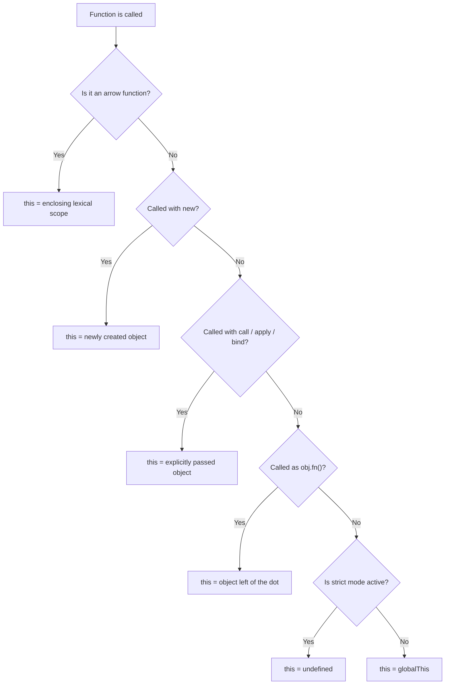
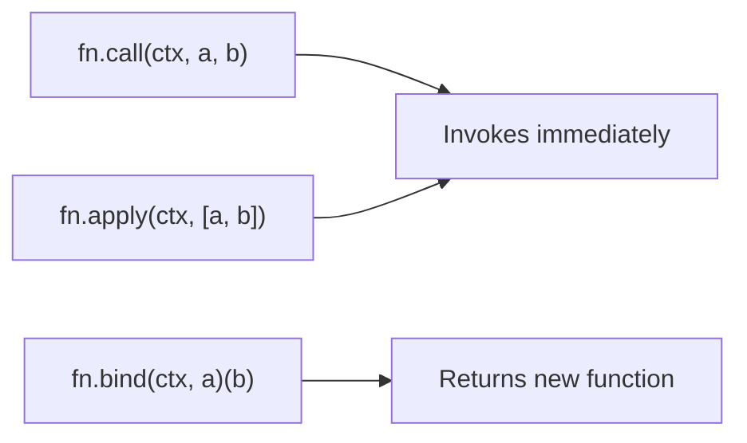
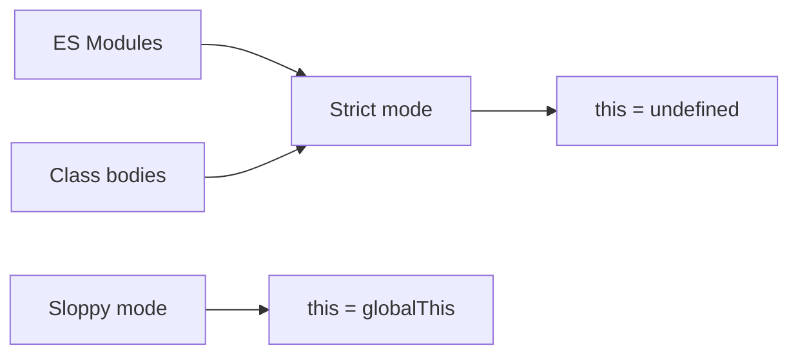

# 03 — The this Keyword

> **TL;DR** — `this` is **not** lexically scoped (except in arrow functions). It is determined at **call time** by *how* a function is invoked, not where it is defined. There are exactly **5 binding rules** evaluated in a strict priority order: `new` > explicit (`call`/`apply`/`bind`) > implicit (method call) > default (standalone) > arrow (lexical). Master these rules and you will never be surprised by `this` again.

---

## 1. Why `this` Exists

In most OOP languages, `this` always points to the current instance. JavaScript is different — functions are first-class objects that can be called in many ways, so the engine needs a runtime mechanism to resolve context.

`this` provides **dynamic context binding**, enabling:

- Method sharing across objects without duplication
- Constructor functions and class instantiation
- Explicit context injection via `call` / `apply` / `bind`
- Event-driven programming (DOM handlers, frameworks)

---

## 2. The 5 Binding Rules (Priority Order)

The engine evaluates these rules **top-to-bottom**. The first match wins.

| Priority | Rule | Call Pattern | `this` Value |
|----------|------|-------------|--------------|
| 1 (highest) | **new** binding | `new Foo()` | Brand-new object created by `new` |
| 2 | **Explicit** binding | `fn.call(obj)` / `fn.apply(obj)` / `fn.bind(obj)` | The explicitly passed object |
| 3 | **Implicit** binding | `obj.fn()` | The object before the dot |
| 4 | **Default** binding | `fn()` | `globalThis` (or `undefined` in strict mode) |
| 5 | **Arrow** function | `() => {}` | Inherited from enclosing lexical scope at definition time |

---

### 2.1 — new Binding

When a function is called with `new`, the engine:

1. Creates a fresh empty object
2. Links its `[[Prototype]]` to `Foo.prototype`
3. Binds `this` to the new object inside the constructor
4. Returns the object (unless the constructor explicitly returns another object)

```javascript
function Person(name) {
  // `this` = newly created object
  this.name = name;
  this.greet = function () {
    console.log(`Hi, I'm ${this.name}`);
  };
}

const alice = new Person('Alice');
alice.greet(); // Hi, I'm Alice
console.log(alice instanceof Person); // true
```

**Key gotcha** — if the constructor returns a non-primitive, that object replaces the new instance:

```javascript
function Weird() {
  this.a = 1;
  return { a: 42 }; // overrides the new object
}

const w = new Weird();
console.log(w.a); // 42, not 1
```

---

### 2.2 — Explicit Binding (call, apply, bind)

You manually specify `this` by passing it as the first argument.

```javascript
function introduce(greeting, punctuation) {
  console.log(`${greeting}, I'm ${this.name}${punctuation}`);
}

const user = { name: 'Bob' };

introduce.call(user, 'Hello', '!');   // Hello, I'm Bob!
introduce.apply(user, ['Hey', '.']);   // Hey, I'm Bob.

const bound = introduce.bind(user, 'Hi');
bound('?'); // Hi, I'm Bob?
```

**Explicit binding wins over implicit binding:**

```javascript
const obj = {
  name: 'obj',
  greet: function () {
    console.log(this.name);
  },
};

const other = { name: 'other' };

obj.greet.call(other); // "other" — explicit wins
```

---

### 2.3 — Implicit Binding

When a function is called as a **method** of an object (the dot-call pattern), `this` points to the object left of the dot.

```javascript
const team = {
  name: 'Engineering',
  describe() {
    console.log(`Team: ${this.name}`);
  },
};

team.describe(); // Team: Engineering
```

**Implicitly lost** — the most common bug:

```javascript
const fn = team.describe; // detached from `team`
fn(); // Team: undefined (default binding kicks in)
```

---

### 2.4 — Default Binding

A plain function call with no context object, no `call`/`apply`/`bind`, and no `new`.

```javascript
function showThis() {
  console.log(this);
}

showThis(); // globalThis (window in browser, global in Node)
```

In **strict mode**, default binding yields `undefined`:

```javascript
'use strict';

function showThis() {
  console.log(this);
}

showThis(); // undefined
```

---

### 2.5 — Arrow Functions (Lexical this)

Arrow functions **do not** have their own `this`. They permanently capture `this` from their **enclosing lexical scope** at the time they are defined.

```javascript
const counter = {
  count: 0,
  start() {
    // `this` here = counter (implicit binding)
    setInterval(() => {
      this.count++; // arrow inherits `this` from start()
      console.log(this.count);
    }, 1000);
  },
};

counter.start(); // 1, 2, 3, ...
```

Arrow functions **cannot be re-bound** — `call`, `apply`, `bind`, and `new` have no effect on their `this`:

```javascript
const arrow = () => console.log(this);

const obj = { name: 'test' };
arrow.call(obj); // still the outer `this`, ignores obj
```

---

## 3. Decision Flowchart — How to Determine `this`



Use this flowchart top-to-bottom every time you need to determine what `this` refers to.

---

## 4. Arrow Functions vs Regular Functions

| Feature | Regular Function | Arrow Function |
|---------|-----------------|----------------|
| Own `this` | Yes — determined at call time | No — lexical from enclosing scope |
| `arguments` object | Yes | No (use rest params `...args`) |
| Can be used as constructor | Yes (`new Foo()`) | No — throws `TypeError` |
| `call`/`apply`/`bind` affect `this` | Yes | No |
| `prototype` property | Yes | No |
| Suitable for methods on objects | Yes | No — `this` won't be the object |
| Suitable for callbacks/closures | Requires `.bind(this)` or `self = this` | Yes — natural fit |
| `super` keyword | Determined by call | Lexical from enclosing scope |

**When to use each:**

```javascript
// USE regular functions for object methods
const api = {
  data: [],
  fetch() {                // regular — `this` = api
    return this.data;
  },
};

// USE arrow functions for callbacks inside methods
class UserService {
  users = [];

  loadUsers() {
    fetchFromAPI('/users').then((result) => {
      this.users = result;  // arrow — `this` = UserService instance
    });
  }
}
```

---

## 5. call, apply, bind — Deep Dive

### 5.1 — Comparison



| Method | Invokes immediately? | Arguments format | Returns |
|--------|---------------------|------------------|---------|
| `call` | Yes | Comma-separated | Return value of `fn` |
| `apply` | Yes | Array | Return value of `fn` |
| `bind` | No | Comma-separated (partial) | New bound function |

### 5.2 — Practical Use Cases

**Borrowing methods:**

```javascript
const nums = { 0: 'a', 1: 'b', 2: 'c', length: 3 };

// Array-like object borrowing Array.prototype.slice
const arr = Array.prototype.slice.call(nums);
console.log(arr); // ['a', 'b', 'c']
```

**Finding max in array (apply trick):**

```javascript
const values = [5, 12, 3, 99, 7];
const max = Math.max.apply(null, values); // 99

// Modern alternative with spread:
const max2 = Math.max(...values); // 99
```

**Partial application with bind:**

```javascript
function log(level, message) {
  console.log(`[${level}] ${message}`);
}

const warn = log.bind(null, 'WARN');
const error = log.bind(null, 'ERROR');

warn('Disk space low');   // [WARN] Disk space low
error('Connection lost'); // [ERROR] Connection lost
```

### 5.3 — Implement Your Own bind

A common interview question — implement `Function.prototype.myBind`:

```javascript
Function.prototype.myBind = function (context, ...boundArgs) {
  const originalFn = this;

  return function (...callArgs) {
    return originalFn.apply(context, [...boundArgs, ...callArgs]);
  };
};

function greet(greeting, name) {
  return `${greeting}, ${this.title} ${name}`;
}

const boundGreet = greet.myBind({ title: 'Dr.' }, 'Hello');
console.log(boundGreet('Smith')); // Hello, Dr. Smith
```

> **Note:** A production polyfill also handles `new` on the bound function and preserves the prototype chain. The above covers the 90% interview case.

---

## 6. `this` in Classes

### 6.1 — Constructor and Methods

```javascript
class Timer {
  seconds = 0;

  constructor(label) {
    this.label = label; // `this` = new instance
  }

  start() {
    // `this` = instance (implicit binding)
    setInterval(() => {
      this.seconds++;
      console.log(`${this.label}: ${this.seconds}s`);
    }, 1000);
  }
}

const t = new Timer('Stopwatch');
t.start(); // Stopwatch: 1s, Stopwatch: 2s, ...
```

### 6.2 — The "Lost this" Problem

Passing a method as a callback detaches it from the instance:

```javascript
class Button {
  label = 'Click me';

  handleClick() {
    console.log(this.label);
  }
}

const btn = new Button();
const handler = btn.handleClick;
handler(); // undefined — `this` is not the Button instance
```

**Three solutions:**

```javascript
// Solution 1: bind in constructor
class Button1 {
  label = 'Click me';
  constructor() {
    this.handleClick = this.handleClick.bind(this);
  }
  handleClick() {
    console.log(this.label);
  }
}

// Solution 2: arrow function as class field (most common)
class Button2 {
  label = 'Click me';
  handleClick = () => {
    console.log(this.label); // lexical `this` = instance
  };
}

// Solution 3: arrow wrapper at call site
const btn3 = new Button();
document.addEventListener('click', () => btn3.handleClick());
```

### 6.3 — Static Methods

In static methods, `this` refers to the **class itself**, not an instance:

```javascript
class Config {
  static defaults = { theme: 'dark' };

  static getDefaults() {
    return this.defaults; // `this` = Config class
  }
}

console.log(Config.getDefaults()); // { theme: 'dark' }
```

---

## 7. `this` in Event Handlers

### 7.1 — DOM Event Handlers

In a traditional DOM event handler, `this` refers to the **element** that the listener is attached to:

```javascript
const button = document.querySelector('#myBtn');

button.addEventListener('click', function () {
  console.log(this);          // <button id="myBtn">
  this.textContent = 'Clicked!';
});

// Arrow function — different behavior:
button.addEventListener('click', () => {
  console.log(this); // outer scope `this` (probably window)
});
```

### 7.2 — Framework Patterns (Angular/React)

In Angular, event bindings in templates call methods on the component instance — `this` is always the component (handled by the framework). But when passing methods to third-party libraries, use arrow class fields or `.bind(this)`.

In React class components (legacy), the classic binding pattern:

```javascript
class MyComponent {
  constructor() {
    this.state = { count: 0 };
    this.handleClick = this.handleClick.bind(this);
  }

  handleClick() {
    this.setState({ count: this.state.count + 1 });
  }
}
```

Modern React uses functional components with hooks, avoiding `this` entirely.

---

## 8. `this` in setTimeout / setInterval

The classic trap — `setTimeout` calls the callback as a **standalone function**, triggering default binding:

```javascript
const server = {
  port: 3000,
  start() {
    setTimeout(function () {
      console.log(`Listening on port ${this.port}`);
    }, 1000);
  },
};

server.start(); // Listening on port undefined
```

### Solutions

```javascript
// Solution 1: Arrow function (best)
const server1 = {
  port: 3000,
  start() {
    setTimeout(() => {
      console.log(`Listening on port ${this.port}`); // 3000
    }, 1000);
  },
};

// Solution 2: bind
const server2 = {
  port: 3000,
  start() {
    setTimeout(
      function () {
        console.log(`Listening on port ${this.port}`); // 3000
      }.bind(this),
      1000
    );
  },
};

// Solution 3: closure capture (old-school)
const server3 = {
  port: 3000,
  start() {
    const self = this;
    setTimeout(function () {
      console.log(`Listening on port ${self.port}`); // 3000
    }, 1000);
  },
};
```

---

## 9. Strict Mode Impact

`"use strict"` changes one rule: **default binding** yields `undefined` instead of `globalThis`.

```javascript
function loose() {
  return this; // globalThis
}

function strict() {
  'use strict';
  return this; // undefined
}

console.log(loose() === globalThis); // true
console.log(strict() === undefined); // true
```

**Why it matters:**

- ES modules are always strict — standalone function calls inside modules give `undefined`
- Class bodies are implicitly strict
- Prevents accidental global pollution (`this.foo = bar` won't create `window.foo`)



---

## 10. Common Mistakes

### Mistake 1 — Using Arrow Functions as Object Methods

```javascript
const user = {
  name: 'Eve',
  greet: () => {
    console.log(`Hi, ${this.name}`); // `this` is NOT user
  },
};

user.greet(); // Hi, undefined
```

**Fix:** Use a regular function (shorthand method).

```javascript
const user = {
  name: 'Eve',
  greet() {
    console.log(`Hi, ${this.name}`);
  },
};
```

### Mistake 2 — Extracting Methods Without Binding

```javascript
class Logger {
  prefix = '[LOG]';
  log(msg) {
    console.log(`${this.prefix} ${msg}`);
  }
}

const logger = new Logger();
const logFn = logger.log;
logFn('test'); // TypeError: Cannot read properties of undefined
```

**Fix:** Use `logger.log.bind(logger)` or arrow class field.

### Mistake 3 — forEach/map Callback Losing `this`

```javascript
const processor = {
  multiplier: 2,
  process(items) {
    return items.map(function (item) {
      return item * this.multiplier; // `this` is undefined in strict mode
    });
  },
};
```

**Fix:** Use an arrow function in the callback:

```javascript
process(items) {
  return items.map((item) => item * this.multiplier);
}
```

### Mistake 4 — `new` on Arrow Functions

```javascript
const Foo = () => {};
const f = new Foo(); // TypeError: Foo is not a constructor
```

Arrow functions cannot be used with `new` — they have no `[[Construct]]` internal method.

### Mistake 5 — Assuming `bind` Stacks

```javascript
function show() {
  console.log(this.val);
}

const a = { val: 'A' };
const b = { val: 'B' };

const bound = show.bind(a);
const doubleBound = bound.bind(b);
doubleBound(); // "A" — first bind wins, second is ignored
```

---

## 11. Tricky Interview Questions

### Question 1 — Nested Objects

```javascript
const outer = {
  name: 'outer',
  inner: {
    name: 'inner',
    getName() {
      return this.name;
    },
  },
};

console.log(outer.inner.getName()); // ?
```

**Answer:** `"inner"` — implicit binding looks at the object **immediately** left of the dot (`inner`), not the entire chain.

---

### Question 2 — Callback Extraction

```javascript
const obj = {
  value: 42,
  getValue() {
    return this.value;
  },
};

const getValue = obj.getValue;
console.log(getValue()); // ?
```

**Answer:** `undefined` (strict mode) or `undefined` (since `window.value` doesn't exist). The function is called standalone — default binding applies. `this` is no longer `obj`.

---

### Question 3 — Arrow Inside Method

```javascript
const team = {
  name: 'Alpha',
  members: ['a', 'b', 'c'],
  list() {
    return this.members.map((m) => `${this.name}: ${m}`);
  },
};

console.log(team.list()); // ?
```

**Answer:** `["Alpha: a", "Alpha: b", "Alpha: c"]` — the arrow function inside `map` inherits `this` from `list()`, which has implicit binding to `team`.

---

### Question 4 — new vs bind

```javascript
function Greeting(msg) {
  this.msg = msg;
}

const bound = Greeting.bind({ msg: 'bound' });
const instance = new bound('constructed');
console.log(instance.msg); // ?
```

**Answer:** `"constructed"` — `new` binding has **higher priority** than explicit binding. The `bind` context is ignored when `new` is used.

---

### Question 5 — setTimeout Chain

```javascript
const app = {
  name: 'MyApp',
  init() {
    console.log('A:', this.name);

    setTimeout(function () {
      console.log('B:', this.name);

      setTimeout(() => {
        console.log('C:', this.name);
      }, 0);
    }, 0);
  },
};

app.init();
```

**Answer:**

- `A: MyApp` — implicit binding (`app.init()`)
- `B: undefined` — the regular function in `setTimeout` gets default binding
- `C: undefined` — the arrow function inherits `this` from the enclosing regular function, which itself had default binding (`this` = `globalThis` or `undefined`), so `this.name` is `undefined`

---

### Question 6 — Explicit Binding on Arrow

```javascript
const arrow = () => this;

const obj = { name: 'test' };
console.log(arrow.call(obj) === obj); // ?
```

**Answer:** `false` — arrow functions ignore `call`/`apply`/`bind`. `this` remains the lexical `this` from the enclosing scope (module `this` or `globalThis`).

---

### Question 7 — Class Method Assignment

```javascript
class Dog {
  name = 'Rex';

  bark() {
    console.log(`${this.name} says woof!`);
  }

  arrowBark = () => {
    console.log(`${this.name} says woof!`);
  };
}

const dog = new Dog();
const bark = dog.bark;
const arrowBark = dog.arrowBark;

bark();       // ?
arrowBark();  // ?
```

**Answer:**

- `bark()` — `TypeError` or `undefined says woof!` — regular method loses `this` when extracted
- `arrowBark()` — `Rex says woof!` — arrow class field captures `this` from the constructor, permanently bound to the instance

---

## 12. Interview-Ready Answers

> **Q: What are the 5 rules for determining `this` in JavaScript?**
> The 5 rules, in priority order, are: (1) **new binding** — `this` is the newly created object, (2) **explicit binding** via `call`/`apply`/`bind` — `this` is the passed object, (3) **implicit binding** — `this` is the object left of the dot in a method call, (4) **default binding** — `this` is `globalThis` (or `undefined` in strict mode) for standalone calls, (5) **arrow functions** — `this` is lexically inherited from the enclosing scope and can never be changed.

> **Q: Why do arrow functions not have their own `this`?**
> Arrow functions were designed for short callbacks where you want to preserve the enclosing context. They have no `[[Construct]]` internal method, no `prototype`, no `arguments` object, and no `this` binding. This makes them predictable inside callbacks, event handlers, and promise chains — you never need the `var self = this` hack.

> **Q: What happens if you call `bind` twice on the same function?**
> The first `bind` wins. Once a function is bound, subsequent `bind` calls create a new wrapper but the original context from the first `bind` is preserved. The second context argument is effectively ignored. This is because `bind` wraps the original function with a fixed context, and wrapping a wrapper doesn't override the inner binding.

> **Q: How does `this` behave differently in ES modules vs scripts?**
> ES modules run in **strict mode** by default. In the module's top-level scope, `this` is `undefined` (not `globalThis`). In classic scripts (non-module), the top-level `this` is `globalThis` (e.g., `window` in browsers). Inside functions within modules, standalone calls also produce `undefined` for `this`, preventing accidental global variable creation.

> **Q: How do you solve the "lost this" problem in class methods used as callbacks?**
> Three approaches: (1) **Arrow class fields** — `handleClick = () => { ... }` captures `this` lexically from the constructor, (2) **Bind in constructor** — `this.handleClick = this.handleClick.bind(this)`, (3) **Arrow wrapper at call site** — `onClick={() => this.handleClick()}`. Arrow class fields are the modern standard, but note they create a new function per instance (no prototype sharing), which matters at scale.

> **Q: Can `new` override an explicit `bind`?**
> Yes. `new` binding has the **highest** priority. When you call `new` on a `bind`-wrapped function, the `new` operator creates a fresh object and sets `this` to it, ignoring the bound context. This is by design — `bind` is meant to fix `this` for regular calls, but `new` always needs to produce a new instance.

> **Q: Why does `this` in a `setTimeout` callback not refer to the enclosing object?**
> `setTimeout` invokes the callback as a **standalone function call**, not as a method on any object. This triggers **default binding** — `this` becomes `globalThis` (sloppy mode) or `undefined` (strict mode). The fix is to use an arrow function (which inherits the enclosing `this`) or explicitly `.bind(this)` the callback.

---

> Next → [04-prototypes-deep-dive.md](04-prototypes-deep-dive.md)
