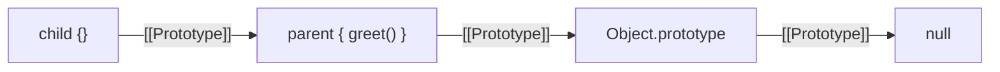
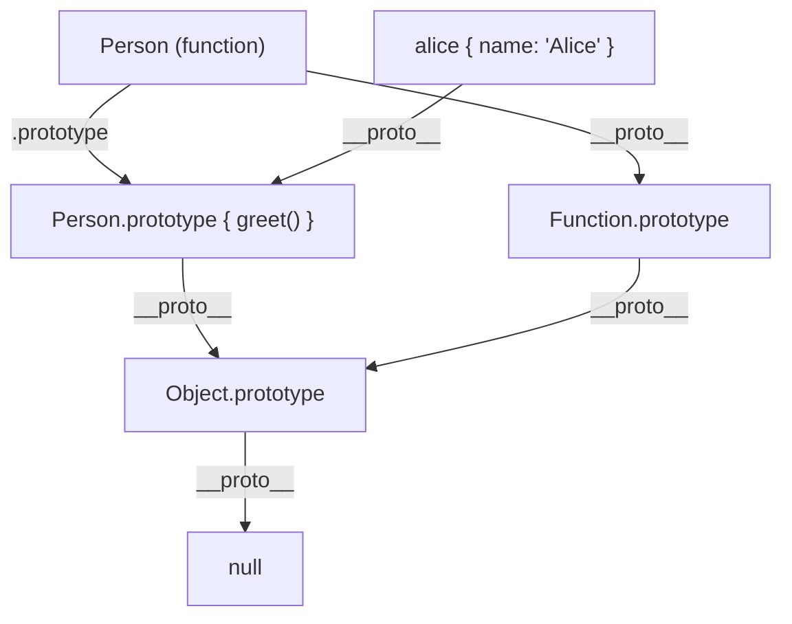
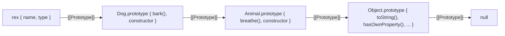
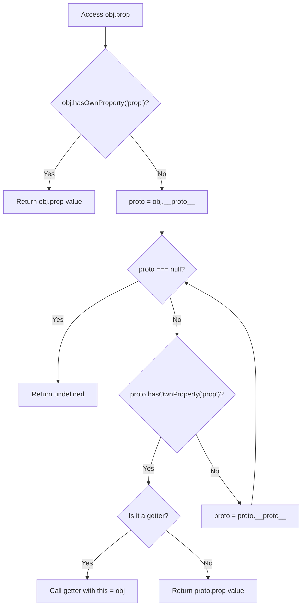
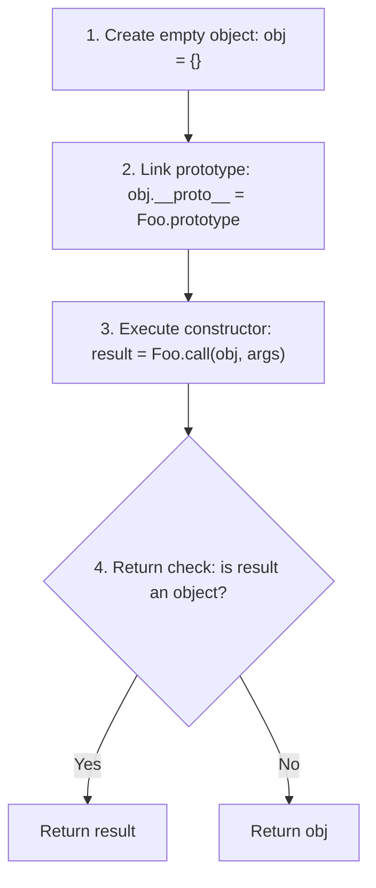
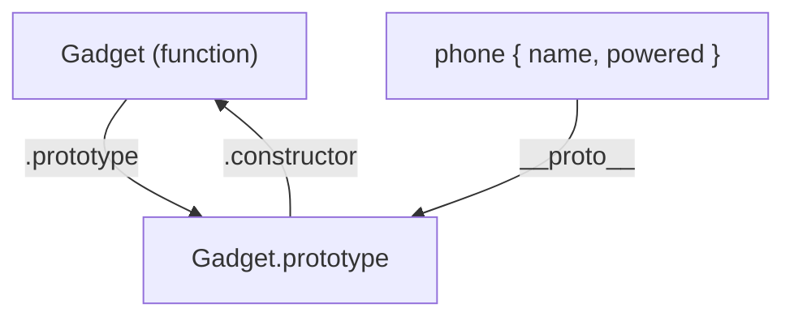
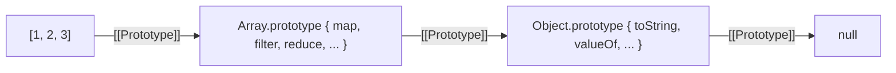
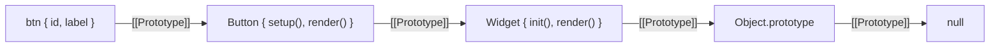
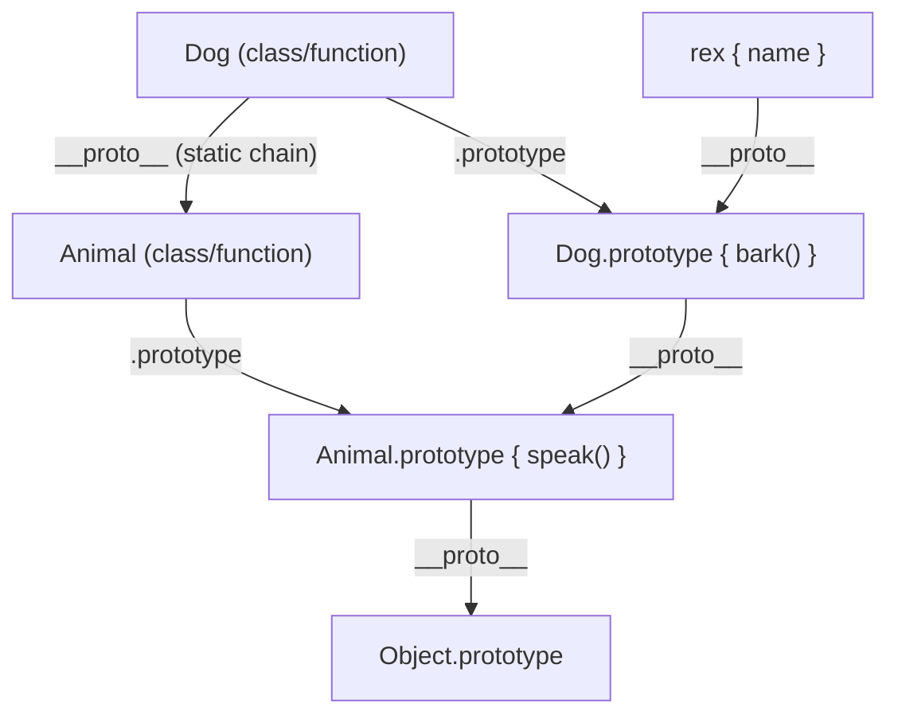

# 04 — Prototypes Deep Dive

> **TL;DR** — Every JavaScript object has a hidden `[[Prototype]]` link to another object, forming a chain that ends at `null`. Property lookups walk this chain. `__proto__` is the accessor for an object's prototype; `.prototype` is a property on **functions** used when constructing instances via `new`. Mastering this mechanism is essential — it underpins inheritance, `class` syntax, and half the "gotcha" questions in senior-level interviews.

---

## 1. What Is a Prototype?

Every object in JavaScript has an internal slot called `[[Prototype]]`. This is not a regular property — it is a hidden link to another object (or `null`). When the engine cannot find a property on an object, it follows this link and searches the next object in the chain.

```javascript
const parent = { greet() { return 'hello'; } };
const child = Object.create(parent);

console.log(child.greet()); // "hello" — found via [[Prototype]]
console.log(child.hasOwnProperty('greet')); // false
```

Key facts:

| Concept | Detail |
|---|---|
| `[[Prototype]]` | Internal slot — not directly accessible as a property name |
| Default value | `Object.prototype` for plain objects created via `{}` |
| Terminal value | `Object.prototype.[[Prototype]]` is `null` — end of every chain |
| Access | `Object.getPrototypeOf(obj)` (standard), `obj.__proto__` (legacy) |



The prototype is **not** a copy. It is a live reference. Mutating the parent object immediately affects all objects linked to it.

```javascript
parent.farewell = () => 'bye';
console.log(child.farewell()); // "bye" — instantly visible
```

---

## 2. `__proto__` vs `.prototype` — The Critical Distinction

This is the single most confused concept in all of JavaScript. They are **completely different things**.

| | `__proto__` | `.prototype` |
|---|---|---|
| What is it? | Accessor property on every **object** | Regular property on every **function** |
| Points to | The object's `[[Prototype]]` (its parent) | The object that will become `[[Prototype]]` of instances created via `new` |
| Exists on | All objects | Only functions (specifically constructor functions) |
| Standard? | Legacy (ES2015 formalized as optional) | Part of the language since ES3 |
| Preferred alternative | `Object.getPrototypeOf()` | N/A — it is the mechanism itself |

```javascript
function Person(name) {
  this.name = name;
}
Person.prototype.greet = function () {
  return `Hi, I am ${this.name}`;
};

const alice = new Person('Alice');

// alice.__proto__ === Person.prototype
console.log(Object.getPrototypeOf(alice) === Person.prototype); // true

// Person.__proto__ === Function.prototype (Person is a function object)
console.log(Object.getPrototypeOf(Person) === Function.prototype); // true

// Person.prototype is NOT Person's own prototype — it is the blueprint for instances
console.log(Person.prototype === Object.getPrototypeOf(Person)); // false
```



**Read the diagram carefully.** `Person` the function has *two* prototype-related links:

1. `.prototype` — points to the object given to instances (`alice`)
2. `__proto__` — points to `Function.prototype` (because `Person` is itself a function object)

---

## 3. The Prototype Chain

When you access a property on an object, the engine performs a **prototype chain walk**:

1. Check the object's own properties.
2. If not found, follow `[[Prototype]]` to the next object.
3. Repeat until the property is found or `null` is reached.

```javascript
function Animal(type) {
  this.type = type;
}
Animal.prototype.breathe = function () {
  return 'inhale... exhale...';
};

function Dog(name) {
  Animal.call(this, 'canine');
  this.name = name;
}
Dog.prototype = Object.create(Animal.prototype);
Dog.prototype.constructor = Dog;
Dog.prototype.bark = function () {
  return 'Woof!';
};

const rex = new Dog('Rex');
```

The full chain for `rex`:



```javascript
rex.bark();              // found on Dog.prototype
rex.breathe();           // found on Animal.prototype
rex.toString();          // found on Object.prototype
rex.hasOwnProperty('name'); // found on Object.prototype → true
rex.fly;                 // undefined — chain exhausted, reached null
```

---

## 4. Property Lookup Mechanism

The engine follows a well-defined algorithm when you read `obj.prop`:



### Property Shadowing

When you **set** a property on an object, it creates an own property — even if the same name exists on the prototype. This is called **shadowing**.

```javascript
function Base() {}
Base.prototype.value = 42;

const obj = new Base();
console.log(obj.value);                // 42 (from prototype)
console.log(obj.hasOwnProperty('value')); // false

obj.value = 100; // creates OWN property
console.log(obj.value);                // 100 (own — shadows prototype)
console.log(obj.hasOwnProperty('value')); // true

delete obj.value;
console.log(obj.value); // 42 (prototype visible again)
```

**Gotcha** — shadowing does NOT work as expected when the prototype property is a setter or is non-writable:

```javascript
const proto = {};
Object.defineProperty(proto, 'x', {
  value: 10,
  writable: false
});
const child = Object.create(proto);

child.x = 99; // SILENTLY FAILS in sloppy mode, throws in strict mode
console.log(child.x); // 10 — no shadowing occurred
```

---

## 5. `Object.create()` — Direct Prototype Control

`Object.create(proto)` creates a new object with `[[Prototype]]` set to `proto`. This is the cleanest way to set up prototype chains without constructor functions.

```javascript
const vehicle = {
  start() { return `${this.type} engine started`; },
  stop() { return 'Engine stopped'; }
};

const car = Object.create(vehicle);
car.type = 'V8';
car.drift = function () { return 'Skrrrt!'; };

console.log(car.start()); // "V8 engine started"
console.log(Object.getPrototypeOf(car) === vehicle); // true
```

### `Object.create(null)` — The Pure Dictionary

Creating an object with `null` prototype gives you a truly empty object — no `toString`, no `hasOwnProperty`, no prototype pollution risk.

```javascript
const dict = Object.create(null);
dict['__proto__'] = 'safe'; // just a regular key, not a prototype link
dict['constructor'] = 'also safe';

console.log(dict.__proto__);   // "safe" (no accessor override)
console.log(dict.toString);    // undefined (no inherited methods)
console.log('__proto__' in dict); // true — own property only
```

This is heavily used in engines, bundlers, and frameworks for safe hash maps.

### Simplified Polyfill

```javascript
if (!Object.create) {
  Object.create = function (proto) {
    if (typeof proto !== 'object' && typeof proto !== 'function') {
      throw new TypeError('Prototype must be an object or null');
    }
    function Temp() {}
    Temp.prototype = proto;
    return new Temp();
  };
}
```

---

## 6. `Object.getPrototypeOf()` / `Object.setPrototypeOf()`

The modern, standard API for reading and writing `[[Prototype]]`.

```javascript
const base = { role: 'base' };
const derived = Object.create(base);

// READ
console.log(Object.getPrototypeOf(derived) === base); // true

// WRITE (use sparingly — serious perf impact)
const newBase = { role: 'newBase' };
Object.setPrototypeOf(derived, newBase);
console.log(derived.role); // "newBase"
```

| Method | Use |
|---|---|
| `Object.getPrototypeOf(obj)` | Read `[[Prototype]]` — always prefer this |
| `Object.setPrototypeOf(obj, proto)` | Write `[[Prototype]]` — avoid in hot paths |
| `obj.__proto__` | Legacy accessor — avoid in production code |
| `Reflect.getPrototypeOf(obj)` | Same as `Object.getPrototypeOf`, stricter argument checking |

> **Performance warning:** `Object.setPrototypeOf()` and writing `__proto__` de-optimizes the object in every major engine. V8, SpiderMonkey, and JavaScriptCore all bail out of inline caches when prototype chains change at runtime.

---

## 7. Constructor Functions and `new` — What Actually Happens

When you call `new Foo(args)`, the engine performs exactly **four steps**:



```javascript
function Gadget(name) {
  this.name = name;
  this.powered = false;
}
Gadget.prototype.turnOn = function () {
  this.powered = true;
};

// What `new Gadget('Phone')` does internally:
function simulateNew(Constructor, ...args) {
  const obj = Object.create(Constructor.prototype); // steps 1 + 2
  const result = Constructor.apply(obj, args);       // step 3
  return result instanceof Object ? result : obj;    // step 4
}

const phone = simulateNew(Gadget, 'Phone');
console.log(phone.name);     // "Phone"
console.log(phone.turnOn);   // function — from Gadget.prototype
console.log(phone instanceof Gadget); // true
```

### The `constructor` Property

`Foo.prototype.constructor` points back to `Foo` by default. This circular reference is important for `instanceof` and `constructor` checks.

```javascript
console.log(Gadget.prototype.constructor === Gadget); // true
console.log(phone.constructor === Gadget);            // true (inherited)
```



---

## 8. Prototype Chain for Built-in Types

All built-in types follow the same chain pattern. Understanding this explains why `[].map()` works and why `({}).toString()` is available everywhere.



```javascript
const arr = [1, 2, 3];

console.log(Object.getPrototypeOf(arr) === Array.prototype);          // true
console.log(Object.getPrototypeOf(Array.prototype) === Object.prototype); // true
console.log(Object.getPrototypeOf(Object.prototype) === null);        // true

// All built-ins follow this pattern:
// instance → Type.prototype → Object.prototype → null
```

| Instance | Chain |
|---|---|
| `'hello'` (boxed) | `String.prototype → Object.prototype → null` |
| `42` (boxed) | `Number.prototype → Object.prototype → null` |
| `/regex/` | `RegExp.prototype → Object.prototype → null` |
| `function(){}` | `Function.prototype → Object.prototype → null` |
| `new Map()` | `Map.prototype → Object.prototype → null` |
| `new Error()` | `Error.prototype → Object.prototype → null` |

```javascript
// Functions have a longer chain — they are objects with callable behavior
function foo() {}
console.log(Object.getPrototypeOf(foo) === Function.prototype);        // true
console.log(Object.getPrototypeOf(Function.prototype) === Object.prototype); // true

// Even Function itself follows the chain
console.log(Object.getPrototypeOf(Function) === Function.prototype); // true
// The circular reference: Function is an instance of Function
console.log(Function instanceof Function); // true
console.log(Function instanceof Object);   // true
```

---

## 9. Inheritance via Prototypes (Pre-ES6 Pattern)

Before `class` syntax, this was the standard inheritance pattern:

```javascript
// Parent constructor
function Shape(color) {
  this.color = color;
}
Shape.prototype.describe = function () {
  return `A ${this.color} shape`;
};

// Child constructor
function Circle(color, radius) {
  Shape.call(this, color); // "super" call — borrow parent initialization
  this.radius = radius;
}

// Set up inheritance chain
Circle.prototype = Object.create(Shape.prototype);
Circle.prototype.constructor = Circle;

// Add child methods
Circle.prototype.area = function () {
  return Math.PI * this.radius ** 2;
};

const c = new Circle('red', 5);
console.log(c.describe()); // "A red shape" — inherited
console.log(c.area());     // 78.539... — own
console.log(c instanceof Circle); // true
console.log(c instanceof Shape);  // true
```

**Why `Object.create(Shape.prototype)` instead of `new Shape()`?**

Using `new Shape()` would execute the constructor body (possibly with side effects and missing arguments). `Object.create` only sets up the prototype link — no constructor invocation.

```javascript
// WRONG — invokes Shape() with no arguments, causes side effects
Circle.prototype = new Shape();

// RIGHT — only links prototypes, no constructor call
Circle.prototype = Object.create(Shape.prototype);
```

### Method Overriding

```javascript
Circle.prototype.describe = function () {
  // Call parent method explicitly
  const parentDesc = Shape.prototype.describe.call(this);
  return `${parentDesc} with radius ${this.radius}`;
};

console.log(c.describe()); // "A red shape with radius 5"
```

---

## 10. `hasOwnProperty` vs `in` Operator

Understanding the difference is critical for iterating safely.

```javascript
function Vehicle(type) {
  this.type = type;
}
Vehicle.prototype.wheels = 4;

const car = new Vehicle('sedan');
car.color = 'blue';
```

| Check | `'type'` | `'color'` | `'wheels'` | `'toString'` |
|---|---|---|---|---|
| `car.hasOwnProperty(prop)` | `true` | `true` | `false` | `false` |
| `prop in car` | `true` | `true` | `true` | `true` |
| `car[prop] !== undefined` | `true` | `true` | `true` | `true` |

```javascript
// for...in iterates OWN + INHERITED enumerable properties
for (const key in car) {
  console.log(key, car.hasOwnProperty(key) ? '(own)' : '(inherited)');
}
// type (own)
// color (own)
// wheels (inherited)

// Object.keys() returns ONLY own enumerable properties
console.log(Object.keys(car)); // ["type", "color"]

// Safest ownership check (immune to prototype pollution)
console.log(Object.hasOwn(car, 'type'));    // true  (ES2022+)
console.log(Object.hasOwn(car, 'wheels')); // false
```

> **Prefer `Object.hasOwn()`** over `obj.hasOwnProperty()`. The latter can be shadowed or unavailable on `Object.create(null)` objects.

---

## 11. Performance Implications

### Long Prototype Chains

Every property miss triggers a chain walk. Longer chains mean more lookups.

```javascript
// Depth-4 chain
const a = { x: 1 };
const b = Object.create(a);
const c = Object.create(b);
const d = Object.create(c);

// Accessing d.x walks: d → c → b → a → found
// Accessing d.y walks: d → c → b → a → Object.prototype → null → undefined
```

In practice, V8 uses **hidden classes** and **inline caches** to optimize chain lookups to near-zero cost for stable objects. The performance penalty comes from:

1. **Megamorphic call sites** — accessing the same property on objects with different shapes
2. **Prototype mutations** — using `Object.setPrototypeOf()` or writing `__proto__` at runtime
3. **Very deep chains** — beyond 3-4 levels, inline cache misses increase

### `Object.create(null)` for High-Performance Dictionaries

```javascript
// Regular object — has 13+ inherited properties from Object.prototype
const regular = {};
'toString' in regular; // true — polluted namespace

// Null-prototype object — pure dictionary
const pure = Object.create(null);
'toString' in pure; // false — clean namespace

// Used by: V8 internally, Express.js (req.query), many ORM query builders
```

### Avoid Prototype Mutation in Hot Paths

```javascript
// BAD — triggers de-optimization in V8
function makeSpecial(obj) {
  Object.setPrototypeOf(obj, specialProto);
  return obj;
}

// GOOD — set prototype at creation time
function makeSpecial() {
  return Object.create(specialProto);
}
```

---

## 12. Prototype Pollution — Security Concern

Prototype pollution is a vulnerability where an attacker modifies `Object.prototype`, affecting **all objects** in the application.

### How It Works

```javascript
// Unsafe deep merge (simplified)
function unsafeMerge(target, source) {
  for (const key in source) {
    if (typeof source[key] === 'object' && source[key] !== null) {
      if (!target[key]) target[key] = {};
      unsafeMerge(target[key], source[key]);
    } else {
      target[key] = source[key];
    }
  }
  return target;
}

// Attacker payload
const malicious = JSON.parse('{"__proto__": {"isAdmin": true}}');
unsafeMerge({}, malicious);

// Now EVERY object in the application is affected
const user = {};
console.log(user.isAdmin); // true — polluted!
```

### Prevention Strategies

```javascript
// 1. Freeze Object.prototype (nuclear option)
Object.freeze(Object.prototype);

// 2. Validate keys during merge
function safeMerge(target, source) {
  for (const key of Object.keys(source)) {
    if (key === '__proto__' || key === 'constructor' || key === 'prototype') {
      continue; // skip dangerous keys
    }
    if (typeof source[key] === 'object' && source[key] !== null) {
      target[key] = target[key] || {};
      safeMerge(target[key], source[key]);
    } else {
      target[key] = source[key];
    }
  }
  return target;
}

// 3. Use Map instead of plain objects for user-controlled data
const safeStore = new Map();
safeStore.set('__proto__', 'safe'); // no pollution

// 4. Use null-prototype objects
const config = Object.create(null);
config['__proto__'] = 'just a string'; // no accessor to hijack

// 5. Use Object.hasOwn() checks
```

| Strategy | Effectiveness | Trade-off |
|---|---|---|
| `Object.freeze(Object.prototype)` | Full protection | Breaks libraries that patch prototypes |
| Key blacklisting | Good | Must maintain deny-list |
| `Object.create(null)` | Eliminates vector | No inherited methods |
| `Map` / `Set` | Eliminates vector | Different API |
| Schema validation (Joi, Zod) | Best for APIs | Requires schema definitions |

---

## 13. Prototype-Related Patterns in the Wild

### Mixin Pattern via `Object.assign`

```javascript
const serializable = {
  serialize() { return JSON.stringify(this); },
  toJSON() {
    return Object.fromEntries(
      Object.entries(this).filter(([k]) => !k.startsWith('_'))
    );
  }
};

const eventEmitter = {
  on(event, fn) { (this._events ??= {})[event] = [...(this._events?.[event] ?? []), fn]; },
  emit(event, ...args) { this._events?.[event]?.forEach(fn => fn(...args)); }
};

function User(name) {
  this.name = name;
  this._secret = 'hidden';
}

// Mix multiple behaviors into prototype
Object.assign(User.prototype, serializable, eventEmitter);

const u = new User('Alice');
u.on('save', () => console.log('saved!'));
console.log(u.serialize()); // {"name":"Alice"} — _secret excluded
u.emit('save');             // "saved!"
```

### Prototype-based Delegation (OLOO — Objects Linked to Other Objects)

Advocated by Kyle Simpson, this pattern skips constructor functions entirely:

```javascript
const Widget = {
  init(id) {
    this.id = id;
    return this;
  },
  render() {
    return `<div id="${this.id}"></div>`;
  }
};

const Button = Object.create(Widget);
Button.setup = function (id, label) {
  this.init(id);
  this.label = label;
  return this;
};
Button.render = function () {
  return `<button id="${this.id}">${this.label}</button>`;
};

const btn = Object.create(Button).setup('btn1', 'Click Me');
console.log(btn.render()); // <button id="btn1">Click Me</button>
```



---

## 14. Common Mistakes

### Mistake 1: Confusing `.prototype` with `__proto__`

```javascript
function Foo() {}
const f = new Foo();

// WRONG mental model: "f.prototype exists"
console.log(f.prototype); // undefined — f is not a function

// CORRECT
console.log(Object.getPrototypeOf(f) === Foo.prototype); // true
```

### Mistake 2: Overwriting `.prototype` After Creating Instances

```javascript
function Cat(name) { this.name = name; }
Cat.prototype.meow = function () { return 'Meow!'; };

const kitty = new Cat('Kitty');

// Overwrite prototype AFTER instance creation
Cat.prototype = { purr() { return 'Purrr'; } };

const newCat = new Cat('Luna');

kitty.meow(); // "Meow!" — kitty still links to the OLD prototype
newCat.purr(); // "Purrr" — newCat links to the NEW prototype
newCat.meow;   // undefined — not on the new prototype
kitty.purr;    // undefined — not on the old prototype
```

### Mistake 3: Forgetting to Restore `constructor`

```javascript
function Parent() {}
function Child() {}

Child.prototype = Object.create(Parent.prototype);
// BUG: Child.prototype.constructor now points to Parent!

console.log(new Child().constructor === Parent); // true — wrong!

// FIX
Child.prototype.constructor = Child;
```

### Mistake 4: Using `for...in` Without `hasOwnProperty` Guard

```javascript
Object.prototype.customProp = 'danger';

const obj = { a: 1, b: 2 };
for (const key in obj) {
  console.log(key); // a, b, customProp — leaked!
}

// FIX: use Object.keys() or filter
for (const key in obj) {
  if (Object.hasOwn(obj, key)) {
    console.log(key); // a, b — safe
  }
}
```

### Mistake 5: Assuming Primitives Have Prototypes Directly

```javascript
const str = 'hello';
console.log(typeof str);                    // "string" (primitive)
console.log(Object.getPrototypeOf(str));    // String.prototype — auto-boxing

// Primitives are auto-boxed when accessing properties
str.toUpperCase(); // JS creates new String('hello'), calls method, discards wrapper
```

---

## 15. Advanced: `Symbol.hasInstance` and `instanceof` Internals

`instanceof` uses the prototype chain by default, but can be customized:

```javascript
class EvenNumber {
  static [Symbol.hasInstance](value) {
    return typeof value === 'number' && value % 2 === 0;
  }
}

console.log(4 instanceof EvenNumber);  // true
console.log(5 instanceof EvenNumber);  // false

// Default instanceof algorithm:
function customInstanceOf(obj, Constructor) {
  let proto = Object.getPrototypeOf(obj);
  const target = Constructor.prototype;
  while (proto !== null) {
    if (proto === target) return true;
    proto = Object.getPrototypeOf(proto);
  }
  return false;
}
```

---

## 16. Prototypes and ES6 `class` — Syntactic Sugar

ES6 classes are **not** a new inheritance model. They are syntactic sugar over the exact same prototype mechanism.

```javascript
class Animal {
  constructor(name) {
    this.name = name;
  }
  speak() {
    return `${this.name} makes a noise`;
  }
}

class Dog extends Animal {
  bark() {
    return `${this.name} barks`;
  }
}

const d = new Dog('Rex');
```

Under the hood, this is equivalent to:

```javascript
// The engine effectively does:
// Dog.prototype = Object.create(Animal.prototype)
// Object.setPrototypeOf(Dog, Animal) — for static inheritance

console.log(Object.getPrototypeOf(Dog.prototype) === Animal.prototype); // true
console.log(Object.getPrototypeOf(Dog) === Animal);                     // true
```



The `extends` keyword sets up **two** prototype chains:

1. **Instance chain:** `Dog.prototype.__proto__ = Animal.prototype` (method inheritance)
2. **Static chain:** `Dog.__proto__ = Animal` (static method inheritance)

---

## 17. Interview-Ready Answers

> **Q: What is the difference between `__proto__` and `.prototype`?**
>
> `__proto__` is an accessor property on every object that exposes its internal `[[Prototype]]` link — the object it delegates to for property lookups. `.prototype` is a regular property on **functions** that becomes the `[[Prototype]]` of objects created via `new`. They serve completely different roles: `__proto__` is about an object's own parent in the chain, while `.prototype` is about what a constructor function gives to its children.

> **Q: What are the four steps `new` performs?**
>
> 1. Create a new empty object. 2. Set the object's `[[Prototype]]` to `Constructor.prototype`. 3. Execute the constructor with `this` bound to the new object. 4. If the constructor returns a non-primitive, return that; otherwise return the newly created object.

> **Q: How does JavaScript property lookup work?**
>
> The engine first checks the object's own properties. If the property is not found, it follows the `[[Prototype]]` link to the next object in the chain and checks there. This continues until the property is found or the chain terminates at `null` (the `[[Prototype]]` of `Object.prototype`). This is called the prototype chain walk.

> **Q: What is prototype pollution and how do you prevent it?**
>
> Prototype pollution occurs when an attacker injects properties into `Object.prototype` (typically via unsafe deep-merge or `JSON.parse` with `__proto__` keys), affecting all objects in the runtime. Prevention: validate/blacklist keys like `__proto__`, `constructor`, and `prototype` in merge utilities; use `Object.create(null)` or `Map` for user-controlled data; freeze `Object.prototype` in sensitive environments; use schema validation libraries.

> **Q: Why is `Object.create(null)` useful?**
>
> It creates an object with no prototype chain — no inherited `toString`, `hasOwnProperty`, or any other `Object.prototype` methods. This makes it a pure dictionary with zero risk of key collisions with inherited properties or prototype pollution. It is used in high-performance scenarios (Express.js `req.query`, template engines, bundler internals) where a clean namespace is critical.

> **Q: How do ES6 classes relate to prototypes?**
>
> ES6 `class` syntax is syntactic sugar over the prototypal inheritance model. `class Dog extends Animal` sets up `Dog.prototype.__proto__ = Animal.prototype` for instance method inheritance and `Dog.__proto__ = Animal` for static method inheritance. The `constructor` method maps to the constructor function body. Under the hood, `new`, prototype chains, and `instanceof` work identically to pre-ES6 patterns.

> **Q: What is the difference between `hasOwnProperty` and the `in` operator?**
>
> `hasOwnProperty` checks only the object's own properties — it does not walk the prototype chain. The `in` operator checks the entire prototype chain, returning `true` for own and inherited properties. For safety, prefer `Object.hasOwn()` (ES2022) since `hasOwnProperty` can be shadowed or absent on `Object.create(null)` objects.

> **Q: Why should you avoid `Object.setPrototypeOf()` in production code?**
>
> Mutating an object's prototype after creation forces engines to abandon optimized hidden classes and inline caches for that object. V8, SpiderMonkey, and JSC all treat prototype mutations as de-optimization events, resulting in significantly slower property access. Instead, set the prototype at object creation time using `Object.create()` or constructor functions.

> **Q: How does `instanceof` work internally?**
>
> `obj instanceof Constructor` walks the prototype chain of `obj` comparing each `[[Prototype]]` against `Constructor.prototype`. If a match is found, it returns `true`; if the chain reaches `null`, it returns `false`. This behavior can be customized by defining `Symbol.hasInstance` on the constructor.

---

> Next → [05-oop-javascript.md](05-oop-javascript.md)
