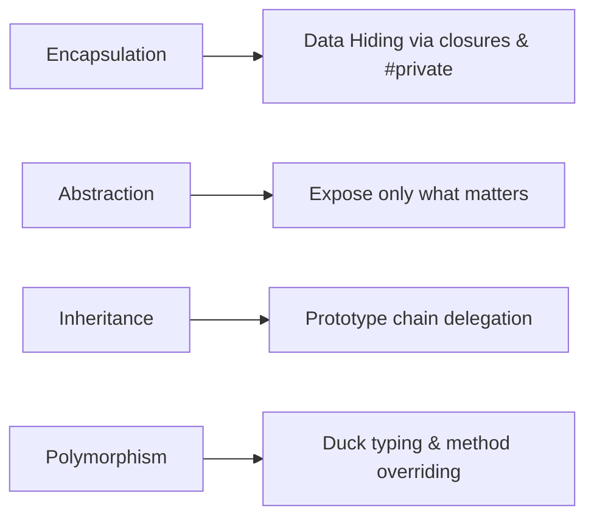
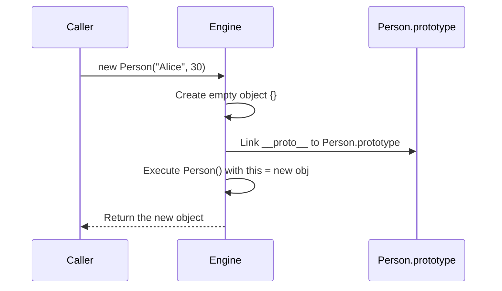
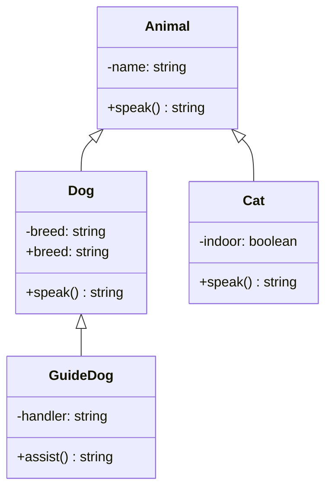
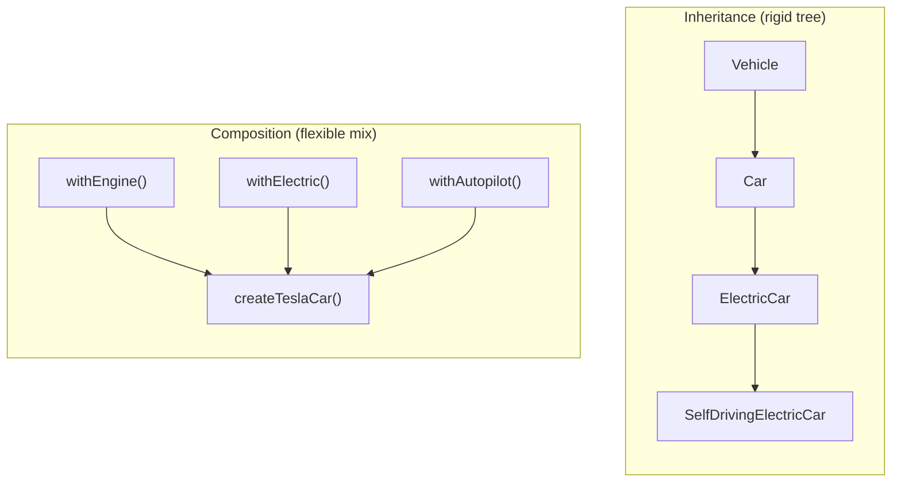

# 05 — OOP in JavaScript

> **TL;DR** — JavaScript's OOP is prototype-based, not class-based. `class` is syntactic sugar over constructor functions and prototypes. Mastering OOP in JS means understanding prototype chains, favoring composition over inheritance, applying SOLID through duck typing, and leveraging mixins for code reuse without the diamond problem.

---

## 1. The Four Pillars of OOP in JavaScript

Every OOP language revolves around four pillars, but JS implements each with its own twist.



### Encapsulation

```javascript
class BankAccount {
  #balance = 0; // truly private

  deposit(amount) {
    if (amount <= 0) throw new RangeError('Amount must be positive');
    this.#balance += amount;
  }

  get balance() {
    return this.#balance;
  }
}

const acct = new BankAccount();
acct.deposit(100);
console.log(acct.balance);   // 100
console.log(acct.#balance);  // SyntaxError — cannot access private field
```

### Abstraction

```javascript
class HttpClient {
  #baseUrl;
  constructor(baseUrl) { this.#baseUrl = baseUrl; }

  async get(path) {
    const res = await fetch(`${this.#baseUrl}${path}`);
    if (!res.ok) throw new Error(`HTTP ${res.status}`);
    return res.json();
  }
}

const api = new HttpClient('https://api.example.com');
const users = await api.get('/users'); // consumer never sees fetch internals
```

### Inheritance

```javascript
class Shape {
  area() { throw new Error('area() must be implemented'); }
}

class Circle extends Shape {
  #radius;
  constructor(r) { super(); this.#radius = r; }
  area() { return Math.PI * this.#radius ** 2; }
}
```

### Polymorphism

```javascript
function printArea(shape) {
  // works for any object with an area() method — duck typing
  console.log(`Area: ${shape.area()}`);
}

printArea(new Circle(5));
printArea({ area: () => 42 }); // plain object works too
```

---

## 2. Constructor Functions — The Pre-Class Way

Before ES6, constructor functions + prototype assignment was the only mechanism.

```javascript
function Person(name, age) {
  this.name = name;
  this.age = age;
}

Person.prototype.greet = function () {
  return `Hi, I'm ${this.name}`;
};

const alice = new Person('Alice', 30);
console.log(alice.greet());                    // "Hi, I'm Alice"
console.log(alice instanceof Person);          // true
console.log(alice.__proto__ === Person.prototype); // true
```

### What `new` Actually Does

When you call `new Person('Alice', 30)`, four things happen:

```javascript
// Pseudocode equivalent of `new Person('Alice', 30)`
function fakeNew(Constructor, ...args) {
  const obj = Object.create(Constructor.prototype); // 1. create empty object linked to prototype
  const result = Constructor.apply(obj, args);       // 2. call constructor with `this` = obj
  return result instanceof Object ? result : obj;    // 3. return obj (unless constructor returns an object)
}
```



---

## 3. ES6 Classes Are Syntactic Sugar

`class` does **not** introduce a new OOP model — it is syntactic sugar over the existing prototype system.

```javascript
class Dog {
  constructor(name) { this.name = name; }
  bark() { return 'Woof!'; }
}

// Proof:
console.log(typeof Dog);                        // "function"
console.log(Dog.prototype.bark);                // [Function: bark]
console.log(Object.getOwnPropertyNames(Dog.prototype)); // ["constructor", "bark"]
```

The class above is functionally identical to:

```javascript
function Dog(name) {
  this.name = name;
}
Dog.prototype.bark = function () {
  return 'Woof!';
};
```

### Key Differences from Plain Functions

| Feature | Constructor Function | `class` |
|---|---|---|
| Hoisted? | Yes (function declaration) | No (TDZ applies) |
| Callable without `new`? | Yes (bug-prone) | No (throws `TypeError`) |
| `prototype` methods enumerable? | Yes | No |
| `"use strict"` in body? | Manual | Automatic |

```mermaid
graph TB
  DogClass["class Dog"] -->|"typeof === 'function'"| DogPrototype["Dog.prototype"]
  DogPrototype -->|"has"| constructor["constructor()"]
  DogPrototype -->|"has"| barkMethod["bark()"]
  instance["new Dog('Rex')"] -->|"__proto__"| DogPrototype
  DogPrototype -->|"__proto__"| ObjectProto["Object.prototype"]
  ObjectProto -->|"__proto__"| nullNode["null"]
```

---

## 4. Class Syntax Deep Dive

### Constructor and Instance Methods

```javascript
class User {
  #id;
  #email;

  constructor(id, email) {
    this.#id = id;
    this.#email = email;
  }

  get email() { return this.#email; }

  set email(value) {
    if (!value.includes('@')) throw new Error('Invalid email');
    this.#email = value;
  }

  toJSON() {
    return { id: this.#id, email: this.#email };
  }
}
```

### Static Methods and Properties

```javascript
class MathUtils {
  static PI = 3.14159265;

  static clamp(val, min, max) {
    return Math.min(Math.max(val, min), max);
  }
}

console.log(MathUtils.clamp(15, 0, 10)); // 10
console.log(MathUtils.PI);               // 3.14159265
```

### Private Fields and Methods

```javascript
class Counter {
  #count = 0;

  #validate(n) {
    if (typeof n !== 'number') throw new TypeError('Expected number');
  }

  increment(n = 1) {
    this.#validate(n);
    this.#count += n;
  }

  get value() { return this.#count; }
}
```

### Static Initialization Blocks (ES2022)

```javascript
class Config {
  static defaultTimeout;
  static maxRetries;

  static {
    const env = typeof process !== 'undefined' ? 'node' : 'browser';
    Config.defaultTimeout = env === 'node' ? 5000 : 10000;
    Config.maxRetries = env === 'node' ? 3 : 1;
  }
}
```

---

## 5. Inheritance with `extends`

### How `super()` Works

```javascript
class Animal {
  #name;
  constructor(name) { this.#name = name; }
  get name() { return this.#name; }
  speak() { return `${this.#name} makes a sound`; }
}

class Dog extends Animal {
  #breed;

  constructor(name, breed) {
    super(name); // MUST call before accessing `this`
    this.#breed = breed;
  }

  speak() {
    return `${this.name} barks! (${super.speak()})`;
  }

  get breed() { return this.#breed; }
}

const rex = new Dog('Rex', 'Shepherd');
console.log(rex.speak()); // "Rex barks! (Rex makes a sound)"
```

### The Rule: `super()` Before `this`

If a derived class has a constructor, it **must** call `super()` before accessing `this`. This is because `this` is not initialized until the parent constructor runs.



### Prototype Chain After `extends`

```javascript
console.log(rex instanceof Dog);    // true
console.log(rex instanceof Animal); // true
console.log(rex instanceof Object); // true

// Two-level chain:
// rex → Dog.prototype → Animal.prototype → Object.prototype → null
```

---

## 6. Composition vs Inheritance

> "Favor composition over inheritance" — Gang of Four

### The Problem with Deep Inheritance

```javascript
class Vehicle { /* ... */ }
class Car extends Vehicle { /* ... */ }
class ElectricCar extends Car { /* ... */ }
class SelfDrivingElectricCar extends ElectricCar { /* ... */ }
// Fragile: changing Vehicle ripples through 3 levels
```

### Composition Approach

```javascript
const withEngine = (horse) => ({
  start() { console.log(`Engine: ${horse}hp`); },
});

const withElectric = (kwh) => ({
  charge() { console.log(`Charging ${kwh}kWh battery`); },
});

const withAutopilot = () => ({
  navigate(dest) { console.log(`Navigating to ${dest}`); },
});

function createTeslaCar() {
  return {
    brand: 'Tesla',
    ...withEngine(670),
    ...withElectric(100),
    ...withAutopilot(),
  };
}

const car = createTeslaCar();
car.start();              // "Engine: 670hp"
car.charge();             // "Charging 100kWh battery"
car.navigate('Airport');  // "Navigating to Airport"
```



### When to Use Each

| Criteria | Inheritance | Composition |
|---|---|---|
| Relationship | "is-a" | "has-a" / "can-do" |
| Coupling | Tight | Loose |
| Reuse across hierarchies | Hard | Easy |
| Runtime flexibility | None | Full — swap behaviors |
| Testing | Requires base class | Mock individual pieces |

---

## 7. SOLID Principles in JavaScript


### S — Single Responsibility Principle

> A class should have only one reason to change.

```javascript
// BAD: UserService does too many things
class UserService {
  createUser(data) { /* ... */ }
  sendWelcomeEmail(user) { /* ... */ }
  generateReport(users) { /* ... */ }
}

// GOOD: split into focused classes
class UserRepository {
  create(data) { /* persist user */ }
}

class EmailService {
  sendWelcome(user) { /* send email */ }
}

class UserReportGenerator {
  generate(users) { /* build report */ }
}
```

### O — Open/Closed Principle

> Open for extension, closed for modification.

```javascript
// Strategy pattern — add new discounts without modifying DiscountCalculator
class DiscountCalculator {
  #strategies = new Map();

  register(type, strategy) {
    this.#strategies.set(type, strategy);
  }

  calculate(type, amount) {
    const strategy = this.#strategies.get(type);
    if (!strategy) throw new Error(`Unknown discount: ${type}`);
    return strategy(amount);
  }
}

const calc = new DiscountCalculator();
calc.register('seasonal', (amt) => amt * 0.9);
calc.register('vip', (amt) => amt * 0.8);
calc.register('employee', (amt) => amt * 0.7); // extended, not modified
```

### L — Liskov Substitution Principle

> Subtypes must be substitutable for their base types without breaking behavior.

```javascript
class Rectangle {
  #w; #h;
  constructor(w, h) { this.#w = w; this.#h = h; }
  get width() { return this.#w; }
  get height() { return this.#h; }
  set width(v) { this.#w = v; }
  set height(v) { this.#h = v; }
  area() { return this.#w * this.#h; }
}

// VIOLATION: Square overrides setters to enforce w === h
class Square extends Rectangle {
  set width(v) { super.width = v; super.height = v; }
  set height(v) { super.width = v; super.height = v; }
}

// This breaks expectations:
function assertAreaAfterResize(rect) {
  rect.width = 5;
  rect.height = 4;
  console.assert(rect.area() === 20); // fails for Square (area is 16)
}

// FIX: Don't make Square extend Rectangle. Use composition or separate classes.
```

### I — Interface Segregation Principle

JS has no interfaces, but duck typing achieves the same goal: **require only the methods you use**.

```javascript
// BAD: function expects a god-object
function processAnimal(animal) {
  animal.fly();
  animal.swim();
  animal.run();
}

// GOOD: depend only on what you need
function processFlyer(flyer) {
  flyer.fly(); // only requires fly()
}

function processSwimmer(swimmer) {
  swimmer.swim(); // only requires swim()
}
```

### D — Dependency Inversion Principle

> High-level modules should not depend on low-level modules. Both depend on abstractions.

```javascript
// Abstraction (could be any logger)
class Logger {
  log(msg) { throw new Error('Not implemented'); }
}

class ConsoleLogger extends Logger {
  log(msg) { console.log(`[LOG] ${msg}`); }
}

class FileLogger extends Logger {
  log(msg) { /* write to file */ }
}

// High-level module depends on the abstraction, not the concrete class
class OrderService {
  #logger;
  constructor(logger) { this.#logger = logger; }

  placeOrder(order) {
    this.#logger.log(`Order placed: ${order.id}`);
  }
}

const service = new OrderService(new ConsoleLogger());
// Swap to FileLogger in production — zero changes to OrderService
```

---

## 8. Mixins and Multiple Inheritance

JavaScript has **single inheritance** via `extends`, but mixins simulate multiple inheritance.

### Mixin via `Object.assign`

```javascript
const Serializable = {
  serialize() { return JSON.stringify(this); },
  deserialize(json) { return Object.assign(this, JSON.parse(json)); },
};

const Validatable = {
  validate() {
    for (const [key, val] of Object.entries(this)) {
      if (val == null) throw new Error(`${key} is required`);
    }
    return true;
  },
};

class Product {
  constructor(name, price) {
    this.name = name;
    this.price = price;
  }
}

Object.assign(Product.prototype, Serializable, Validatable);

const p = new Product('Widget', 9.99);
console.log(p.serialize());  // '{"name":"Widget","price":9.99}'
p.validate();                 // true
```

### Mixin Factory Pattern (Class-Based)

This approach preserves the prototype chain and works with `instanceof`.

```javascript
const Timestamped = (Base) =>
  class extends Base {
    createdAt = new Date();
  };

const SoftDeletable = (Base) =>
  class extends Base {
    #deleted = false;
    softDelete() { this.#deleted = true; }
    get isDeleted() { return this.#deleted; }
  };

class BaseEntity {
  constructor(id) { this.id = id; }
}

class Order extends SoftDeletable(Timestamped(BaseEntity)) {
  #total;
  constructor(id, total) {
    super(id);
    this.#total = total;
  }
}

const order = new Order('ORD-1', 250);
console.log(order.createdAt);  // current date
order.softDelete();
console.log(order.isDeleted);  // true
console.log(order instanceof BaseEntity); // true
```

### Symbol-Based Conflict Resolution

```javascript
const flySymbol = Symbol('fly');
const swimSymbol = Symbol('swim');

const FlyMixin = {
  [flySymbol]() { return `${this.name} is flying`; },
};

const SwimMixin = {
  [swimSymbol]() { return `${this.name} is swimming`; },
};

class Duck {
  constructor(name) { this.name = name; }
}

Object.assign(Duck.prototype, FlyMixin, SwimMixin);

const duck = new Duck('Donald');
console.log(duck[flySymbol]());  // "Donald is flying"
console.log(duck[swimSymbol]()); // "Donald is swimming"
```

---

## 9. Abstract Classes (Simulated)

JavaScript has no `abstract` keyword. We simulate it by throwing in the base class.

```javascript
class DataStore {
  constructor() {
    if (new.target === DataStore) {
      throw new TypeError('DataStore is abstract — cannot instantiate directly');
    }
  }

  save(record)  { throw new Error('save() must be implemented'); }
  find(id)      { throw new Error('find() must be implemented'); }
  delete(id)    { throw new Error('delete() must be implemented'); }
}

class PostgresStore extends DataStore {
  #pool;
  constructor(pool) {
    super();
    this.#pool = pool;
  }

  save(record) { /* INSERT ... */ }
  find(id) { /* SELECT ... */ }
  delete(id) { /* DELETE ... */ }
}

class InMemoryStore extends DataStore {
  #data = new Map();

  save(record) { this.#data.set(record.id, record); }
  find(id) { return this.#data.get(id); }
  delete(id) { this.#data.delete(id); }
}

// new DataStore();            // TypeError
// new PostgresStore(pool);    // works
```

### Comparison with TypeScript `abstract`

```javascript
// TypeScript enforces at compile time:
// abstract class DataStore {
//   abstract save(record: any): void;   // must be implemented
//   abstract find(id: string): any;
//   abstract delete(id: string): void;
// }
// Missing implementations → compile error, not a runtime throw.
```

---

## 10. Polymorphism in JS

### Method Overriding

```javascript
class Payment {
  process(amount) { return `Processing $${amount}`; }
}

class CreditCardPayment extends Payment {
  process(amount) {
    const fee = amount * 0.029;
    return `Charging $${(amount + fee).toFixed(2)} to card (includes fee)`;
  }
}

class CryptoPayment extends Payment {
  process(amount) {
    return `Sending ${(amount / 60000).toFixed(6)} BTC`;
  }
}

// Polymorphic dispatch
const payments = [new CreditCardPayment(), new CryptoPayment()];
payments.forEach((p) => console.log(p.process(100)));
```

### Duck Typing

```javascript
function logIterable(iterable) {
  for (const item of iterable) {
    console.log(item);
  }
}

logIterable([1, 2, 3]);          // Array
logIterable(new Set([4, 5]));    // Set
logIterable('hello');            // String — all are iterable via Symbol.iterator
```

### `Symbol.iterator` — Custom Iteration Protocol

```javascript
class Range {
  #start;
  #finish;

  constructor(start, finish) {
    this.#start = start;
    this.#finish = finish;
  }

  [Symbol.iterator]() {
    let current = this.#start;
    const finish = this.#finish;
    return {
      next() {
        return current <= finish
          ? { value: current++, done: false }
          : { done: true };
      },
    };
  }
}

console.log([...new Range(1, 5)]); // [1, 2, 3, 4, 5]
```

### `Symbol.toPrimitive` — Custom Type Coercion

```javascript
class Money {
  #amount;
  #currency;

  constructor(amount, currency) {
    this.#amount = amount;
    this.#currency = currency;
  }

  [Symbol.toPrimitive](hint) {
    switch (hint) {
      case 'number':  return this.#amount;
      case 'string':  return `${this.#amount} ${this.#currency}`;
      default:        return this.#amount;
    }
  }
}

const price = new Money(42, 'USD');
console.log(+price);       // 42
console.log(`${price}`);   // "42 USD"
console.log(price + 8);    // 50
```

---

## 11. Common Mistakes

### 1. Forgetting `new`

```javascript
function Foo() { this.x = 1; }
const f = Foo(); // undefined — `this` is globalThis, pollutes global scope
// class Foo {} won't allow this — throws TypeError
```

### 2. Arrow Functions as Methods

```javascript
class Timer {
  #seconds = 0;

  // BUG: arrow function captures enclosing `this` at define-time,
  // but class fields are fine here — the real trap is in object literals:
  start = () => setInterval(() => this.#seconds++, 1000);
}

const obj = {
  value: 42,
  getValue: () => this.value, // BUG: `this` is outer scope, not obj
};
console.log(obj.getValue()); // undefined
```

### 3. Overusing Inheritance

```javascript
// BAD: God-class hierarchy
class Animal {}
class FlyingAnimal extends Animal {}
class SwimmingFlyingAnimal extends FlyingAnimal {}
// What about a swimming non-flying animal?

// GOOD: Use composition (mixins)
const withFly = (Base) => class extends Base { fly() { /* ... */ } };
const withSwim = (Base) => class extends Base { swim() { /* ... */ } };

class Duck extends withSwim(withFly(Animal)) {}
class Fish extends withSwim(Animal) {}
```

### 4. Mutating `prototype` After Instantiation

```javascript
function Car(model) { this.model = model; }
const civic = new Car('Civic');

Car.prototype = { drive() { return 'vroom'; } }; // replaces prototype entirely

console.log(civic.drive); // undefined — civic still linked to OLD prototype
// Always use Car.prototype.drive = ... to add methods safely
```

### 5. `instanceof` Across Realms

```javascript
// Arrays created in an iframe have a different Array constructor
// arr instanceof Array → false
// Use Array.isArray(arr) instead
```

---

## 12. Interview-Ready Answers

> **Q: Are ES6 classes "real" classes like in Java?**
> No. ES6 classes are syntactic sugar over JavaScript's existing prototype-based inheritance. `typeof MyClass` returns `"function"`, methods live on `MyClass.prototype`, and the prototype chain is identical to constructor function patterns. There are no visibility modifiers enforced by a type system (private fields `#` are a runtime mechanism), and there are no interfaces or abstract classes at the language level.

> **Q: What happens step-by-step when you call `new MyClass()`?**
> 1. A new empty object is created. 2. Its `[[Prototype]]` is set to `MyClass.prototype`. 3. The constructor function is called with `this` bound to the new object. 4. If the constructor returns a non-primitive, that becomes the result; otherwise the new object is returned. For derived classes, `this` is uninitialized until `super()` is called.

> **Q: How would you implement the Open/Closed Principle in JavaScript?**
> Use the Strategy pattern: define a registry (e.g., a `Map`) where new behaviors are registered without modifying the core class. Alternatively, use higher-order functions, middleware chains, or mixin factories. The key is that new functionality is added by extension (new code), not by editing existing code.

> **Q: Why should you "favor composition over inheritance"?**
> Inheritance creates tight coupling — a change in a base class can break all descendants (fragile base class problem). It also locks you into a single hierarchy. Composition lets you combine independent, reusable behaviors at runtime, makes testing easier (mock individual pieces), and avoids the diamond problem entirely.

> **Q: How do you simulate abstract classes in JavaScript?**
> Use `new.target` in the constructor to prevent direct instantiation of the base class. Define methods that throw `Error('Not implemented')` to enforce override requirements. In TypeScript, use the `abstract` keyword which enforces this at compile time rather than runtime.

> **Q: Explain polymorphism in JavaScript without using the word "class".**
> Polymorphism in JS is achieved through duck typing: if an object has the method you call, it works — regardless of its constructor or prototype. A function that calls `obj.speak()` will work with any object that has a `speak` method. Well-known symbols like `Symbol.iterator` and `Symbol.toPrimitive` enable protocol-based polymorphism, letting any object participate in `for...of` loops or type coercion by implementing the right symbol-keyed methods.

> **Q: What are the gotchas with mixins in JavaScript?**
> Property name collisions: if two mixins define the same method, the last one wins when using `Object.assign`. Solutions include Symbol-keyed methods, namespacing, or the class-based mixin factory pattern. Also, `Object.assign` only copies own enumerable properties and does not copy getters/setters as accessors — it invokes them and copies the resulting value. Use `Object.getOwnPropertyDescriptors` with `Object.defineProperties` for full fidelity.

---

> Next → [06-oop-design-patterns.md](06-oop-design-patterns.md)
