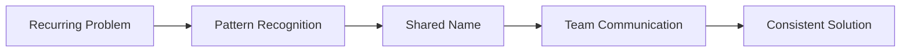
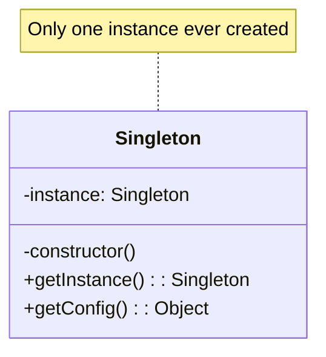
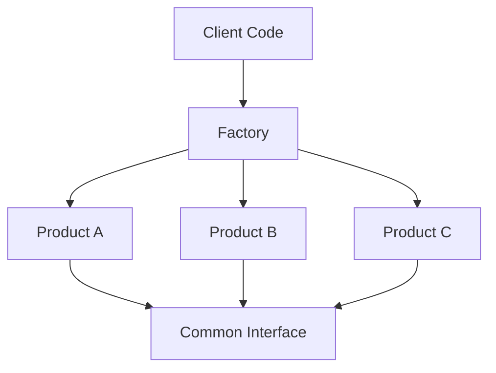
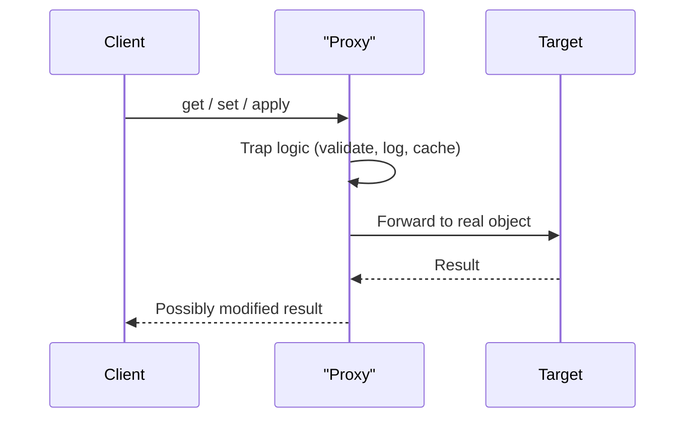
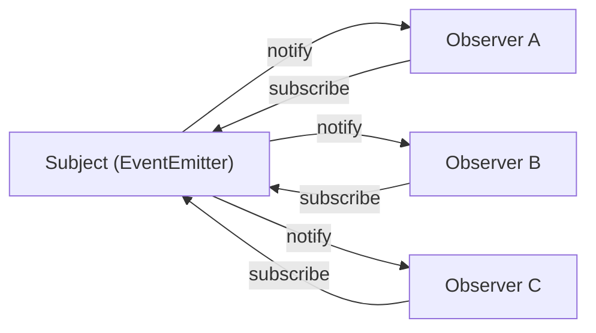
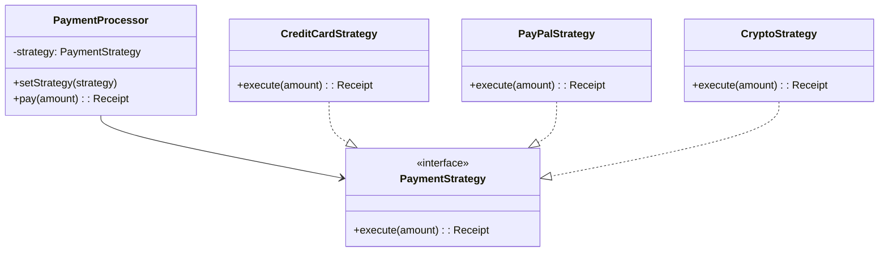
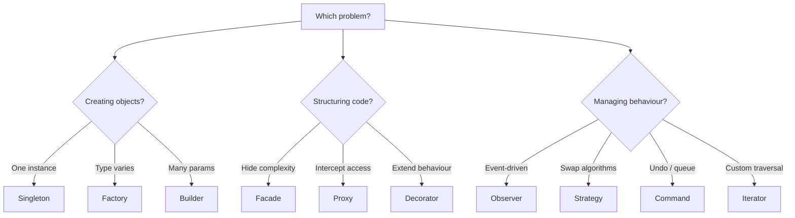

# 06 — OOP Design Patterns

> **TL;DR** — Design patterns are battle-tested blueprints for recurring software problems. They don't add new language features — they give names to solutions you've likely already written. This chapter covers the Gang-of-Four patterns most relevant to modern JavaScript: Singleton, Factory, Builder, Proxy, Decorator, Observer, Strategy, Command, and Iterator — each with production-grade implementations.

---

## 1. Why Patterns Matter

Patterns are **not** about memorizing UML diagrams. They exist for three practical reasons:

| Reason | Impact |
|---|---|
| **Shared vocabulary** | Saying "use a Strategy here" conveys an entire architecture in two words |
| **Proven trade-offs** | Each pattern documents what you gain *and* what you lose |
| **Faster code reviews** | Reviewers instantly recognise intent when patterns are applied correctly |

A senior engineer doesn't force patterns onto code — they *recognise* when a problem has already been solved by one.



---

## 2. Creational Patterns

Creational patterns control **how objects are instantiated**, hiding the creation logic and making the system independent of the specifics.

### 2.1 Singleton

A Singleton ensures a class has **exactly one instance** and provides a global access point.



**Closure-based Singleton (most idiomatic JS):**

```javascript
const createLogger = (() => {
  let instance;

  function Logger() {
    this.logs = [];
  }

  Logger.prototype.log = function (msg) {
    this.logs.push({ msg, timestamp: Date.now() });
    console.log(`[LOG] ${msg}`);
  };

  Logger.prototype.getHistory = function () {
    return [...this.logs];
  };

  return {
    getInstance() {
      if (!instance) {
        instance = new Logger();
      }
      return instance;
    },
  };
})();

const a = createLogger.getInstance();
const b = createLogger.getInstance();
console.log(a === b); // true
```

**Class-based Singleton:**

```javascript
class Database {
  static #instance;

  #connection;

  constructor(connectionString) {
    if (Database.#instance) {
      return Database.#instance;
    }
    this.#connection = connectionString;
    Database.#instance = this;
  }

  static getInstance(connectionString) {
    if (!Database.#instance) {
      new Database(connectionString);
    }
    return Database.#instance;
  }

  query(sql) {
    console.log(`[${this.#connection}] ${sql}`);
  }
}
```

**Module-based Singleton (ES Modules — simplest form):**

```javascript
// config.js — the module system itself guarantees a single evaluation
const config = {
  apiUrl: 'https://api.example.com',
  timeout: 5000,
};

export default Object.freeze(config);
```

> **When to use:** shared caches, connection pools, app configuration.
> **When to avoid:** anything that complicates testing — Singletons are hidden global state. Prefer dependency injection in large apps.

---

### 2.2 Factory

Factories **delegate** object creation to a method or class, so callers don't need to know the concrete types.



**Simple Factory:**

```javascript
class Notification {
  constructor(type, message) {
    this.type = type;
    this.message = message;
  }

  send() {
    throw new Error('send() must be implemented');
  }
}

class EmailNotification extends Notification {
  send() {
    console.log(`Email → ${this.message}`);
  }
}

class SMSNotification extends Notification {
  send() {
    console.log(`SMS → ${this.message}`);
  }
}

class PushNotification extends Notification {
  send() {
    console.log(`Push → ${this.message}`);
  }
}

function createNotification(type, message) {
  const map = {
    email: EmailNotification,
    sms: SMSNotification,
    push: PushNotification,
  };

  const NotifClass = map[type];
  if (!NotifClass) throw new Error(`Unknown notification type: ${type}`);
  return new NotifClass(type, message);
}

const alert = createNotification('sms', 'Your code shipped!');
alert.send(); // SMS → Your code shipped!
```

**Abstract Factory — family of related objects:**

```javascript
const UIFactory = {
  material: {
    createButton: (label) => ({ type: 'MaterialButton', label, raised: true }),
    createInput: (placeholder) => ({ type: 'MaterialInput', placeholder, outlined: true }),
  },
  bootstrap: {
    createButton: (label) => ({ type: 'BootstrapButton', label, btnClass: 'btn-primary' }),
    createInput: (placeholder) => ({ type: 'BootstrapInput', placeholder, formControl: true }),
  },
};

function buildForm(framework) {
  const factory = UIFactory[framework];
  return {
    submit: factory.createButton('Submit'),
    email: factory.createInput('Enter email'),
  };
}

console.log(buildForm('material'));
// { submit: { type: 'MaterialButton', ... }, email: { type: 'MaterialInput', ... } }
```

---

### 2.3 Builder

The Builder pattern constructs complex objects **step-by-step**, often with a fluent API so each method returns `this`.

```javascript
class QueryBuilder {
  #table;
  #conditions = [];
  #orderBy;
  #limitVal;

  from(table) {
    this.#table = table;
    return this;
  }

  where(condition) {
    this.#conditions.push(condition);
    return this;
  }

  order(column, dir = 'ASC') {
    this.#orderBy = `${column} ${dir}`;
    return this;
  }

  limit(n) {
    this.#limitVal = n;
    return this;
  }

  build() {
    let sql = `SELECT * FROM ${this.#table}`;
    if (this.#conditions.length) {
      sql += ` WHERE ${this.#conditions.join(' AND ')}`;
    }
    if (this.#orderBy) sql += ` ORDER BY ${this.#orderBy}`;
    if (this.#limitVal) sql += ` LIMIT ${this.#limitVal}`;
    return sql;
  }
}

const query = new QueryBuilder()
  .from('users')
  .where('age > 18')
  .where('active = true')
  .order('created_at', 'DESC')
  .limit(10)
  .build();

console.log(query);
// SELECT * FROM users WHERE age > 18 AND active = true ORDER BY created_at DESC LIMIT 10
```

> Builders shine when constructors would require 5+ parameters, many of which are optional.

---

## 3. Structural Patterns

Structural patterns deal with **composing** objects and classes into larger structures while keeping them flexible.

### 3.1 Module / Revealing Module

Before ES Modules, the Revealing Module used closures for true encapsulation:

```javascript
const AuthModule = (() => {
  let token = null;

  function setToken(t) {
    token = t;
  }

  function getToken() {
    return token;
  }

  function isAuthenticated() {
    return token !== null;
  }

  function clearSession() {
    token = null;
  }

  // Reveal only the public API
  return { login: setToken, isAuthenticated, logout: clearSession };
})();

AuthModule.login('abc123');
console.log(AuthModule.isAuthenticated()); // true
console.log(AuthModule.token);             // undefined — private
```

The modern equivalent is simply using ES module scope — unexported bindings are private by default.

---

### 3.2 Proxy

ES6 `Proxy` intercepts fundamental operations on objects — reads, writes, function calls, and more.



**Validation Proxy:**

```javascript
function createValidated(target, schema) {
  return new Proxy(target, {
    set(obj, prop, value) {
      const validator = schema[prop];
      if (validator && !validator(value)) {
        throw new TypeError(`Invalid value for "${prop}": ${value}`);
      }
      obj[prop] = value;
      return true;
    },
  });
}

const user = createValidated(
  {},
  {
    age: (v) => Number.isInteger(v) && v >= 0 && v <= 150,
    email: (v) => typeof v === 'string' && v.includes('@'),
  }
);

user.age = 30;       // ok
user.email = 'a@b.c'; // ok
user.age = -5;        // TypeError: Invalid value for "age": -5
```

**Caching Proxy:**

```javascript
function withCache(fn, ttl = 5000) {
  const cache = new Map();

  return new Proxy(fn, {
    apply(target, thisArg, args) {
      const key = JSON.stringify(args);
      const cached = cache.get(key);

      if (cached && Date.now() - cached.time < ttl) {
        return cached.value;
      }

      const result = Reflect.apply(target, thisArg, args);
      cache.set(key, { value: result, time: Date.now() });
      return result;
    },
  });
}

const expensiveCalc = withCache((n) => {
  console.log('computing...');
  return n * n;
}, 3000);

expensiveCalc(5); // computing... → 25
expensiveCalc(5); // → 25 (cached, no log)
```

---

### 3.3 Decorator

Decorators **wrap** existing behaviour to extend it without modifying the original.

**Function decorator (higher-order function):**

```javascript
function withLogging(fn) {
  return function (...args) {
    console.log(`→ ${fn.name}(${args.join(', ')})`);
    const result = fn.apply(this, args);
    console.log(`← ${fn.name} = ${result}`);
    return result;
  };
}

function add(a, b) {
  return a + b;
}

const loggedAdd = withLogging(add);
loggedAdd(3, 4);
// → add(3, 4)
// ← add = 7
```

**TC39 Stage-3 Decorators (class methods):**

```javascript
function throttle(ms) {
  return function (_target, { kind, name }) {
    if (kind !== 'method') throw new Error('throttle is for methods only');
    let lastCall = 0;
    return function (...args) {
      const now = Date.now();
      if (now - lastCall >= ms) {
        lastCall = now;
        return _target.call(this, ...args);
      }
    };
  };
}

class Search {
  @throttle(300)
  query(term) {
    console.log(`Searching: ${term}`);
  }
}
```

---

### 3.4 Facade

A Facade provides a **unified simple interface** to a complex subsystem.

```javascript
class CartFacade {
  #inventory;
  #payment;
  #shipping;

  constructor(inventory, payment, shipping) {
    this.#inventory = inventory;
    this.#payment = payment;
    this.#shipping = shipping;
  }

  checkout(userId, items, paymentInfo) {
    const available = items.every((i) => this.#inventory.check(i));
    if (!available) throw new Error('Item out of stock');

    const total = items.reduce((sum, i) => sum + i.price, 0);
    const receipt = this.#payment.charge(paymentInfo, total);

    const tracking = this.#shipping.schedule(userId, items);

    return { receipt, tracking, total };
  }
}

// Callers only interact with one method instead of three subsystems
const cart = new CartFacade(inventoryService, paymentService, shippingService);
cart.checkout('user-42', cartItems, cardDetails);
```

---

## 4. Behavioral Patterns

Behavioral patterns manage **algorithms, communication, and responsibility** between objects.

### 4.1 Observer

The Observer pattern defines a one-to-many dependency: when one object changes state, all dependents are notified.



**Full EventEmitter implementation:**

```javascript
class EventEmitter {
  #listeners = new Map();

  on(event, fn) {
    if (!this.#listeners.has(event)) {
      this.#listeners.set(event, new Set());
    }
    this.#listeners.get(event).add(fn);
    return () => this.off(event, fn); // return unsubscribe handle
  }

  once(event, fn) {
    const wrapper = (...args) => {
      this.off(event, wrapper);
      fn(...args);
    };
    return this.on(event, wrapper);
  }

  off(event, fn) {
    this.#listeners.get(event)?.delete(fn);
  }

  emit(event, ...args) {
    for (const fn of this.#listeners.get(event) ?? []) {
      fn(...args);
    }
  }

  listenerCount(event) {
    return this.#listeners.get(event)?.size ?? 0;
  }
}

const bus = new EventEmitter();
const unsub = bus.on('data', (payload) => console.log('Got:', payload));
bus.emit('data', { id: 1 }); // Got: { id: 1 }
unsub();                      // clean unsubscribe
bus.emit('data', { id: 2 }); // silence
```

**Observer vs Pub/Sub:**

| Aspect | Observer | Pub/Sub |
|---|---|---|
| Coupling | Subject knows observers directly | Decoupled via message broker |
| Channel | Method call | Named topics/channels |
| Use case | Component-level reactivity | Cross-module or cross-service messaging |

---

### 4.2 Strategy

The Strategy pattern defines a **family of interchangeable algorithms** and lets you swap them at runtime.



```javascript
const paymentStrategies = {
  creditCard: (amount) => ({
    method: 'Credit Card',
    charged: amount,
    fee: +(amount * 0.029).toFixed(2),
  }),
  paypal: (amount) => ({
    method: 'PayPal',
    charged: amount,
    fee: +(amount * 0.035).toFixed(2),
  }),
  crypto: (amount) => ({
    method: 'Crypto',
    charged: amount,
    fee: 0,
  }),
};

class PaymentProcessor {
  #strategy;

  setStrategy(name) {
    const strategy = paymentStrategies[name];
    if (!strategy) throw new Error(`Unknown payment method: ${name}`);
    this.#strategy = strategy;
  }

  pay(amount) {
    if (!this.#strategy) throw new Error('No payment strategy set');
    return this.#strategy(amount);
  }
}

const processor = new PaymentProcessor();
processor.setStrategy('paypal');
console.log(processor.pay(100));
// { method: 'PayPal', charged: 100, fee: 3.50 }
```

> In JavaScript, strategies are often just plain functions stored in an object map — no need for class hierarchies.

---

### 4.3 Command

The Command pattern encapsulates a request as an object, enabling **undo/redo**, queuing, and logging.

```javascript
class CommandManager {
  #history = [];
  #undone = [];

  execute(command) {
    command.execute();
    this.#history.push(command);
    this.#undone.length = 0; // clear redo stack on new action
  }

  undo() {
    const cmd = this.#history.pop();
    if (cmd) {
      cmd.undo();
      this.#undone.push(cmd);
    }
  }

  redo() {
    const cmd = this.#undone.pop();
    if (cmd) {
      cmd.execute();
      this.#history.push(cmd);
    }
  }
}

class InsertTextCommand {
  constructor(editor, position, text) {
    this.editor = editor;
    this.position = position;
    this.text = text;
  }

  execute() {
    this.editor.insert(this.position, this.text);
  }

  undo() {
    this.editor.delete(this.position, this.text.length);
  }
}

// Usage
const editor = {
  content: '',
  insert(pos, text) {
    this.content = this.content.slice(0, pos) + text + this.content.slice(pos);
  },
  delete(pos, len) {
    this.content = this.content.slice(0, pos) + this.content.slice(pos + len);
  },
};

const manager = new CommandManager();
manager.execute(new InsertTextCommand(editor, 0, 'Hello'));
manager.execute(new InsertTextCommand(editor, 5, ' World'));
console.log(editor.content); // "Hello World"

manager.undo();
console.log(editor.content); // "Hello"

manager.redo();
console.log(editor.content); // "Hello World"
```

---

### 4.4 Iterator

The Iterator protocol (`Symbol.iterator`) lets any object work with `for...of`, spread, and destructuring.

```javascript
class Range {
  constructor(start, finish, step = 1) {
    this.start = start;
    this.finish = finish;
    this.step = step;
  }

  [Symbol.iterator]() {
    let current = this.start;
    const { finish, step } = this;

    return {
      next() {
        if (current <= finish) {
          const value = current;
          current += step;
          return { value, done: false };
        }
        return { done: true };
      },
    };
  }
}

console.log([...new Range(1, 5)]);    // [1, 2, 3, 4, 5]
console.log([...new Range(0, 10, 3)]); // [0, 3, 6, 9]
```

**Generator as iterator — far more concise:**

```javascript
class Tree {
  constructor(value, children = []) {
    this.value = value;
    this.children = children;
  }

  *[Symbol.iterator]() {
    yield this.value;
    for (const child of this.children) {
      yield* child; // delegate to child's iterator
    }
  }
}

const tree = new Tree('root', [
  new Tree('a', [new Tree('a1'), new Tree('a2')]),
  new Tree('b', [new Tree('b1')]),
]);

console.log([...tree]); // ['root', 'a', 'a1', 'a2', 'b', 'b1']
```

**Infinite generator with lazy evaluation:**

```javascript
function* fibonacci() {
  let a = 0, b = 1;
  while (true) {
    yield a;
    [a, b] = [b, a + b];
  }
}

function take(n, iterable) {
  const result = [];
  for (const val of iterable) {
    result.push(val);
    if (result.length >= n) break;
  }
  return result;
}

console.log(take(8, fibonacci())); // [0, 1, 1, 2, 3, 5, 8, 13]
```

---

## 5. Pattern Selection Guide

| Problem | Pattern | Key Benefit |
|---|---|---|
| Need exactly one shared instance | **Singleton** | Controlled global access |
| Object creation varies by type | **Factory** | Decouples creation from usage |
| Complex object with many optional parts | **Builder** | Readable step-by-step construction |
| Hide internal complexity behind a simple API | **Facade** | Simplified interface |
| Intercept property access / validate data | **Proxy** | Transparent interception |
| Extend behaviour without subclassing | **Decorator** | Composable wrappers |
| React to state changes (event-driven) | **Observer** | Loose coupling |
| Swap algorithms at runtime | **Strategy** | Open/Closed principle |
| Support undo/redo or operation queuing | **Command** | Encapsulated actions |
| Custom iteration over data structures | **Iterator** | Works with `for...of` and spread |



---

## 6. Common Mistakes

| Mistake | Why It's Wrong | Fix |
|---|---|---|
| Singleton for everything | Creates hidden coupling and untestable code | Use DI; reserve Singleton for true global resources |
| Factory that returns unrelated types | Violates the common interface contract | Ensure all products share a consistent API |
| Builder without a `build()` / `execute()` | Callers don't know when construction is done | Always have a terminal method |
| Observer without cleanup | Memory leaks from abandoned subscriptions | Return unsubscribe handles; clean up in `destroy` |
| Proxy traps that mutate the target silently | Debugging nightmare — action at a distance | Keep traps transparent; log or throw, don't silently change |
| Decorator stacking without order awareness | `@throttle @log` behaves differently from `@log @throttle` | Document decorator order; outermost runs first |
| Overusing patterns | Adds abstraction tax with no benefit | Only apply a pattern when the problem recurs or is complex enough to justify it |

---

## 7. Interview-Ready Answers

> **Q: What's the difference between a Factory and a Constructor?**
> A constructor always creates the same type. A Factory decides *which* type to instantiate based on input, returning objects that share a common interface but differ in implementation. Factories decouple the caller from concrete classes.

> **Q: Why is Singleton considered an anti-pattern in many codebases?**
> Singletons introduce hidden global state, making unit testing difficult because you can't easily substitute mocks. They also create tight coupling — any module can depend on the Singleton without declaring it. In modern JS, dependency injection or module-scoped state is preferred.

> **Q: How does the Observer pattern differ from Promises?**
> A Promise handles a single async value (resolves once). The Observer pattern handles a *stream* of values over time — zero, one, or many events. Observables (RxJS) formalise this: they're lazy, cancellable, and composable, while Promises are eager and non-cancellable.

> **Q: When would you use Proxy over a Decorator?**
> Use `Proxy` when you need to intercept *arbitrary* property access or operations on an object (validation, logging every property read). Use a Decorator when you want to wrap a *specific method* with additional behaviour. Proxy is more powerful but has a performance cost on hot paths.

> **Q: Explain the Command pattern in a real-world scenario.**
> A text editor uses Command to wrap each user action (type, delete, format) as an object with `execute()` and `undo()`. A CommandManager maintains a history stack. Undo pops the last command and calls `undo()`, redo re-executes. This same pattern powers transaction logs, macro recording, and job queues.

> **Q: How do JavaScript generators relate to the Iterator pattern?**
> Generators are syntactic sugar for creating iterators. A generator function returns an object that conforms to both the iterable and iterator protocols. `yield` produces values lazily, and `yield*` delegates to other iterables — making tree traversal or pagination trivial to implement.

> **Q: What is the Strategy pattern and how does it differ from simple if/else?**
> Strategy externalises algorithm selection into interchangeable objects (or functions). Unlike if/else chains, strategies are open for extension — you add a new strategy without modifying existing code (Open/Closed Principle). They're also independently testable and can be swapped at runtime, whereas if/else is static and grows into unmaintainable blocks.

---

> Next → [07-async-javascript.md](07-async-javascript.md)
