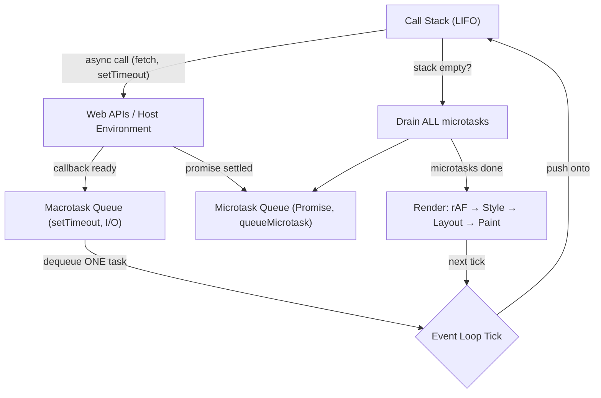
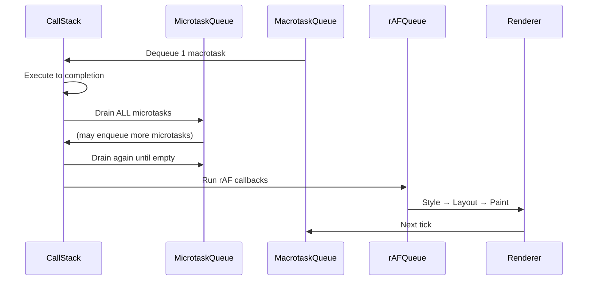
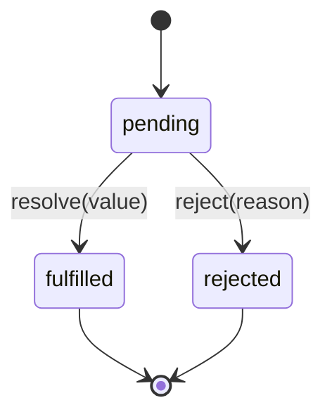
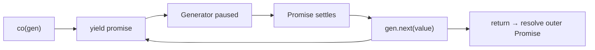
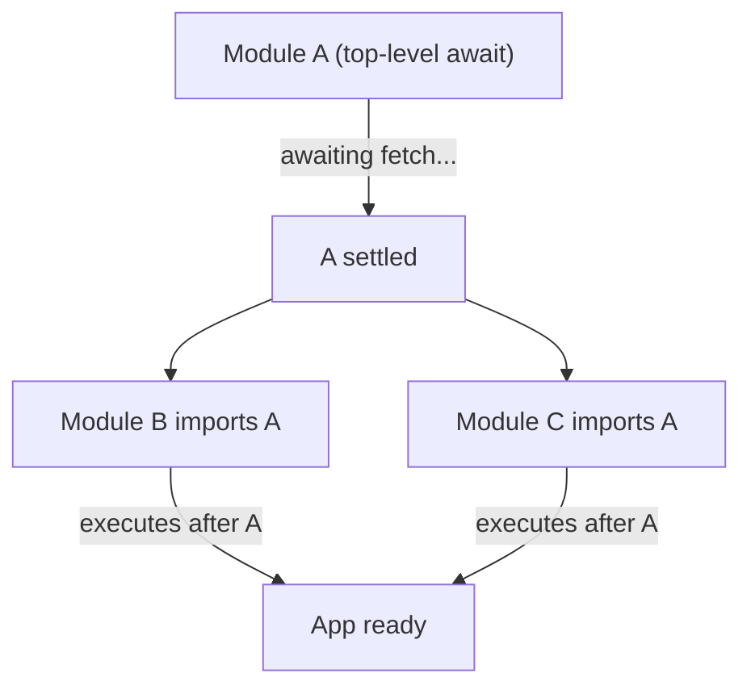

# 07 — Async JavaScript

> **TL;DR** — JavaScript is single-threaded but non-blocking thanks to the **event loop**. Microtasks (Promises, `queueMicrotask`) always drain before macrotasks (`setTimeout`, I/O). Master the execution order, build Promises from scratch, and know `async/await` is syntactic sugar over generator-based coroutines. This chapter is your event-loop exam prep.

---

## 1. The Single-Threaded Model

JavaScript executes on **one thread** — one call stack, one instruction at a time. There is no pre-emptive multitasking; if a function is running, nothing else can execute until it returns.

So how does JS handle network requests, timers, and user input without freezing the page?

**Concurrency without parallelism.** The runtime delegates long-running work to host APIs (browser Web APIs or libuv in Node.js). When the work completes, a callback is enqueued. The event loop picks it up only when the call stack is empty.

```javascript
console.log("A");
setTimeout(() => console.log("B"), 0);
console.log("C");
// Output: A → C → B
```

Even with a `0 ms` delay, `"B"` prints last because `setTimeout` schedules a **macrotask**, and the synchronous code must finish first.

---

## 2. The Event Loop — In Detail



### One Tick of the Event Loop

1. **Pick one macrotask** from the queue (or wait for one).
2. **Execute it** — push frames onto the call stack until it's empty.
3. **Drain the entire microtask queue** — run every microtask, including ones enqueued during this step.
4. **Render** (if needed) — run `requestAnimationFrame` callbacks, recalc styles, layout, paint.
5. Go to step 1.

> The critical insight: **microtasks are drained completely between every macrotask and before rendering.** A tight microtask loop can starve rendering.

---

## 3. Microtasks vs Macrotasks

| Category | Source | Queue | Priority |
|---|---|---|---|
| **Microtask** | `Promise.then/catch/finally`, `queueMicrotask`, `MutationObserver` | Microtask queue | **High** — drained after every task |
| **Macrotask** | `setTimeout`, `setInterval`, `setImmediate` (Node), I/O, UI events | Macrotask (task) queue | Normal — one per tick |
| **Animation** | `requestAnimationFrame` | rAF queue | Runs before paint, after microtasks |



### Starvation Warning

```javascript
function recurse() {
  queueMicrotask(recurse);
}
recurse(); // blocks rendering forever — microtask queue never empties
```

The equivalent with `setTimeout` would **not** block rendering, because only one macrotask runs per tick.

---

## 4. Callbacks

The original async pattern: pass a function to be called later.

### Error-First Convention (Node.js)

```javascript
const fs = require("fs");

fs.readFile("/etc/passwd", "utf8", (err, data) => {
  if (err) {
    console.error("Read failed:", err);
    return;
  }
  console.log(data);
});
```

### Callback Hell

```javascript
getUser(userId, (err, user) => {
  getOrders(user.id, (err, orders) => {
    getOrderDetails(orders[0].id, (err, details) => {
      getShipping(details.shippingId, (err, tracking) => {
        console.log(tracking); // pyramid of doom
      });
    });
  });
});
```

**Problems:**

- **Inversion of control** — you hand your continuation to a third-party function and trust it will call back exactly once, with the right arguments.
- **No composability** — can't return values, can't use try/catch.
- **Error propagation** — manual at every level.

Promises solve all three.

---

## 5. Promises Deep Dive

### States



A Promise is **settled** once fulfilled or rejected — the state is immutable after that.

### Chaining

`.then()` always returns a **new** Promise, enabling chains:

```javascript
fetch("/api/user")
  .then((res) => res.json())        // returns Promise<User>
  .then((user) => fetch(`/api/orders/${user.id}`))
  .then((res) => res.json())
  .then((orders) => console.log(orders))
  .catch((err) => console.error(err)); // catches ANY rejection upstream
```

If a `.then` handler returns a thenable, the chain waits for it to settle.

### Static Combinators

| Method | Resolves when | Rejects when | Use case |
|---|---|---|---|
| `Promise.all(arr)` | **All** fulfill | **Any one** rejects | Parallel fetch, all required |
| `Promise.allSettled(arr)` | **All** settle | Never rejects | Parallel fetch, partial OK |
| `Promise.race(arr)` | **First** to settle | First to settle (if rejected) | Timeout pattern |
| `Promise.any(arr)` | **First** to fulfill | All reject (`AggregateError`) | Fastest mirror/CDN |

```javascript
// Timeout pattern with Promise.race
function fetchWithTimeout(url, ms) {
  const controller = new AbortController();
  const timeout = new Promise((_, reject) =>
    setTimeout(() => {
      controller.abort();
      reject(new Error(`Timeout after ${ms}ms`));
    }, ms)
  );
  return Promise.race([fetch(url, { signal: controller.signal }), timeout]);
}
```

### `Promise.withResolvers()` (ES2024)

Extracts `resolve` and `reject` so you can settle a Promise from outside its executor:

```javascript
const { promise, resolve, reject } = Promise.withResolvers();

setTimeout(() => resolve("done"), 1000);

const result = await promise; // "done"
```

Before this API, the common workaround was the "deferred" pattern — assigning `resolve`/`reject` to outer variables inside the executor.

### Simplified Promise Implementation

```javascript
class SimplePromise {
  #state = "pending";
  #value = undefined;
  #handlers = [];

  constructor(executor) {
    const resolve = (value) => this.#transition("fulfilled", value);
    const reject = (reason) => this.#transition("rejected", reason);
    try {
      executor(resolve, reject);
    } catch (err) {
      reject(err);
    }
  }

  #transition(state, value) {
    if (this.#state !== "pending") return; // immutable once settled
    this.#state = state;
    this.#value = value;
    this.#handlers.forEach((h) => this.#handle(h));
    this.#handlers = [];
  }

  #handle({ onFulfilled, onRejected, resolve, reject }) {
    queueMicrotask(() => {
      const handler = this.#state === "fulfilled" ? onFulfilled : onRejected;
      if (!handler) {
        (this.#state === "fulfilled" ? resolve : reject)(this.#value);
        return;
      }
      try {
        resolve(handler(this.#value));
      } catch (err) {
        reject(err);
      }
    });
  }

  then(onFulfilled, onRejected) {
    return new SimplePromise((resolve, reject) => {
      const handler = { onFulfilled, onRejected, resolve, reject };
      if (this.#state === "pending") {
        this.#handlers.push(handler);
      } else {
        this.#handle(handler);
      }
    });
  }

  catch(onRejected) {
    return this.then(null, onRejected);
  }
}
```

Key details: handlers are always invoked **asynchronously** via `queueMicrotask` (spec compliance), and the state is locked after the first transition.

---

## 6. async / await

`async/await` is syntactic sugar over Promises. An `async` function always returns a Promise. `await` pauses execution of that function, yielding control back to the caller.

```javascript
async function loadUser(id) {
  try {
    const res = await fetch(`/api/users/${id}`);
    if (!res.ok) throw new Error(`HTTP ${res.status}`);
    return await res.json();
  } catch (err) {
    console.error("Failed to load user:", err);
    throw err;
  }
}
```

### Sequential vs Concurrent

```javascript
// Sequential — total time = T1 + T2
async function sequential() {
  const user = await getUser();
  const orders = await getOrders(); // waits for getUser to finish first
  return { user, orders };
}

// Concurrent — total time = max(T1, T2)
async function concurrent() {
  const [user, orders] = await Promise.all([getUser(), getOrders()]);
  return { user, orders };
}
```

A common mistake is using `await` in a loop when the iterations are independent:

```javascript
// BAD — sequential, O(n) total time
for (const id of ids) {
  const data = await fetchItem(id);
  results.push(data);
}

// GOOD — concurrent, O(1) total time (network bound)
const results = await Promise.all(ids.map((id) => fetchItem(id)));
```

### `for await...of` — Async Iteration

```javascript
async function* streamChunks(url) {
  const res = await fetch(url);
  const reader = res.body.getReader();
  while (true) {
    const { done, value } = await reader.read();
    if (done) break;
    yield value;
  }
}

for await (const chunk of streamChunks("/api/stream")) {
  process(chunk);
}
```

---

## 7. Generators and Iterators

### Generator Basics

A generator function (`function*`) returns an iterator. Execution pauses at each `yield` and resumes when `.next()` is called.

```javascript
function* range(start, end) {
  for (let i = start; i <= end; i++) {
    yield i;
  }
}

const iter = range(1, 3);
iter.next(); // { value: 1, done: false }
iter.next(); // { value: 2, done: false }
iter.next(); // { value: 3, done: false }
iter.next(); // { value: undefined, done: true }
```

### Co-Routine Pattern — How async/await Evolved

Before `async/await`, libraries like **co** used generators to flatten async code:

```javascript
function co(generatorFn) {
  return new Promise((resolve, reject) => {
    const gen = generatorFn();
    function step(nextFn) {
      let result;
      try {
        result = nextFn();
      } catch (err) {
        return reject(err);
      }
      if (result.done) return resolve(result.value);
      Promise.resolve(result.value).then(
        (val) => step(() => gen.next(val)),
        (err) => step(() => gen.throw(err))
      );
    }
    step(() => gen.next());
  });
}

// Usage — looks like async/await, powered by generators
co(function* () {
  const res = yield fetch("/api/users");
  const users = yield res.json();
  console.log(users);
});
```



`async/await` is essentially this pattern baked into the language. `await` = `yield`, `async function` = `function*` + auto-runner.

---

## 8. Event Loop Output Questions

These are the most frequently asked interview questions on async JavaScript. Work through each one before looking at the answer.

### Puzzle 1 — The Classic

```javascript
console.log("1");
setTimeout(() => console.log("2"), 0);
Promise.resolve().then(() => console.log("3"));
console.log("4");
```

<details><summary>Answer</summary>

**Output: `1 → 4 → 3 → 2`**

| Step | Action | Queue state |
|---|---|---|
| 1 | `console.log("1")` — sync | |
| 2 | `setTimeout` cb → macrotask queue | Macro: [cb2] |
| 3 | `Promise.then` cb → microtask queue | Micro: [cb3], Macro: [cb2] |
| 4 | `console.log("4")` — sync | |
| 5 | Stack empty → drain microtasks → `"3"` | Macro: [cb2] |
| 6 | Next tick → macrotask → `"2"` | |

</details>

### Puzzle 2 — Nested Microtasks

```javascript
Promise.resolve()
  .then(() => {
    console.log("A");
    Promise.resolve().then(() => console.log("B"));
  })
  .then(() => console.log("C"));

Promise.resolve().then(() => console.log("D"));
```

<details><summary>Answer</summary>

**Output: `A → D → B → C`**

| Step | Microtask queue |
|---|---|
| Sync done | [thenA, thenD] |
| Run thenA → logs `"A"`, enqueues thenB, returns → enqueues thenC | [thenD, thenB, thenC] |
| Run thenD → logs `"D"` | [thenB, thenC] |
| Run thenB → logs `"B"` | [thenC] |
| Run thenC → logs `"C"` | [] |

Key: `.then()` on a resolved chain enqueues the next handler **after** the current handler completes. thenC is enqueued when thenA's handler returns (not when the chain is created).

</details>

### Puzzle 3 — setTimeout vs queueMicrotask

```javascript
setTimeout(() => console.log("T1"), 0);
queueMicrotask(() => {
  console.log("M1");
  queueMicrotask(() => console.log("M2"));
});
setTimeout(() => console.log("T2"), 0);
queueMicrotask(() => console.log("M3"));
console.log("S1");
```

<details><summary>Answer</summary>

**Output: `S1 → M1 → M3 → M2 → T1 → T2`**

1. `setTimeout` cb → macro queue. `queueMicrotask` cb → micro queue. Second `setTimeout` → macro. Second `queueMicrotask` → micro. `console.log("S1")` runs sync.
2. Stack empty → drain microtasks: `M1` (enqueues `M2`), `M3`, `M2` (microtask queue drained completely).
3. Macrotask tick: `T1`.
4. Macrotask tick: `T2`.

</details>

### Puzzle 4 — async/await Desugaring

```javascript
async function foo() {
  console.log("F1");
  await Promise.resolve();
  console.log("F2");
}

console.log("S1");
foo();
console.log("S2");
```

<details><summary>Answer</summary>

**Output: `S1 → F1 → S2 → F2`**

`foo()` runs synchronously until the first `await`. `await` is equivalent to `.then(() => /* rest of function */)`. The continuation (`"F2"`) is a microtask, so it runs after all sync code finishes.

</details>

### Puzzle 5 — The Tricky One

```javascript
async function a() {
  console.log("a1");
  await b();
  console.log("a2");
}

async function b() {
  console.log("b1");
  await c();
  console.log("b2");
}

async function c() {
  console.log("c1");
}

console.log("start");
a();
console.log("end");
```

<details><summary>Answer</summary>

**Output: `start → a1 → b1 → c1 → end → b2 → a2`**

1. `"start"` — sync.
2. `a()` → `"a1"` — sync, then calls `b()`.
3. `b()` → `"b1"` — sync, then calls `c()`.
4. `c()` → `"c1"` — sync, returns resolved Promise.
5. `await c()` pauses `b` — continuation (`"b2"`) → microtask queue.
6. `await b()` — `b` returned a pending Promise, so `a` pauses — continuation (`"a2"`) chains onto `b`'s completion.
7. `"end"` — sync (back to top-level code after `a()` returned).
8. Drain microtasks: `"b2"` runs → `b`'s Promise resolves → `"a2"` runs.

</details>

### Puzzle 6 — Promise Constructor is Synchronous

```javascript
console.log("1");

new Promise((resolve) => {
  console.log("2");
  resolve();
  console.log("3");
}).then(() => console.log("4"));

console.log("5");
```

<details><summary>Answer</summary>

**Output: `1 → 2 → 3 → 5 → 4`**

The Promise **executor runs synchronously**. `resolve()` does not abort the executor — `"3"` still prints. The `.then` callback is a microtask, so `"4"` comes after all sync code.

</details>

---

## 9. AbortController

`AbortController` provides a standard cancellation mechanism for async operations.

```javascript
const controller = new AbortController();

// Cancel after 5 seconds
setTimeout(() => controller.abort(), 5000);

try {
  const res = await fetch("/api/large-data", {
    signal: controller.signal,
  });
  const data = await res.json();
  process(data);
} catch (err) {
  if (err.name === "AbortError") {
    console.log("Request was cancelled");
  } else {
    throw err;
  }
}
```

### Custom Async Operations with AbortSignal

```javascript
function delay(ms, { signal } = {}) {
  return new Promise((resolve, reject) => {
    const timer = setTimeout(resolve, ms);
    signal?.addEventListener("abort", () => {
      clearTimeout(timer);
      reject(new DOMException("Aborted", "AbortError"));
    });
  });
}

const controller = new AbortController();
delay(10000, { signal: controller.signal })
  .then(() => console.log("Done"))
  .catch((err) => console.log(err.message)); // "Aborted"

controller.abort();
```

### `AbortSignal.timeout()` — Built-in Timeout

```javascript
// Automatically aborts after 3 seconds — no manual controller needed
const res = await fetch("/api/data", {
  signal: AbortSignal.timeout(3000),
});
```

### `AbortSignal.any()` — Combine Signals

```javascript
const userCancel = new AbortController();
const combined = AbortSignal.any([
  userCancel.signal,
  AbortSignal.timeout(5000),
]);

const res = await fetch("/api/data", { signal: combined });
// Aborts if user cancels OR 5s timeout — whichever comes first
```

---

## 10. Top-Level Await

In **ES Modules** (not CommonJS), `await` can be used at the top level of a module:

```javascript
// config.mjs
const res = await fetch("/api/config");
export const config = await res.json();
```

**How it works:** The module's body is treated like an `async` function. Any module that imports this one will wait for its evaluation to complete before executing.



**Caveats:**

- Blocks downstream module evaluation — use sparingly
- Only works in ESM (`type: "module"` in `package.json` or `.mjs` extension)
- Can cause waterfall delays if modules with TLA depend on each other sequentially

---

## Common Mistakes

| Mistake | Why it's wrong | Fix |
|---|---|---|
| `await` in `forEach` | `forEach` ignores returned Promises — iterations fire simultaneously with no await | Use `for...of` for sequential, `Promise.all` + `map` for concurrent |
| Missing `await` before `res.json()` | Returns a Promise, not the parsed body | Always `await res.json()` |
| Swallowing rejections | Unhandled Promise rejections crash Node.js (v15+) | Always `.catch()` or `try/catch` |
| Creating Promises inside `new Promise` | Anti-pattern — wrapping an existing Promise in another | Return the Promise directly, chain with `.then` |
| `return await` inside `try` | Correctly catches rejections — but **removing** `await` skips the catch block | Keep `return await` inside `try/catch`; remove it otherwise |
| Starving the event loop with microtasks | Recursive `queueMicrotask` or `.then` blocks rendering | Use `setTimeout` for long recursive chains to yield to the event loop |
| `async` on a function that never awaits | Unnecessary wrapping — adds a microtask tick of overhead | Remove `async` if the function only returns synchronous values |

---

## Interview-Ready Answers

> **Q: What is the event loop and how does it work?**
> The event loop is the mechanism that allows JavaScript to perform non-blocking I/O despite being single-threaded. Each iteration (tick) dequeues one macrotask, executes it to completion, then drains the entire microtask queue, and optionally renders. This cycle repeats indefinitely.

> **Q: What's the difference between microtasks and macrotasks?**
> Microtasks (Promise callbacks, `queueMicrotask`, `MutationObserver`) are drained completely after every macrotask and before rendering. Macrotasks (`setTimeout`, `setInterval`, I/O events) are processed one per tick. Microtasks have higher priority — they always run before the next macrotask.

> **Q: Why does `setTimeout(fn, 0)` not execute immediately?**
> Because `setTimeout` schedules a macrotask. Even with a delay of 0, the callback goes into the macrotask queue and can only execute after the current call stack is empty AND all microtasks have been drained. The HTML spec also enforces a minimum 4ms delay for nested `setTimeout` calls (depth > 4).

> **Q: How does `async/await` work under the hood?**
> An `async` function returns a Promise. When the engine hits `await expr`, it wraps `expr` in `Promise.resolve(expr)`, suspends the function's execution frame, and schedules the rest of the function as a microtask `.then` callback on that Promise. This evolved from the generator + co-routine pattern where `yield` was used to pause execution and a runner library would call `gen.next(value)` when the yielded Promise settled.

> **Q: What happens if a Promise rejection is never handled?**
> In browsers, it fires an `unhandledrejection` event on `window`. In Node.js v15+, it terminates the process with a non-zero exit code. Always attach a `.catch()` or use `try/catch` with `await`. You can listen for `unhandledrejection` as a safety net, but it should not be your primary error handling strategy.

> **Q: Explain `Promise.all` vs `Promise.allSettled` vs `Promise.race` vs `Promise.any`.**
> `Promise.all` short-circuits on the first rejection — use when all results are required. `Promise.allSettled` waits for every Promise regardless of outcome and returns `{status, value/reason}` objects — use for "best effort" parallel work. `Promise.race` settles with whichever Promise settles first (fulfilled or rejected) — classic timeout pattern. `Promise.any` resolves with the first fulfillment and only rejects if all Promises reject (with an `AggregateError`) — use for redundant requests to multiple sources.

> **Q: How do you cancel an async operation in JavaScript?**
> Use `AbortController`. Create a controller, pass `controller.signal` to `fetch` or any API that accepts an `AbortSignal`. Call `controller.abort()` to cancel. The operation throws an `AbortError` which you catch. For timeouts, use `AbortSignal.timeout(ms)`. To combine multiple cancellation signals, use `AbortSignal.any([...signals])`.

> **Q: What is top-level `await` and what are its implications?**
> Top-level `await` allows using `await` outside of an `async` function, but only in ES Modules. The module becomes asynchronous — any module that imports it will wait for it to finish evaluating before running. This can introduce waterfall delays if overused. It's useful for one-time async initialization like loading configuration or establishing database connections at startup.

---

> Next → [08-functional-patterns.md](08-functional-patterns.md)
