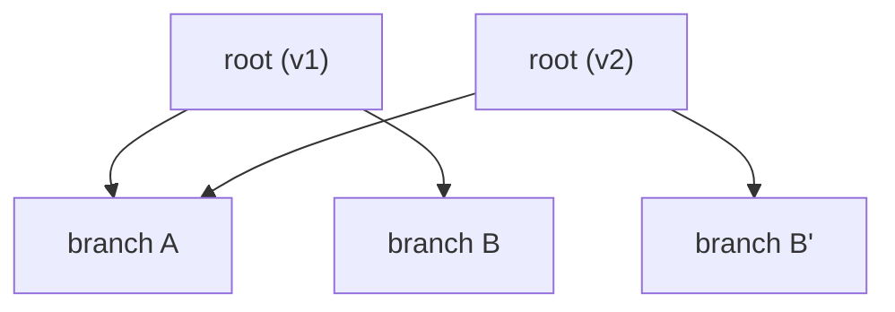
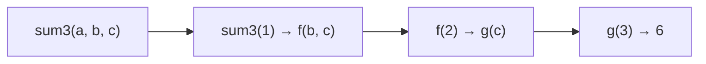
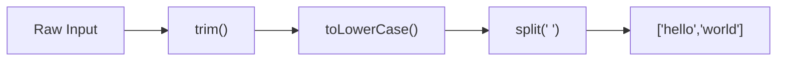
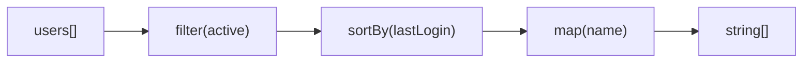

# 08 — Functional Patterns

> **TL;DR** — Functional programming in JS means composing pure functions, avoiding shared mutable state, and treating functions as data. Master currying, composition, `map`/`filter`/`reduce` internals, and lightweight monadic patterns — these concepts surface in every senior-level interview and underpin Redux, RxJS, and modern React.

---

## 1. FP Core Principles

Functional programming rests on four pillars:

| Principle | Meaning | JS Example |
|---|---|---|
| **Purity** | Same input → same output, no side effects | `const add = (a, b) => a + b` |
| **Immutability** | Never mutate; create new values | `[...arr, item]` instead of `arr.push(item)` |
| **Referential transparency** | Expression can be replaced by its value | `add(2, 3)` can always be replaced with `5` |
| **Declarative style** | Describe *what*, not *how* | `.filter().map()` over manual loops |

```javascript
// Imperative (how)
const evens = [];
for (let i = 0; i < nums.length; i++) {
  if (nums[i] % 2 === 0) evens.push(nums[i]);
}

// Declarative (what)
const evens = nums.filter(n => n % 2 === 0);
```

---

## 2. Pure Functions

A function is **pure** when it:

1. Returns the same output for the same input (deterministic).
2. Produces no observable side effects (no I/O, no mutation, no randomness).

```javascript
// Pure
const discount = (price, rate) => price * (1 - rate);

// Impure — reads external mutable state
let taxRate = 0.2;
const withTax = (price) => price * (1 + taxRate);

// Impure — mutates input
const addItem = (cart, item) => {
  cart.items.push(item); // side effect!
  return cart;
};

// Pure equivalent
const addItemPure = (cart, item) => ({
  ...cart,
  items: [...cart.items, item],
});
```

**Why purity matters:**

- **Testable** — no mocks needed, just assert input/output.
- **Cacheable** — safe to memoize since output depends only on input.
- **Parallelizable** — no shared state means no race conditions.
- **Refactorable** — referential transparency lets you inline or extract freely.

---

## 3. Immutability

### Shallow Freeze

```javascript
const config = Object.freeze({ api: '/v1', timeout: 3000 });
config.timeout = 5000; // silently ignored (throws in strict mode)

// Nested objects are NOT frozen
const deep = Object.freeze({ nested: { value: 1 } });
deep.nested.value = 99; // succeeds — freeze is shallow
```

### Deep Clone Options

```javascript
// Spread — shallow only
const updated = { ...user, address: { ...user.address, city: 'NYC' } };

// structuredClone — deep, handles cycles, no functions
const clone = structuredClone(complexObj);

// JSON round-trip — no undefined, Date becomes string, no functions
const legacy = JSON.parse(JSON.stringify(obj));
```

### Structural Sharing (Conceptual)

Libraries like Immer and Immutable.js reuse unchanged branches of a data tree, making immutable updates O(log n) instead of O(n).



Branch A is **shared** — only B is cloned to B'. This is how Redux and persistent data structures stay performant.

---

## 4. First-Class & Higher-Order Functions

Functions in JS are first-class values — assignable, passable, returnable.

```javascript
// Assign to variable
const greet = (name) => `Hello, ${name}`;

// Pass as argument (callback)
const apply = (fn, value) => fn(value);
apply(greet, 'Alice'); // "Hello, Alice"

// Return a function (factory / closure)
const multiplier = (factor) => (n) => n * factor;
const double = multiplier(2);
double(5); // 10
```

A **higher-order function** (HOF) either takes a function as an argument or returns one. `Array.prototype.map`, `setTimeout`, and Express middleware are all HOFs.

---

## 5. Currying

Currying transforms `f(a, b, c)` into `f(a)(b)(c)` — each call returns a new function expecting the next argument.

```javascript
// Manual currying
const add = (a) => (b) => a + b;
add(2)(3); // 5

const increment = add(1);
increment(10); // 11
```

### Generic Curry Implementation

```javascript
function curry(fn) {
  return function curried(...args) {
    if (args.length >= fn.length) {
      return fn.apply(this, args);
    }
    return (...next) => curried(...args, ...next);
  };
}

const sum3 = curry((a, b, c) => a + b + c);
sum3(1)(2)(3);    // 6
sum3(1, 2)(3);    // 6
sum3(1)(2, 3);    // 6
```

### Partial Application Flow



### Practical Currying

```javascript
const log = curry((level, timestamp, message) =>
  `[${level}] ${timestamp} — ${message}`
);

const warn = log('WARN');
const warnNow = warn(Date.now());
warnNow('Disk space low');
// "[WARN] 1709561234567 — Disk space low"

// Curried predicate for reusable filters
const propEq = curry((key, val, obj) => obj[key] === val);
const isAdmin = propEq('role', 'admin');
users.filter(isAdmin);
```

---

## 6. Function Composition

Composition chains functions so the output of one becomes the input of the next.

### `compose` and `pipe`

```javascript
// compose: right-to-left
const compose = (...fns) => (x) =>
  fns.reduceRight((acc, fn) => fn(acc), x);

// pipe: left-to-right (more readable)
const pipe = (...fns) => (x) =>
  fns.reduce((acc, fn) => fn(acc), x);
```

```javascript
const toLowerCase = (s) => s.toLowerCase();
const trim = (s) => s.trim();
const split = (sep) => (s) => s.split(sep);

const words = pipe(trim, toLowerCase, split(' '));
words('  Hello World  '); // ["hello", "world"]
```

### Point-Free Style

Point-free means never mentioning the data argument:

```javascript
// Pointed
const getAdminEmails = (users) =>
  users.filter(u => u.role === 'admin').map(u => u.email);

// Point-free with curried helpers
const getAdminEmails = pipe(
  filter(propEq('role', 'admin')),
  map(prop('email'))
);
```

### Composition Pipeline



---

## 7. `map`, `filter`, `reduce` Internals

Understanding the internals reveals that **all three are specializations of `reduce`**.

### Implement from Scratch

```javascript
function map(arr, fn) {
  const result = [];
  for (let i = 0; i < arr.length; i++) {
    result.push(fn(arr[i], i, arr));
  }
  return result;
}

function filter(arr, pred) {
  const result = [];
  for (let i = 0; i < arr.length; i++) {
    if (pred(arr[i], i, arr)) result.push(arr[i]);
  }
  return result;
}

function reduce(arr, fn, init) {
  let acc = init;
  let start = 0;
  if (acc === undefined) {
    acc = arr[0];
    start = 1;
  }
  for (let i = start; i < arr.length; i++) {
    acc = fn(acc, arr[i], i, arr);
  }
  return acc;
}
```

### `map` and `filter` via `reduce`

```javascript
const mapR = (arr, fn) =>
  arr.reduce((acc, x, i) => [...acc, fn(x, i)], []);

const filterR = (arr, pred) =>
  arr.reduce((acc, x, i) => pred(x, i) ? [...acc, x] : acc, []);
```

### Transducers (Concept)

Chaining `.map().filter().map()` creates intermediate arrays. Transducers compose transformations into a **single reduce pass**.

```javascript
const mapping = (fn) => (step) => (acc, x) => step(acc, fn(x));
const filtering = (pred) => (step) => (acc, x) =>
  pred(x) ? step(acc, x) : acc;

const append = (acc, x) => [...acc, x];

const xform = compose(
  filtering(n => n % 2 === 0),
  mapping(n => n * 10)
);

[1, 2, 3, 4].reduce(xform(append), []);
// [20, 40] — single pass, no intermediate arrays
```

---

## 8. Functors and Monads (Simplified)

Skip the category theory — focus on **two patterns that eliminate null checks and try/catch boilerplate**.

### Maybe / Option

```javascript
class Maybe {
  #value;
  constructor(value) { this.#value = value; }

  static of(value) { return new Maybe(value); }
  static empty() { return new Maybe(null); }

  isNothing() { return this.#value == null; }

  map(fn) {
    return this.isNothing() ? this : Maybe.of(fn(this.#value));
  }

  flatMap(fn) {
    return this.isNothing() ? this : fn(this.#value);
  }

  getOrElse(fallback) {
    return this.isNothing() ? fallback : this.#value;
  }
}
```

```javascript
const getCity = (user) =>
  Maybe.of(user)
    .map(u => u.address)
    .map(a => a.city)
    .getOrElse('Unknown');

getCity({ address: { city: 'NYC' } }); // "NYC"
getCity({});                            // "Unknown"
getCity(null);                          // "Unknown"
```

### Result / Either

```javascript
class Result {
  #ok; #value;
  constructor(ok, value) { this.#ok = ok; this.#value = value; }

  static ok(value) { return new Result(true, value); }
  static err(error) { return new Result(false, error); }

  isOk() { return this.#ok; }

  map(fn) {
    return this.#ok ? Result.ok(fn(this.#value)) : this;
  }

  flatMap(fn) {
    return this.#ok ? fn(this.#value) : this;
  }

  match({ ok, err }) {
    return this.#ok ? ok(this.#value) : err(this.#value);
  }
}
```

```javascript
const parseJSON = (str) => {
  try {
    return Result.ok(JSON.parse(str));
  } catch (e) {
    return Result.err(e.message);
  }
};

parseJSON('{"a":1}')
  .map(obj => obj.a)
  .match({
    ok: (val) => `Value: ${val}`,
    err: (msg) => `Parse failed: ${msg}`,
  });
// "Value: 1"
```

---

## 9. Lazy Evaluation

Eager evaluation builds entire arrays before the next step. **Lazy evaluation** computes values on demand.

### Generators for Lazy Sequences

```javascript
function* lazyMap(iterable, fn) {
  for (const item of iterable) {
    yield fn(item);
  }
}

function* lazyFilter(iterable, pred) {
  for (const item of iterable) {
    if (pred(item)) yield item;
  }
}

function* take(iterable, n) {
  let count = 0;
  for (const item of iterable) {
    if (count++ >= n) return;
    yield item;
  }
}
```

### Infinite Sequences

```javascript
function* naturals(start = 1) {
  let n = start;
  while (true) yield n++;
}

function* fibonacci() {
  let [a, b] = [0, 1];
  while (true) {
    yield a;
    [a, b] = [b, a + b];
  }
}

const firstTenEvens = [
  ...take(lazyFilter(naturals(), n => n % 2 === 0), 10)
];
// [2, 4, 6, 8, 10, 12, 14, 16, 18, 20]
```

No intermediate array is allocated — each value flows through the pipeline one at a time.

---

## 10. FP vs OOP

| Aspect | FP | OOP |
|---|---|---|
| Primary unit | Function | Object (class) |
| State | Immutable values | Encapsulated mutable state |
| Polymorphism | HOFs, pattern matching | Inheritance, interfaces |
| Reuse mechanism | Composition, currying | Inheritance, mixins |
| Side effects | Pushed to edges | Spread through methods |
| Best for | Data transformations, pipelines | Stateful entities, UI components |
| Testing | Easy (pure in → out) | Requires mocks for dependencies |

### Hybrid Approach in Modern JS

Real-world codebases mix both. Angular services (OOP classes) contain pure transformation methods (FP). React components (OOP-ish classes or function closures) use hooks with reducer patterns (FP).

```javascript
// OOP shell, FP core
class OrderService {
  #repo;
  constructor(repo) { this.#repo = repo; }

  async calculateTotal(orderId) {
    const order = await this.#repo.find(orderId);
    return pipe(
      getLineItems,
      map(applyDiscount),
      reduce(sumPrices, 0),
      applyTax(order.region)
    )(order);
  }
}
```

---

## 11. Real-World FP

### Redux Reducers

Reducers are pure functions: `(state, action) → newState`.

```javascript
const todosReducer = (state = [], action) => {
  switch (action.type) {
    case 'ADD':
      return [...state, { id: Date.now(), text: action.text, done: false }];
    case 'TOGGLE':
      return state.map(t =>
        t.id === action.id ? { ...t, done: !t.done } : t
      );
    default:
      return state;
  }
};
```

### RxJS Pipelines

RxJS is function composition over async streams:

```javascript
const search$ = input$.pipe(
  debounceTime(300),
  distinctUntilChanged(),
  switchMap(term => http.get(`/api/search?q=${term}`)),
  map(res => res.results),
  catchError(() => of([]))
);
```

### Ramda / lodash/fp

```javascript
import { pipe, filter, map, prop, sortBy } from 'ramda';

const topActiveUsers = pipe(
  filter(prop('active')),
  sortBy(prop('lastLogin')),
  map(prop('name'))
);

topActiveUsers(users);
```



---

## 12. Common Mistakes

| Mistake | Why It's Wrong | Fix |
|---|---|---|
| Mutating function arguments | Breaks purity, causes subtle bugs | Spread/clone before modifying |
| Currying variadic functions | `fn.length` is 0 for `...args` | Use explicit arity or pass arity to `curry` |
| Over-abstracting with point-free | Readability drops for the team | Point-free only when intent stays obvious |
| Using `reduce` for everything | Harder to read than `map`/`filter` | Use the most specific method available |
| Ignoring stack limits with recursion | No TCO in most engines | Use trampolines or iterative reduce |
| Deep-cloning with JSON | Drops `undefined`, `Date`, functions, `Map`, `Set` | Use `structuredClone` or Immer |
| Chaining `.map().filter().map()` on huge arrays | Creates intermediate arrays | Use transducers or lazy generators |

---

## 13. Interview-Ready Answers

> **Q: What makes a function pure, and why does it matter?**
> A pure function always returns the same output for the same input and produces no side effects. This matters because pure functions are trivially testable (no mocks), safely memoizable, and parallelizable. They also enable referential transparency — you can replace a call with its result without changing program behavior.

> **Q: Explain currying vs partial application.**
> Currying transforms a function of N arguments into N nested unary functions: `f(a, b, c)` → `f(a)(b)(c)`. Partial application fixes some arguments and returns a function expecting the rest — it doesn't require unary steps. A generic `curry` helper enables both: `curry(f)(1, 2)(3)` partially applies two args, then supplies the third.

> **Q: How would you implement `pipe` and why prefer it over `compose`?**
> `pipe = (...fns) => (x) => fns.reduce((acc, fn) => fn(acc), x)`. It applies functions left-to-right, matching natural reading order. `compose` goes right-to-left, which matches mathematical notation but is harder to scan in code reviews. Both produce identical results — choose whichever your team reads faster.

> **Q: What is a Monad in practical JS terms?**
> A Monad is a wrapper type with two operations: `of` (wrap a value) and `flatMap` (unwrap, transform, re-wrap). In JS, Promises are monads — `Promise.resolve` is `of`, and `.then` is `flatMap`. The Maybe monad wraps nullable values so you can chain transformations without null checks. The key law: `flatMap` prevents nested wrapping (`Maybe<Maybe<T>>` flattens to `Maybe<T>`).

> **Q: When would you choose FP over OOP in a JS project?**
> FP shines for data transformation pipelines (ETL, API response shaping), state reducers (Redux/NgRx), and anywhere testability and predictability matter most. OOP fits better for modeling stateful domain entities with behavior (e.g., `User.deactivate()`). Modern JS blends both — pure functions for logic, classes for service boundaries and DI. The senior move is picking the right tool per layer, not dogmatically choosing one paradigm.

> **Q: How do transducers improve performance over chained array methods?**
> Chained `.map().filter().map()` creates a new intermediate array at each step — O(n) allocation per transformation. Transducers compose the transformation functions themselves (not the data), then apply the composed transform in a single `reduce` pass. This eliminates intermediate arrays and iterates the source only once, which matters significantly on large datasets.

---

> Next → [09-modern-es2024.md](09-modern-es2024.md)
