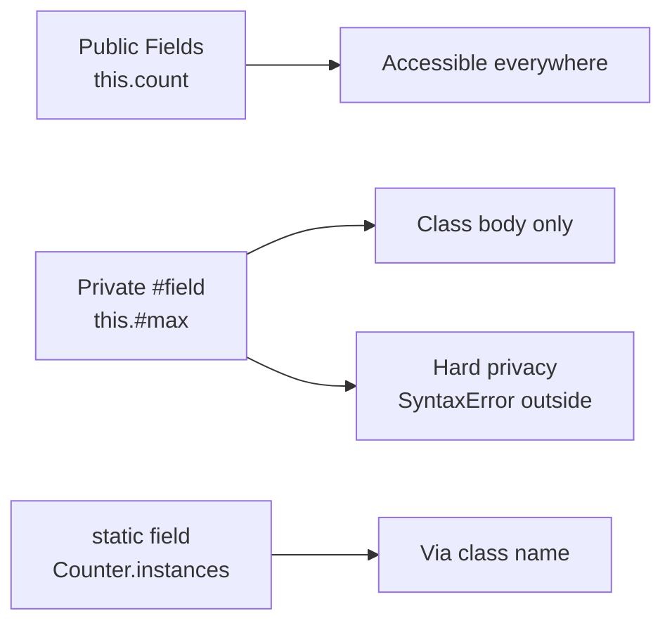
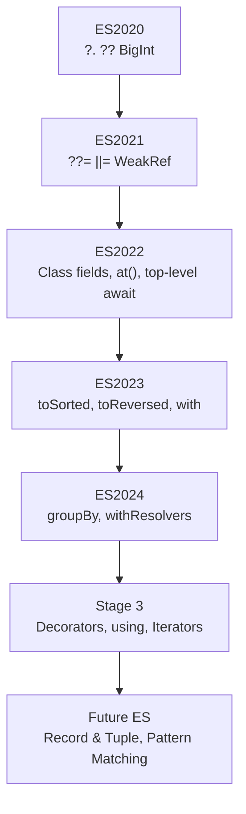

# 09 — Modern JavaScript (ES2020–2024+)

> **TL;DR** — JavaScript ships yearly. ES2020 gave us `?.` and `??`, ES2022 brought class fields and top-level await, ES2023 introduced immutable array methods, and ES2024 landed `Object.groupBy` and `Promise.withResolvers`. Knowing *when* each feature arrived — and which ones still need transpiling — is a senior-dev superpower.

---

## 1 ES2020 — The Ergonomics Release

### 1.1 Optional Chaining `?.`

Safely access deeply nested properties without manual null-checks.

```javascript
// Before — defensive && chains
const city = user && user.address && user.address.city;

// After — optional chaining
const city = user?.address?.city;

// Works with methods and dynamic access
const result = api?.getUser?.();
const val = map?.['key'];
```

### 1.2 Nullish Coalescing `??`

Distinguishes `null`/`undefined` from other falsy values (`0`, `''`, `false`).

```javascript
// Before — || treats 0 and '' as falsy
const port = config.port || 3000;        // bug: port 0 becomes 3000

// After — ?? only falls back on null / undefined
const port = config.port ?? 3000;        // 0 stays 0 ✓
const name = input.name ?? 'Anonymous';  // '' stays '' ✓
```

### 1.3 BigInt

Arbitrary-precision integers for financial, crypto, and ID work.

```javascript
const huge = 9007199254740993n;  // beyond Number.MAX_SAFE_INTEGER
const sum = huge + 1n;           // 9007199254740994n

// Cannot mix BigInt with Number without explicit conversion
// huge + 1  → TypeError
const mixed = huge + BigInt(1);  // OK
```

### 1.4 `globalThis`

A universal reference to the global object across environments.

```javascript
// Before — environment sniffing
const global = typeof window !== 'undefined' ? window
             : typeof global !== 'undefined' ? global
             : self;

// After
globalThis.setTimeout(() => {}, 1000); // works everywhere
```

### 1.5 `Promise.allSettled`

Wait for all promises to complete regardless of rejection.

```javascript
const results = await Promise.allSettled([
  fetch('/api/users'),
  fetch('/api/orders'),
  fetch('/api/inventory'),
]);

const succeeded = results.filter(r => r.status === 'fulfilled');
const failed    = results.filter(r => r.status === 'rejected');
```

| Method | Short-circuits on | Returns |
|---|---|---|
| `Promise.all` | First rejection | All values or first error |
| `Promise.allSettled` | Never | Array of `{status, value/reason}` |
| `Promise.race` | First settlement | First settled value |
| `Promise.any` | First fulfillment | First fulfilled value |

### 1.6 Dynamic `import()`

Load modules on demand — essential for code-splitting.

```javascript
const button = document.getElementById('chart-btn');
button.addEventListener('click', async () => {
  const { renderChart } = await import('./chart-module.js');
  renderChart(data);
});
```

### 1.7 `String.prototype.matchAll`

```javascript
const regex = /(?<year>\d{4})-(?<month>\d{2})/g;
const text = 'Released 2023-06 and updated 2024-01';

for (const match of text.matchAll(regex)) {
  console.log(match.groups); // { year: '2023', month: '06' }, …
}
```

---

## 2 ES2021 — Assignments & Cleanup

### 2.1 Logical Assignment Operators

```javascript
// ??= — assign only if null/undefined
user.name ??= 'Guest';

// ||= — assign if falsy
config.retries ||= 3;

// &&= — assign only if truthy (update existing)
user.token &&= refreshToken(user.token);
```

### 2.2 `String.prototype.replaceAll`

```javascript
// Before — regex with global flag
'a.b.c'.replace(/\./g, '/');

// After
'a.b.c'.replaceAll('.', '/'); // 'a/b/c'
```

### 2.3 `WeakRef` & `FinalizationRegistry`

Hold weak references to objects and react when they are garbage-collected.

```javascript
class Cache {
  #refs = new Map();
  #registry = new FinalizationRegistry(key => this.#refs.delete(key));

  set(key, value) {
    this.#refs.set(key, new WeakRef(value));
    this.#registry.register(value, key);
  }

  get(key) {
    return this.#refs.get(key)?.deref(); // undefined if GC'd
  }
}
```

> **Warning** — `WeakRef` and `FinalizationRegistry` are non-deterministic. Never rely on them for correctness logic; use only for caching or diagnostics.

### 2.4 Numeric Separators

```javascript
const billion   = 1_000_000_000;
const bytes     = 0xFF_FF_FF_FF;
const fraction  = 0.000_001;
```

---

## 3 ES2022 — Classes & Ergonomics

### 3.1 Top-Level `await`

Use `await` outside async functions in ES modules.

```javascript
// db.js — ES module
const connection = await connectToDatabase();
export { connection };
```

### 3.2 Class Fields & Private Members

```javascript
class Counter {
  // Public field with default
  count = 0;

  // Private field — inaccessible outside class
  #max = 100;

  // Static field
  static instances = 0;

  constructor() { Counter.instances++; }

  increment() {
    if (this.count < this.#max) this.count++;
  }

  // Private method
  #reset() { this.count = 0; }
}

const c = new Counter();
// c.#max → SyntaxError (truly private)
```



### 3.3 `Array.prototype.at()`

Negative indexing for arrays and strings.

```javascript
const arr = [10, 20, 30, 40];
arr.at(-1);  // 40  (last element)
arr.at(-2);  // 30
'hello'.at(-1); // 'o'
```

### 3.4 `Object.hasOwn()`

Safer replacement for `hasOwnProperty`.

```javascript
const obj = Object.create(null); // no prototype
obj.key = 'value';

// obj.hasOwnProperty('key')  → TypeError (no prototype)
Object.hasOwn(obj, 'key');     // true ✓
```

### 3.5 `Error.cause`

Chain errors to preserve root-cause context.

```javascript
try {
  await fetch('/api/data');
} catch (err) {
  throw new Error('Data fetch failed', { cause: err });
}
// Downstream: error.cause gives the original fetch error
```

### 3.6 `findLast` / `findLastIndex`

Search arrays from the end without reversing.

```javascript
const txns = [
  { id: 1, type: 'credit' },
  { id: 2, type: 'debit' },
  { id: 3, type: 'credit' },
];

txns.findLast(t => t.type === 'credit');      // { id: 3, ... }
txns.findLastIndex(t => t.type === 'credit'); // 2
```

---

## 4 ES2023 — Immutable Array Methods

ES2023 added **non-mutating** counterparts to classic array methods.

| Mutating | Non-mutating (ES2023) | Returns |
|---|---|---|
| `sort()` | `toSorted()` | New sorted array |
| `reverse()` | `toReversed()` | New reversed array |
| `splice()` | `toSpliced()` | New array with changes |
| `arr[i] = v` | `with(i, v)` | New array with replaced index |

```javascript
const nums = [3, 1, 4, 1, 5];

// Old — mutates in place
const sorted = [...nums].sort(); // clone first to avoid mutation

// New — returns a fresh array, original untouched
const sorted = nums.toSorted();
const reversed = nums.toReversed();
const replaced = nums.with(2, 99);       // [3, 1, 99, 1, 5]
const spliced  = nums.toSpliced(1, 2);   // [3, 1, 5]

console.log(nums); // [3, 1, 4, 1, 5] — unchanged
```

### Real-World: Redux-Style State Updates

```javascript
function reducer(state, action) {
  switch (action.type) {
    case 'SORT_USERS':
      return { ...state, users: state.users.toSorted((a, b) => a.name.localeCompare(b.name)) };
    case 'UPDATE_USER':
      return { ...state, users: state.users.with(action.index, action.payload) };
    default:
      return state;
  }
}
```

### 4.1 WeakMap Symbol Keys

`WeakMap` now accepts `Symbol` keys — useful for metadata without string pollution.

```javascript
const meta = new WeakMap();
const TAG = Symbol('tag');
meta.set(TAG, { created: Date.now() });
```

---

## 5 ES2024 — Grouping, Resolvers & Buffers

### 5.1 `Object.groupBy` / `Map.groupBy`

Native grouping — no more Lodash `_.groupBy`.

```javascript
const people = [
  { name: 'Alice', dept: 'eng' },
  { name: 'Bob',   dept: 'eng' },
  { name: 'Carol', dept: 'sales' },
];

const byDept = Object.groupBy(people, p => p.dept);
// { eng: [Alice, Bob], sales: [Carol] }

// Map.groupBy returns a Map (useful for non-string keys)
const map = Map.groupBy(people, p => p.dept);
```

### 5.2 `Promise.withResolvers`

Extract resolve/reject without the executor boilerplate.

```javascript
// Before
let resolve, reject;
const promise = new Promise((res, rej) => { resolve = res; reject = rej; });

// After — one-liner
const { promise, resolve, reject } = Promise.withResolvers();

// Real-world: event-to-promise bridge
function onceEvent(emitter, event) {
  const { promise, resolve } = Promise.withResolvers();
  emitter.addEventListener(event, resolve, { once: true });
  return promise;
}
```

### 5.3 `ArrayBuffer.prototype.resize` / `transfer`

Resizable buffers for streaming or growing data.

```javascript
const buf = new ArrayBuffer(256, { maxByteLength: 1024 });
const view = new Uint8Array(buf);
buf.resize(512);              // grow in-place
const transferred = buf.transfer(1024); // move ownership
```

### 5.4 `Atomics.waitAsync`

Non-blocking wait for shared memory — enables async coordination between workers.

```javascript
const sab = new SharedArrayBuffer(4);
const view = new Int32Array(sab);

// In worker — non-blocking
const result = Atomics.waitAsync(view, 0, 0);
result.value.then(() => console.log('Woken up!'));

// In main thread
Atomics.notify(view, 0);
```

### 5.5 Well-Formed Unicode & `v` Flag RegExp

```javascript
// Well-formed unicode strings
const str = 'abc\uD800';           // lone surrogate
str.isWellFormed();                 // false
str.toWellFormed();                 // replaces with U+FFFD

// v flag — set notation and properties of strings in RegExp
const emoji = /^\p{RGI_Emoji}$/v;
emoji.test('😀');  // true
emoji.test('👨‍👩‍👧‍👦'); // true (multi-codepoint)
```



---

## 6 Stage 3 / Coming Soon

### 6.1 Decorators

Standard TC39 decorators (different from legacy TypeScript experimental ones).

```javascript
function logged(originalMethod, context) {
  return function (...args) {
    console.log(`Calling ${context.name}`);
    return originalMethod.apply(this, args);
  };
}

class Api {
  @logged
  fetchUsers() { /* ... */ }
}
```

### 6.2 Explicit Resource Management (`using` / `await using`)

Deterministic cleanup — the JS equivalent of Python's `with` or C#'s `using`.

```javascript
function readFile(path) {
  using handle = openFileSync(path); // auto-closed at block end
  return handle.readAll();
} // handle[Symbol.dispose]() called here

async function queryDb() {
  await using conn = await pool.getConnection();
  return conn.query('SELECT * FROM users');
} // conn[Symbol.asyncDispose]() called here
```

### 6.3 Iterator Helpers

Lazy `.map()`, `.filter()`, `.take()` etc. on any iterator — no intermediate arrays.

```javascript
function* naturals() {
  let i = 0;
  while (true) yield i++;
}

const result = naturals()
  .filter(n => n % 2 === 0)
  .map(n => n ** 2)
  .take(5)
  .toArray(); // [0, 4, 16, 36, 64]
```

### 6.4 `JSON.parse` Source Text Access

Reviver functions now receive the raw source text, enabling lossless BigInt parsing.

```javascript
const parsed = JSON.parse('{"id": 99999999999999999}', (key, val, { source }) => {
  if (key === 'id') return BigInt(source);
  return val;
});
// parsed.id === 99999999999999999n
```

### 6.5 Record & Tuple (Stage 2)

Deeply immutable value types with `===` structural equality.

```javascript
const point = #{ x: 1, y: 2 };  // Record
const rgb   = #[255, 128, 0];   // Tuple

point === #{ x: 1, y: 2 };  // true (structural comparison)
rgb === #[255, 128, 0];      // true
```

---

## 7 Feature Adoption Guide

| Feature | Chrome | Firefox | Safari | Node.js | Transpile? |
|---|---|---|---|---|---|
| `?.` / `??` | 80+ | 72+ | 13.1+ | 14+ | No |
| `BigInt` | 67+ | 68+ | 14+ | 10.3+ | No |
| `Promise.allSettled` | 76+ | 71+ | 13+ | 12.9+ | No |
| Logical assignment | 85+ | 79+ | 14+ | 15+ | No |
| `replaceAll` | 85+ | 77+ | 13.1+ | 15+ | No |
| Top-level await | 89+ | 89+ | 15+ | 14.8+ | No |
| Class private fields | 74+ | 90+ | 14.1+ | 12+ | No |
| `Array.at()` | 92+ | 90+ | 15.4+ | 16.6+ | No |
| `Error.cause` | 93+ | 91+ | 15+ | 16.9+ | No |
| `toSorted/toReversed` | 110+ | 115+ | 16+ | 20+ | Polyfill |
| `Object.groupBy` | 117+ | 119+ | 17.4+ | 21+ | Polyfill |
| `Promise.withResolvers` | 119+ | 121+ | 17.4+ | 22+ | Polyfill |
| Decorators (TC39) | Flag | No | No | No | Yes (Babel/TS) |
| `using` / `await using` | 134+ | No | No | 22+ | Yes (TS 5.2+) |
| Iterator helpers | 122+ | 131+ | 18+ | 22+ | Yes |

> **Rule of thumb** — If it is ES2022 or earlier, ship it without transpilation. ES2023 features are safe in modern evergreen browsers. ES2024 features may need a polyfill for Safari < 17.4. Stage 3 proposals still need Babel or TypeScript.

---

## 8 Common Mistakes

### Mistake 1 — Confusing `??` with `||`

```javascript
const count = 0;
count || 10;   // 10 — wrong, 0 is valid
count ?? 10;   // 0  — correct
```

### Mistake 2 — Mixing BigInt and Number

```javascript
1n + 1;          // TypeError!
1n + BigInt(1);  // 2n ✓
Number(1n) + 1;  // 2  ✓ (but may lose precision)
```

### Mistake 3 — Assuming `toSorted()` exists on older engines

```javascript
// Breaks on Node < 20 / Safari < 16
items.toSorted((a, b) => a - b);

// Safe fallback
const sorted = [...items].sort((a, b) => a - b);
```

### Mistake 4 — Using `WeakRef` for correctness logic

```javascript
// BAD — GC timing is unpredictable
const ref = new WeakRef(obj);
setTimeout(() => {
  const val = ref.deref();
  if (!val) throw new Error('Object was collected'); // may or may not fire
}, 5000);
```

### Mistake 5 — Forgetting `Error.cause` in catch chains

```javascript
// BAD — original error context lost
try { await fetchData(); }
catch (e) { throw new Error('fetch failed'); }

// GOOD — chain the cause
try { await fetchData(); }
catch (e) { throw new Error('fetch failed', { cause: e }); }
```

### Mistake 6 — Treating `Object.groupBy` result as a regular object

```javascript
const grouped = Object.groupBy(items, i => i.type);
// grouped has null prototype — no hasOwnProperty
grouped.hasOwnProperty('foo'); // TypeError
Object.hasOwn(grouped, 'foo'); // ✓
```

---

## 9 Interview-Ready Answers

> **Q: What is the difference between `??` and `||`?**
> `||` returns the right operand for *any* falsy left value (`0`, `''`, `false`, `null`, `undefined`, `NaN`). `??` returns the right operand **only** for `null` or `undefined`. Use `??` when zero, empty string, or false are valid values.

> **Q: Why did ES2023 add `toSorted()` when `sort()` already exists?**
> `sort()` mutates the original array, which is problematic in immutable state patterns (React, Redux, signals). `toSorted()` returns a new array, making it safe in pure functions and state reducers without the `[...arr].sort()` boilerplate.

> **Q: What problem does `Promise.withResolvers()` solve?**
> It eliminates the "deferred pattern" boilerplate where you declare `let resolve, reject` in outer scope and assign them inside the Promise executor. `Promise.withResolvers()` returns `{ promise, resolve, reject }` in a single call, which is especially useful when resolve/reject need to be called from outside the executor — e.g., bridging event emitters to promises.

> **Q: How do private class fields (`#`) differ from TypeScript's `private`?**
> TypeScript `private` is compile-time only — it disappears at runtime. The `#` prefix is **hard privacy** enforced by the engine: accessing `obj.#field` from outside the class body is a `SyntaxError`, even via `Object.keys` or `Reflect`. It provides true encapsulation, not just a linter hint.

> **Q: What is Explicit Resource Management (`using`) and why should I care?**
> `using` declares a resource that will be automatically disposed at the end of the block via `[Symbol.dispose]()`. It prevents resource leaks (file handles, DB connections, locks) the same way `try/finally` does, but without the nesting. `await using` handles async disposal. TypeScript 5.2+ supports it today.

> **Q: How does `Object.groupBy` differ from Lodash `_.groupBy`?**
> `Object.groupBy` is a static method that returns a **null-prototype object** (no inherited properties). It takes an iterable and a callback. Unlike Lodash, it doesn't handle deep property paths — you pass a function. The result's null prototype means you must use `Object.hasOwn()` or `in` instead of `hasOwnProperty`. For `Map` keys (non-string grouping), use `Map.groupBy`.

> **Q: Can you use top-level `await` in CommonJS?**
> No. Top-level `await` only works in **ES modules** (`.mjs` files or `"type": "module"` in `package.json`). In CommonJS, `await` must still be inside an `async` function. This is one of the key incentives to migrate Node.js projects to ESM.

---

> Next → [10-memory-performance.md](10-memory-performance.md)
