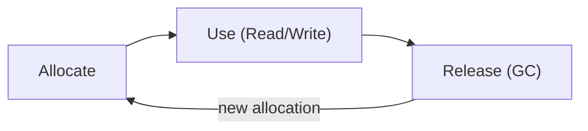
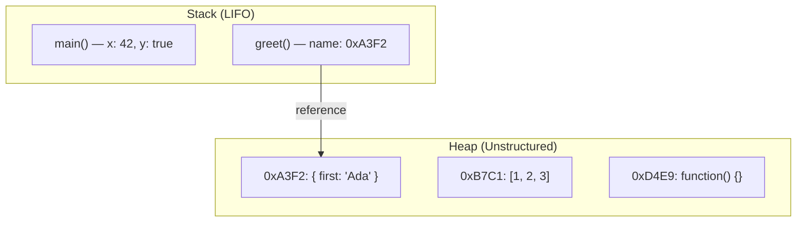
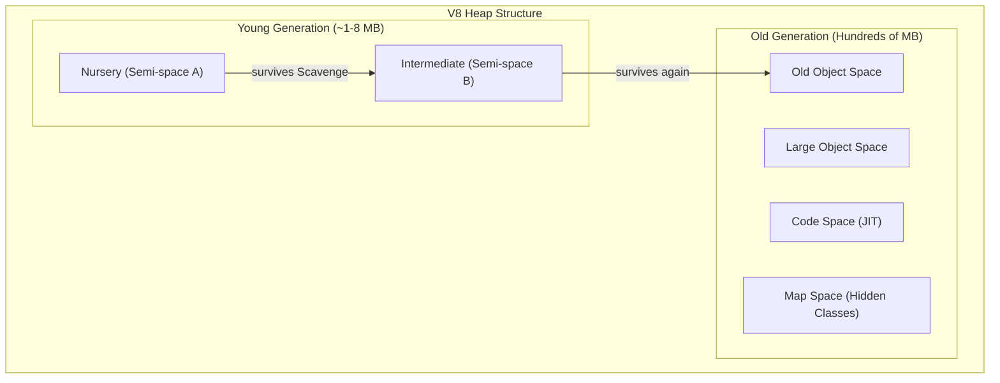

# 10 — Memory & Performance

> **TL;DR** — JavaScript automatically manages memory through garbage collection, but that doesn't mean you can ignore it. Understanding stack vs heap allocation, GC generations, common leak patterns, weak references, Web Workers, and the Performance API separates senior engineers from everyone else. This chapter gives you the mental models and tooling to write leak-free, high-performance code.

---

## 1. Memory Lifecycle

Every piece of data in a JavaScript program passes through three phases:



| Phase | What Happens | Who Controls It |
|-------|-------------|-----------------|
| **Allocate** | Engine reserves memory for variables, objects, functions | Implicit (engine) |
| **Use** | Read/write through references | Developer |
| **Release** | Memory returned to OS when no longer reachable | Garbage Collector |

The developer controls only the **Use** phase. Allocation and release are automatic — but your code determines *when* the GC can reclaim memory by controlling reachability.

---

## 2. Stack vs Heap



| Aspect | Stack | Heap |
|--------|-------|------|
| **Stores** | Primitives, function frames, pointers | Objects, arrays, functions, closures |
| **Access** | O(1) — direct offset | O(1) via pointer, but GC overhead |
| **Size** | Small, fixed per thread (~1 MB) | Large, dynamically sized |
| **Lifetime** | Automatic — freed on function return | Until no references remain |
| **Speed** | Extremely fast (CPU cache friendly) | Slower (pointer indirection) |

```javascript
// Stack allocation — primitive copied by value
let a = 10;
let b = a;     // b gets its own copy
b = 20;        // a is still 10

// Heap allocation — object shared by reference
let obj1 = { count: 1 };
let obj2 = obj1;      // both point to same heap address
obj2.count = 99;      // obj1.count is also 99
```

**Key insight**: when you pass an object to a function, you pass the *reference* (a stack pointer), not the object itself. This is why mutations inside functions "escape."

---

## 3. Garbage Collection

### 3.1 Mark-and-Sweep

The fundamental algorithm used by all modern engines:

1. **Mark** — Start from GC roots (global object, active stack frames, closures). Traverse all reachable objects, marking each as "alive."
2. **Sweep** — Iterate the entire heap. Any unmarked object is unreachable → free its memory.
3. **Compact** (optional) — Move surviving objects together to reduce fragmentation.

### 3.2 V8's Generational GC

V8 splits the heap into generations based on the *generational hypothesis*: most objects die young.



| GC Type | Generation | Algorithm | Pause | Frequency |
|---------|-----------|-----------|-------|-----------|
| **Scavenger (Minor GC)** | Young | Cheney's semi-space copy | ~1-5 ms | Very frequent |
| **Major GC** | Old | Mark-Sweep-Compact | ~50-200 ms | Infrequent |
| **Incremental Marking** | Old | Mark in small steps | Interleaved | Concurrent |
| **Concurrent Sweeping** | Old | Sweep on background thread | Zero main-thread | Parallel |

**Scavenger** copies live objects from one semi-space to the other, then flips. Objects that survive two scavenges get *promoted* to old generation.

---

## 4. Common Memory Leaks

### 4.1 Accidental Globals

```javascript
// BAD — implicit global (no strict mode)
function process() {
  result = computeHeavy();  // 'result' attaches to window
}

// FIX — always use strict mode + explicit declarations
'use strict';
function process() {
  const result = computeHeavy();
  return result;
}
```

### 4.2 Forgotten Timers and Intervals

```javascript
// BAD — interval keeps reference to heavyData forever
const heavyData = loadMassiveDataset();
setInterval(() => {
  console.log(heavyData.summary);
}, 5000);

// FIX — clear when no longer needed
const id = setInterval(() => {
  console.log(heavyData.summary);
}, 5000);

function teardown() {
  clearInterval(id);
}
```

### 4.3 Detached DOM Nodes

```javascript
// BAD — reference keeps removed node in memory
const button = document.getElementById('submit');
document.body.removeChild(button.parentElement);
// 'button' still references the detached subtree

// FIX — nullify the reference
let button = document.getElementById('submit');
document.body.removeChild(button.parentElement);
button = null;
```

### 4.4 Closures Holding References

```javascript
// BAD — closure captures entire scope including bigArray
function createHandler() {
  const bigArray = new Array(1_000_000).fill('x');
  const id = bigArray.length;

  return function handler() {
    console.log(id);  // only needs 'id', but bigArray is also retained
  };
}

// FIX — restructure to avoid capturing unnecessary variables
function createHandler() {
  const id = computeId();
  return function handler() {
    console.log(id);
  };
}

function computeId() {
  const bigArray = new Array(1_000_000).fill('x');
  return bigArray.length;  // bigArray is now eligible for GC
}
```

### 4.5 Event Listeners Not Removed

```javascript
// BAD — listener survives element removal in SPAs
class Component {
  init() {
    this.onScroll = () => this.update();
    window.addEventListener('scroll', this.onScroll);
  }
}

// FIX — use AbortController for clean teardown
class Component {
  #controller = new AbortController();

  init() {
    window.addEventListener('scroll', () => this.update(), {
      signal: this.#controller.signal,
    });
  }

  destroy() {
    this.#controller.abort();  // removes ALL listeners registered with this signal
  }
}
```

### 4.6 console.log in Production

```javascript
// BAD — logged objects cannot be GC'd while DevTools retains them
function process(data) {
  console.log('Processing:', data);  // data pinned in memory
  return transform(data);
}

// FIX — strip console in production builds or use conditional logging
function process(data) {
  if (__DEV__) console.log('Processing:', data);
  return transform(data);
}
```

---

## 5. WeakRef

`WeakRef` wraps an object without preventing its garbage collection. The GC can reclaim the target at any time.

```javascript
let target = { name: 'expensive', data: new ArrayBuffer(10_000_000) };
const ref = new WeakRef(target);

// Later — target may have been GC'd
const obj = ref.deref();
if (obj) {
  console.log(obj.name);
} else {
  console.log('Object was garbage collected');
}
```

### Caching Pattern with WeakRef

```javascript
function createCache(fetcher) {
  const cache = new Map();

  return async function get(key) {
    const ref = cache.get(key);
    if (ref) {
      const cached = ref.deref();
      if (cached) return cached;
    }

    const value = await fetcher(key);
    cache.set(key, new WeakRef(value));
    return value;
  };
}

const getUser = createCache(userId => fetch(`/api/users/${userId}`).then(r => r.json()));
```

**Caveat**: `deref()` may return `undefined` at any call — always check. Don't rely on `WeakRef` for correctness, only for optimization.

---

## 6. FinalizationRegistry

Registers a callback that fires *after* a target object is garbage collected. Useful for releasing external resources (file handles, native memory, cache entries).

```javascript
const registry = new FinalizationRegistry((heldValue) => {
  console.log(`Cleaning up resource: ${heldValue}`);
  externalResourceMap.delete(heldValue);
});

function createManagedResource(id) {
  const resource = { id, buffer: new ArrayBuffer(1_000_000) };
  registry.register(resource, id);  // id is the "held value" passed to callback
  return resource;
}

let res = createManagedResource('img-42');
res = null; // eventually GC reclaims it → callback fires with 'img-42'
```

### WeakRef + FinalizationRegistry Cache

```javascript
class SmartCache {
  #cache = new Map();
  #registry = new FinalizationRegistry((key) => {
    const ref = this.#cache.get(key);
    if (ref && !ref.deref()) this.#cache.delete(key);
  });

  set(key, value) {
    this.#cache.set(key, new WeakRef(value));
    this.#registry.register(value, key);
  }

  get(key) {
    return this.#cache.get(key)?.deref();
  }
}
```

The `FinalizationRegistry` callback cleans up the stale `WeakRef` entry from the Map, preventing unbounded key growth.

---

## 7. WeakMap & WeakSet

| Feature | Map | WeakMap |
|---------|-----|---------|
| Key types | Any | Objects only |
| Key references | Strong | Weak |
| Iterable | Yes | No |
| `.size` | Yes | No |
| Use case | General storage | Metadata, private data |

### DOM Metadata Pattern

```javascript
const nodeData = new WeakMap();

function track(element, metadata) {
  nodeData.set(element, metadata);
}

function getMetadata(element) {
  return nodeData.get(element);
}

// When the DOM element is removed and no other reference exists,
// both the key AND the value are eligible for GC — zero manual cleanup.
```

### Private Data Pattern (pre-`#private`)

```javascript
const privates = new WeakMap();

class User {
  constructor(name, ssn) {
    this.name = name;
    privates.set(this, { ssn });
  }

  getSSN() {
    return privates.get(this).ssn;
  }
}

const u = new User('Ada', '123-45-6789');
u.getSSN();        // '123-45-6789'
// No way to access ssn from outside without the User instance
```

**WeakSet** is useful for tagging objects without preventing GC — e.g., marking objects as "already processed."

```javascript
const visited = new WeakSet();

function processOnce(node) {
  if (visited.has(node)) return;
  visited.add(node);
  // ... process node
}
```

---

## 8. Web Workers

Web Workers move CPU-intensive work off the main thread, keeping the UI responsive.

### Basic Worker

```javascript
// worker.js
self.onmessage = (e) => {
  const result = heavyComputation(e.data);
  self.postMessage(result);
};

// main.js
const worker = new Worker('worker.js');
worker.postMessage(largeDataset);
worker.onmessage = (e) => {
  renderResults(e.data);
};
worker.onerror = (e) => console.error('Worker error:', e.message);
```

### Transferable Objects

By default, `postMessage` uses the **structured clone algorithm** (deep copy). For large `ArrayBuffer`s, use **transfer** to move ownership with zero copy.

```javascript
const buffer = new ArrayBuffer(1024 * 1024 * 64); // 64 MB

// Structured clone — slow, copies 64 MB
worker.postMessage(buffer);

// Transfer — instant, buffer becomes unusable in sender
worker.postMessage(buffer, [buffer]);
console.log(buffer.byteLength); // 0 — ownership transferred
```

### SharedArrayBuffer + Atomics

Shared memory between threads — no copying, no transferring. Requires `Cross-Origin-Isolation` headers.

```javascript
const shared = new SharedArrayBuffer(1024);
const view = new Int32Array(shared);

worker.postMessage(shared);

// In worker — atomic operations prevent data races
Atomics.add(view, 0, 1);
Atomics.store(view, 1, 42);
const val = Atomics.load(view, 1);  // 42
Atomics.wait(view, 0, 0);           // block until view[0] !== 0
Atomics.notify(view, 0, 1);         // wake one waiting thread
```

### SharedWorker

A single worker instance shared across multiple tabs/windows of the same origin.

```javascript
const shared = new SharedWorker('shared-worker.js');
shared.port.start();
shared.port.postMessage({ type: 'subscribe', channel: 'updates' });
shared.port.onmessage = (e) => console.log(e.data);
```

---

## 9. requestIdleCallback & requestAnimationFrame

| API | Fires When | Use Case | Typical Budget |
|-----|-----------|----------|---------------|
| `requestAnimationFrame` | Before next repaint (~16 ms at 60 fps) | Animations, DOM reads/writes | 16 ms total frame |
| `requestIdleCallback` | Browser is idle (no pending work) | Non-urgent background tasks | ~50 ms max |

### requestAnimationFrame

```javascript
function animate(timestamp) {
  element.style.transform = `translateX(${timestamp * 0.1}px)`;
  requestAnimationFrame(animate);
}
requestAnimationFrame(animate);
```

### requestIdleCallback

```javascript
function processQueue(deadline) {
  while (queue.length > 0 && deadline.timeRemaining() > 5) {
    const item = queue.shift();
    processItem(item);
  }

  if (queue.length > 0) {
    requestIdleCallback(processQueue, { timeout: 2000 });
  }
}

requestIdleCallback(processQueue, { timeout: 2000 }); // force run within 2s
```

### Scheduling Pattern — Prioritized Work

```javascript
function scheduleWork(urgentTasks, backgroundTasks) {
  urgentTasks.forEach((task) => {
    requestAnimationFrame(() => task());
  });

  backgroundTasks.forEach((task) => {
    requestIdleCallback((deadline) => {
      if (deadline.timeRemaining() > 10) task();
    });
  });
}
```

---

## 10. Performance API

### High-Resolution Timing

```javascript
const start = performance.now(); // microsecond precision
expensiveOperation();
const duration = performance.now() - start;
console.log(`Took ${duration.toFixed(2)} ms`);
```

### User Timing (Marks & Measures)

```javascript
performance.mark('fetch-start');
const data = await fetch('/api/data');
performance.mark('fetch-end');

performance.measure('fetch-duration', 'fetch-start', 'fetch-end');

const [entry] = performance.getEntriesByName('fetch-duration');
console.log(`Fetch took ${entry.duration.toFixed(2)} ms`);
```

### PerformanceObserver

```javascript
const observer = new PerformanceObserver((list) => {
  for (const entry of list.getEntries()) {
    if (entry.duration > 100) {
      console.warn(`Slow ${entry.name}: ${entry.duration.toFixed(1)} ms`);
    }
  }
});

observer.observe({ type: 'measure', buffered: true });
observer.observe({ type: 'longtask', buffered: true });
```

### Measuring Core Web Vitals

```javascript
new PerformanceObserver((list) => {
  for (const entry of list.getEntries()) {
    console.log('LCP:', entry.startTime);
  }
}).observe({ type: 'largest-contentful-paint', buffered: true });

new PerformanceObserver((list) => {
  for (const entry of list.getEntries()) {
    console.log('FID:', entry.processingStart - entry.startTime);
  }
}).observe({ type: 'first-input', buffered: true });
```

---

## 11. DevTools Memory Profiling

### Heap Snapshot

1. Open DevTools → **Memory** tab → select **Heap snapshot** → click **Take snapshot**.
2. Look at **Summary** view — sort by **Retained Size** to find the biggest objects.
3. Use **Comparison** view between two snapshots to find what grew.

### Allocation Timeline

1. Select **Allocation instrumentation on timeline** → **Start**.
2. Perform the leaking action → **Stop**.
3. Blue bars that don't turn gray are objects that were never collected — potential leaks.

### Key Terms

| Term | Meaning |
|------|---------|
| **Shallow Size** | Memory held by the object itself |
| **Retained Size** | Memory freed if this object is GC'd (includes dependents) |
| **Detached DOM tree** | DOM subtree removed from document but still referenced in JS |
| **Retaining path** | Chain of references from GC root to the object |

### Finding a Leak — Workflow

```
1. Take Snapshot A (baseline)
2. Perform suspected leaking action repeatedly
3. Force GC (trash can icon)
4. Take Snapshot B
5. Compare B vs A → filter by "Objects allocated between snapshots"
6. Check retaining paths of growing objects
7. Fix the reference → repeat to verify
```

---

## Common Mistakes

| Mistake | Why It's Bad | Fix |
|---------|-------------|-----|
| Storing DOM refs in long-lived objects | Detached DOM trees leak | Use WeakRef or nullify on removal |
| Never clearing `setInterval` | Callback + closure live forever | Store ID and call `clearInterval` |
| Adding listeners without removal plan | Listeners pin their closures | Use `AbortController.signal` |
| Assuming GC is immediate | GC is non-deterministic | Don't rely on GC timing for correctness |
| Using `WeakRef.deref()` without null check | Target may already be collected | Always check `if (obj)` |
| Blocking main thread with heavy computation | Janky UI, missed frames | Offload to Web Worker |
| Using `performance.now()` in tight loops | Observer overhead skews results | Batch measurements, use `mark/measure` |
| Transferring a buffer then reading it | `byteLength` becomes 0 after transfer | Clone if you need it in both contexts |

---

## Interview-Ready Answers

> **Q: How does JavaScript manage memory, and what GC algorithm does V8 use?**
> JavaScript uses automatic memory management. V8 employs a generational garbage collector: the **Scavenger** (Cheney's semi-space) handles the young generation with fast ~1-5 ms pauses, while the **Major GC** (Mark-Sweep-Compact) handles the old generation. V8 also uses incremental marking and concurrent sweeping to reduce main-thread pauses. Objects that survive two scavenges are promoted to old generation.

> **Q: Name five common sources of memory leaks in JavaScript.**
> (1) Accidental globals from missing `let`/`const`, (2) forgotten `setInterval`/`setTimeout` callbacks, (3) detached DOM nodes held by JS references, (4) closures capturing variables larger than needed, (5) event listeners never removed — especially in SPAs where components mount/unmount. A sixth: `console.log` retaining object references in production.

> **Q: What is the difference between `WeakMap` and `Map`?**
> `WeakMap` holds **weak references** to its keys (which must be objects). If no other reference to the key exists, both the key and its associated value become eligible for GC. This makes `WeakMap` ideal for attaching metadata to objects without causing leaks. Unlike `Map`, `WeakMap` is not iterable and has no `.size` — because its contents are non-deterministic due to GC.

> **Q: When would you use `WeakRef` and `FinalizationRegistry`?**
> Use `WeakRef` for caches where you want to hold expensive objects only as long as something else needs them. Pair with `FinalizationRegistry` to clean up external resources (file handles, map entries, native memory) after the JS object is collected. Never rely on them for correctness — GC timing is non-deterministic. They're an optimization, not a guarantee.

> **Q: How does `postMessage` transfer work, and why is it faster than cloning?**
> By default, `postMessage` deep-clones data using the structured clone algorithm. For `ArrayBuffer` and other transferable objects, you can pass them in the transfer list: `worker.postMessage(buffer, [buffer])`. This transfers **ownership** in O(1) — no bytes are copied. The sender's buffer becomes zero-length (neutered). This is critical for large payloads like images or audio buffers.

> **Q: What is the difference between `requestAnimationFrame` and `requestIdleCallback`?**
> `requestAnimationFrame` fires right before the browser paints the next frame (~16 ms at 60 fps) — use it for visual updates and animations. `requestIdleCallback` fires when the browser has spare time after completing higher-priority work — use it for non-urgent tasks like analytics, prefetching, or background processing. `rIC` receives a `deadline` object so you can check remaining time and yield early.

> **Q: How do you identify a memory leak using Chrome DevTools?**
> Take a heap snapshot as a baseline. Perform the suspected leaking action several times. Force GC, then take a second snapshot. Use the **Comparison** view to find objects allocated between snapshots that were never freed. Examine the **retaining path** of suspicious objects to trace back to the root reference preventing collection. The **Allocation Timeline** can also visualize allocations over time — persistent blue bars indicate leaks.

---

> Next → [11-modules-bundling.md](11-modules-bundling.md)
