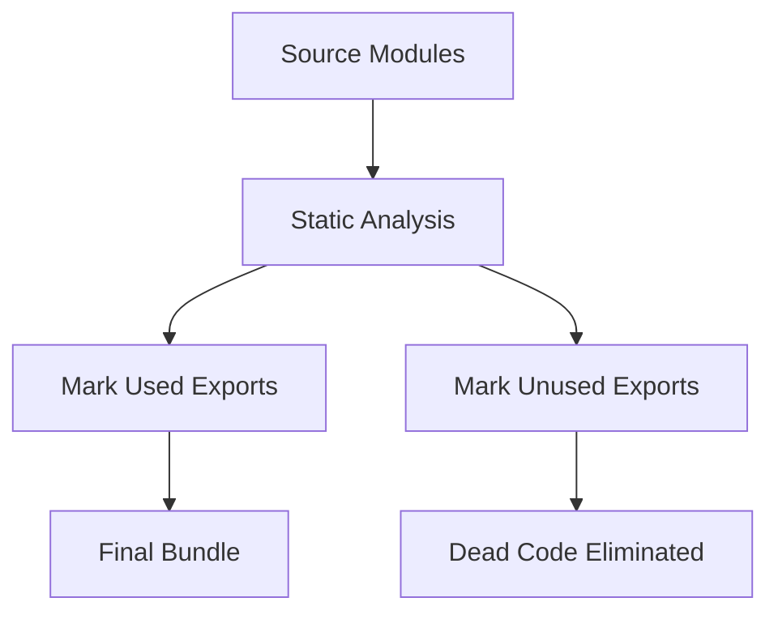
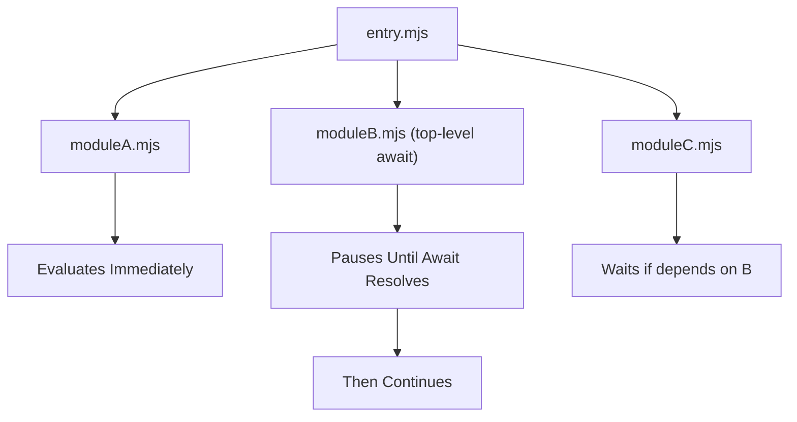

# 11 — Modules & Bundling

> **TL;DR** — JavaScript evolved from global `<script>` tags to a robust module system. CommonJS (`require`) powers Node.js synchronously; ES Modules (`import`/`export`) are the standard for both browser and server with static analysis enabling tree shaking. Bundlers (Webpack, Vite, Rollup, esbuild) transform module graphs into optimized bundles. Understanding module resolution, dual publishing, and code splitting is essential for architecting modern applications.

---

## 1 — Module History

Before modules, every `<script>` dumped variables into the global scope. The community invented patterns to work around this.


| Era | Pattern | Environment | Key Trait |
|-----|---------|-------------|-----------|
| 1995 | Global scripts | Browser | Namespace collisions |
| 2003 | IIFE | Browser | Encapsulation via closures |
| 2009 | AMD | Browser (async) | `define()` / `require()` |
| 2009 | CommonJS | Node.js | `require()` / `module.exports` |
| 2011 | UMD | Both | Universal wrapper |
| 2015 | ESM | Both (spec) | `import` / `export` — static |
| 2020 | Dynamic `import()` | Both | Lazy loading, code splitting |

### IIFE Recap

```javascript
var MyLib = (function () {
  var privateCount = 0;
  return {
    increment: function () { return ++privateCount; },
    getCount:  function () { return privateCount; }
  };
})();
```

The revealing module pattern was the de-facto standard before tooling caught up.

---

## 2 — CommonJS (CJS)

Node.js adopted CommonJS as its module system. Every file is a module; `require()` is synchronous.

```javascript
// math.js
function add(a, b) { return a + b; }
function multiply(a, b) { return a * b; }

module.exports = { add, multiply };

// app.js
const { add, multiply } = require('./math');
console.log(add(2, 3)); // 5
```

### How Node Resolves `require()`

1. **Core module?** → return built-in (`fs`, `path`, etc.)
2. **Starts with `./` or `../`?** → resolve relative path, try `.js`, `.json`, `.node`
3. **Otherwise** → walk up `node_modules` directories until found
4. **Folder?** → read `package.json` `"main"` field, fallback to `index.js`

### CJS Characteristics

- **Synchronous** — `require()` blocks until the module is loaded
- **Value copies** — imported values are snapshots at require-time
- **Dynamic** — `require()` can appear inside conditionals or loops
- **Caching** — modules are cached after first load (`require.cache`)

```javascript
// Conditional require — valid in CJS
if (process.env.NODE_ENV === 'development') {
  const debug = require('./debug-tools');
  debug.enable();
}
```

---

## 3 — ES Modules (ESM)

The language-level module system standardized in ES2015. Static structure enables tooling optimizations impossible with CJS.

```javascript
// Named exports
export function add(a, b) { return a + b; }
export const PI = 3.14159;

// Default export
export default class Calculator {
  evaluate(expr) { /* ... */ }
}

// Re-export (barrel)
export { add, PI } from './math.js';
export * from './utils.js';
export { default as Calculator } from './calculator.js';
```

### Import Syntax

```javascript
import Calculator, { add, PI } from './math.js';
import * as MathLib from './math.js';
import { add as sum } from './math.js';
```

### Live Bindings vs CJS Copies

This is a critical distinction:

```javascript
// counter.mjs (ESM)
export let count = 0;
export function increment() { count++; }

// main.mjs
import { count, increment } from './counter.mjs';
console.log(count);  // 0
increment();
console.log(count);  // 1  ← live binding updates!

// counter.cjs (CJS equivalent)
let count = 0;
module.exports = { count, increment() { count++; } };

// main.cjs
const { count, increment } = require('./counter.cjs');
console.log(count);  // 0
increment();
console.log(count);  // 0  ← still 0! It's a copy.
```

---

## 4 — CJS vs ESM Comparison

| Feature | CommonJS | ES Modules |
|---------|----------|------------|
| Syntax | `require()` / `module.exports` | `import` / `export` |
| Loading | Synchronous | Asynchronous (browser), static parse |
| Evaluation | Eager, on `require()` | Deferred, after full parse |
| Bindings | Value copy (snapshot) | Live read-only bindings |
| Tree Shaking | Not possible (dynamic) | Fully supported (static) |
| Top-Level `this` | `module.exports` | `undefined` |
| Top-Level Await | Not supported | Supported (ES2022) |
| Conditional Import | `if (x) require('y')` | Only via dynamic `import()` |
| File Extension | `.js` (default in Node) | `.mjs` or `.js` with `"type": "module"` |
| Browser Support | Requires bundler | Native with `<script type="module">` |
| Circular Deps | Partial object returned | Live bindings resolve correctly |

---

## 5 — Dynamic `import()`

Dynamic import returns a **Promise** resolving to the module namespace. It enables code splitting and conditional loading.

```javascript
// Code splitting — load on demand
const button = document.getElementById('chart-btn');
button.addEventListener('click', async () => {
  const { renderChart } = await import('./chart-engine.js');
  renderChart(data);
});

// Conditional loading
async function loadParser(format) {
  switch (format) {
    case 'csv':  return import('./parsers/csv.js');
    case 'xml':  return import('./parsers/xml.js');
    case 'json': return import('./parsers/json.js');
    default:     throw new Error(`Unknown format: ${format}`);
  }
}

// React.lazy pattern (framework code splitting)
const Dashboard = React.lazy(() => import('./Dashboard'));
// Angular equivalent
const routes = [
  { path: 'dashboard', loadComponent: () => import('./dashboard.component').then(m => m.DashboardComponent) }
];
```

Dynamic `import()` is the only way to lazily load ESM at runtime. Bundlers (Webpack, Vite) use it as a **split point** to create separate chunks.

---

## 6 — Tree Shaking

Tree shaking eliminates unused exports from the final bundle. It relies on the **static structure** of ES Modules.



### What Enables Tree Shaking

- ESM `import`/`export` (statically analyzable)
- Pure functions with no side effects
- `"sideEffects": false` in `package.json`

### What Prevents Tree Shaking

```javascript
// 1. CJS — dynamic, can't analyze
const lib = require('./lib');

// 2. Side effects at module level
export const API_URL = 'https://api.example.com';
console.log('Module loaded!'); // ← side effect prevents removal

// 3. Dynamic property access
import * as Utils from './utils';
const fn = Utils[someVariable]; // bundler can't know which export is used

// 4. Re-exporting everything without filtering
export * from './massive-lib'; // bundler must keep all exports
```

### The `sideEffects` Field

```json
{
  "name": "my-library",
  "sideEffects": false
}
```

Setting `"sideEffects": false` tells the bundler that any file in the package can be safely pruned if its exports are unused. For CSS or polyfills that do have side effects:

```json
{
  "sideEffects": ["*.css", "./src/polyfills.js"]
}
```

---

## 7 — Import Maps

Import maps let browsers resolve bare specifiers without a bundler — a native alternative to `node_modules` resolution.

```html
<script type="importmap">
{
  "imports": {
    "lodash": "https://cdn.jsdelivr.net/npm/lodash-es@4.17.21/lodash.js",
    "react": "https://esm.sh/react@18",
    "@utils/": "./src/utils/"
  }
}
</script>

<script type="module">
import { debounce } from 'lodash';   // resolved by import map
import { formatDate } from '@utils/date.js';
</script>
```

Import maps are now supported in all major browsers and are useful for **dev-time bundler-free workflows** (e.g., during prototyping or with tools like `es-module-shims`).

---

## 8 — Top-Level Await

ES2022 allows `await` at the top level of a module, turning the module itself into an async boundary.

```javascript
// config.mjs
const response = await fetch('/api/config');
export const config = await response.json();

// app.mjs — blocks until config.mjs resolves
import { config } from './config.mjs';
console.log(config.apiUrl);
```

### Evaluation Order Impact



- Modules **without** top-level await evaluate synchronously as usual
- A module **with** top-level await pauses its own evaluation (and anything that depends on it)
- Sibling modules that do **not** depend on the awaiting module continue in parallel

> **Caution**: Top-level await can introduce waterfall delays if modules form a dependency chain. Use it judiciously — config loading, feature detection, or async initialization.

---

## 9 — Module Resolution in Node

Node.js has different resolution algorithms for CJS and ESM.

### Enabling ESM in Node

| Method | Description |
|--------|-------------|
| `.mjs` extension | Always treated as ESM |
| `"type": "module"` in `package.json` | `.js` files treated as ESM |
| `--input-type=module` flag | For stdin/eval input |

### The `exports` Field (Package Entry Points)

The `exports` field in `package.json` replaces `"main"` and enables **conditional exports**:

```json
{
  "name": "my-lib",
  "exports": {
    ".": {
      "import": "./dist/esm/index.js",
      "require": "./dist/cjs/index.cjs",
      "types": "./dist/types/index.d.ts"
    },
    "./utils": {
      "import": "./dist/esm/utils.js",
      "require": "./dist/cjs/utils.cjs"
    }
  }
}
```

### Conditional Exports

```json
{
  "exports": {
    ".": {
      "node": {
        "import": "./dist/node-esm.js",
        "require": "./dist/node-cjs.cjs"
      },
      "browser": "./dist/browser.js",
      "default": "./dist/esm/index.js"
    }
  }
}
```

Conditions are evaluated **top-down, first match wins**. Common conditions: `import`, `require`, `node`, `browser`, `default`, `types`.

---

## 10 — Bundlers Overview

Modern bundlers transform a module graph into optimized output. Each makes different trade-offs.


| Bundler | Language | Dev Speed | Prod Quality | Tree Shaking | Code Splitting | HMR | Best For |
|---------|----------|-----------|--------------|--------------|----------------|-----|----------|
| **Webpack** | JS | Moderate | Excellent | Yes | Yes (mature) | Yes | Large apps, complex configs |
| **Vite** | JS (esbuild+Rollup) | Very Fast | Excellent | Yes (Rollup) | Yes | Yes (native ESM) | Modern apps, DX-focused |
| **Rollup** | JS | Fast | Excellent | Best-in-class | Yes | Plugin | Libraries, packages |
| **esbuild** | Go | Fastest | Good | Basic | Yes (limited) | No | Build tooling, transforms |
| **Turbopack** | Rust | Very Fast | Good | Yes | Yes | Yes | Next.js (Vercel ecosystem) |
| **Rspack** | Rust | Very Fast | Excellent | Yes | Yes | Yes | Webpack-compatible, fast |

### When to Choose What

- **Library** → Rollup (cleanest output, best tree shaking)
- **Application** → Vite (fast dev, Rollup prod) or Webpack (mature ecosystem)
- **Build toolchain** → esbuild (raw speed for transforms)
- **Next.js** → Turbopack (native integration)
- **Webpack migration** → Rspack (drop-in Rust replacement)

---

## 11 — Package.json Dual Publishing

Supporting both CJS and ESM consumers requires careful configuration.

```json
{
  "name": "my-awesome-lib",
  "version": "2.0.0",
  "type": "module",
  "main": "./dist/cjs/index.cjs",
  "module": "./dist/esm/index.js",
  "types": "./dist/types/index.d.ts",
  "exports": {
    ".": {
      "types": "./dist/types/index.d.ts",
      "import": "./dist/esm/index.js",
      "require": "./dist/cjs/index.cjs"
    }
  },
  "files": ["dist"],
  "sideEffects": false
}
```

### The Dual-Package Hazard

When both CJS and ESM versions of the same package exist, Node might load both if one dependency uses `require()` and another uses `import`. This creates **two separate instances** with duplicated state.

Mitigation strategies:
- Use a **CJS wrapper** that re-exports the ESM version
- Use the `exports` field to explicitly control resolution
- Keep state in a separate shared module

```javascript
// dist/cjs/index.cjs — thin CJS wrapper
module.exports = async function (...args) {
  const mod = await import('../esm/index.js');
  return mod.default(...args);
};
```

---

## 12 — Common Mistakes

| Mistake | Why It Fails | Fix |
|---------|-------------|-----|
| Using `require()` in ESM file | `require` is not defined in ESM | Use `import` or `createRequire` |
| Omitting file extensions in ESM | Node ESM requires full specifiers | Add `.js` extension to imports |
| `export default { fn1, fn2 }` | Prevents tree shaking (single object) | Use named exports |
| Circular imports in CJS | Partially initialized `module.exports` | Restructure or use ESM live bindings |
| `"type": "module"` breaking CJS deps | `.js` files now parsed as ESM | Rename CJS files to `.cjs` |
| Barrel files re-exporting everything | Kills tree shaking in some bundlers | Import directly from source |
| Missing `"sideEffects"` in library | Bundler assumes all files have effects | Set `"sideEffects": false` |
| Top-level await in hot path | Creates waterfall in module evaluation | Move to lazy initialization |

---

## 13 — Interview-Ready Answers

> **Q: What is the difference between CommonJS and ES Modules?**
> CommonJS uses `require()`/`module.exports`, loads synchronously, and produces value copies. ES Modules use `import`/`export`, are statically analyzable at parse time, and provide live read-only bindings to the original value. ESM enables tree shaking because the import/export graph is known before execution; CJS cannot be tree-shaken because `require()` calls can be dynamic and conditional. ESM also supports top-level `await` and is the standard for both browser and server environments.

> **Q: How does tree shaking work, and what prevents it?**
> Tree shaking uses static analysis of ES Module `import`/`export` statements to determine which exports are actually used, then eliminates unused code (dead code elimination). It is prevented by: (1) CommonJS `require()` since it's dynamic, (2) side effects at module scope like `console.log` or DOM manipulation, (3) dynamic property access like `obj[variable]`, and (4) missing `"sideEffects": false` in `package.json` which causes bundlers to conservatively keep everything.

> **Q: What is the dual-package hazard, and how do you avoid it?**
> When a package ships both CJS and ESM builds, Node.js may load both versions if different parts of the dependency graph use `require()` and `import` for the same package. This creates two separate module instances with duplicated state, breaking singletons and shared state. To avoid it, use the `exports` field in `package.json` to explicitly map `"import"` and `"require"` conditions, or use a thin CJS wrapper that delegates to the ESM build via dynamic `import()`.

> **Q: Explain live bindings in ES Modules versus value copies in CommonJS.**
> In CJS, `require()` returns a snapshot of the exported values at the time of the call. If the exporting module later mutates a variable, the importing module still sees the old value. In ESM, imports are live read-only references to the original binding in the exporting module. When the exporting module updates an exported variable, all importers immediately see the new value. This is why circular dependencies work more predictably in ESM.

> **Q: When would you choose Rollup over Webpack?**
> Rollup is ideal for building **libraries and packages** because it produces the cleanest output with the best tree shaking, supports ESM output natively, and generates flat bundles without runtime overhead. Webpack is better for **applications** that need advanced code splitting, HMR, extensive loader/plugin ecosystems, and complex asset pipelines (CSS, images, fonts). For modern app development, Vite combines esbuild for fast dev transforms with Rollup for optimized production builds, offering the best of both worlds.

> **Q: How do conditional exports work in `package.json`?**
> The `"exports"` field defines a map of entry points with conditions like `"import"`, `"require"`, `"node"`, `"browser"`, `"types"`, and `"default"`. When a consumer resolves the package, Node (or a bundler) evaluates conditions top-down and uses the first matching path. This allows a single package to serve different builds to different environments — ESM for modern bundlers, CJS for legacy Node code, and browser-specific builds for client-side tools — all without consumers changing their import statements.

---

> Next → [12-typescript-foundations.md](12-typescript-foundations.md)
