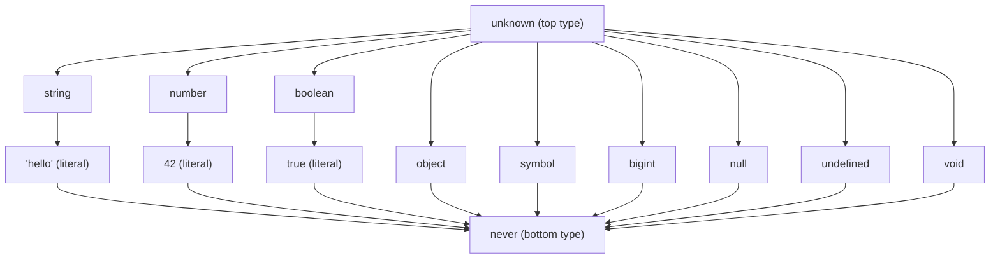
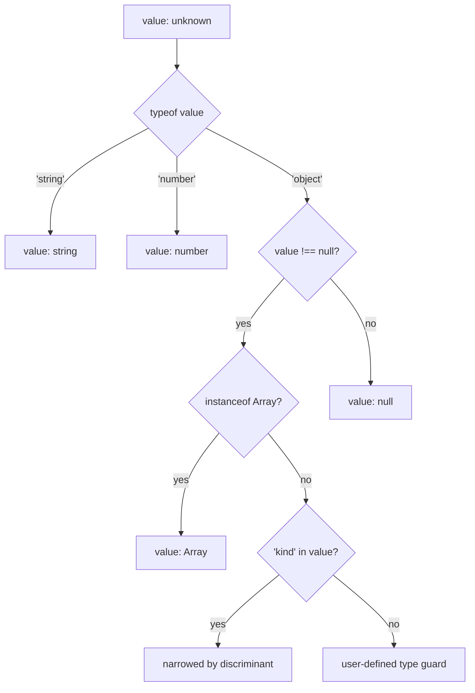
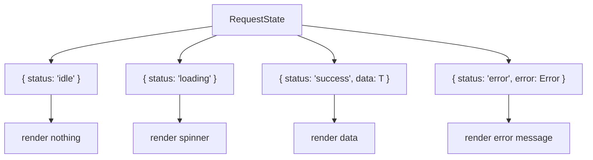

# 12 — TypeScript Foundations

> **TL;DR** — TypeScript adds a structural type system on top of JavaScript that catches errors at compile time without runtime overhead. Master the type hierarchy (`unknown` → concrete types → `never`), narrowing techniques, generics, utility types, and discriminated unions to write code that is both safe and expressive. This chapter covers everything a senior engineer needs to know about TypeScript's core type system.

---

## 1. Why TypeScript

### Structural vs Nominal Typing

TypeScript uses **structural typing** (duck typing at the type level). Two types are compatible if their shapes match — names don't matter.

```typescript
interface Point {
  x: number;
  y: number;
}

interface Coordinate {
  x: number;
  y: number;
}

const p: Point = { x: 1, y: 2 };
const c: Coordinate = p; // ✅ — same shape, different name
```

In nominal systems (Java, C#), `Point` and `Coordinate` would be incompatible despite identical structure. TypeScript's structural approach is more flexible but requires discipline — you can accidentally pass the wrong type if shapes overlap.

### Simulating Nominal Types (Branded Types)

```typescript
type USD = number & { readonly __brand: unique symbol };
type EUR = number & { readonly __brand: unique symbol };

function toUSD(amount: number): USD {
  return amount as USD;
}

function toEUR(amount: number): EUR {
  return amount as EUR;
}

function chargeUSD(amount: USD): void { /* ... */ }

chargeUSD(toUSD(100)); // ✅
chargeUSD(toEUR(100)); // ❌ — Type 'EUR' is not assignable to 'USD'
```

### The TypeScript Tax Debate

| Argument For TS | Argument Against TS |
|---|---|
| Catches bugs at compile time | Adds build step complexity |
| Self-documenting via types | Over-engineering simple scripts |
| Refactoring confidence | Learning curve for advanced types |
| IDE autocompletion & navigation | Type gymnastics can obscure intent |
| Scales with team size | Small prototypes don't benefit |

**When NOT to use TypeScript**: quick prototypes, tiny scripts, teams with zero TS experience and a tight deadline, or when the type system fights the problem domain (heavy metaprogramming, dynamic codegen).

---

## 2. Type System Fundamentals

### The Type Hierarchy



### Primitives and Literal Types

```typescript
// Primitives
let name: string = 'Alice';
let age: number = 30;
let active: boolean = true;
let id: bigint = 100n;
let key: symbol = Symbol('key');

// Literal types — narrower than their base type
let direction: 'north' | 'south' | 'east' | 'west' = 'north';
let httpStatus: 200 | 301 | 404 | 500 = 200;
let toggle: true = true; // only `true`, not `boolean`
```

### `unknown` vs `any` vs `never`

| Type | Assignability | Safety | Use Case |
|---|---|---|---|
| `unknown` | Everything assigns **to** it, nothing reads **from** it without narrowing | ✅ Safe | Values from external sources (API, user input) |
| `any` | Everything assigns to/from it | ❌ Unsafe | Migration from JS, escape hatch |
| `never` | Nothing assigns **to** it, it assigns to everything | ✅ Safe | Impossible states, exhaustive checks |

```typescript
// unknown — forces narrowing before use
function processInput(value: unknown): string {
  if (typeof value === 'string') return value.toUpperCase();
  if (typeof value === 'number') return value.toFixed(2);
  throw new Error('Unsupported type');
}

// never — function that never returns
function throwError(msg: string): never {
  throw new Error(msg);
}

// never — exhaustive check
type Shape = 'circle' | 'square';
function area(shape: Shape): number {
  switch (shape) {
    case 'circle': return Math.PI * 10 ** 2;
    case 'square': return 10 ** 2;
    default: {
      const _exhaustive: never = shape; // ❌ if a case is missing
      return _exhaustive;
    }
  }
}
```

### Union and Intersection Types

```typescript
// Union — either A or B
type Result = Success | Failure;
type ID = string | number;

// Intersection — both A and B
type Timestamped<T> = T & { createdAt: Date; updatedAt: Date };

interface User { name: string; email: string; }
type TimestampedUser = Timestamped<User>;
// { name: string; email: string; createdAt: Date; updatedAt: Date }
```

---

## 3. Type Narrowing

Narrowing is how TypeScript refines a wide type into a specific one within a code branch.



### `typeof` Narrowing

```typescript
function double(value: string | number): string | number {
  if (typeof value === 'string') {
    return value.repeat(2); // value: string
  }
  return value * 2; // value: number
}
```

### `instanceof` Narrowing

```typescript
function formatError(err: Error | string): string {
  if (err instanceof Error) {
    return `${err.name}: ${err.message}`; // err: Error
  }
  return err; // err: string
}
```

### `in` Operator Narrowing

```typescript
interface Fish { swim(): void; }
interface Bird { fly(): void; }

function move(animal: Fish | Bird): void {
  if ('swim' in animal) {
    animal.swim(); // animal: Fish
  } else {
    animal.fly(); // animal: Bird
  }
}
```

### Custom Type Guards (`is`)

```typescript
interface ApiError {
  code: number;
  message: string;
}

function isApiError(value: unknown): value is ApiError {
  return (
    typeof value === 'object' &&
    value !== null &&
    'code' in value &&
    'message' in value &&
    typeof (value as ApiError).code === 'number' &&
    typeof (value as ApiError).message === 'string'
  );
}

function handleResponse(data: unknown): void {
  if (isApiError(data)) {
    console.error(`Error ${data.code}: ${data.message}`); // data: ApiError
  }
}
```

### Assertion Functions

```typescript
function assertDefined<T>(value: T | null | undefined, name: string): asserts value is T {
  if (value === null || value === undefined) {
    throw new Error(`Expected ${name} to be defined`);
  }
}

function process(input: string | null): void {
  assertDefined(input, 'input');
  console.log(input.toUpperCase()); // input: string — narrowed after assertion
}
```

---

## 4. Interfaces vs Types

| Feature | `interface` | `type` |
|---|---|---|
| Object shapes | ✅ | ✅ |
| Union types | ❌ | ✅ `type A = B \| C` |
| Intersection types | Via `extends` | ✅ `type A = B & C` |
| Declaration merging | ✅ | ❌ |
| `extends` keyword | ✅ | ❌ (use `&`) |
| Computed properties | ❌ | ✅ (mapped types) |
| Primitives / tuples / functions | ❌ | ✅ |
| Performance (compiler) | Slightly better (cached by name) | Slightly slower (structural) |

### Declaration Merging

```typescript
// Only interfaces can merge — useful for augmenting third-party types
interface Window {
  analytics: AnalyticsLib;
}

interface Window {
  featureFlags: Record<string, boolean>;
}

// Result: Window has both `analytics` and `featureFlags`
```

### When to Use Which

- **Use `interface`** for public API contracts, library types, object shapes you expect consumers to extend.
- **Use `type`** for unions, intersections, mapped types, utility compositions, and anything that isn't a plain object shape.

```typescript
// interface — extendable contract
interface Repository<T> {
  findById(id: string): Promise<T | null>;
  save(entity: T): Promise<T>;
  delete(id: string): Promise<void>;
}

// type — union, not possible with interface
type HttpMethod = 'GET' | 'POST' | 'PUT' | 'DELETE' | 'PATCH';

// type — computed / mapped
type Nullable<T> = { [K in keyof T]: T[K] | null };
```

---

## 5. Generics

### Basic Generics

```typescript
function identity<T>(value: T): T {
  return value;
}

const str = identity('hello'); // T inferred as 'hello' (literal)
const num = identity(42);      // T inferred as 42
```

### Generic Constraints

```typescript
function getProperty<T, K extends keyof T>(obj: T, key: K): T[K] {
  return obj[key];
}

const user = { name: 'Alice', age: 30 };
const name = getProperty(user, 'name'); // string
const age = getProperty(user, 'age');   // number
// getProperty(user, 'email');          // ❌ — 'email' not in keyof typeof user
```

### Default Type Parameters

```typescript
interface PaginatedResponse<T, M = Record<string, never>> {
  data: T[];
  total: number;
  page: number;
  meta: M;
}

type UserPage = PaginatedResponse<User>;
type UserPageWithLinks = PaginatedResponse<User, { nextUrl: string }>;
```

### Generic Classes

```typescript
class TypedEventEmitter<EventMap extends Record<string, unknown>> {
  private listeners = new Map<keyof EventMap, Set<(payload: any) => void>>();

  on<K extends keyof EventMap>(event: K, handler: (payload: EventMap[K]) => void): void {
    if (!this.listeners.has(event)) this.listeners.set(event, new Set());
    this.listeners.get(event)!.add(handler);
  }

  emit<K extends keyof EventMap>(event: K, payload: EventMap[K]): void {
    this.listeners.get(event)?.forEach(fn => fn(payload));
  }
}

interface AppEvents {
  login: { userId: string };
  logout: undefined;
  error: { code: number; message: string };
}

const bus = new TypedEventEmitter<AppEvents>();
bus.on('login', (payload) => console.log(payload.userId)); // ✅ fully typed
bus.on('error', (payload) => console.log(payload.code));
```

### Generic Interfaces

```typescript
interface Comparable<T> {
  compareTo(other: T): -1 | 0 | 1;
}

class Version implements Comparable<Version> {
  constructor(public major: number, public minor: number, public patch: number) {}

  compareTo(other: Version): -1 | 0 | 1 {
    const fields: (keyof Version)[] = ['major', 'minor', 'patch'];
    for (const field of fields) {
      if (this[field] < other[field]) return -1;
      if (this[field] > other[field]) return 1;
    }
    return 0;
  }
}
```

---

## 6. Utility Types

### Transformation Utilities

```typescript
interface User {
  id: string;
  name: string;
  email: string;
  role: 'admin' | 'user';
}

// Partial — all properties optional
type UpdateUserDto = Partial<User>;
// { id?: string; name?: string; email?: string; role?: 'admin' | 'user' }

// Required — all properties required
type StrictUser = Required<Partial<User>>;

// Readonly — all properties readonly
type FrozenUser = Readonly<User>;

// Pick — select specific properties
type UserPreview = Pick<User, 'id' | 'name'>;
// { id: string; name: string }

// Omit — exclude specific properties
type CreateUserDto = Omit<User, 'id'>;
// { name: string; email: string; role: 'admin' | 'user' }

// Record — typed dictionary
type RolePermissions = Record<User['role'], string[]>;
// { admin: string[]; user: string[] }
```

### Union Filtering Utilities

```typescript
type AllEvents = 'click' | 'scroll' | 'keydown' | 'keyup' | 'mousemove';

// Extract — keep types assignable to U
type KeyEvents = Extract<AllEvents, 'keydown' | 'keyup'>;
// 'keydown' | 'keyup'

// Exclude — remove types assignable to U
type NonKeyEvents = Exclude<AllEvents, 'keydown' | 'keyup'>;
// 'click' | 'scroll' | 'mousemove'

// NonNullable — strip null and undefined
type MaybeString = string | null | undefined;
type DefiniteString = NonNullable<MaybeString>; // string
```

### Function Inspection Utilities

```typescript
function createUser(name: string, email: string, role?: 'admin' | 'user'): User {
  return { id: crypto.randomUUID(), name, email, role: role ?? 'user' };
}

// ReturnType — extract return type
type CreatedUser = ReturnType<typeof createUser>; // User

// Parameters — extract parameter tuple
type CreateUserParams = Parameters<typeof createUser>;
// [name: string, email: string, role?: 'admin' | 'user']

// Awaited — unwrap Promise
type FetchResult = Awaited<Promise<Promise<User>>>; // User (deeply unwraps)
```

### How Utility Types Work Internally

```typescript
// Partial implementation
type MyPartial<T> = { [K in keyof T]?: T[K] };

// Required implementation
type MyRequired<T> = { [K in keyof T]-?: T[K] };

// Readonly implementation
type MyReadonly<T> = { readonly [K in keyof T]: T[K] };

// Pick implementation
type MyPick<T, K extends keyof T> = { [P in K]: T[P] };

// Omit implementation
type MyOmit<T, K extends keyof T> = Pick<T, Exclude<keyof T, K>>;

// Record implementation
type MyRecord<K extends keyof any, V> = { [P in K]: V };
```

---

## 7. Discriminated Unions

A discriminated union uses a shared literal field (the **discriminant**) to let TypeScript narrow the union in each branch.



### Pattern

```typescript
interface IdleState   { status: 'idle'; }
interface LoadingState { status: 'loading'; }
interface SuccessState<T> { status: 'success'; data: T; }
interface ErrorState   { status: 'error'; error: Error; }

type RequestState<T> = IdleState | LoadingState | SuccessState<T> | ErrorState;
```

### Exhaustive Checking

```typescript
function renderState<T>(state: RequestState<T>): string {
  switch (state.status) {
    case 'idle':    return 'Ready';
    case 'loading': return 'Loading...';
    case 'success': return `Data: ${JSON.stringify(state.data)}`;
    case 'error':   return `Error: ${state.error.message}`;
    default: {
      const _exhaustive: never = state;
      return _exhaustive;
    }
  }
}
```

### Real-World State Machine

```typescript
type AuthState =
  | { phase: 'anonymous' }
  | { phase: 'authenticating'; provider: string }
  | { phase: 'authenticated'; user: User; token: string }
  | { phase: 'error'; error: Error; retryCount: number };

type AuthEvent =
  | { type: 'LOGIN_START'; provider: string }
  | { type: 'LOGIN_SUCCESS'; user: User; token: string }
  | { type: 'LOGIN_FAILURE'; error: Error }
  | { type: 'LOGOUT' };

function authReducer(state: AuthState, event: AuthEvent): AuthState {
  switch (event.type) {
    case 'LOGIN_START':
      return { phase: 'authenticating', provider: event.provider };

    case 'LOGIN_SUCCESS':
      return { phase: 'authenticated', user: event.user, token: event.token };

    case 'LOGIN_FAILURE':
      const retryCount = state.phase === 'error' ? state.retryCount + 1 : 1;
      return { phase: 'error', error: event.error, retryCount };

    case 'LOGOUT':
      return { phase: 'anonymous' };
  }
}
```

---

## 8. The `satisfies` Operator

`satisfies` validates that an expression matches a type **without widening it**. This preserves the inferred literal types while still type-checking the structure.

### Problem With `as` and Type Annotation

```typescript
type ColorMap = Record<string, [number, number, number] | string>;

// Type annotation — loses specificity
const colors1: ColorMap = {
  red: [255, 0, 0],
  green: '#00ff00',
};
colors1.red.map(n => n); // ❌ — Property 'map' does not exist on type 'string | [...]'

// `as` — no validation at all
const colors2 = {
  red: [255, 0, 0],
  green: '#00ff00',
} as ColorMap;
```

### Solution With `satisfies`

```typescript
const colors = {
  red: [255, 0, 0],
  green: '#00ff00',
} satisfies ColorMap;

colors.red.map(n => n);        // ✅ — TypeScript knows `red` is a tuple
colors.green.toUpperCase();     // ✅ — TypeScript knows `green` is a string
// colors.blue;                 // ❌ — Property 'blue' does not exist
```

### When to Use `satisfies`

- Validating config objects while preserving literal inference
- Ensuring a constant matches an interface without widening
- Replacing `as const` + manual type checks in many cases

---

## 9. `const` Assertions

`as const` converts a value into its deepest readonly, literal form.

```typescript
// Without as const
const config = { endpoint: '/api', retries: 3 };
// { endpoint: string; retries: number }

// With as const
const frozenConfig = { endpoint: '/api', retries: 3 } as const;
// { readonly endpoint: '/api'; readonly retries: 3 }
```

### Readonly Tuples

```typescript
const httpMethods = ['GET', 'POST', 'PUT', 'DELETE'] as const;
// readonly ['GET', 'POST', 'PUT', 'DELETE']

type HttpMethod = (typeof httpMethods)[number];
// 'GET' | 'POST' | 'PUT' | 'DELETE'

function isValidMethod(method: string): method is HttpMethod {
  return (httpMethods as readonly string[]).includes(method);
}
```

### `as const` + `satisfies` Combo

```typescript
const routes = {
  home: '/',
  users: '/users',
  settings: '/settings',
} as const satisfies Record<string, string>;

type RouteName = keyof typeof routes;     // 'home' | 'users' | 'settings'
type RoutePath = (typeof routes)[RouteName]; // '/' | '/users' | '/settings'
```

---

## 10. Enums vs Union Types

### Const Enums

```typescript
const enum Direction {
  Up = 'UP',
  Down = 'DOWN',
  Left = 'LEFT',
  Right = 'RIGHT',
}

const d = Direction.Up; // Inlined to 'UP' at compile time — zero runtime cost
```

### Union Type Alternative

```typescript
type Direction = 'UP' | 'DOWN' | 'LEFT' | 'RIGHT';

const d: Direction = 'UP'; // No extra runtime artifact
```

### Comparison

| Feature | `enum` | `const enum` | Union Type |
|---|---|---|---|
| Runtime object | ✅ Yes | ❌ Inlined | ❌ None |
| Tree-shakable | ❌ | ✅ | ✅ |
| Iterable at runtime | ✅ `Object.values()` | ❌ | ❌ (need separate array) |
| Works across `.d.ts` | ✅ | ⚠️ `isolatedModules` issues | ✅ |
| Reverse mapping (numeric) | ✅ | ❌ | N/A |
| Bundle size | Larger | Zero | Zero |

### The "Enums Are Bad" Debate

**Arguments against enums**: they generate runtime code, `const enum` has `isolatedModules` pitfalls, numeric enums have unsafe reverse mapping, and they don't exist in JavaScript.

**Arguments for enums**: they provide namespace-like grouping, runtime iteration, and are familiar to developers from other languages.

**Recommendation**: prefer union types for new TypeScript code. Use `const enum` with string values if you need namespace grouping and your build tool supports it. Avoid numeric enums.

---

## 11. Strict Mode Options

| Option | What It Does | Why Enable It |
|---|---|---|
| `strict` | Enables all strict flags below | Baseline for any serious project |
| `strictNullChecks` | `null`/`undefined` are not assignable to other types | Eliminates the most common runtime error |
| `strictFunctionTypes` | Contravariant parameter checking | Catches unsafe function assignments |
| `strictBindCallApply` | Type-check `bind`, `call`, `apply` | Prevents wrong argument passing |
| `noUncheckedIndexedAccess` | Index signatures return `T \| undefined` | Forces null checks on dynamic access |
| `exactOptionalPropertyTypes` | `undefined` is not assignable to optional properties unless explicit | Distinguishes "missing" from "explicitly undefined" |
| `noImplicitAny` | Error on inferred `any` | Prevents silent type holes |
| `noImplicitReturns` | All code paths must return | Catches missing return statements |

### `noUncheckedIndexedAccess` in Practice

```typescript
// tsconfig: "noUncheckedIndexedAccess": true

const scores: Record<string, number> = { alice: 95, bob: 87 };

const aliceScore = scores['alice'];
// Type: number | undefined — must check before using

if (aliceScore !== undefined) {
  console.log(aliceScore.toFixed(2)); // ✅ safe
}
```

### `exactOptionalPropertyTypes` in Practice

```typescript
// tsconfig: "exactOptionalPropertyTypes": true

interface Config {
  debug?: boolean;
}

const a: Config = {};            // ✅ — property missing
const b: Config = { debug: true }; // ✅
// const c: Config = { debug: undefined }; // ❌ — must omit, not set to undefined
```

---

## 12. Common Mistakes

### Mistake 1 — Using `any` Instead of `unknown`

```typescript
// ❌ Bad — `any` disables type checking entirely
function parse(json: string): any {
  return JSON.parse(json);
}

// ✅ Good — `unknown` forces consumers to narrow
function parse(json: string): unknown {
  return JSON.parse(json);
}
```

### Mistake 2 — Redundant Type Assertions

```typescript
// ❌ Bad — lying to the compiler
const user = fetchUser() as User; // What if fetchUser returns null?

// ✅ Good — narrow properly
const result = fetchUser();
if (result !== null) {
  const user: User = result;
}
```

### Mistake 3 — Overly Wide Generic Constraints

```typescript
// ❌ Bad — T extends object is too wide
function merge<T extends object>(a: T, b: T): T {
  return { ...a, ...b };
}

// ✅ Better — constrain to record-like types
function merge<T extends Record<string, unknown>>(a: T, b: Partial<T>): T {
  return { ...a, ...b };
}
```

### Mistake 4 — Forgetting Exhaustive Checks

```typescript
// ❌ Bad — new union member silently falls through
type Status = 'active' | 'inactive' | 'pending';
function label(s: Status): string {
  if (s === 'active') return 'Active';
  if (s === 'inactive') return 'Inactive';
  return 'Unknown'; // 'pending' gets 'Unknown' silently
}

// ✅ Good — compiler error when cases are missing
function label(s: Status): string {
  switch (s) {
    case 'active':   return 'Active';
    case 'inactive': return 'Inactive';
    case 'pending':  return 'Pending';
    default: {
      const _: never = s;
      return _;
    }
  }
}
```

### Mistake 5 — Misusing `satisfies` vs Type Annotation

```typescript
// ❌ Bad — satisfies on a variable you later mutate
let config = { port: 3000 } satisfies { port: number };
config.port = 'oops'; // ❌ — caught, but `let` + `satisfies` is unusual

// ✅ Good — satisfies shines with const
const config = { port: 3000 } satisfies { port: number };
```

---

## 13. Interview-Ready Answers

> **Q: What is structural typing and how does it differ from nominal typing?**
> TypeScript uses structural typing — two types are compatible if they have the same shape, regardless of their declared names. In nominal systems (Java, C#), types must share an explicit inheritance or implementation relationship. This means in TS, `{ x: number }` is assignable to any interface requiring `{ x: number }`, which is more flexible but requires branded types if you need true nominal safety.

> **Q: When would you use `unknown` instead of `any`?**
> Always prefer `unknown` for values whose type you don't know at compile time (API responses, user input, deserialized JSON). `unknown` forces you to narrow the type before using it, preserving type safety. `any` disables all type checking for that value and propagates silently. The only valid uses of `any` are temporary migration from JavaScript and certain generic constraints.

> **Q: Explain discriminated unions and exhaustive checking.**
> A discriminated union is a union of types that share a common literal property (the discriminant, e.g., `status: 'idle' | 'loading'`). TypeScript narrows the union based on the discriminant in `switch`/`if` blocks. Exhaustive checking uses a `default` case that assigns to `never` — if a new variant is added to the union but not handled, the compiler raises an error because the new variant can't be assigned to `never`.

> **Q: What problem does the `satisfies` operator solve?**
> `satisfies` validates that a value conforms to a type without widening it. A type annotation (`const x: T = ...`) widens the inferred type to `T`, losing literal inference. A type assertion (`as T`) provides no validation. `satisfies` gives you both — compile-time validation that the shape matches AND preserved narrow inference for each property. It's ideal for config objects, route maps, and lookup tables.

> **Q: Interfaces vs type aliases — when do you pick each?**
> Use `interface` when defining object shapes that might need declaration merging or that form a public API contract. Use `type` for unions, intersections, mapped types, conditional types, and anything beyond simple object shapes. Interfaces have a slight compiler performance edge because they're cached by name, but the difference is negligible for most projects.

> **Q: What does `noUncheckedIndexedAccess` do and why should you enable it?**
> It changes index signature access (e.g., `obj[key]` or `arr[i]`) to include `| undefined` in the return type. Without it, `Record<string, number>` returns `number` for any key access, which is a lie — the key might not exist. Enabling it forces you to handle the `undefined` case, preventing one of the most common sources of runtime `TypeError`s. It should be enabled in every strict TypeScript project.

> **Q: How do generic constraints work and when would you use a default type parameter?**
> Generic constraints (`T extends SomeType`) restrict what types can be passed as a type argument. For example, `T extends { id: string }` ensures `T` has an `id` property. Default type parameters (`T = DefaultType`) let callers omit the type argument when the default is appropriate, similar to default function parameters. Use defaults for generic interfaces with a common case — like `PaginatedResponse<T, Meta = {}>` where most callers don't need custom metadata.

---

> Next → [13-typescript-advanced.md](13-typescript-advanced.md)
