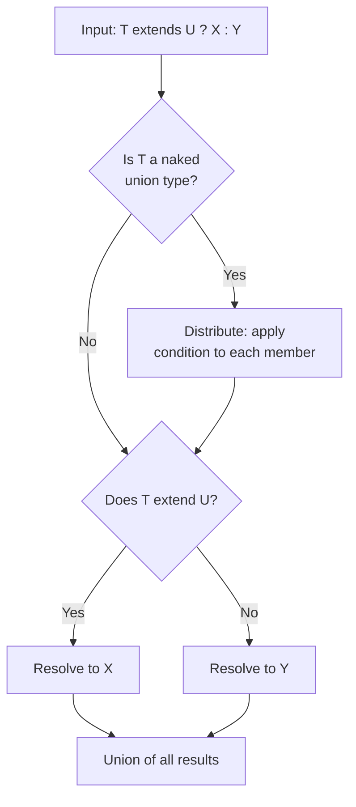
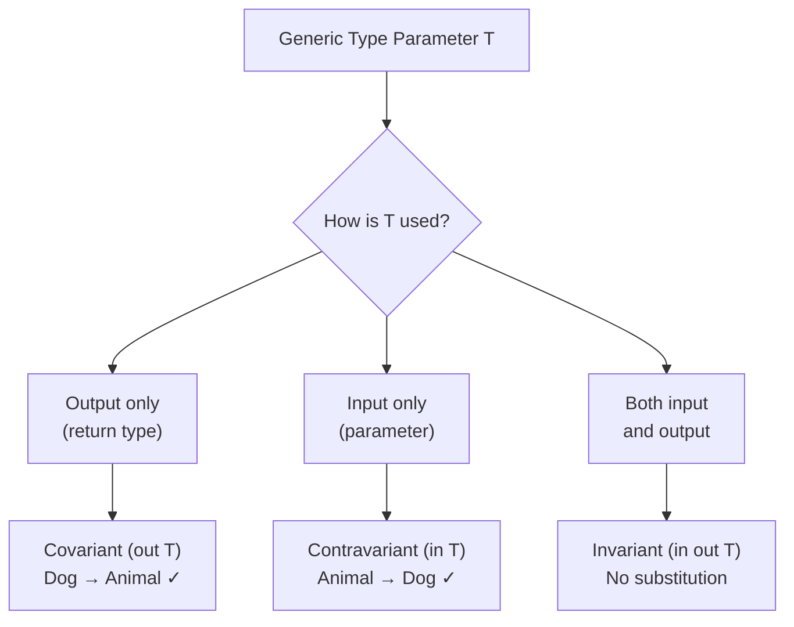

# 13 — TypeScript Advanced

> **TL;DR** — Master conditional types, `infer`, mapped types, template literals, branded types, variance, and recursive types. These are the tools that separate library authors from library consumers — and the topics that dominate senior/architect TypeScript interviews.

---

## 1. Conditional Types

Conditional types let you express **type-level if/else** logic. The syntax mirrors the ternary operator:

```typescript
type IsString<T> = T extends string ? "yes" : "no";

type A = IsString<string>;  // "yes"
type B = IsString<number>;  // "no"
```

### Distributive Conditional Types

When a conditional type acts on a **naked type parameter** (not wrapped in a tuple or array), it distributes over unions:

```typescript
type ToArray<T> = T extends any ? T[] : never;

type Distributed = ToArray<string | number>;
// string[] | number[]  — NOT (string | number)[]
```

To **prevent** distribution, wrap both sides in a tuple:

```typescript
type ToArrayNonDist<T> = [T] extends [any] ? T[] : never;

type NonDistributed = ToArrayNonDist<string | number>;
// (string | number)[]
```

### Practical Built-in Conditional Types

| Utility | Definition | Result |
|---|---|---|
| `Exclude<T, U>` | `T extends U ? never : T` | Remove members of `U` from `T` |
| `Extract<T, U>` | `T extends U ? T : never` | Keep only members assignable to `U` |
| `NonNullable<T>` | `T extends null \| undefined ? never : T` | Strip `null` and `undefined` |

```typescript
type Status = "active" | "inactive" | "banned";
type Allowed = Exclude<Status, "banned">; // "active" | "inactive"
```

### Type Resolution Flow



---

## 2. The `infer` Keyword

`infer` declares a type variable **inside** a conditional type's `extends` clause, letting you extract embedded types.

### Extracting Function Return Types

```typescript
type MyReturnType<T> = T extends (...args: any[]) => infer R ? R : never;

type R1 = MyReturnType<() => string>;         // string
type R2 = MyReturnType<(x: number) => boolean>; // boolean
```

### Extracting Function Parameters

```typescript
type MyParameters<T> = T extends (...args: infer P) => any ? P : never;

type P1 = MyParameters<(a: string, b: number) => void>; // [string, number]
```

### Promise Unwrapping

```typescript
type UnwrapPromise<T> = T extends Promise<infer U> ? U : T;

type X = UnwrapPromise<Promise<string>>;  // string
type Y = UnwrapPromise<number>;           // number
```

### Recursive Promise Unwrapping

```typescript
type DeepUnwrap<T> = T extends Promise<infer U> ? DeepUnwrap<U> : T;

type Deep = DeepUnwrap<Promise<Promise<Promise<number>>>>; // number
```

### Array Element Extraction

```typescript
type ElementOf<T> = T extends (infer E)[] ? E : never;

type El = ElementOf<string[]>; // string
```

### String Template Extraction

```typescript
type ExtractRouteParam<T> = T extends `${string}:${infer Param}/${infer Rest}`
  ? Param | ExtractRouteParam<`/${Rest}`>
  : T extends `${string}:${infer Param}`
    ? Param
    : never;

type Params = ExtractRouteParam<"/users/:userId/posts/:postId">;
// "userId" | "postId"
```

---

## 3. Mapped Types

Mapped types iterate over keys to produce new object types.

```typescript
type Readonly<T> = { readonly [K in keyof T]: T[K] };
type Partial<T>  = { [K in keyof T]?: T[K] };
```

### Modifier Control with `+` and `-`

```typescript
type Mutable<T> = { -readonly [K in keyof T]: T[K] };
type Required<T> = { [K in keyof T]-?: T[K] };
```

### Key Remapping with `as`

```typescript
type Getters<T> = {
  [K in keyof T as `get${Capitalize<string & K>}`]: () => T[K];
};

interface Person { name: string; age: number; }

type PersonGetters = Getters<Person>;
// { getName: () => string; getAge: () => number }
```

### Filtering Keys

```typescript
type OnlyStrings<T> = {
  [K in keyof T as T[K] extends string ? K : never]: T[K];
};

interface Mixed { id: number; name: string; email: string; }
type StringProps = OnlyStrings<Mixed>;
// { name: string; email: string }
```

### Template Literal Keys

```typescript
type EventMap<T extends string> = {
  [K in T as `on${Capitalize<K>}`]: (event: K) => void;
};

type MouseEvents = EventMap<"click" | "hover" | "drag">;
// { onClick: (event: "click") => void; onHover: ...; onDrag: ... }
```

---

## 4. Template Literal Types

TypeScript can manipulate strings at the **type level**.

### Intrinsic String Manipulation Types

| Type | Example | Result |
|---|---|---|
| `Uppercase<T>` | `Uppercase<"hello">` | `"HELLO"` |
| `Lowercase<T>` | `Lowercase<"HELLO">` | `"hello"` |
| `Capitalize<T>` | `Capitalize<"hello">` | `"Hello"` |
| `Uncapitalize<T>` | `Uncapitalize<"Hello">` | `"hello"` |

### Type-Safe Event System

```typescript
type EventName<T extends string> = `${T}Changed`;

type PropEvents<T> = {
  [K in keyof T & string as EventName<K>]: (newVal: T[K]) => void;
};

interface Config { theme: string; fontSize: number; }

type ConfigEvents = PropEvents<Config>;
// { themeChanged: (newVal: string) => void;
//   fontSizeChanged: (newVal: number) => void }
```

### Route Parameter Extraction

```typescript
type ExtractParams<T extends string> =
  T extends `${string}:${infer Param}/${infer Rest}`
    ? { [K in Param | keyof ExtractParams<Rest>]: string }
    : T extends `${string}:${infer Param}`
      ? { [K in Param]: string }
      : {};

type RouteParams = ExtractParams<"/api/users/:userId/posts/:postId">;
// { userId: string; postId: string }
```

### CamelCase to kebab-case

```typescript
type CamelToKebab<S extends string> =
  S extends `${infer First}${infer Rest}`
    ? Rest extends Uncapitalize<Rest>
      ? `${Lowercase<First>}${CamelToKebab<Rest>}`
      : `${Lowercase<First>}-${CamelToKebab<Rest>}`
    : S;

type Result = CamelToKebab<"backgroundColor">; // "background-color"
```

---

## 5. Type Guards and Assertion Functions

### User-Defined Type Guards (`is`)

```typescript
interface Fish { swim(): void; }
interface Bird { fly(): void; }

function isFish(animal: Fish | Bird): animal is Fish {
  return (animal as Fish).swim !== undefined;
}

function move(animal: Fish | Bird) {
  if (isFish(animal)) {
    animal.swim(); // narrowed to Fish
  } else {
    animal.fly();  // narrowed to Bird
  }
}
```

### Generic Type Guards

```typescript
function isDefined<T>(value: T | null | undefined): value is T {
  return value !== null && value !== undefined;
}

const values = [1, null, 2, undefined, 3];
const defined = values.filter(isDefined); // number[]
```

### Assertion Functions (`asserts`)

Assertion functions throw if a condition is falsy and narrow the type from that point forward:

```typescript
function assertIsString(val: unknown): asserts val is string {
  if (typeof val !== "string") {
    throw new Error(`Expected string, got ${typeof val}`);
  }
}

function processInput(input: unknown) {
  assertIsString(input);
  console.log(input.toUpperCase()); // input is string here
}
```

### Discriminated Unions (Best Practice)

```typescript
type Shape =
  | { kind: "circle"; radius: number }
  | { kind: "rect"; width: number; height: number };

function area(shape: Shape): number {
  switch (shape.kind) {
    case "circle": return Math.PI * shape.radius ** 2;
    case "rect":   return shape.width * shape.height;
  }
}
```

---

## 6. Branded / Opaque Types

Branded types add a phantom property to prevent accidentally mixing structurally identical primitives.

```typescript
declare const __brand: unique symbol;

type Brand<T, B extends string> = T & { readonly [__brand]: B };

type UserId  = Brand<string, "UserId">;
type OrderId = Brand<string, "OrderId">;

function fetchUser(id: UserId) { /* ... */ }

const userId = "u-123" as UserId;
const orderId = "o-456" as OrderId;

fetchUser(userId);  // OK
fetchUser(orderId); // Error: OrderId is not assignable to UserId
```

### Factory Functions for Safety

```typescript
function createUserId(raw: string): UserId {
  if (!raw.startsWith("u-")) throw new Error("Invalid user ID");
  return raw as UserId;
}

function createOrderId(raw: string): OrderId {
  if (!raw.startsWith("o-")) throw new Error("Invalid order ID");
  return raw as OrderId;
}
```

### Branded Numeric Types

```typescript
type Meters = Brand<number, "Meters">;
type Seconds = Brand<number, "Seconds">;
type MetersPerSecond = Brand<number, "MetersPerSecond">;

function speed(distance: Meters, time: Seconds): MetersPerSecond {
  return (distance / time) as unknown as MetersPerSecond;
}
```

---

## 7. Module Augmentation & Declaration Merging

### Extending Third-Party Types

```typescript
// extend Express Request
declare module "express" {
  interface Request {
    user?: { id: string; role: string };
  }
}
```

### Global Augmentation

```typescript
declare global {
  interface Window {
    analytics: { track(event: string, data?: unknown): void };
  }
}

export {}; // required to make this a module
```

### Declaration Merging (Interface Merging)

Interfaces with the same name in the same scope merge automatically:

```typescript
interface Config { apiUrl: string; }
interface Config { timeout: number; }

const config: Config = { apiUrl: "https://api.example.com", timeout: 5000 };
```

### Ambient `.d.ts` Declarations

```typescript
// types/env.d.ts
declare namespace NodeJS {
  interface ProcessEnv {
    DATABASE_URL: string;
    API_KEY: string;
    NODE_ENV: "development" | "production" | "test";
  }
}
```

---

## 8. Variance

Variance describes how subtyping between **container** types relates to subtyping between their **element** types.

| Variance | Direction | Keyword (TS 5+) | Example |
|---|---|---|---|
| Covariant | Same | `out T` | `Producer<Dog>` ⊂ `Producer<Animal>` |
| Contravariant | Reversed | `in T` | `Consumer<Animal>` ⊂ `Consumer<Dog>` |
| Invariant | Neither | `in out T` | `Mutable<Dog>` ≠ `Mutable<Animal>` |
| Bivariant | Both | — | Function params (legacy) |

### Variance Flow



### Explicit Variance Annotations (TS 4.7+)

```typescript
interface Producer<out T> {
  produce(): T;
}

interface Consumer<in T> {
  consume(value: T): void;
}

interface Transform<in T, out U> {
  process(input: T): U;
}
```

### Why It Matters

```typescript
class Animal { name = ""; }
class Dog extends Animal { bark() {} }

type Fn = (animal: Animal) => void;
const dogFn: Fn = (d: Dog) => d.bark(); // Unsafe! Fails at runtime with Cat

// With strictFunctionTypes, function parameters are contravariant:
// (Animal) => void  is NOT assignable to  (Dog) => void  ✓ safe
```

---

## 9. Recursive Types

### The JSON Type

```typescript
type JsonValue =
  | string
  | number
  | boolean
  | null
  | JsonValue[]
  | { [key: string]: JsonValue };
```

### Deep Readonly

```typescript
type DeepReadonly<T> =
  T extends (infer E)[]
    ? ReadonlyArray<DeepReadonly<E>>
    : T extends object
      ? { readonly [K in keyof T]: DeepReadonly<T[K]> }
      : T;

interface Nested { a: { b: { c: string }[] } }
type Frozen = DeepReadonly<Nested>;
// { readonly a: { readonly b: ReadonlyArray<{ readonly c: string }> } }
```

### Deep Partial

```typescript
type DeepPartial<T> =
  T extends object
    ? { [K in keyof T]?: DeepPartial<T[K]> }
    : T;
```

### Path Extraction from Nested Objects

```typescript
type Paths<T, Prefix extends string = ""> =
  T extends object
    ? {
        [K in keyof T & string]:
          | `${Prefix}${K}`
          | Paths<T[K], `${Prefix}${K}.`>
      }[keyof T & string]
    : never;

interface AppState {
  user: { name: string; address: { city: string; zip: string } };
  theme: string;
}

type AppPaths = Paths<AppState>;
// "user" | "user.name" | "user.address" | "user.address.city"
// | "user.address.zip" | "theme"
```

### Type-Safe Deep Get

```typescript
type GetByPath<T, P extends string> =
  P extends `${infer Key}.${infer Rest}`
    ? Key extends keyof T
      ? GetByPath<T[Key], Rest>
      : never
    : P extends keyof T
      ? T[P]
      : never;

type City = GetByPath<AppState, "user.address.city">; // string
```

---

## 10. Type Challenges

### Challenge 1: `MyPick` (Easy)

Implement `Pick` from scratch.

```typescript
// Your turn:
type MyPick<T, K extends keyof T> = { [P in K]: T[P] };

// Test:
interface Todo { title: string; description: string; done: boolean; }
type TodoPreview = MyPick<Todo, "title" | "done">;
// { title: string; done: boolean }
```

### Challenge 2: `LastOf` (Medium)

Extract the last element of a tuple.

```typescript
type LastOf<T extends any[]> =
  T extends [...infer _, infer L] ? L : never;

type L1 = LastOf<[1, 2, 3]>;    // 3
type L2 = LastOf<["a", "b"]>;   // "b"
```

### Challenge 3: `Flatten` (Medium)

Flatten a nested tuple one level deep.

```typescript
type Flatten<T extends any[]> =
  T extends [infer First, ...infer Rest]
    ? First extends any[]
      ? [...First, ...Flatten<Rest>]
      : [First, ...Flatten<Rest>]
    : [];

type F = Flatten<[1, [2, 3], [4, [5]]]>;
// [1, 2, 3, 4, [5]]
```

### Challenge 4: `TrimLeft` (Medium)

Remove leading whitespace from a string type.

```typescript
type Whitespace = " " | "\n" | "\t";

type TrimLeft<S extends string> =
  S extends `${Whitespace}${infer Rest}`
    ? TrimLeft<Rest>
    : S;

type Trimmed = TrimLeft<"   hello">; // "hello"
```

### Challenge 5: `ParseQueryString` (Hard)

Parse a URL query string into a typed record.

```typescript
type ParseQueryString<S extends string> =
  S extends `${infer Key}=${infer Value}&${infer Rest}`
    ? { [K in Key]: Value } & ParseQueryString<Rest>
    : S extends `${infer Key}=${infer Value}`
      ? { [K in Key]: Value }
      : {};

type QS = ParseQueryString<"name=John&age=30&role=admin">;
// { name: "John" } & { age: "30" } & { role: "admin" }

// Prettify the intersection:
type Prettify<T> = { [K in keyof T]: T[K] } & {};
type CleanQS = Prettify<QS>;
// { name: "John"; age: "30"; role: "admin" }
```

---

## Common Mistakes

| Mistake | Why It Fails | Fix |
|---|---|---|
| `type X = T extends string ? ...` without `T` being a type param | Conditional types need a generic parameter to distribute | Wrap in a generic: `type X<T> = T extends ...` |
| Using `infer` outside conditional types | `infer` only works in the `extends` clause | Always use inside `T extends ... infer U ? ... : ...` |
| Expecting `Partial<Nested>` to deep-partial | `Partial` is shallow | Use a custom `DeepPartial` recursive type |
| Mixing up `extends` as constraint vs condition | `<T extends string>` = constraint; `T extends string ?` = condition | Understand the two contexts |
| Forgetting distributive behavior with unions | `ToArray<A \| B>` gives `A[] \| B[]` not `(A \| B)[]` | Wrap in tuple `[T] extends [any]` to disable |
| Using branded types without factory functions | Raw `as Brand` casts skip validation | Always create through a validated constructor |
| Declaring `asserts` without throwing | Assertion functions must throw to narrow | Ensure every failing path throws |
| Infinite recursion in recursive types | No base case or excessive depth | Add explicit termination conditions; respect TS depth limits (~50) |

---

## Interview-Ready Answers

> **Q: What are conditional types and how does distribution work?**
> Conditional types use `T extends U ? X : Y` syntax for type-level branching. When `T` is a naked type parameter receiving a union, the condition distributes — it's applied to each union member individually and the results are re-combined. To disable distribution, wrap `T` in a tuple: `[T] extends [U]`.

> **Q: Explain `infer` with a real-world example.**
> `infer` declares a type variable inside a conditional's `extends` clause. For example, `T extends Promise<infer U> ? U : T` unwraps a `Promise` to its resolved type. You can infer from function parameters, return types, tuple positions, and even template literal strings. It's the backbone of utility types like `ReturnType`, `Parameters`, and `InstanceType`.

> **Q: How would you prevent mixing up UserId and OrderId if both are strings?**
> Use branded (opaque) types. Intersect `string` with a phantom property using a `unique symbol` as key: `type UserId = string & { readonly [brand]: "UserId" }`. Values must be created through factory functions that validate format, so raw strings can't accidentally slip through. The phantom property exists only at the type level — zero runtime cost.

> **Q: What is variance and why should I care?**
> Variance describes how generic subtyping relates to element subtyping. Covariant (`out T`) means `Box<Dog>` is assignable to `Box<Animal>` — safe for return positions. Contravariant (`in T`) reverses it — safe for parameter positions. With `strictFunctionTypes`, TS checks function params contravariantly, catching real bugs. TS 4.7+ added explicit `in`/`out` annotations for clarity and performance.

> **Q: What's the difference between `Partial<T>` and a deep partial?**
> `Partial<T>` only makes top-level properties optional. Nested objects remain fully required. A `DeepPartial` recursively applies optionality: if a property is an object, it recursively makes all its children optional too. You implement it with a recursive mapped type that checks `T extends object` before recursing.

> **Q: How do template literal types help build type-safe APIs?**
> Template literal types let you construct and pattern-match string types. You can enforce event naming conventions (`on${Capitalize<EventName>}`), extract route parameters (`/users/:id` → `{ id: string }`), or convert between casing styles. Combined with mapped types, they generate entire typed API surfaces from a single source of truth — like turning an interface's keys into getter/setter method signatures automatically.

> **Q: Walk me through how you'd type a `get(obj, path)` function for deeply nested access.**
> First define a `Paths<T>` recursive type that produces a union of all valid dot-separated paths. Then define `GetByPath<T, P>` that splits the path string with `infer` on `"."`, walks the type tree key by key, and returns the leaf type. The runtime implementation uses `path.split(".").reduce((acc, key) => acc[key], obj)`. The types ensure compile-time safety — invalid paths produce `never` and the return type matches the property at that path.

---

> Next → [14-typescript-patterns.md](14-typescript-patterns.md)
