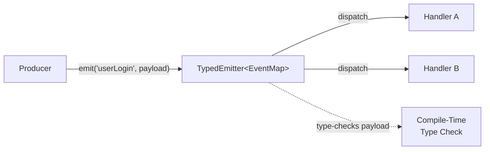
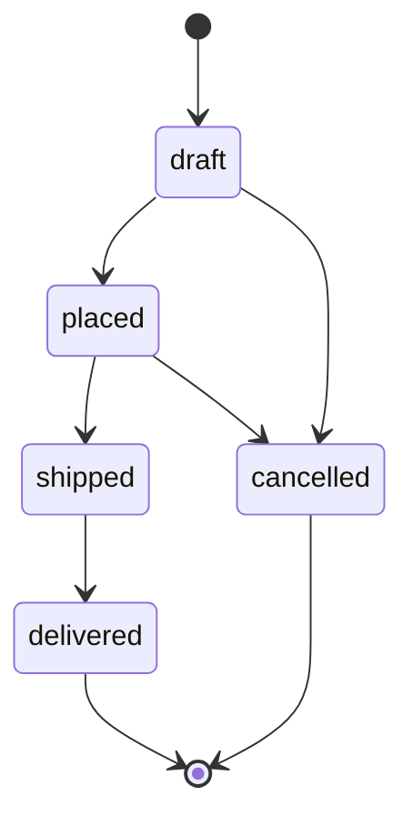

# 14 — TypeScript Patterns in Practice

> **TL;DR** — TypeScript's type system is powerful enough to encode business rules, enforce valid state transitions, and eliminate entire categories of runtime bugs. This chapter covers battle-tested patterns — from type-safe builders and event emitters to Result monads and state machines — that separate senior engineers from the rest.

---

## 1. Type-Safe Builder Pattern

The builder pattern becomes truly powerful when generics track which fields have been set, making the `build()` method available only when all required fields are present.

```typescript
type RequiredFields = 'name' | 'email' | 'role';

type BuilderState = { [K in RequiredFields]: boolean };

type AllTrue = { [K in RequiredFields]: true };

class UserBuilder<State extends BuilderState = { name: false; email: false; role: false }> {
  private data: Partial<{ name: string; email: string; role: string; bio: string }> = {};

  setName(name: string): UserBuilder<State & { name: true }> {
    this.data.name = name;
    return this as any;
  }

  setEmail(email: string): UserBuilder<State & { email: true }> {
    this.data.email = email;
    return this as any;
  }

  setRole(role: string): UserBuilder<State & { role: true }> {
    this.data.role = role;
    return this as any;
  }

  setBio(bio: string): UserBuilder<State> {
    this.data.bio = bio;
    return this as any;
  }

  build(this: UserBuilder<AllTrue>): Required<Pick<typeof this.data, RequiredFields>> {
    return this.data as any;
  }
}

const user = new UserBuilder()
  .setName('Alice')
  .setEmail('alice@example.com')
  .setRole('admin')
  .build(); // ✅ compiles

// new UserBuilder().setName('Alice').build(); // ❌ compile error
```

The key insight: each setter returns a **new type** where that field is marked `true`. The `build` method's `this` parameter constrains it to only be callable when all fields are `true`.

---

## 2. Exhaustive Switch / Check

The `assertNever` pattern guarantees at compile time that every member of a union is handled.

```typescript
type Shape =
  | { kind: 'circle'; radius: number }
  | { kind: 'rect'; width: number; height: number }
  | { kind: 'triangle'; base: number; height: number };

function assertNever(value: never, msg?: string): never {
  throw new Error(msg ?? `Unexpected value: ${JSON.stringify(value)}`);
}

function area(shape: Shape): number {
  switch (shape.kind) {
    case 'circle':
      return Math.PI * shape.radius ** 2;
    case 'rect':
      return shape.width * shape.height;
    case 'triangle':
      return 0.5 * shape.base * shape.height;
    default:
      return assertNever(shape);
  }
}
```

If someone adds `| { kind: 'pentagon'; side: number }` to `Shape`, the `default` branch now receives `{ kind: 'pentagon'; ... }` instead of `never` — an immediate compile error. This is **exhaustiveness checking**, and it scales to any discriminated union.

---

## 3. Type-Safe Event Emitter

A generic event emitter that enforces event names and their payload types at compile time.

```typescript
type EventMap = {
  userLogin: { userId: string; timestamp: number };
  pageView: { path: string; referrer?: string };
  error: { code: number; message: string };
};

class TypedEmitter<Events extends Record<string, unknown>> {
  private listeners = new Map<keyof Events, Set<Function>>();

  on<K extends keyof Events>(event: K, handler: (payload: Events[K]) => void): () => void {
    if (!this.listeners.has(event)) this.listeners.set(event, new Set());
    this.listeners.get(event)!.add(handler);
    return () => this.listeners.get(event)?.delete(handler);
  }

  emit<K extends keyof Events>(event: K, payload: Events[K]): void {
    this.listeners.get(event)?.forEach(fn => fn(payload));
  }
}

const bus = new TypedEmitter<EventMap>();

bus.on('userLogin', ({ userId, timestamp }) => {
  console.log(userId, timestamp); // fully typed
});

bus.emit('userLogin', { userId: '42', timestamp: Date.now() }); // ✅
// bus.emit('userLogin', { wrong: true }); // ❌ compile error
// bus.emit('unknown', {}); // ❌ compile error
```



---

## 4. Zod / Runtime Validation

TypeScript types vanish at runtime. Zod bridges the gap — define a schema once and infer the static type from it.

```typescript
import { z } from 'zod';

const UserSchema = z.object({
  id: z.string().uuid(),
  name: z.string().min(1),
  email: z.string().email(),
  role: z.enum(['admin', 'editor', 'viewer']),
  createdAt: z.coerce.date(),
});

type User = z.infer<typeof UserSchema>;
// { id: string; name: string; email: string; role: 'admin' | 'editor' | 'viewer'; createdAt: Date }

async function fetchUser(id: string): Promise<User> {
  const res = await fetch(`/api/users/${id}`);
  const json = await res.json();
  return UserSchema.parse(json); // throws ZodError if invalid
}
```

| Approach | Compile-Time Safety | Runtime Safety | Single Source of Truth |
|---|---|---|---|
| Interfaces only | ✅ | ❌ | ✅ |
| Manual validation | ❌ | ✅ | ❌ (duplicated) |
| Zod schema + infer | ✅ | ✅ | ✅ |

**Why runtime validation matters**: API responses, form inputs, localStorage, WebSocket messages, and third-party data are all `unknown` at the trust boundary. TypeScript's `as` cast is a *lie* — Zod makes it a **guarantee**.

---

## 5. Strict API Contracts

Model every API call as a discriminated union of possible states.

```typescript
type ApiState<T, E = Error> =
  | { status: 'idle' }
  | { status: 'loading' }
  | { status: 'success'; data: T }
  | { status: 'error'; error: E };

interface ApiClient {
  get<T>(url: string, schema: z.ZodType<T>): Promise<T>;
  post<Req, Res>(url: string, body: Req, schema: z.ZodType<Res>): Promise<Res>;
}

function createApiClient(baseUrl: string): ApiClient {
  return {
    async get<T>(url: string, schema: z.ZodType<T>): Promise<T> {
      const res = await fetch(`${baseUrl}${url}`);
      if (!res.ok) throw new ApiError(res.status, await res.text());
      return schema.parse(await res.json());
    },
    async post<Req, Res>(url: string, body: Req, schema: z.ZodType<Res>): Promise<Res> {
      const res = await fetch(`${baseUrl}${url}`, {
        method: 'POST',
        headers: { 'Content-Type': 'application/json' },
        body: JSON.stringify(body),
      });
      if (!res.ok) throw new ApiError(res.status, await res.text());
      return schema.parse(await res.json());
    },
  };
}
```

Usage with Angular signals:

```typescript
const state = signal<ApiState<User>>({ status: 'idle' });

async function loadUser(id: string) {
  state.set({ status: 'loading' });
  try {
    const data = await api.get(`/users/${id}`, UserSchema);
    state.set({ status: 'success', data });
  } catch (e) {
    state.set({ status: 'error', error: e as Error });
  }
}
```

Consumers can then exhaustively handle every state in the template — no ambiguous `data | undefined` checks.

---

## 6. Result / Either Pattern

Replace `try/catch` with a typed `Result` that makes error handling explicit in the type signature.

```typescript
type Result<T, E = Error> =
  | { ok: true; value: T }
  | { ok: false; error: E };

function Ok<T>(value: T): Result<T, never> {
  return { ok: true, value };
}

function Err<E>(error: E): Result<never, E> {
  return { ok: false, error };
}

function map<T, U, E>(result: Result<T, E>, fn: (val: T) => U): Result<U, E> {
  return result.ok ? Ok(fn(result.value)) : result;
}

function flatMap<T, U, E>(result: Result<T, E>, fn: (val: T) => Result<U, E>): Result<U, E> {
  return result.ok ? fn(result.value) : result;
}
```

Real-world usage:

```typescript
type ParseError = { type: 'parse'; raw: string };
type ValidationError = { type: 'validation'; field: string; message: string };
type AppError = ParseError | ValidationError;

function parseAge(input: string): Result<number, ParseError> {
  const n = Number(input);
  return Number.isNaN(n) ? Err({ type: 'parse', raw: input }) : Ok(n);
}

function validateAge(age: number): Result<number, ValidationError> {
  return age >= 0 && age <= 150
    ? Ok(age)
    : Err({ type: 'validation', field: 'age', message: 'Age out of range' });
}

const result = flatMap(parseAge('25'), validateAge);

if (result.ok) {
  console.log(`Valid age: ${result.value}`);
} else {
  switch (result.error.type) {
    case 'parse': console.error(`Cannot parse: ${result.error.raw}`); break;
    case 'validation': console.error(result.error.message); break;
    default: assertNever(result.error);
  }
}
```

The caller **cannot forget** to handle the error — the type system forces the check before accessing `.value`.

---

## 7. Dependency Injection with Types

Token-based DI in plain TypeScript, mirroring Angular's `inject()` philosophy.

```typescript
type Token<T> = { __brand: T; key: symbol; };

function createToken<T>(description: string): Token<T> {
  return { key: Symbol(description) } as Token<T>;
}

class Container {
  private registry = new Map<symbol, unknown>();

  register<T>(token: Token<T>, value: T): void {
    this.registry.set(token.key, value);
  }

  resolve<T>(token: Token<T>): T {
    const value = this.registry.get(token.key);
    if (value === undefined) throw new Error(`No provider for ${token.key.toString()}`);
    return value as T;
  }
}

// Define tokens
const LOG_TOKEN = createToken<Logger>('Logger');
const DB_TOKEN = createToken<Database>('Database');

// Register
const container = new Container();
container.register(LOG_TOKEN, new ConsoleLogger());
container.register(DB_TOKEN, new PostgresDB(config));

// Resolve — fully typed, no casting at call site
const logger = container.resolve(LOG_TOKEN); // Logger
const db = container.resolve(DB_TOKEN);      // Database
```

Angular's `inject()` does the same thing under the hood: `InjectionToken<T>` carries the generic so the injector returns `T` without a cast.

---

## 8. State Machines

Discriminated unions + mapped types encode which transitions are valid for each state.

```typescript
type OrderState =
  | { status: 'draft' }
  | { status: 'placed'; orderId: string }
  | { status: 'shipped'; orderId: string; trackingNo: string }
  | { status: 'delivered'; orderId: string; deliveredAt: Date }
  | { status: 'cancelled'; reason: string };

type TransitionMap = {
  draft: 'placed' | 'cancelled';
  placed: 'shipped' | 'cancelled';
  shipped: 'delivered';
  delivered: never;
  cancelled: never;
};

function transition<
  From extends OrderState['status'],
  To extends TransitionMap[From]
>(
  current: Extract<OrderState, { status: From }>,
  next: Extract<OrderState, { status: To }>
): Extract<OrderState, { status: To }> {
  console.log(`${current.status} → ${next.status}`);
  return next;
}

let order: OrderState = { status: 'draft' };

// ✅ Valid transitions
order = transition(
  order as Extract<OrderState, { status: 'draft' }>,
  { status: 'placed', orderId: 'ORD-001' }
);

// ❌ Would not compile — 'draft' → 'delivered' is not in TransitionMap
// transition({ status: 'draft' }, { status: 'delivered', orderId: 'X', deliveredAt: new Date() });
```



The `TransitionMap` acts as a compile-time guard: the type system rejects any transition not explicitly listed. In production, this pattern prevents invalid state changes like shipping a cancelled order.

---

## 9. Type-Safe Routing

Extract route parameters directly from string literal types.

```typescript
type ExtractParams<T extends string> =
  T extends `${string}:${infer Param}/${infer Rest}`
    ? Param | ExtractParams<Rest>
    : T extends `${string}:${infer Param}`
      ? Param
      : never;

type Params<T extends string> = { [K in ExtractParams<T>]: string };

// Test it
type UserRoute = '/users/:userId/posts/:postId';
type UserParams = Params<UserRoute>;
// { userId: string; postId: string }

function navigate<T extends string>(
  route: T,
  params: Params<T>
): string {
  return (route as string).replace(/:(\w+)/g, (_, key) => params[key as keyof typeof params]);
}

const url = navigate('/users/:userId/posts/:postId', {
  userId: '42',
  postId: '101',
}); // "/users/42/posts/101"

// navigate('/users/:userId', { wrong: '1' }); // ❌ compile error
```

This is the same technique Angular Router and tRPC use internally — template literal types parse the route string at compile time.

---

## 10. Configuration Pattern

Merge partial user config with deeply nested defaults using recursive mapped types.

```typescript
type DeepPartial<T> = {
  [K in keyof T]?: T[K] extends object ? DeepPartial<T[K]> : T[K];
};

type DeepRequired<T> = {
  [K in keyof T]-?: T[K] extends object ? DeepRequired<T[K]> : T[K];
};

interface AppConfig {
  server: { port: number; host: string; cors: { origins: string[]; credentials: boolean } };
  logging: { level: 'debug' | 'info' | 'warn' | 'error'; pretty: boolean };
  features: { darkMode: boolean; betaAccess: boolean };
}

const DEFAULTS: DeepRequired<AppConfig> = {
  server: { port: 3000, host: 'localhost', cors: { origins: ['*'], credentials: false } },
  logging: { level: 'info', pretty: false },
  features: { darkMode: false, betaAccess: false },
};

function deepMerge<T extends Record<string, any>>(target: T, source: DeepPartial<T>): T {
  const result = { ...target };
  for (const key of Object.keys(source) as (keyof T)[]) {
    const val = source[key];
    if (val && typeof val === 'object' && !Array.isArray(val)) {
      result[key] = deepMerge(result[key] as any, val as any);
    } else if (val !== undefined) {
      result[key] = val as T[keyof T];
    }
  }
  return result;
}

function createConfig(overrides: DeepPartial<AppConfig>): DeepRequired<AppConfig> {
  return deepMerge(DEFAULTS, overrides);
}

const config = createConfig({
  server: { port: 8080 },
  features: { betaAccess: true },
});
// config.server.host === 'localhost' (default preserved)
// config.server.port === 8080 (overridden)
```

---

## Common Mistakes

| Mistake | Why It's Wrong | Fix |
|---|---|---|
| Using `as` to cast API responses | Bypasses type checking entirely | Validate with Zod or a runtime guard |
| `any` in generic constraints | Destroys inference downstream | Use `unknown` and narrow explicitly |
| Not using `assertNever` in switch | New union members silently fall through | Always add a `default: assertNever(x)` |
| Throwing strings instead of typed errors | Catch blocks get `unknown`, no structure | Use `Result<T, E>` or custom error classes |
| Overusing enums | Enums generate runtime code, don't narrow well | Prefer string literal unions |
| Mutable state in DI singletons | Shared mutable state causes race conditions | Return new instances or use immutable patterns |
| Ignoring `strictNullChecks` | Entire categories of bugs reappear | Always enable `strict: true` in tsconfig |
| Builder without state tracking | `build()` callable with missing fields | Use generic state parameter as shown above |

---

## Interview-Ready Answers

> **Q: How does the `assertNever` pattern work, and when would you use it?**
> It leverages TypeScript's `never` type — the bottom type that no value can inhabit. In a switch over a discriminated union, if all cases are handled, the `default` branch receives `never`. If a new variant is added and not handled, the value is no longer `never`, causing a compile error. Use it anywhere you exhaustively match a union: reducers, serializers, API response handlers.

> **Q: Why would you choose `Result<T, E>` over try/catch?**
> `Result` makes errors part of the function signature — callers cannot ignore them. With try/catch, errors are invisible in the type system: `function parse(s: string): number` gives no hint it can fail. `function parse(s: string): Result<number, ParseError>` forces handling. It also composes better via `map`/`flatMap`, avoids stack unwinding overhead, and makes testing deterministic — no need for `expect(...).toThrow()`.

> **Q: Explain how `z.infer` achieves single-source-of-truth for types.**
> Zod schemas are runtime objects that carry their structure in the type system via generics. `z.infer<typeof Schema>` extracts the output type from the schema's generic parameter. This means you define shape once (the schema) and derive the static type from it — no manual interface to keep in sync. Changes to the schema automatically update the inferred type.

> **Q: How would you implement type-safe routing in a framework?**
> Use template literal types to parse route patterns like `'/users/:id/posts/:postId'`. The type `ExtractParams` recursively matches `:param` segments and produces a union of parameter names. A `navigate` function then requires an object whose keys match those extracted params. This gives autocomplete and compile-time errors if a param is missing or mistyped — the same approach Angular Router and tRPC use internally.

> **Q: What's the advantage of encoding state machines in the type system?**
> It makes invalid state transitions unrepresentable. A `TransitionMap` type constrains which target states are reachable from each source state. The compiler rejects code that tries to skip steps (e.g., `draft → delivered`) before it ever runs. In production, this eliminates an entire class of logic bugs — especially in order processing, auth flows, and UI wizards — and makes the valid flow self-documenting in the type definitions.

> **Q: How does the Builder pattern differ in TypeScript vs classical OOP?**
> Classical builders rely on runtime checks: `if (!name) throw`. TypeScript builders use generic state tracking — each setter returns `Builder<State & { name: true }>`, and `build()` is only callable on `Builder<AllTrue>`. The error surfaces at compile time, not in a test or production log. This is a zero-cost abstraction: the generics are erased at runtime, but the safety is enforced during development.

---

> Next → [15-error-handling-debugging.md](15-error-handling-debugging.md)
