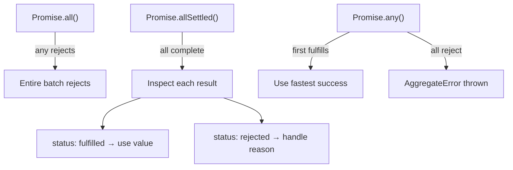
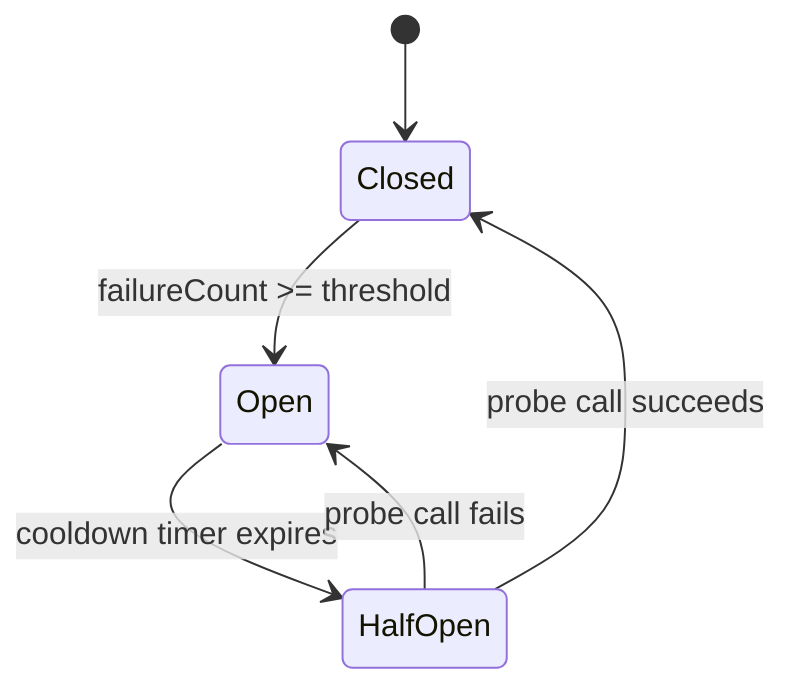

# 15 — Error Handling & Debugging

> **TL;DR** — Robust error handling separates production-grade code from prototypes. Master the native error hierarchy, build custom error classes with `Error.cause`, handle async failures gracefully, and leverage DevTools like a surgeon — not a shotgun.

---

## 1. The Error Type Hierarchy

JavaScript ships a family of built-in error constructors, all inheriting from `Error`.

| Error Type | Triggered When |
|---|---|
| `Error` | Generic base — used for custom errors |
| `TypeError` | Operation on wrong type (`null.foo`, calling non-function) |
| `ReferenceError` | Accessing undeclared variable |
| `SyntaxError` | Parsing invalid code (`JSON.parse('{bad}')`) |
| `RangeError` | Numeric value out of range (`new Array(-1)`) |
| `URIError` | Malformed URI (`decodeURI('%')`) |
| `EvalError` | Legacy — rarely thrown in modern engines |
| `AggregateError` | `Promise.any()` when all promises reject |
| `DOMException` | Browser API errors (e.g., `AbortController.abort()`) |

```javascript
try {
  JSON.parse('not json');
} catch (e) {
  console.log(e instanceof SyntaxError); // true
  console.log(e.message);                // Unexpected token 'o'...
  console.log(e.stack);                  // full stack trace string
}
```

Every `Error` instance carries three key properties: `message`, `name`, and `stack`. The `stack` property is non-standard but universally supported.

---

## 2. Custom Error Classes

Production codebases need domain-specific errors with machine-readable codes and causal chains.

```javascript
class AppError extends Error {
  constructor(message, { code, cause, statusCode = 500 } = {}) {
    super(message, { cause }); // ES2022 cause chaining
    this.name = 'AppError';
    this.code = code;
    this.statusCode = statusCode;
  }
}

class ValidationError extends AppError {
  constructor(field, message, options = {}) {
    super(message, { ...options, code: 'VALIDATION_ERROR', statusCode: 400 });
    this.name = 'ValidationError';
    this.field = field;
  }
}

// Usage with Error.cause for chaining
try {
  const data = JSON.parse(rawInput);
} catch (parseErr) {
  throw new ValidationError('payload', 'Invalid JSON body', { cause: parseErr });
}
```

**Why `Error.cause` matters (ES2022):** Before `cause`, developers lost the original stack trace when wrapping errors. Now the full chain is preserved and inspectable:

```javascript
catch (e) {
  console.log(e.message);       // "Invalid JSON body"
  console.log(e.cause.message); // "Unexpected token..."
  console.log(e.cause.stack);   // original parse error stack
}
```

---

## 3. try / catch / finally Mechanics

```javascript
function readConfig(path) {
  let handle;
  try {
    handle = openFile(path);
    return parseConfig(handle); // return executes, but finally runs first
  } catch (e) {
    if (e instanceof SyntaxError) {
      return getDefaultConfig(); // conditional recovery
    }
    throw e; // re-throw unknown errors — never swallow silently
  } finally {
    handle?.close(); // ALWAYS runs — even after return or throw
  }
}
```

**Performance note:** A `try` block with no thrown error has near-zero cost in V8. The expensive path is *catching* — engines de-optimize the catch scope. Keep catch blocks lean.

**`finally` guarantees:** The `finally` block runs after `try` or `catch` completes — even if either contains a `return`. If `finally` itself has a `return`, it overrides the previous return value (this is a common bug source).

```javascript
function gotcha() {
  try {
    return 'from try';
  } finally {
    return 'from finally'; // ⚠️ this wins — silently overrides
  }
}
gotcha(); // "from finally"
```

---

## 4. Error Handling in Async Code

Unhandled promise rejections are the async equivalent of uncaught exceptions.

```javascript
// ❌ Silent failure — rejection is never caught
async function fetchUser(id) {
  const res = await fetch(`/api/users/${id}`);
  if (!res.ok) throw new AppError('User fetch failed', { code: 'FETCH_ERROR' });
  return res.json();
}
fetchUser(42); // no .catch(), no try/catch wrapping the await

// ✅ Always handle at the call boundary
try {
  const user = await fetchUser(42);
} catch (e) {
  logger.error('Failed to load user', { error: e, userId: 42 });
}
```

### Global Rejection Handlers

```javascript
// Browser
window.addEventListener('unhandledrejection', (event) => {
  event.preventDefault(); // prevents default console error
  reportError(event.reason);
});

// Node.js
process.on('unhandledRejection', (reason, promise) => {
  logger.fatal('Unhandled rejection', { reason });
  process.exit(1); // fail fast in production
});
```

### Partial Failure with `Promise.allSettled`

```javascript
const results = await Promise.allSettled([
  fetchUser(1),
  fetchUser(2),
  fetchUser(999), // this one fails
]);

const users = results
  .filter(r => r.status === 'fulfilled')
  .map(r => r.value);

const errors = results
  .filter(r => r.status === 'rejected')
  .map(r => r.reason);

// Process successes, log failures — don't let one bad call kill the batch
```



---

## 5. Structured Error Handling

### Global Error Handler (Browser)

```javascript
window.addEventListener('error', (event) => {
  reportToService({
    message: event.message,
    source: event.filename,
    line: event.lineno,
    col: event.colno,
    stack: event.error?.stack,
  });
});
```

### Centralized Error Logger

```javascript
class ErrorReporter {
  #queue = [];
  #flushInterval;

  constructor(endpoint, { batchSize = 10, flushMs = 5000 } = {}) {
    this.endpoint = endpoint;
    this.batchSize = batchSize;
    this.#flushInterval = setInterval(() => this.flush(), flushMs);
  }

  capture(error, context = {}) {
    this.#queue.push({
      message: error.message,
      stack: error.stack,
      code: error.code,
      cause: error.cause?.message,
      context,
      timestamp: Date.now(),
    });
    if (this.#queue.length >= this.batchSize) this.flush();
  }

  async flush() {
    if (!this.#queue.length) return;
    const batch = this.#queue.splice(0);
    try {
      await fetch(this.endpoint, {
        method: 'POST',
        body: JSON.stringify(batch),
        keepalive: true, // survives page unload
      });
    } catch {
      this.#queue.unshift(...batch); // re-queue on failure
    }
  }
}
```

---

## 6. Error Handling Strategies

### Fail Fast

Validate inputs at the boundary. Throw immediately on invariant violations rather than letting corrupt state propagate.

```javascript
function transferFunds(from, to, amount) {
  if (!from || !to) throw new AppError('Accounts required', { code: 'INVALID_ARGS' });
  if (amount <= 0) throw new RangeError('Amount must be positive');
  if (from.balance < amount) throw new AppError('Insufficient funds', { code: 'NSF' });
  // proceed only when all invariants hold
}
```

### Retry with Exponential Backoff

```javascript
async function withRetry(fn, { maxAttempts = 3, baseMs = 300 } = {}) {
  for (let attempt = 1; attempt <= maxAttempts; attempt++) {
    try {
      return await fn();
    } catch (e) {
      if (attempt === maxAttempts) throw e;
      const jitter = Math.random() * 100;
      const delay = baseMs * 2 ** (attempt - 1) + jitter;
      await new Promise(r => setTimeout(r, delay));
    }
  }
}

const data = await withRetry(() => fetch('/api/flaky-endpoint').then(r => r.json()));
```

### Circuit Breaker Pattern

Prevents cascading failures by short-circuiting calls to a failing dependency.



```javascript
class CircuitBreaker {
  #state = 'CLOSED';
  #failures = 0;
  #nextAttempt = 0;

  constructor(fn, { threshold = 5, cooldownMs = 30000 } = {}) {
    this.fn = fn;
    this.threshold = threshold;
    this.cooldownMs = cooldownMs;
  }

  async call(...args) {
    if (this.#state === 'OPEN') {
      if (Date.now() < this.#nextAttempt) {
        throw new AppError('Circuit open — call blocked', { code: 'CIRCUIT_OPEN' });
      }
      this.#state = 'HALF_OPEN';
    }

    try {
      const result = await this.fn(...args);
      this.#reset();
      return result;
    } catch (e) {
      this.#recordFailure();
      throw e;
    }
  }

  #reset() {
    this.#state = 'CLOSED';
    this.#failures = 0;
  }

  #recordFailure() {
    this.#failures++;
    if (this.#failures >= this.threshold) {
      this.#state = 'OPEN';
      this.#nextAttempt = Date.now() + this.cooldownMs;
    }
  }
}
```

---

## 7. Source Maps

Source maps create a mapping from minified/transpiled code back to the original source.

| Aspect | Detail |
|---|---|
| Format | JSON with `mappings` field using VLQ-encoded segments |
| Link header | `//# sourceMappingURL=app.js.map` at end of bundle |
| Hidden source maps | Upload `.map` to error service, omit from public server |
| Security | Never ship source maps publicly in production — they expose your entire codebase |

DevTools automatically fetch and apply source maps, letting you set breakpoints in original TypeScript/ES modules even when the browser runs a single minified bundle.

---

## 8. Chrome DevTools Debugging

### Breakpoint Types

| Type | How to Set | Use Case |
|---|---|---|
| Line | Click gutter | Pause at specific line |
| Conditional | Right-click gutter → "Add conditional" | Pause only when expression is truthy |
| Logpoint | Right-click gutter → "Add logpoint" | Log without pausing — no `console.log` litter |
| DOM | Elements panel → "Break on..." | Pause on subtree/attribute modification |
| XHR/Fetch | Sources → XHR Breakpoints | Pause when URL matches pattern |
| Exception | Sources → ⏸ icon | Pause on caught/uncaught exceptions |
| Event Listener | Sources → Event Listener Breakpoints | Pause on click, keydown, etc. |

### The `debugger` Statement

```javascript
function processOrder(order) {
  if (order.total > 10000) {
    debugger; // opens DevTools and pauses here — remove before committing
  }
  return submitOrder(order);
}
```

### Call Stack Inspection

When paused, the **Call Stack** panel shows the execution path. Use **Restart Frame** to re-execute a function without reloading. Async stacks are stitched together so you can trace through `await` boundaries.

---

## 9. `console` Beyond `log`

```javascript
// Structured table output
console.table([
  { name: 'Alice', role: 'admin' },
  { name: 'Bob', role: 'viewer' },
]);

// Grouped output
console.group('User Auth Flow');
console.log('Step 1: validate token');
console.log('Step 2: fetch permissions');
console.groupEnd();

// Timing
console.time('dataLoad');
await loadData();
console.timeEnd('dataLoad'); // dataLoad: 142.3ms

// Stack trace snapshot
console.trace('Reached critical path');

// Assertion (logs only on failure)
console.assert(user.role === 'admin', 'Expected admin role', user);

// DOM element inspection
console.dir(document.body, { depth: 2 });
```

| Method | Purpose |
|---|---|
| `console.table()` | Display arrays/objects as sortable table |
| `console.group()` / `groupEnd()` | Collapsible log sections |
| `console.time()` / `timeEnd()` | Measure execution duration |
| `console.trace()` | Print stack trace without throwing |
| `console.assert()` | Log only when assertion fails |
| `console.dir()` | Inspect object properties (not HTML representation) |
| `console.count()` | Count how many times a label is hit |

---

## 10. Logging Best Practices

**Structured logging** — Emit JSON objects, not interpolated strings. This makes logs searchable and parseable by tools like ELK, Datadog, and CloudWatch.

```javascript
// ❌ Unstructured
console.log(`User ${id} failed to login at ${new Date()}`);

// ✅ Structured
logger.warn({
  event: 'LOGIN_FAILURE',
  userId: id,
  timestamp: Date.now(),
  ip: request.ip,        // useful for forensics
  // ⚠️ NEVER log: password, tokens, SSN, full credit card numbers
});
```

**Log levels in production:**

| Level | When to Use |
|---|---|
| `fatal` | App cannot continue — process exit imminent |
| `error` | Operation failed — needs attention |
| `warn` | Degraded but functional — retry succeeded, fallback used |
| `info` | Significant business events — user created, order placed |
| `debug` | Diagnostic detail — disabled in prod by default |

**PII rules:** Strip or mask personally identifiable information before logging. Log user IDs, never full names or emails in high-volume streams.

---

## Common Mistakes

1. **Swallowing errors silently** — Empty `catch {}` blocks hide bugs. At minimum, log the error.
2. **Catching too broadly** — Wrapping 200 lines in one `try` makes it impossible to know which operation failed.
3. **Returning in `finally`** — Overrides the value from `try` or `catch` without warning.
4. **Forgetting async error boundaries** — An `async` function without a caller-side `catch` produces an unhandled rejection.
5. **Logging sensitive data** — Stack traces can include tokens from closure variables. Sanitize before shipping to external services.
6. **Using `throw "string"`** — Thrown strings have no stack trace. Always throw `Error` instances.
7. **Not using `Error.cause`** — Wrapping errors without `cause` destroys the original stack, making root-cause analysis impossible.

---

## Interview-Ready Answers

> **Q: What is the difference between `throw new Error()` and `throw "error"`?**
> `throw new Error()` creates an object with `message`, `name`, and `stack` properties — essential for debugging. Throwing a raw string loses the stack trace entirely. Always throw `Error` instances or subclasses.

> **Q: How does `Error.cause` work and why is it important?**
> Introduced in ES2022, you pass `{ cause: originalError }` as the second argument to `new Error()`. It preserves the original error's stack trace while letting you add domain context. This creates a chain: `e.cause.cause...` that tools can walk for root-cause analysis.

> **Q: How would you handle partial failures in a batch of async operations?**
> Use `Promise.allSettled()` instead of `Promise.all()`. It waits for all promises and returns an array of `{ status, value/reason }` objects. Process successes, collect and log failures, and decide whether the partial result is acceptable for the business operation.

> **Q: Explain the circuit breaker pattern in frontend code.**
> A circuit breaker tracks consecutive failures to a dependency. After a threshold, it "opens" and short-circuits calls immediately (returning a cached response or error) instead of hammering a downed service. After a cooldown, it allows one probe call — if it succeeds, the circuit "closes" and normal traffic resumes. This prevents cascading failures and reduces recovery time.

> **Q: What happens if you `return` inside a `finally` block?**
> The `finally` return silently overrides any value returned from `try` or `catch`. This is a well-known gotcha — `finally` should be reserved for cleanup (closing handles, clearing timers), never for returning values.

> **Q: How do you debug minified production code?**
> Use source maps. The build tool generates a `.map` file that maps minified positions back to original source. In production, upload source maps to your error tracking service (Sentry, Datadog) but don't serve them publicly. DevTools and error services decode stack traces automatically when maps are available.

---

> Next → [16-interview-qa.md](16-interview-qa.md)
