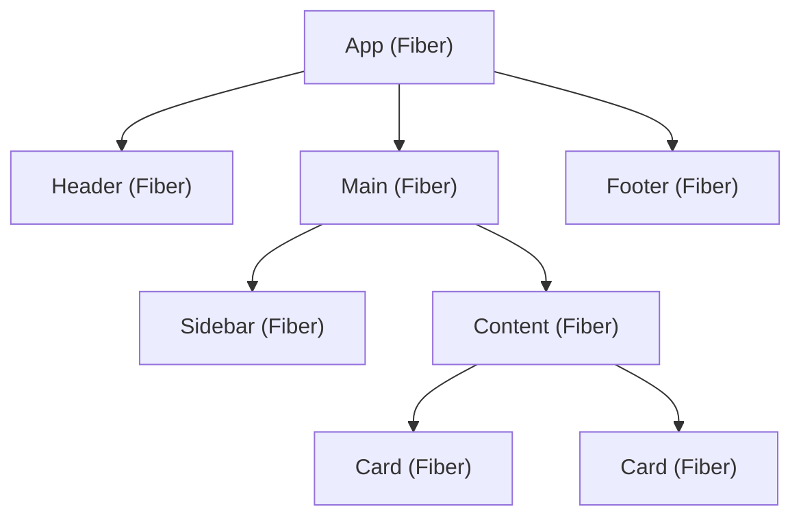

# 02 — Rendering & Reconciliation

> **TL;DR:** React uses a Virtual DOM diffing algorithm powered by the Fiber architecture. Fiber breaks rendering into interruptible work units with priority lanes, enabling concurrent features like `startTransition` and `useDeferredValue`. Understanding render phase vs commit phase is the key to debugging performance.

---

## 1. The Mental Model — What Happens When State Changes?

```
setState()
  │
  ▼
Render Phase (pure, can be interrupted)
  ├── React calls your component function
  ├── Produces new React element tree (Virtual DOM)
  └── Diffs new tree against current Fiber tree
  │
  ▼
Reconciliation
  ├── Compares old Fiber nodes with new elements
  ├── Marks nodes as Placement / Update / Deletion
  └── Builds a "work-in-progress" Fiber tree
  │
  ▼
Commit Phase (synchronous, cannot be interrupted)
  ├── Applies DOM mutations in one batch
  ├── Calls useLayoutEffect
  ├── Browser paints
  └── Calls useEffect (async, after paint)
```

> **Critical distinction:** The render phase is pure computation (no side effects). The commit phase touches the real DOM. React can throw away render-phase work and restart — it can never undo commit-phase work.

---

## 2. Virtual DOM — Why It Exists

The Virtual DOM is a lightweight JavaScript representation of the real DOM:

```tsx
// JSX you write
<div className="card">
  <h2>{title}</h2>
  <p>{description}</p>
</div>

// React element tree (Virtual DOM) produced
{
  type: 'div',
  props: {
    className: 'card',
    children: [
      { type: 'h2', props: { children: title } },
      { type: 'p', props: { children: description } }
    ]
  }
}
```

**Why not update the real DOM directly?**
- DOM operations are expensive (layout recalculation, paint, composite)
- Batching multiple changes into one DOM update is faster
- Diffing in JS is O(n) — diffing in DOM requires reading layout (forced reflows)
- Enables cross-platform rendering (React Native, server-side)

**What the Virtual DOM is NOT:**
- It is not "faster than the DOM" — it's an abstraction that enables smart batching
- It is not a shadow DOM (that's a browser API for encapsulation)
- It is not free — diffing has a cost, which is why memoization matters

---

## 3. React Fiber Architecture

Fiber is React's reconciliation engine, introduced in React 16. It replaced the old synchronous "stack reconciler" with an interruptible, priority-based system.

### What is a Fiber?

A Fiber is a JavaScript object representing a unit of work. Each component instance gets one Fiber node.

```
Fiber Node {
  type          → Component function or DOM tag ('div', 'span')
  key           → Reconciliation identity
  stateNode     → DOM node (for host components) or component instance
  child         → First child Fiber
  sibling       → Next sibling Fiber
  return        → Parent Fiber
  pendingProps  → New props to apply
  memoizedProps → Props from last render
  memoizedState → State from last render (linked list of hooks)
  flags         → Side effect flags (Placement, Update, Deletion)
  lanes         → Priority bits for this work
}
```

### Fiber Tree Structure



Fibers are linked via `child`, `sibling`, and `return` pointers — forming a singly-linked list that can be traversed iteratively (no recursion, no stack overflow).

### Double Buffering

React maintains two Fiber trees:
- **Current tree** — what's on screen right now
- **Work-in-progress (WIP) tree** — being built during the render phase

When the WIP tree is complete, React swaps the pointer. The old current becomes reusable memory for the next render. This is "double buffering" — the same technique used in game rendering.

---

## 4. Reconciliation Algorithm

When React re-renders, it must figure out the minimum set of DOM changes. Here's how it diffs:

### Rule 1: Different Types → Full Replacement

```tsx
// Before                    // After
<div><Counter /></div>   →  <span><Counter /></span>
```
React destroys the entire `<div>` subtree (including `<Counter>` state) and builds a new `<span>` subtree from scratch.

### Rule 2: Same Type → Update Props

```tsx
// Before                         // After
<div className="old" />       →  <div className="new" />
```
React keeps the DOM node, only updates the changed attribute.

### Rule 3: Keys Identify Elements in Lists

```tsx
// Without key — React has no identity signal
{items.map((item) => <Card title={item.title} />)}

// With key — React can track, reorder, and preserve state
{items.map((item) => <Card key={item.id} title={item.title} />)}
```

**Why keys matter for performance:**

| Scenario | Without Key | With Stable Key |
|----------|-------------|-----------------|
| Prepend item to list | Re-renders ALL items (index shifted) | Re-renders only new item |
| Reorder items | Destroys and recreates DOM nodes | Moves existing DOM nodes |
| Remove middle item | Re-renders all items after removal | Removes only that item |

> **Interview tip:** Never use array index as key for dynamic lists. Index-based keys cause bugs when items are reordered, inserted, or removed — React reuses the wrong component instances.

---

## 5. Concurrent Rendering

Concurrent rendering is React's ability to prepare multiple UI versions simultaneously and interrupt low-priority work to handle urgent updates.

### Priority Lanes

React 18+ uses a lane-based priority system (31 bit lanes):

| Lane | Priority | Example |
|------|----------|---------|
| SyncLane | Immediate | `flushSync()`, discrete events (click, keypress) |
| InputContinuousLane | High | Continuous events (mousemove, scroll) |
| DefaultLane | Normal | `setState()` in event handlers |
| TransitionLane | Low | `startTransition()` updates |
| IdleLane | Background | Offscreen / speculative rendering |

### How Interruption Works

```
User types in search box (SyncLane)
  │
  ▼
React starts rendering search results (TransitionLane)
  │── renders 50 of 500 items...
  │
  ▼  ← User types another character (SyncLane interrupts)
React abandons in-progress TransitionLane work
  │
  ▼
React processes new SyncLane update first (input stays responsive)
  │
  ▼
React restarts TransitionLane with new search query
```

---

## 6. startTransition — Marking Low-Priority Updates

```tsx
import { useState, useTransition } from 'react';

export function SearchPage() {
  const [query, setQuery] = useState('');
  const [results, setResults] = useState<Item[]>([]);
  const [isPending, startTransition] = useTransition();

  function handleChange(e: React.ChangeEvent<HTMLInputElement>) {
    const value = e.target.value;
    setQuery(value);  // Sync — input stays responsive

    startTransition(() => {
      setResults(filterLargeDataset(value));  // Transition — can be interrupted
    });
  }

  return (
    <div>
      <input value={query} onChange={handleChange} />
      {isPending && <Spinner />}
      <ResultsList results={results} />
    </div>
  );
}
```

**When to use `startTransition`:**
- Filtering/sorting large lists
- Tab switching with heavy content
- Navigation (Next.js uses it internally for route transitions)
- Any update where stale UI is acceptable briefly

---

## 7. useDeferredValue — Deferring Derived Values

```tsx
import { useDeferredValue, useMemo } from 'react';

export function ProductList({ searchQuery }: { searchQuery: string }) {
  const deferredQuery = useDeferredValue(searchQuery);
  const isStale = deferredQuery !== searchQuery;

  const filteredProducts = useMemo(
    () => products.filter((p) => p.name.includes(deferredQuery)),
    [deferredQuery]
  );

  return (
    <div style={{ opacity: isStale ? 0.7 : 1 }}>
      {filteredProducts.map((p) => (
        <ProductCard key={p.id} product={p} />
      ))}
    </div>
  );
}
```

**`startTransition` vs `useDeferredValue`:**

| | `startTransition` | `useDeferredValue` |
|-|----|----|
| Controls | When state is set | When a value is consumed |
| Use when | You own the state setter | You receive a prop you can't control |
| Wraps | A `setState` call | A value |

---

## 8. Render Phase vs Commit Phase — Deep Dive

### Render Phase (Interruptible)

What happens:
1. React calls your component function
2. Hooks execute (`useState`, `useMemo`, `useContext`, etc.)
3. JSX is returned → React element tree
4. React diffs new elements against current Fiber tree
5. Marks Fibers with effect flags (Update, Placement, Deletion)

**Rules during render phase:**
- Must be pure — no side effects
- Can be called multiple times (Strict Mode does this in dev)
- Can be interrupted and restarted
- No DOM reads or writes

### Commit Phase (Synchronous)

What happens:
1. **Before mutation:** `getSnapshotBeforeUpdate` (class components)
2. **Mutation:** React applies all DOM changes in one batch
3. **Layout effects:** `useLayoutEffect` callbacks run (blocking, before paint)
4. **Browser paint**
5. **Passive effects:** `useEffect` callbacks run (non-blocking, after paint)

```
                    ┌─────────────────────────────────────────┐
                    │            COMMIT PHASE                  │
setState ──► Render ──► DOM Mutations ──► useLayoutEffect ──► Paint ──► useEffect
             (pure)     (sync batch)      (sync, blocking)             (async)
                    └─────────────────────────────────────────┘
```

---

## 9. Batching — React 18+ Automatic Batching

React 18 batches ALL state updates, regardless of where they happen:

```tsx
// React 18+: These THREE setState calls → ONE re-render
async function handleClick() {
  const data = await fetchData();
  setLoading(false);     // batched
  setData(data);         // batched
  setError(null);        // batched
  // → single re-render with all three updates
}
```

Before React 18, only event handler updates were batched. Now updates in promises, timeouts, and native event handlers are also batched.

**Opt out of batching (rare):**

```tsx
import { flushSync } from 'react-dom';

function handleClick() {
  flushSync(() => setCount((c) => c + 1));  // forces immediate re-render
  flushSync(() => setFlag(true));            // forces another re-render
}
```

---

## 10. Why Understanding Fiber Matters for Performance

| Problem | Fiber Knowledge Applied |
|---------|------------------------|
| List of 10,000 items is slow | Keys enable O(n) diffing; `startTransition` prevents input lag |
| Tab switch jank | Wrap in `startTransition` — old tab stays visible while new tab renders |
| Input feels laggy | `useDeferredValue` defers expensive derived state |
| Component remounts unnecessarily | Incorrect key causes Fiber destruction; stable keys preserve state |
| Profiler shows long render | Render phase is doing too much — memoize with `useMemo` or React Compiler |

---

## Common Mistakes — Avoid Saying These

| Mistake | Why It's Wrong |
|---------|---------------|
| "Virtual DOM makes React faster than vanilla JS" | It doesn't — it's an abstraction for declarative updates, not a speed hack |
| "React re-renders the whole DOM on every state change" | Only the diffed subset of the real DOM is touched |
| "Keys don't matter if the list doesn't change" | Keys affect reconciliation identity — wrong keys cause state bugs |
| "useEffect runs in the render phase" | It runs AFTER the commit phase, asynchronously after paint |
| "startTransition makes updates faster" | It makes them interruptible — the work is the same, but the UI stays responsive |

---

## Interview-Ready Answer

> "Explain how React rendering works internally."

**Strong answer:**

> React uses the Fiber architecture for reconciliation. When state changes, React enters the render phase where it calls component functions to produce a new element tree, then diffs it against the current Fiber tree. Fibers are linked-list nodes that represent units of work, each with priority lanes. This makes rendering interruptible — high-priority updates like user input can preempt lower-priority work like filtering large lists. After diffing, the commit phase applies the minimal set of DOM mutations synchronously, then runs layout effects before paint and passive effects after paint. React 18+ automatically batches all state updates into a single re-render regardless of where they originate. Understanding this two-phase model is essential for knowing where to place side effects and how to use concurrent features like `startTransition` and `useDeferredValue`.

---

## Next Topic

→ [03-react-19.md](03-react-19.md) — Everything new in React 19: Actions, `use()`, form handling, metadata, and the new optimistic update pattern.
