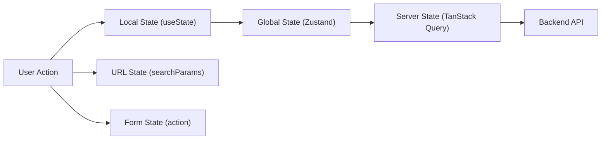

# 06 — State Management

> **TL;DR:** State has five categories — local, global, server, URL, and form. Use `useState`/`useReducer` for local state, TanStack Query for server state, Zustand for lightweight global state, URL params for shareable state, and React 19 form actions for form state. The biggest mistake is putting server data in a global store.

---

## 1. The Five Categories of State

Every piece of state in a React app belongs to one of these categories. Choosing the wrong tool for the category is the #1 state management mistake.

| Category | What It Is | Lives Where | Right Tool |
|----------|-----------|-------------|------------|
| **Local** | UI state for one component | Component | `useState`, `useReducer` |
| **Global** | Shared across many components | Client memory | Zustand, Jotai, Redux Toolkit |
| **Server** | Data from backend APIs | Cache | TanStack Query, SWR, RSC |
| **URL** | Page, filters, search params | URL bar | `useSearchParams`, router state |
| **Form** | Input values, validation, dirty state | Form | React 19 actions, React Hook Form |



---

## 2. Local State — useState and useReducer

### When to Use Local State

- Toggle open/close
- Selected tab
- Input focus
- Accordion expand/collapse
- Component-specific loading/error
- Anything that dies when the component unmounts

```tsx
function Accordion({ items }: { items: AccordionItem[] }) {
  const [openIndex, setOpenIndex] = useState<number | null>(null);

  return (
    <div className="accordion">
      {items.map((item, i) => (
        <div key={item.id}>
          <button
            className="accordion-header"
            onClick={() => setOpenIndex(openIndex === i ? null : i)}
          >
            {item.title}
          </button>
          {openIndex === i && <div className="accordion-body">{item.content}</div>}
        </div>
      ))}
    </div>
  );
}
```

### State Co-location Rule

> State should live as close to where it's used as possible. Only lift state up when a sibling needs it.

```
Component A uses state X → Keep X in A
Component A and B both need X → Lift X to their common parent
10+ components across the app need X → Global state (Zustand)
X comes from an API → Server state (TanStack Query)
```

---

## 3. Server State — TanStack Query

Server state is fundamentally different from client state:
- It's owned by the server, not the client
- It can become stale while the user is looking at it
- Multiple users can modify it simultaneously
- It needs caching, deduplication, and background refresh

### Basic Query

```tsx
import { useQuery } from '@tanstack/react-query';

function useUsers(page: number) {
  return useQuery({
    queryKey: ['users', page],
    queryFn: () => fetch(`/api/users?page=${page}`).then((r) => r.json()),
    staleTime: 30_000,       // Data considered fresh for 30s
    gcTime: 5 * 60_000,      // Cache kept for 5 min after last subscriber
  });
}

function UsersPage() {
  const [page, setPage] = useState(1);
  const { data, isLoading, error, isFetching } = useUsers(page);

  if (isLoading) return <Spinner />;
  if (error) return <ErrorFallback error={error} />;

  return (
    <div>
      <UserTable users={data.users} />
      {isFetching && <span className="text-muted">Refreshing...</span>}
      <Pagination page={page} total={data.totalPages} onChange={setPage} />
    </div>
  );
}
```

### Mutations with Optimistic Updates

```tsx
import { useMutation, useQueryClient } from '@tanstack/react-query';

function useDeleteUser() {
  const queryClient = useQueryClient();

  return useMutation({
    mutationFn: (userId: string) => fetch(`/api/users/${userId}`, { method: 'DELETE' }),

    onMutate: async (userId) => {
      await queryClient.cancelQueries({ queryKey: ['users'] });
      const previous = queryClient.getQueryData(['users']);

      queryClient.setQueryData(['users'], (old: User[]) =>
        old.filter((u) => u.id !== userId)
      );

      return { previous };
    },

    onError: (_err, _userId, context) => {
      queryClient.setQueryData(['users'], context?.previous);
    },

    onSettled: () => {
      queryClient.invalidateQueries({ queryKey: ['users'] });
    },
  });
}
```

### TanStack Query Key Concepts

| Concept | What It Does |
|---------|-------------|
| `queryKey` | Cache identity — same key = same cached data |
| `staleTime` | How long data is "fresh" before background refetch |
| `gcTime` | How long inactive cache stays in memory |
| Deduplication | Multiple components using same key → one network request |
| Background refetch | Refetch on window focus, reconnect, or interval |
| Optimistic updates | Update cache before server confirms |
| Prefetching | `queryClient.prefetchQuery()` on hover/route match |

---

## 4. Global State — Zustand

Zustand is the modern default for lightweight global state. No boilerplate, no providers, no reducers.

### Basic Store

```tsx
import { create } from 'zustand';

interface AppStore {
  sidebarOpen: boolean;
  toggleSidebar: () => void;
  notifications: Notification[];
  addNotification: (n: Notification) => void;
  clearNotifications: () => void;
}

export const useAppStore = create<AppStore>((set) => ({
  sidebarOpen: true,
  toggleSidebar: () => set((s) => ({ sidebarOpen: !s.sidebarOpen })),
  notifications: [],
  addNotification: (n) => set((s) => ({ notifications: [...s.notifications, n] })),
  clearNotifications: () => set({ notifications: [] }),
}));
```

### Using the Store with Selectors

```tsx
function Sidebar() {
  const isOpen = useAppStore((s) => s.sidebarOpen);

  if (!isOpen) return null;
  return <nav className="sidebar">...</nav>;
}

function Header() {
  const toggle = useAppStore((s) => s.toggleSidebar);
  const count = useAppStore((s) => s.notifications.length);

  return (
    <header>
      <button onClick={toggle}>Menu</button>
      <span className="badge">{count}</span>
    </header>
  );
}
```

**Performance:** Zustand only re-renders a component when its selected slice changes. `useAppStore((s) => s.sidebarOpen)` won't re-render when `notifications` change.

### Zustand with Middleware

```tsx
import { create } from 'zustand';
import { devtools, persist } from 'zustand/middleware';

export const useAuthStore = create<AuthStore>()(
  devtools(
    persist(
      (set) => ({
        user: null,
        token: null,
        login: (user, token) => set({ user, token }),
        logout: () => set({ user: null, token: null }),
      }),
      { name: 'auth-storage' }
    )
  )
);
```

---

## 5. Zustand vs Redux Toolkit vs Jotai

| Feature | Zustand | Redux Toolkit | Jotai |
|---------|---------|---------------|-------|
| Boilerplate | Minimal | Medium (slices, store config) | Minimal |
| DevTools | Via middleware | Built-in | Via devtools atom |
| Bundle size | ~1 KB | ~11 KB | ~3 KB |
| Learning curve | Low | Medium | Low |
| Middleware | `persist`, `devtools`, `immer` | Built-in (thunk, RTK Query) | Derived atoms |
| Best for | Most apps, simple global state | Large teams needing strict patterns | Atomic, granular state |
| Server state | Use TanStack Query | RTK Query (built-in) | Use TanStack Query |

### When to Use Redux Toolkit

- Team already knows Redux
- Need strict unidirectional data flow with time-travel debugging
- Using RTK Query and want one tool for server + global state
- Large team needing enforced patterns (actions, reducers, selectors)

### When to Use Zustand

- New project, no legacy Redux
- Want minimal boilerplate
- Don't need server-state management built into the store
- Team prefers simplicity over ceremony

### When to Use Jotai

- Many small, independent atoms of state
- Need derived state that computes from other atoms
- Building a tool with many toggles/settings (like a design editor)

---

## 6. URL State — Search Params as State

URL state is state that should survive page refresh and be shareable via link.

```tsx
import { useSearchParams } from 'react-router-dom';

function ProductFilters() {
  const [searchParams, setSearchParams] = useSearchParams();

  const category = searchParams.get('category') ?? 'all';
  const sort = searchParams.get('sort') ?? 'newest';
  const page = parseInt(searchParams.get('page') ?? '1', 10);

  function setFilter(key: string, value: string) {
    setSearchParams((prev) => {
      const next = new URLSearchParams(prev);
      next.set(key, value);
      next.set('page', '1');  // Reset page on filter change
      return next;
    });
  }

  return (
    <div className="d-flex gap-3">
      <select value={category} onChange={(e) => setFilter('category', e.target.value)}>
        <option value="all">All</option>
        <option value="electronics">Electronics</option>
        <option value="clothing">Clothing</option>
      </select>
      <select value={sort} onChange={(e) => setFilter('sort', e.target.value)}>
        <option value="newest">Newest</option>
        <option value="price-asc">Price: Low → High</option>
        <option value="price-desc">Price: High → Low</option>
      </select>
    </div>
  );
}
```

**What belongs in URL state:**
- Active tab
- Filters and sort order
- Search query
- Pagination page number
- Selected item ID (for detail panel)
- Modal open/close (deep-linkable modals)

---

## 7. Form State — React 19 Actions vs React Hook Form

### React 19 Native Forms (Simple Forms)

```tsx
function ContactForm() {
  const [state, formAction, isPending] = useActionState(
    async (_prev: FormState, formData: FormData) => {
      const email = formData.get('email') as string;
      const message = formData.get('message') as string;

      if (!email.includes('@')) return { error: 'Invalid email' };

      await sendContact({ email, message });
      return { error: null, sent: true };
    },
    { error: null, sent: false }
  );

  return (
    <form action={formAction}>
      <input name="email" type="email" required />
      <textarea name="message" required />
      <button disabled={isPending}>{isPending ? 'Sending...' : 'Send'}</button>
      {state.error && <p className="text-danger">{state.error}</p>}
      {state.sent && <p className="text-success">Sent!</p>}
    </form>
  );
}
```

### React Hook Form (Complex Forms)

```tsx
import { useForm } from 'react-hook-form';
import { zodResolver } from '@hookform/resolvers/zod';
import { z } from 'zod';

const schema = z.object({
  name: z.string().min(2, 'Name too short'),
  email: z.string().email('Invalid email'),
  role: z.enum(['admin', 'editor', 'viewer']),
  bio: z.string().max(500).optional(),
});

type FormData = z.infer<typeof schema>;

function UserForm() {
  const { register, handleSubmit, formState: { errors, isSubmitting } } = useForm<FormData>({
    resolver: zodResolver(schema),
    defaultValues: { name: '', email: '', role: 'viewer' },
  });

  const onSubmit = async (data: FormData) => {
    await saveUser(data);
  };

  return (
    <form onSubmit={handleSubmit(onSubmit)}>
      <div>
        <input {...register('name')} className="form-control" />
        {errors.name && <span className="text-danger">{errors.name.message}</span>}
      </div>
      <div>
        <input {...register('email')} className="form-control" />
        {errors.email && <span className="text-danger">{errors.email.message}</span>}
      </div>
      <div>
        <select {...register('role')} className="form-select">
          <option value="viewer">Viewer</option>
          <option value="editor">Editor</option>
          <option value="admin">Admin</option>
        </select>
      </div>
      <button disabled={isSubmitting} className="btn btn-primary">
        {isSubmitting ? 'Saving...' : 'Save'}
      </button>
    </form>
  );
}
```

### When to Use Which

| Scenario | React 19 Actions | React Hook Form |
|----------|--|--|
| Simple contact / search form | Yes | Overkill |
| Multi-step wizard | Not ideal | Yes |
| Dynamic field arrays | Difficult | Yes (`useFieldArray`) |
| Complex validation with Zod | Possible but manual | Built-in resolver |
| Progressive enhancement (no JS) | Yes (server actions) | No |
| Existing React Hook Form codebase | Gradual migration | Keep using it |

---

## 8. Decision Tree — Which State Tool to Use

```
Is the data from an API?
  YES → TanStack Query (or RSC for read-only)
  NO ↓

Should it survive a page refresh?
  YES → URL search params
  NO ↓

Is it form input state?
  YES → React 19 actions (simple) or React Hook Form (complex)
  NO ↓

Is it used by only one component?
  YES → useState / useReducer
  NO ↓

Is it used by a parent + 1-2 children?
  YES → Lift state to parent, pass via props
  NO ↓

Is it used across many components / routes?
  YES → Zustand (simple) or Redux Toolkit (complex / legacy)
```

---

## 9. Anti-Patterns — What NOT to Do

### Anti-Pattern 1: Server Data in Global Store

```tsx
// WRONG — duplicating server data into Zustand/Redux
const useStore = create((set) => ({
  users: [],
  fetchUsers: async () => {
    const users = await fetch('/api/users').then((r) => r.json());
    set({ users });  // Now you own cache invalidation, staleness, deduplication...
  },
}));

// CORRECT — TanStack Query owns server data
function useUsers() {
  return useQuery({ queryKey: ['users'], queryFn: fetchUsers });
}
```

### Anti-Pattern 2: Prop Drilling Through 5+ Levels

```tsx
// WRONG — threading props through components that don't use them
<App theme={theme}>
  <Layout theme={theme}>
    <Sidebar theme={theme}>
      <NavItem theme={theme} />  // Only NavItem needs theme!

// CORRECT — Context or Zustand
const theme = useAppStore((s) => s.theme);  // NavItem reads directly
```

### Anti-Pattern 3: One Mega Store

```tsx
// WRONG — everything in one Zustand store
const useStore = create((set) => ({
  user: null,
  products: [],
  cart: [],
  notifications: [],
  sidebarOpen: true,
  theme: 'light',
  // ... 50 more fields
}));

// CORRECT — separate stores by domain
const useAuthStore = create(/* ... */);
const useUIStore = create(/* ... */);
// Products and cart → TanStack Query, not a store
```

---

## Common Mistakes — Avoid Saying These

| Mistake | Why It's Wrong |
|---------|---------------|
| "I use Redux for everything" | Overkill for most state; server data belongs in TanStack Query |
| "I manage API data with useState + useEffect" | No caching, no deduplication, no background refresh |
| "Context is my global state solution" | Context re-renders all consumers on any change — fine for rare updates, terrible for frequent ones |
| "I don't use URL state because it's hard" | URL state makes your app shareable and deep-linkable — critical for UX |
| "Zustand can't handle complex state" | It can with slices, middleware, and immer — but for server state, use TanStack Query |

---

## Interview-Ready Answer

> "How do you approach state management in React?"

**Strong answer:**

> I categorize state into five types: local, global, server, URL, and form. Server state — which is the majority in most apps — goes into TanStack Query for automatic caching, deduplication, background refresh, and optimistic updates. Local UI state like toggles and selections uses `useState` or `useReducer`, kept as close to the using component as possible. Global client state — things like sidebar open/close or theme — uses Zustand for its minimal API and selector-based re-renders. URL state handles filters, pagination, and anything that should be bookmarkable or shareable. Form state uses React 19 actions for simple submissions or React Hook Form with Zod for complex multi-step forms. The key principle is state co-location: start local, lift only when needed, and never put server data in a client store.

---

## Next Topic

→ [07-server-components.md](07-server-components.md) — React Server Components, the server/client boundary, streaming SSR, and the Next.js App Router architecture.
