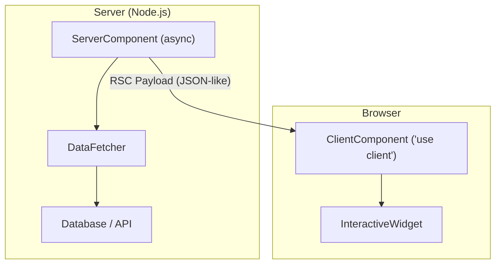

# 07 — Server Components & Streaming SSR

> **TL;DR:** React Server Components (RSC) render on the server, send zero JavaScript to the client, and can directly access databases and file systems. Client Components handle interactivity. The boundary is marked by `"use client"`. Streaming SSR with Suspense sends HTML progressively. Next.js App Router is the reference implementation with layouts, loading states, and error boundaries built in.

---

## 1. The Mental Model — Server vs Client



**The fundamental split:**

| | Server Component | Client Component |
|-|--|--|
| Renders where | Server only | Server (SSR) + Client (hydration) |
| JavaScript sent | None | Yes — component code ships to browser |
| Can use hooks | No (no `useState`, `useEffect`) | Yes |
| Can use async/await | Yes (async component function) | No (use hooks instead) |
| Can access DB/fs | Yes | No |
| Can handle events | No (`onClick`, `onChange`, etc.) | Yes |
| Can use browser APIs | No (`window`, `localStorage`) | Yes |
| Default in App Router | Yes | Must opt-in with `"use client"` |

---

## 2. The "use client" and "use server" Directives

### "use client" — Marks the Client Boundary

```tsx
'use client';

import { useState } from 'react';

export function Counter() {
  const [count, setCount] = useState(0);
  return <button onClick={() => setCount(c => c + 1)}>Count: {count}</button>;
}
```

**Rules:**
- Place at the TOP of the file, before any imports
- Everything imported by this file is also treated as client code
- The boundary is the file, not the component

### "use server" — Server Actions

```tsx
'use server';

export async function deleteUser(userId: string) {
  await db.users.delete({ where: { id: userId } });
  revalidatePath('/users');
}
```

**Rules:**
- Only for async functions (actions)
- Creates a network endpoint — the function runs on the server
- Can be imported and called from client components
- Arguments must be serializable

### The Boundary Visualized

```
                    SERVER                              CLIENT
┌──────────────────────────────────────┐  ┌─────────────────────────┐
│  page.tsx (Server Component)         │  │                         │
│    ├── Header (Server)               │  │                         │
│    ├── ProductList (Server)          │  │                         │
│    │     └── fetches from DB         │  │                         │
│    │     └── renders <ProductCard /> ─┼──┼→ ProductCard ('use     │
│    │                                 │  │   client') — has onClick│
│    └── Footer (Server)              │  │                         │
└──────────────────────────────────────┘  └─────────────────────────┘
```

---

## 3. Async Server Components — Data Fetching Without useEffect

Server components can be `async` — they `await` data directly:

```tsx
// app/users/page.tsx — Server Component (default)
async function UsersPage() {
  const users = await db.users.findMany({
    orderBy: { createdAt: 'desc' },
    take: 50,
  });

  return (
    <div className="container">
      <h1>Users</h1>
      <UserTable users={users} />
    </div>
  );
}

export default UsersPage;
```

**What this eliminates:**
- No `useEffect` + `useState` for data fetching
- No loading state boilerplate
- No client-side waterfall (fetch happens before any HTML is sent)
- No need for TanStack Query on read-only server-rendered pages

### Fetch with Caching

```tsx
async function getProduct(id: string) {
  const res = await fetch(`https://api.example.com/products/${id}`, {
    next: { revalidate: 3600 },  // Cache for 1 hour
  });
  return res.json();
}

async function ProductPage({ params }: { params: { id: string } }) {
  const product = await getProduct(params.id);

  return (
    <article>
      <title>{product.name}</title>
      <h1>{product.name}</h1>
      <p>{product.description}</p>
      <AddToCartButton productId={product.id} />
    </article>
  );
}
```

---

## 4. Streaming SSR with Suspense

Traditional SSR sends the entire page as one HTML blob. Streaming SSR sends HTML chunks progressively as server components resolve.

### How Streaming Works

```
Browser request → /products

Server starts streaming:

  1. Send <html><head>...</head><body>
  2. Send <Header /> (instant — static)
  3. Send <Sidebar /> (instant — static)
  4. Hit <Suspense fallback={<Spinner />}>
     → Send <Spinner /> placeholder immediately
  5. Continue streaming other parts...
  6. ProductList resolves (DB query done)
     → Send <script> that replaces Spinner with ProductList HTML
  7. Send </body></html>
```

### Implementation

```tsx
import { Suspense } from 'react';

async function ProductList() {
  const products = await db.products.findMany();  // Slow query
  return (
    <ul>
      {products.map((p) => (
        <li key={p.id}>{p.name} — ${p.price}</li>
      ))}
    </ul>
  );
}

export default function ProductsPage() {
  return (
    <div className="container">
      <h1>Products</h1>  {/* Streamed immediately */}
      <SearchBar />      {/* Streamed immediately */}

      <Suspense fallback={<ProductSkeleton />}>
        <ProductList />  {/* Streamed when DB query resolves */}
      </Suspense>

      <Footer />         {/* Streamed immediately */}
    </div>
  );
}
```

**Benefits of streaming:**
- First byte arrives immediately (fast TTFB)
- Users see the page shell before data loads
- Suspense boundaries are the natural loading boundaries
- Multiple slow queries stream independently (no waterfall)

---

## 5. Selective Hydration

With streaming SSR + Suspense, React can hydrate parts of the page independently:

```
1. HTML for Header streams → hydrates immediately (interactive)
2. HTML for Sidebar streams → hydrates immediately
3. Spinner for ProductList shows (waiting for data)
4. User clicks a sidebar link → React prioritizes hydrating sidebar
5. ProductList HTML streams → hydrates when prioritized
```

**Key insight:** If the user interacts with a section that hasn't hydrated yet, React bumps its priority. The user never notices hydration ordering.

---

## 6. Next.js App Router Architecture

Next.js App Router is the reference implementation of RSC.

### File-Based Routing

```
app/
├── layout.tsx              ← Root layout (wraps all pages)
├── page.tsx                ← / route
├── loading.tsx             ← Suspense fallback for this route
├── error.tsx               ← Error boundary for this route
├── not-found.tsx           ← 404 for this route
│
├── dashboard/
│   ├── layout.tsx          ← Dashboard layout (persistent sidebar)
│   ├── page.tsx            ← /dashboard
│   └── settings/
│       └── page.tsx        ← /dashboard/settings
│
├── products/
│   ├── page.tsx            ← /products
│   └── [id]/
│       ├── page.tsx        ← /products/:id
│       └── loading.tsx     ← Loading state for product detail
│
└── (auth)/                 ← Route group (no URL segment)
    ├── login/page.tsx      ← /login
    └── register/page.tsx   ← /register
```

### Layouts — Persistent UI

```tsx
// app/dashboard/layout.tsx
export default function DashboardLayout({ children }: { children: React.ReactNode }) {
  return (
    <div className="d-flex">
      <DashboardSidebar />       {/* Persists across dashboard routes */}
      <main className="flex-grow-1 p-4">
        {children}                {/* Swapped on navigation */}
      </main>
    </div>
  );
}
```

**Layout behavior:**
- Layouts don't re-render on navigation between child routes
- They preserve state (sidebar scroll position, counters, etc.)
- Nested layouts compose (root → dashboard → settings)

### Loading States

```tsx
// app/products/[id]/loading.tsx
export default function ProductLoading() {
  return (
    <div className="placeholder-glow">
      <div className="placeholder col-6 mb-3" style={{ height: 32 }} />
      <div className="placeholder col-12 mb-2" style={{ height: 200 }} />
      <div className="placeholder col-4" style={{ height: 20 }} />
    </div>
  );
}
```

This file is automatically wrapped in a `<Suspense>` boundary around the page.

### Error Boundaries

```tsx
// app/products/[id]/error.tsx
'use client';

export default function ProductError({ error, reset }: { error: Error; reset: () => void }) {
  return (
    <div className="alert alert-danger">
      <h4>Something went wrong</h4>
      <p>{error.message}</p>
      <button className="btn btn-outline-danger" onClick={reset}>Try again</button>
    </div>
  );
}
```

---

## 7. Parallel Routes and Intercepting Routes

### Parallel Routes — Multiple Pages in One Layout

```
app/dashboard/
├── layout.tsx
├── page.tsx
├── @analytics/page.tsx    ← Parallel slot
└── @activity/page.tsx     ← Parallel slot
```

```tsx
// app/dashboard/layout.tsx
export default function Layout({
  children,
  analytics,
  activity,
}: {
  children: React.ReactNode;
  analytics: React.ReactNode;
  activity: React.ReactNode;
}) {
  return (
    <div>
      {children}
      <div className="row">
        <div className="col-8">{analytics}</div>
        <div className="col-4">{activity}</div>
      </div>
    </div>
  );
}
```

Each parallel slot loads independently, has its own loading/error states, and can be conditionally rendered.

### Intercepting Routes — Modal Pattern

```
app/
├── photos/
│   └── [id]/page.tsx        ← Full page view: /photos/123
├── @modal/
│   └── (.)photos/[id]/
│       └── page.tsx          ← Intercepted: shows as modal when navigating from feed
```

When navigating from within the app, the modal route intercepts. On hard refresh or direct URL, the full page renders.

---

## 8. RSC Payload Format

When the server renders a Server Component, it doesn't send HTML — it sends an **RSC payload**: a JSON-like stream of serialized React elements.

```
// Simplified RSC payload
0: ["$", "div", null, {"children": [
  ["$", "h1", null, {"children": "Products"}],
  ["$", "$Suspense", null, {"fallback": "Loading...", "children":
    ["$", "ul", null, {"children": [...]}]
  }]
]}]
```

**Why not just HTML?**
- RSC payload preserves React element identity — enables client-side reconciliation
- Client components receive their props as serialized data
- Navigation between server-rendered pages doesn't full-page reload — React merges the new tree
- Supports streaming — chunks arrive progressively

---

## 9. Composition Patterns — Mixing Server and Client

### Pattern 1: Server Component Passes Data to Client Component

```tsx
// Server Component
async function ProductPage({ params }: { params: { id: string } }) {
  const product = await getProduct(params.id);

  return (
    <div>
      <h1>{product.name}</h1>
      <p>{product.description}</p>
      <AddToCartButton product={product} />  {/* Client component */}
    </div>
  );
}
```

```tsx
// Client Component
'use client';

export function AddToCartButton({ product }: { product: Product }) {
  const [added, setAdded] = useState(false);
  return (
    <button onClick={() => { addToCart(product.id); setAdded(true); }}>
      {added ? 'Added!' : `Add to Cart — $${product.price}`}
    </button>
  );
}
```

### Pattern 2: Client Component Wraps Server Component Children

```tsx
// Client Component that receives server-rendered children
'use client';

export function Tabs({ children }: { children: React.ReactNode }) {
  const [active, setActive] = useState(0);
  return <div>{/* Tab logic wrapping server-rendered children */}</div>;
}
```

```tsx
// Server Component
export default function Dashboard() {
  return (
    <Tabs>
      <AnalyticsPanel />   {/* Server Component — rendered on server */}
      <ActivityFeed />     {/* Server Component — rendered on server */}
    </Tabs>
  );
}
```

> **Key insight:** Client components CAN render server component children passed via `children` prop. The children are pre-rendered on the server.

### Pattern 3: Server Action Called from Client Component

```tsx
// server action
'use server';
export async function toggleFavorite(productId: string) {
  await db.favorites.toggle({ productId, userId: getCurrentUser() });
  revalidatePath('/products');
}
```

```tsx
// client component
'use client';
import { toggleFavorite } from './actions';

export function FavoriteButton({ productId }: { productId: string }) {
  const [optimistic, setOptimistic] = useOptimistic(false);

  return (
    <form action={async () => {
      setOptimistic(true);
      await toggleFavorite(productId);
    }}>
      <button type="submit">{optimistic ? '❤' : '♡'}</button>
    </form>
  );
}
```

---

## 10. When NOT to Use Server Components

| Scenario | Why Client Component Is Better |
|----------|------|
| Interactive forms with real-time validation | Need `useState`, `onChange` |
| Drag-and-drop interfaces | Need `onDrag*` events, DOM references |
| Real-time features (chat, live data) | Need WebSocket connections, `useEffect` |
| Canvas / WebGL rendering | Need browser Canvas API |
| Animation-heavy components | Need `useRef`, `requestAnimationFrame` |
| Components using `window` or `localStorage` | Browser-only APIs |

**Guideline:** Default to Server Components. Add `"use client"` only when you need interactivity, hooks, or browser APIs.

---

## Common Mistakes — Avoid Saying These

| Mistake | Why It's Wrong |
|---------|---------------|
| "Server Components replace SSR" | SSR and RSC work together — SSR sends initial HTML, RSC sends serialized component trees |
| "Every component should be a Server Component" | Interactive components must be Client Components — the split is intentional |
| "`'use client'` means it only runs on the client" | Client Components run on BOTH server (SSR) and client (hydration) |
| "Server Components are just SSR" | SSR renders HTML once; Server Components are re-rendered on navigation and send RSC payloads |
| "I can use useState in Server Components" | Hooks that manage state or effects are client-only |

---

## Interview-Ready Answer

> "Explain React Server Components and when to use them."

**Strong answer:**

> React Server Components render exclusively on the server and send zero JavaScript to the browser. They can directly access databases, file systems, and APIs without exposing credentials to the client. Client Components, marked with `"use client"`, handle interactivity — anything needing `useState`, `useEffect`, or event handlers. In Next.js App Router, all components are Server Components by default. The server renders them into an RSC payload — a serializable stream that preserves React element identity for client-side reconciliation. This enables streaming SSR with Suspense, where the browser receives HTML progressively as async data resolves. Layouts persist across navigation without re-rendering. I use server components for data display, SEO-critical content, and any read-only UI. Client components handle forms, modals, drag-and-drop, and real-time features. Server actions via `"use server"` handle mutations, creating a full server-first architecture where forms work before JavaScript loads.

---

## Next Topic

→ [08-performance.md](08-performance.md) — Core Web Vitals strategies, code splitting, bundle analysis, virtual scrolling, Web Workers, and the React Profiler.
