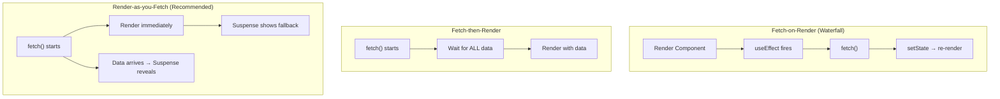
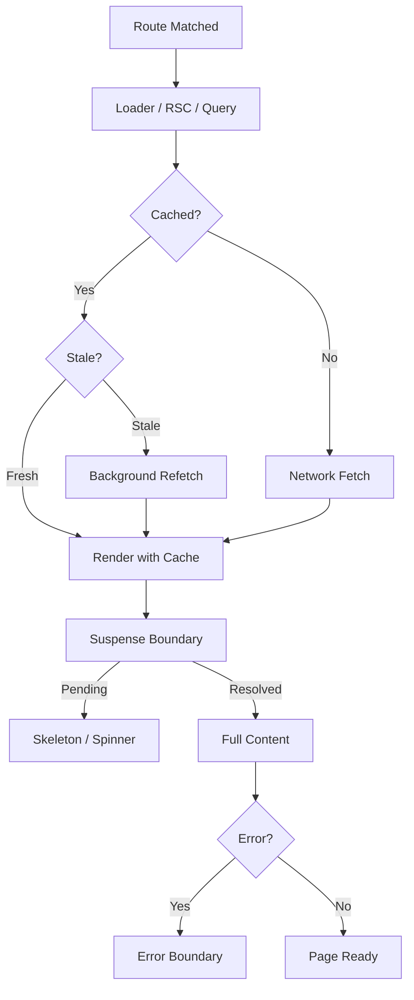

# 09 — Routing & Data Fetching Patterns

> **TL;DR:** Modern React routing has three major options: React Router v7 (SPA/framework-mode), TanStack Router (type-safe, file-based), and Next.js App Router (RSC, streaming). Data fetching has evolved from fetch-on-render (waterfall) through fetch-then-render to render-as-you-fetch (parallel). Suspense and error boundaries are the control flow primitives for async.

---

## 1. Three Data Fetching Patterns



### Fetch-on-Render (The Problem)

```tsx
function UserProfile({ userId }: { userId: string }) {
  const [user, setUser] = useState<User | null>(null);
  const [posts, setPosts] = useState<Post[]>([]);

  useEffect(() => {
    fetchUser(userId).then(setUser);
  }, [userId]);

  useEffect(() => {
    if (user) {
      fetchPosts(user.id).then(setPosts);  // Waterfall! Waits for user
    }
  }, [user]);

  if (!user) return <Spinner />;
  return <div>{user.name}: {posts.length} posts</div>;
}
```

**Problem:** User fetch → wait → Posts fetch → wait. Two sequential network roundtrips.

### Render-as-you-Fetch (The Solution)

```tsx
// Start both fetches BEFORE rendering
function UserProfilePage({ params }: { params: { id: string } }) {
  const userPromise = fetchUser(params.id);
  const postsPromise = fetchUserPosts(params.id);

  return (
    <Suspense fallback={<ProfileSkeleton />}>
      <UserDetails userPromise={userPromise} />
      <Suspense fallback={<PostsSkeleton />}>
        <UserPosts postsPromise={postsPromise} />
      </Suspense>
    </Suspense>
  );
}

function UserDetails({ userPromise }: { userPromise: Promise<User> }) {
  const user = use(userPromise);
  return <h1>{user.name}</h1>;
}
```

**Result:** Both fetches start immediately, in parallel. No waterfall.

---

## 2. React Router v7

React Router v7 (evolution of Remix) supports both SPA mode and framework mode.

### SPA Mode — Client-Side Routing

```tsx
import { createBrowserRouter, RouterProvider } from 'react-router';

const router = createBrowserRouter([
  {
    path: '/',
    element: <RootLayout />,
    errorElement: <RootError />,
    children: [
      { index: true, element: <Home /> },
      {
        path: 'products',
        element: <ProductsLayout />,
        children: [
          { index: true, element: <ProductList />, loader: productsLoader },
          { path: ':id', element: <ProductDetail />, loader: productLoader },
        ],
      },
      {
        path: 'orders',
        lazy: () => import('./routes/orders'),  // Code-split route
      },
    ],
  },
]);

function App() {
  return <RouterProvider router={router} />;
}
```

### Loaders — Data Fetching Before Render

```tsx
// routes/products.tsx
export async function loader({ request }: LoaderFunctionArgs) {
  const url = new URL(request.url);
  const query = url.searchParams.get('q') ?? '';
  const products = await fetchProducts(query);
  return { products, query };
}

export function ProductList() {
  const { products, query } = useLoaderData<typeof loader>();

  return (
    <div>
      <SearchBar defaultValue={query} />
      {products.map((p) => (
        <ProductCard key={p.id} product={p} />
      ))}
    </div>
  );
}
```

### Actions — Mutations

```tsx
export async function action({ request }: ActionFunctionArgs) {
  const formData = await request.formData();
  const title = formData.get('title') as string;

  const result = await createProduct({ title });

  if (result.error) {
    return { error: result.error };
  }

  return redirect('/products');
}

export function NewProductForm() {
  const actionData = useActionData<typeof action>();
  const navigation = useNavigation();
  const isSubmitting = navigation.state === 'submitting';

  return (
    <Form method="post">
      <input name="title" required />
      <button disabled={isSubmitting}>
        {isSubmitting ? 'Creating...' : 'Create Product'}
      </button>
      {actionData?.error && <p className="text-danger">{actionData.error}</p>}
    </Form>
  );
}
```

### Nested Routes with Outlet

```tsx
function ProductsLayout() {
  return (
    <div className="d-flex">
      <aside className="sidebar">
        <ProductNav />
      </aside>
      <main>
        <Outlet />  {/* Child route renders here */}
      </main>
    </div>
  );
}
```

---

## 3. TanStack Router — Type-Safe Routing

TanStack Router provides full type safety from route definition to component.

### Route Definition

```tsx
import { createFileRoute } from '@tanstack/react-router';

export const Route = createFileRoute('/products/$productId')({
  validateSearch: (search) => ({
    tab: (search.tab as string) ?? 'details',
  }),
  loader: async ({ params }) => {
    const product = await fetchProduct(params.productId);  // params.productId is typed
    return { product };
  },
  component: ProductPage,
});

function ProductPage() {
  const { product } = Route.useLoaderData();  // Fully typed
  const { tab } = Route.useSearch();          // Typed search params

  return (
    <div>
      <h1>{product.name}</h1>
      <TabPanel activeTab={tab} />
    </div>
  );
}
```

### Type-Safe Navigation

```tsx
import { Link } from '@tanstack/react-router';

// TypeScript errors if route params are wrong
<Link to="/products/$productId" params={{ productId: '123' }} search={{ tab: 'reviews' }}>
  View Product
</Link>
```

### TanStack Router vs React Router

| Feature | React Router v7 | TanStack Router |
|---------|--|--|
| Type safety | Partial (loaders typed separately) | Full (params, search, loader data) |
| File-based routing | Framework mode | Yes (with plugin) |
| Search params | Manual parsing | Built-in validated search params |
| Devtools | No | Yes (TanStack Router Devtools) |
| SSR support | Yes (framework mode) | Yes |
| Bundle size | ~14 KB | ~12 KB |
| Maturity | Very mature (10+ years) | Newer but production-ready |

---

## 4. Next.js App Router

See [07-server-components.md](07-server-components.md) for detailed App Router architecture. Key routing patterns:

### Dynamic Routes

```tsx
// app/products/[id]/page.tsx
export default async function ProductPage({ params }: { params: { id: string } }) {
  const product = await getProduct(params.id);
  return <ProductView product={product} />;
}
```

### Route Groups (No URL Segment)

```
app/
├── (marketing)/
│   ├── about/page.tsx        ← /about
│   └── pricing/page.tsx      ← /pricing
├── (app)/
│   ├── dashboard/page.tsx    ← /dashboard
│   └── settings/page.tsx     ← /settings
```

### Catch-All Routes

```tsx
// app/docs/[...slug]/page.tsx
export default function DocsPage({ params }: { params: { slug: string[] } }) {
  // /docs/react/hooks → slug = ['react', 'hooks']
  return <DocRenderer path={params.slug.join('/')} />;
}
```

### Middleware

```tsx
// middleware.ts (at project root)
import { NextResponse } from 'next/server';
import type { NextRequest } from 'next/server';

export function middleware(request: NextRequest) {
  const token = request.cookies.get('session-token');

  if (!token && request.nextUrl.pathname.startsWith('/dashboard')) {
    return NextResponse.redirect(new URL('/login', request.url));
  }

  return NextResponse.next();
}

export const config = {
  matcher: ['/dashboard/:path*', '/settings/:path*'],
};
```

---

## 5. Suspense for Data Fetching

Suspense is the declarative way to handle async in React.

### Multiple Independent Suspense Boundaries

```tsx
export default function DashboardPage() {
  return (
    <div className="row">
      <div className="col-8">
        <Suspense fallback={<ChartSkeleton />}>
          <RevenueChart />            {/* Loads independently */}
        </Suspense>
      </div>
      <div className="col-4">
        <Suspense fallback={<ListSkeleton />}>
          <RecentOrders />            {/* Loads independently */}
        </Suspense>
      </div>
      <div className="col-12">
        <Suspense fallback={<TableSkeleton />}>
          <ActivityTable />           {/* Loads independently */}
        </Suspense>
      </div>
    </div>
  );
}
```

Each section loads and reveals independently — no waterfall, no "all or nothing".

### Nested Suspense (Cascading Reveals)

```tsx
<Suspense fallback={<PageSkeleton />}>
  <UserProfile />                     {/* Shows first when ready */}
  <Suspense fallback={<PostsSkeleton />}>
    <UserPosts />                     {/* Shows second */}
    <Suspense fallback={<CommentsSkeleton />}>
      <PostComments />                {/* Shows last */}
    </Suspense>
  </Suspense>
</Suspense>
```

---

## 6. Error Boundaries — Graceful Degradation

```tsx
'use client';

import { Component, type ReactNode } from 'react';

interface ErrorBoundaryState {
  hasError: boolean;
  error: Error | null;
}

export class ErrorBoundary extends Component<
  { children: ReactNode; fallback?: ReactNode },
  ErrorBoundaryState
> {
  state: ErrorBoundaryState = { hasError: false, error: null };

  static getDerivedStateFromError(error: Error) {
    return { hasError: true, error };
  }

  componentDidCatch(error: Error, info: React.ErrorInfo) {
    logErrorToService(error, info.componentStack);
  }

  render() {
    if (this.state.hasError) {
      return this.props.fallback ?? (
        <div className="alert alert-danger">
          <h4>Something went wrong</h4>
          <p>{this.state.error?.message}</p>
          <button onClick={() => this.setState({ hasError: false, error: null })}>
            Try again
          </button>
        </div>
      );
    }
    return this.props.children;
  }
}
```

### Granular Error Boundaries

```tsx
function Dashboard() {
  return (
    <div>
      <ErrorBoundary fallback={<p>Chart failed to load</p>}>
        <Suspense fallback={<ChartSkeleton />}>
          <RevenueChart />
        </Suspense>
      </ErrorBoundary>

      <ErrorBoundary fallback={<p>Orders failed to load</p>}>
        <Suspense fallback={<TableSkeleton />}>
          <RecentOrders />
        </Suspense>
      </ErrorBoundary>
    </div>
  );
}
```

**Principle:** If one widget fails, the rest of the page still works.

---

## 7. Prefetching and Preloading Strategies

### Route Prefetching (React Router)

```tsx
import { Link } from 'react-router';

// Prefetch on hover
<Link to="/products/123" prefetch="intent">View Product</Link>

// Prefetch on render (visible in viewport)
<Link to="/products/123" prefetch="render">View Product</Link>
```

### Query Prefetching (TanStack Query)

```tsx
const queryClient = useQueryClient();

function ProductCard({ product }: { product: Product }) {
  const prefetch = () => {
    queryClient.prefetchQuery({
      queryKey: ['product', product.id],
      queryFn: () => fetchProduct(product.id),
      staleTime: 60_000,
    });
  };

  return (
    <Link to={`/products/${product.id}`} onMouseEnter={prefetch}>
      {product.name}
    </Link>
  );
}
```

### Next.js Prefetching

Next.js `<Link>` automatically prefetches routes when they enter the viewport:

```tsx
import Link from 'next/link';

// Automatically prefetches when visible (production only)
<Link href="/products/123">View Product</Link>

// Disable prefetching for rarely visited routes
<Link href="/admin/settings" prefetch={false}>Settings</Link>
```

---

## 8. SPA vs MPA vs Hybrid — Trade-offs

| Aspect | SPA (React Router) | MPA (Traditional) | Hybrid (Next.js App Router) |
|--------|---|---|---|
| Navigation | Client-side (instant) | Full page reload | Client-side with RSC payload |
| Initial load | Heavy (full JS bundle) | Light (HTML + minimal JS) | Light (streaming, RSC) |
| SEO | Requires SSR/prerender | Native | Native (Server Components) |
| Offline | Easy (Service Worker) | Difficult | Possible |
| Complexity | Low | Low | Medium |
| Best for | Dashboards, internal tools | Blogs, docs, static sites | Content + interactive apps |

### When to Choose Which

| Scenario | Recommendation |
|----------|-----|
| Marketing site with blog | Next.js App Router (SSG + RSC) |
| Internal admin dashboard | React Router v7 SPA mode |
| E-commerce with rich filters | Next.js App Router (RSC + Client interactivity) |
| Data-heavy analytics app | React Router or TanStack Router SPA |
| Multi-page form wizard | React Router with loader/action pattern |

---

## 9. Data Fetching Architecture — Putting It All Together



### Pattern Summary

| Pattern | Tool | When |
|---------|------|------|
| Server-side fetch (no client JS) | RSC async components | Read-only content pages |
| Route-level loader | React Router / TanStack Router | Data needed before render |
| Client-side cache + fetch | TanStack Query | Interactive pages needing real-time data |
| Optimistic mutation | TanStack Query mutation or `useOptimistic` | User actions that should feel instant |
| Prefetch on hover | `queryClient.prefetchQuery` | Speeding up perceived navigation |
| Streaming | Suspense + RSC | Pages with mixed fast/slow data sources |

---

## Common Mistakes — Avoid Saying These

| Mistake | Why It's Wrong |
|---------|---------------|
| "I fetch data in useEffect on mount" | Creates waterfalls; use loaders or RSC instead |
| "SPAs are always faster because there's no page reload" | Initial load is heavier; streaming SSR can be faster for first visit |
| "I don't need error boundaries" | Without them, one error crashes the whole page |
| "Prefetching wastes bandwidth" | Smart prefetching (on hover/viewport) speeds up perceived navigation dramatically |
| "I handle loading states with boolean flags" | Suspense is declarative and composable; boolean flags don't nest well |

---

## Interview-Ready Answer

> "How do you handle routing and data fetching in a React app?"

**Strong answer:**

> I choose the router based on the app type. For server-rendered apps, Next.js App Router gives me Server Components that fetch data directly with `async/await`, streaming SSR with Suspense, and file-based routing with layouts and error boundaries. For SPAs like internal dashboards, React Router v7 with loaders and actions keeps data fetching co-located with routes. For type-safe routing, TanStack Router provides full TypeScript safety from params to search to loader data. Regardless of the router, I follow the render-as-you-fetch pattern: data fetching starts before the component renders, multiple fetches run in parallel, and Suspense boundaries show skeletons until data arrives. For mutations, I use React 19 server actions or TanStack Query mutations with optimistic updates. Error boundaries around each data section ensure one failure doesn't crash the page. Prefetching on hover speeds up perceived navigation.

---

## Next Topic

→ [10-security.md](10-security.md) — XSS prevention, server action security, authentication patterns, CSRF, and Content Security Policy in React applications.
