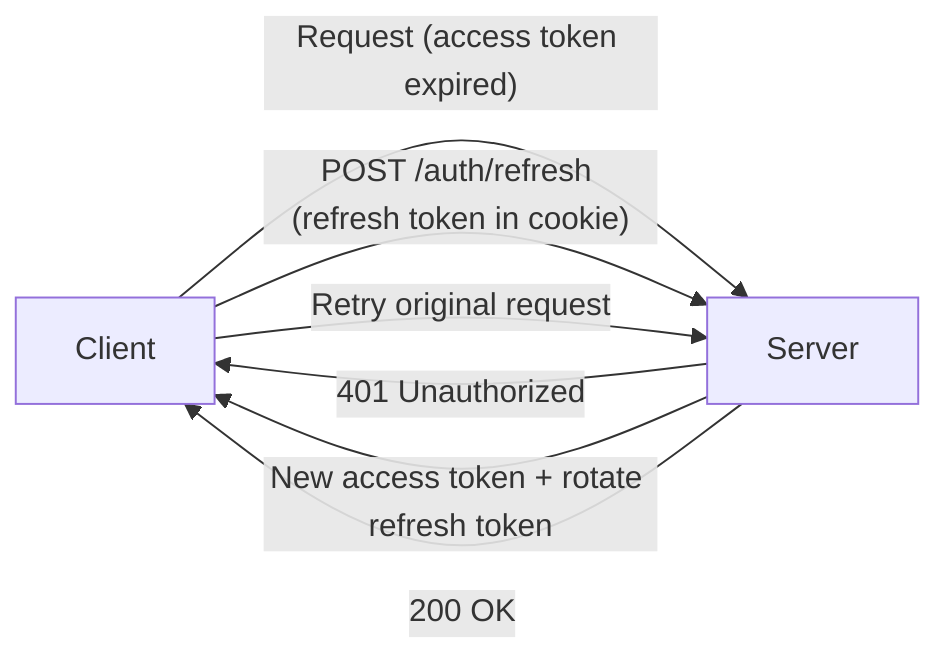
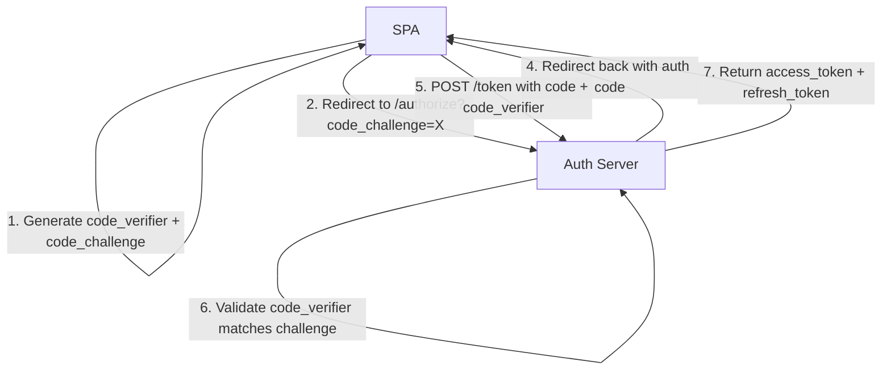

# 10 — Security & Authentication

> **TL;DR:** React auto-escapes JSX output, preventing most XSS. The main risks are `dangerouslySetInnerHTML`, `href="javascript:..."`, and unsanitized server action inputs. Use HTTP-only cookies for tokens, OAuth PKCE for SPAs, CSP headers to block injection, and always validate on the server — never trust the client.

---

## 1. XSS Prevention in React

### What React Does Automatically

JSX escapes all values by default:

```tsx
const userInput = '<script>alert("XSS")</script>';

// Safe — React escapes the string before inserting into DOM
return <p>{userInput}</p>;
// Renders: <p>&lt;script&gt;alert("XSS")&lt;/script&gt;</p>
```

This covers the most common XSS vector — injecting HTML via dynamic content.

### Where XSS Can Still Happen

| Vector | Risk | Mitigation |
|--------|------|------------|
| `dangerouslySetInnerHTML` | Injects raw HTML without escaping | Sanitize with DOMPurify |
| `href` / `src` with user input | `javascript:alert('XSS')` | Validate URL protocol |
| Server Component data | Unsanitized DB content rendered as HTML | Sanitize before storing |
| Third-party scripts | XSS via compromised CDN | Subresource Integrity (SRI) |
| `eval()` / `new Function()` | Executes arbitrary code | Never use with user input |

### dangerouslySetInnerHTML — When You Must Use It

```tsx
import DOMPurify from 'dompurify';

function RichContent({ html }: { html: string }) {
  const sanitized = DOMPurify.sanitize(html, {
    ALLOWED_TAGS: ['p', 'b', 'i', 'a', 'ul', 'ol', 'li', 'br', 'h2', 'h3'],
    ALLOWED_ATTR: ['href', 'target', 'rel'],
  });

  return <div dangerouslySetInnerHTML={{ __html: sanitized }} />;
}
```

**Rules for `dangerouslySetInnerHTML`:**
- Always sanitize with DOMPurify
- Whitelist allowed tags and attributes
- Never pass raw user input directly
- Consider Markdown rendering (react-markdown) instead

### URL Validation

```tsx
function SafeLink({ href, children }: { href: string; children: ReactNode }) {
  const isValid = /^https?:\/\//.test(href) || href.startsWith('/');

  if (!isValid) {
    console.warn(`Blocked potentially dangerous URL: ${href}`);
    return <span>{children}</span>;
  }

  return (
    <a href={href} rel="noopener noreferrer" target="_blank">
      {children}
    </a>
  );
}
```

---

## 2. Server Actions Security

Server actions (`"use server"`) create HTTP endpoints. Treat them with the same rigor as API routes.

### The Risk

```tsx
// DANGEROUS — no validation
'use server';
export async function updateProfile(formData: FormData) {
  const name = formData.get('name') as string;
  await db.users.update({ where: { id: getCurrentUserId() }, data: { name } });
}
```

An attacker can call this endpoint directly with arbitrary FormData — including fields you didn't intend.

### The Fix — Schema Validation

```tsx
'use server';

import { z } from 'zod';

const updateProfileSchema = z.object({
  name: z.string().min(1).max(100).trim(),
  bio: z.string().max(500).optional(),
});

export async function updateProfile(formData: FormData) {
  const raw = Object.fromEntries(formData.entries());
  const result = updateProfileSchema.safeParse(raw);

  if (!result.success) {
    return { error: result.error.flatten().fieldErrors };
  }

  const userId = await getAuthenticatedUserId();
  if (!userId) {
    return { error: { _form: ['Not authenticated'] } };
  }

  await db.users.update({
    where: { id: userId },
    data: result.data,
  });

  revalidatePath('/profile');
  return { error: null };
}
```

### Server Action Security Checklist

- [ ] Validate ALL inputs with Zod or similar
- [ ] Authenticate the user (check session/token)
- [ ] Authorize the action (does this user own this resource?)
- [ ] Rate limit mutations
- [ ] Never expose internal IDs the user shouldn't know
- [ ] Log mutations for audit trail

---

## 3. Authentication Patterns

### Token Storage — Where to Store JWTs

| Storage | XSS Risk | CSRF Risk | Best For |
|---------|----------|-----------|----------|
| `localStorage` | Vulnerable (JS can read) | None | Not recommended for auth tokens |
| `sessionStorage` | Vulnerable (JS can read) | None | Not recommended for auth tokens |
| HTTP-only cookie | Protected (JS cannot read) | Vulnerable (mitigate with CSRF token) | Recommended |
| Memory (variable) | Protected (not persisted) | None | Short-lived tokens (in-memory only) |

### Recommended: HTTP-Only Cookie Pattern

```tsx
// Server: Set cookie on login
// app/api/auth/login/route.ts
import { cookies } from 'next/headers';

export async function POST(request: Request) {
  const { email, password } = await request.json();
  const user = await authenticate(email, password);

  if (!user) {
    return Response.json({ error: 'Invalid credentials' }, { status: 401 });
  }

  const token = generateJWT(user);

  cookies().set('session', token, {
    httpOnly: true,      // JavaScript cannot read
    secure: true,        // HTTPS only
    sameSite: 'lax',     // CSRF protection
    maxAge: 60 * 60 * 24 * 7,  // 7 days
    path: '/',
  });

  return Response.json({ user: { id: user.id, name: user.name } });
}
```

### JWT Refresh Pattern



```tsx
// core/config/api-client.ts
apiClient.interceptors.response.use(
  (response) => response,
  async (error) => {
    const original = error.config;

    if (error.response?.status === 401 && !original._retry) {
      original._retry = true;

      try {
        await fetch('/api/auth/refresh', { method: 'POST', credentials: 'include' });
        return apiClient(original);  // Retry with new token
      } catch {
        window.location.href = '/login';
      }
    }

    return Promise.reject(error);
  }
);
```

---

## 4. OAuth 2.0 PKCE for SPAs

SPAs cannot keep a client secret. PKCE (Proof Key for Code Exchange) solves this.



```tsx
async function startOAuthFlow() {
  const codeVerifier = generateRandomString(128);
  const codeChallenge = await sha256Base64Url(codeVerifier);

  sessionStorage.setItem('pkce_verifier', codeVerifier);

  const params = new URLSearchParams({
    client_id: OAUTH_CLIENT_ID,
    redirect_uri: `${window.location.origin}/auth/callback`,
    response_type: 'code',
    scope: 'openid profile email',
    code_challenge: codeChallenge,
    code_challenge_method: 'S256',
    state: generateRandomString(32),
  });

  window.location.href = `${AUTH_SERVER}/authorize?${params}`;
}

async function handleCallback(code: string) {
  const codeVerifier = sessionStorage.getItem('pkce_verifier');

  const response = await fetch(`${AUTH_SERVER}/token`, {
    method: 'POST',
    headers: { 'Content-Type': 'application/x-www-form-urlencoded' },
    body: new URLSearchParams({
      grant_type: 'authorization_code',
      client_id: OAUTH_CLIENT_ID,
      code,
      redirect_uri: `${window.location.origin}/auth/callback`,
      code_verifier: codeVerifier!,
    }),
  });

  const tokens = await response.json();
  // Store tokens securely (ideally exchange for HTTP-only cookie via BFF)
}
```

---

## 5. CSRF Protection

### SameSite Cookies (Primary Defense)

```typescript
cookies().set('session', token, {
  sameSite: 'lax',  // Cookies sent on top-level navigations, not on cross-origin POST
  secure: true,
  httpOnly: true,
});
```

| SameSite Value | Cross-Origin GET | Cross-Origin POST | Best For |
|---|---|---|---|
| `strict` | Blocked | Blocked | Highly sensitive apps (banking) |
| `lax` | Allowed | Blocked | Most applications (default) |
| `none` | Allowed | Allowed | Cross-origin APIs (requires `secure`) |

### CSRF Token (Belt-and-Suspenders)

```tsx
// Server: Generate CSRF token and set as cookie
export async function GET() {
  const csrfToken = crypto.randomUUID();
  cookies().set('csrf-token', csrfToken, { httpOnly: false, sameSite: 'strict' });
  return Response.json({ csrfToken });
}

// Client: Include CSRF token in mutation requests
async function submitForm(data: FormData) {
  const csrfToken = getCookie('csrf-token');

  await fetch('/api/submit', {
    method: 'POST',
    headers: { 'X-CSRF-Token': csrfToken },
    body: data,
    credentials: 'include',
  });
}

// Server: Validate CSRF token
export async function POST(request: Request) {
  const headerToken = request.headers.get('X-CSRF-Token');
  const cookieToken = cookies().get('csrf-token')?.value;

  if (!headerToken || headerToken !== cookieToken) {
    return Response.json({ error: 'CSRF validation failed' }, { status: 403 });
  }
  // Process request...
}
```

---

## 6. Content Security Policy (CSP)

CSP is a browser security header that controls what resources can load on your page.

### Next.js CSP Configuration

```tsx
// middleware.ts
import { NextResponse } from 'next/server';

export function middleware(request: NextRequest) {
  const nonce = crypto.randomUUID();
  const response = NextResponse.next();

  const csp = [
    `default-src 'self'`,
    `script-src 'self' 'nonce-${nonce}'`,
    `style-src 'self' 'unsafe-inline'`,
    `img-src 'self' data: https://cdn.example.com`,
    `font-src 'self'`,
    `connect-src 'self' https://api.example.com`,
    `frame-ancestors 'none'`,
    `base-uri 'self'`,
    `form-action 'self'`,
  ].join('; ');

  response.headers.set('Content-Security-Policy', csp);
  response.headers.set('X-Nonce', nonce);

  return response;
}
```

### CSP Directives Cheat Sheet

| Directive | Controls | Example |
|-----------|----------|---------|
| `default-src` | Fallback for all resource types | `'self'` |
| `script-src` | JavaScript execution | `'self' 'nonce-abc'` |
| `style-src` | CSS loading | `'self' 'unsafe-inline'` |
| `img-src` | Image loading | `'self' data: https://cdn.example.com` |
| `connect-src` | XHR, fetch, WebSocket | `'self' https://api.example.com` |
| `frame-ancestors` | Who can embed your page | `'none'` (no iframe) |
| `base-uri` | `<base>` tag restriction | `'self'` |

---

## 7. Security Headers

```tsx
// next.config.ts
const securityHeaders = [
  { key: 'X-Frame-Options', value: 'DENY' },
  { key: 'X-Content-Type-Options', value: 'nosniff' },
  { key: 'Referrer-Policy', value: 'strict-origin-when-cross-origin' },
  { key: 'Permissions-Policy', value: 'camera=(), microphone=(), geolocation=()' },
  { key: 'Strict-Transport-Security', value: 'max-age=63072000; includeSubDomains; preload' },
];

const nextConfig = {
  async headers() {
    return [{ source: '/(.*)', headers: securityHeaders }];
  },
};

export default nextConfig;
```

| Header | Purpose |
|--------|---------|
| `X-Frame-Options: DENY` | Prevents clickjacking (no iframe embedding) |
| `X-Content-Type-Options: nosniff` | Prevents MIME-type sniffing |
| `Referrer-Policy` | Controls referrer info sent to other sites |
| `Permissions-Policy` | Disables browser features you don't need |
| `Strict-Transport-Security` | Forces HTTPS for all future requests |

---

## 8. Subresource Integrity (SRI)

Verify that CDN resources haven't been tampered with:

```html
<script
  src="https://cdn.example.com/analytics.js"
  integrity="sha384-oqVuAfXRKap7fdgcCY5uykM6+R9GqQ8K/uxy9rx7HNQlGYl1kPzQho1wx4JwY8w"
  crossorigin="anonymous"
></script>
```

**Generate integrity hash:**
```bash
cat analytics.js | openssl dgst -sha384 -binary | openssl base64 -A
```

---

## 9. Dependency Supply Chain Security

### The Risk

A compromised npm package can steal tokens, inject malware, or exfiltrate data.

### Mitigations

| Strategy | How |
|----------|-----|
| Lock file | Commit `package-lock.json` — ensures reproducible installs |
| Audit | `npm audit` in CI — fails build on known vulnerabilities |
| Pin versions | Avoid `^` for critical deps — `"react": "19.0.0"` not `"^19.0.0"` |
| Minimal deps | Evaluate if you need the package — native APIs often suffice |
| Socket.dev | Detects supply-chain attacks (typosquatting, maintainer changes) |
| Renovate/Dependabot | Automated dependency updates with PR reviews |

### npm audit in CI

```yaml
# .github/workflows/security.yml
- name: Security audit
  run: npm audit --audit-level=high
```

---

## 10. Secure Data Fetching in Server Components

Server Components run on the server — they can access databases directly. This changes the security model:

```tsx
// SECURE — credentials never reach the client
async function UserDashboard() {
  const session = await getServerSession();

  if (!session) redirect('/login');

  const user = await db.users.findUnique({
    where: { id: session.userId },
    select: { name: true, email: true, role: true },  // Never select password hash
  });

  return <DashboardView user={user} />;
}
```

**Server Component security advantages:**
- Database credentials stay on the server
- API keys never appear in client bundles
- Internal IDs and sensitive fields can be filtered before sending props
- No CORS issues — server fetches are server-to-server

**Server Component security risks:**
- SQL injection if using raw queries — always parameterize
- Accidentally passing sensitive props to Client Components
- Server action inputs are user-controlled — always validate

---

## Common Mistakes — Avoid Saying These

| Mistake | Why It's Wrong |
|---------|---------------|
| "React prevents all XSS" | `dangerouslySetInnerHTML`, `href`, and server-injected data are still vectors |
| "I store JWT in localStorage" | Any XSS can steal the token — use HTTP-only cookies |
| "SameSite cookies solve CSRF completely" | Older browsers don't support it; defense-in-depth is better |
| "CSP is optional for SPAs" | CSP prevents script injection even if XSS exists — critical defense layer |
| "Server Components are inherently secure" | They still need auth checks, input validation, and query parameterization |

---

## Interview-Ready Answer

> "How do you secure a React application?"

**Strong answer:**

> I layer defenses across the stack. React's JSX escaping handles basic XSS, but I sanitize any HTML rendered via `dangerouslySetInnerHTML` with DOMPurify and validate URL schemes for dynamic `href` values. Auth tokens go in HTTP-only, secure, SameSite cookies — never `localStorage`. For OAuth, I use PKCE since SPAs can't hold client secrets. Server actions are treated like API endpoints — every input is validated with Zod, authenticated, and authorized. CSRF is mitigated by SameSite=Lax cookies plus CSRF tokens for sensitive mutations. CSP headers restrict script sources using nonces, preventing injected scripts from executing. Security headers (X-Frame-Options, HSTS, nosniff) add further hardening. In Server Components, database credentials stay server-side and I'm careful not to leak sensitive fields through props to Client Components. Dependencies are locked, audited in CI, and minimized.

---

## Next Topic

→ [11-testing.md](11-testing.md) — Testing strategy, React Testing Library, Vitest, MSW for API mocking, component testing, and E2E with Playwright.
