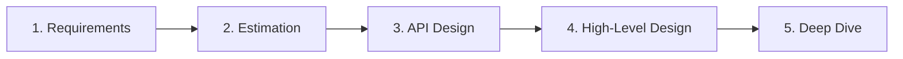
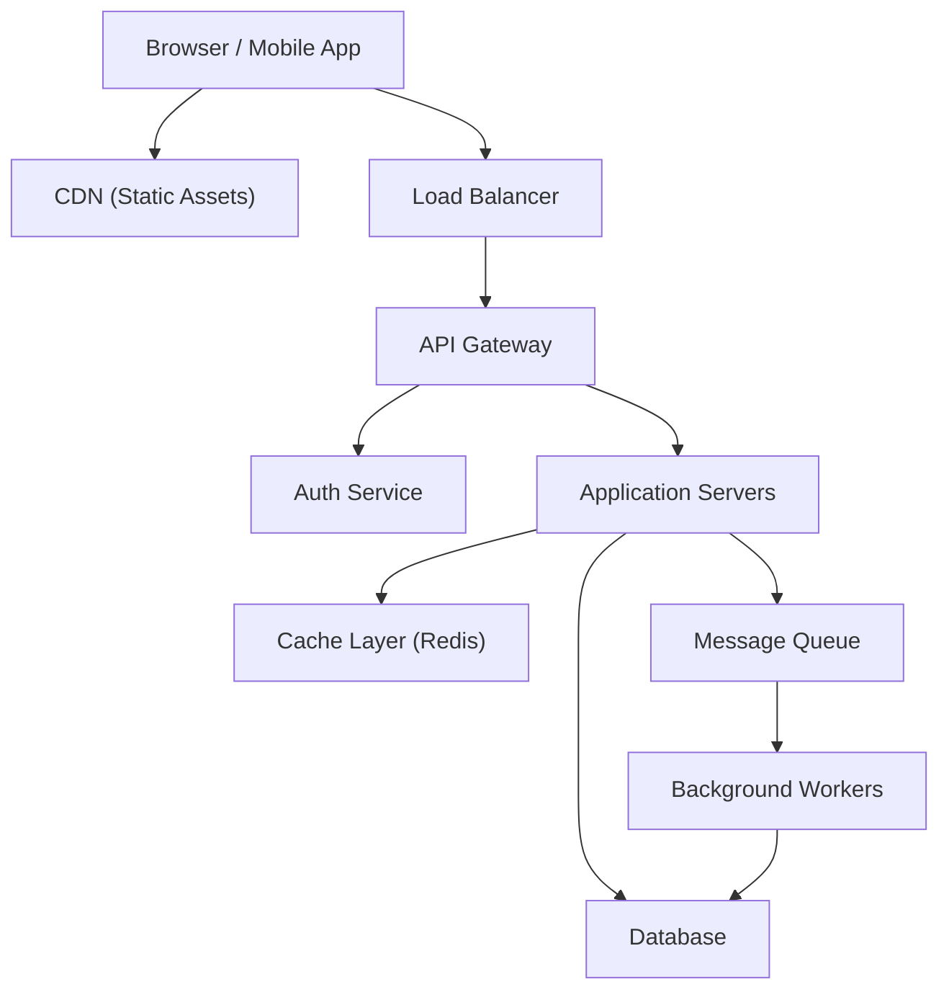

# Chapter 1: System Design Thinking

> A structured framework to approach any system design problem with confidence, from requirement gathering to trade-off analysis.

## Why This Matters for UI Architects

Every system design interview tests how you **think**, not what you memorize. Interviewers want to see you decompose ambiguity into structure, make reasoned trade-offs, and communicate clearly. As a UI architect, you must demonstrate that you can reason about systems end-to-end — not just the frontend layer.

---

## The 5-Step Framework

Use this template for every system design question. It keeps you structured and signals maturity to the interviewer.



### Step 1: Clarify Requirements (3-5 minutes)

Never start designing immediately. Ask questions first.

**Functional Requirements (FRs)** — What the system *does*:
- Who are the users? (end users, admins, internal services)
- What are the core use cases? (list the top 3-5)
- What data flows in and out?

**Non-Functional Requirements (NFRs)** — How the system *behaves*:
- **Availability** — Can we tolerate downtime? (99.9% = 8.7h/year, 99.99% = 52min/year)
- **Latency** — What's acceptable? (< 100ms for interactive UI, < 1s for page load)
- **Consistency** — Strong vs eventual? (banking = strong; social feed = eventual)
- **Scalability** — How many users? How fast is growth?
- **Durability** — Can we afford to lose data?

**UI Architect-specific questions to ask:**
- What devices/platforms must we support?
- Is offline support needed?
- What accessibility standards apply (WCAG 2.1 AA)?
- Are there SEO requirements?
- What's the expected bundle size budget?

#### Example: "Design a dashboard for real-time analytics"

| Requirement Type | Question | Answer |
|---|---|---|
| Functional | What metrics are shown? | Page views, conversions, active users |
| Functional | Can users customize widgets? | Yes, drag-and-drop layout |
| Non-Functional | Latency | Data refresh < 5 seconds |
| Non-Functional | Scale | 10K concurrent dashboard viewers |
| UI-Specific | Offline? | No, real-time only |
| UI-Specific | Mobile? | Responsive, but desktop-primary |

### Step 2: Back-of-Envelope Estimation (2-3 minutes)

Estimation shows you understand scale. Round aggressively — precision doesn't matter, order of magnitude does.

**Key numbers to memorize:**

| Metric | Value |
|---|---|
| 1 day | ~100,000 seconds (86,400) |
| 1 million requests/day | ~12 requests/second |
| 1 billion requests/day | ~12,000 requests/second |
| 1 KB text | ~1,000 characters |
| 1 MB image | compressed photo |
| 1 GB | ~1,000 high-res photos |
| 1 TB | ~1 million high-res photos |

**Estimation formula:**

```
Daily Active Users (DAU) × Actions per user × Data per action = Daily data volume
Daily data volume × 365 × retention years = Total storage
Peak QPS = Average QPS × 2-5 (depending on traffic pattern)
```

**Example: Image-heavy social feed**
- 10M DAU, 5 posts viewed per session, 200KB average image
- Read bandwidth: 10M × 5 × 200KB = 10TB/day ≈ 115MB/s average
- Peak: ~500MB/s
- This tells you: **you need a CDN**, you can't serve this from origin

### Step 3: API Design (3-5 minutes)

Define the contract between client and server. This is where UI architects shine.

**Think in terms of:**
- What data does the frontend need?
- What's the ideal shape of the response? (avoid over-fetching)
- What operations does the user perform?

```
GET  /api/dashboard?userId={id}&range=7d
POST /api/dashboard/widgets    { position, type, config }
PUT  /api/dashboard/widgets/:id  { position, config }
WS   /ws/metrics?dashboardId={id}  → real-time stream
```

**Key design decisions:**
- REST vs GraphQL vs gRPC — justify your choice
- Pagination strategy — cursor-based for feeds, offset for tables
- Authentication — Bearer token, session cookie, or API key
- Versioning — URL path (`/v2/`) vs header (`Accept-Version`)

### Step 4: High-Level Design (10-15 minutes)

Draw the architecture. Start broad, then zoom in.



**For each component, explain:**
1. Why it exists (what problem it solves)
2. What technology you'd choose (and why)
3. How it connects to other components

### Step 5: Deep Dive (10-15 minutes)

The interviewer will pick 1-2 areas to go deep. Be ready to discuss:

- **Database schema** — tables, indexes, access patterns
- **Caching strategy** — what to cache, TTL, invalidation
- **Failure modes** — what happens when X goes down?
- **Scaling bottlenecks** — where does it break at 10× load?
- **Data consistency** — how do you handle conflicts?

As a UI architect, you'll often be asked to deep-dive into:
- Component rendering strategy (SSR vs CSR vs hybrid)
- State synchronization across tabs/devices
- Optimistic updates and conflict resolution
- Bundle splitting strategy for large apps
- Real-time data flow (WebSocket vs polling vs SSE)

---

## Trade-off Analysis: The Core Skill

System design is about trade-offs. Never present a solution without discussing what you're sacrificing.

### The Trade-off Framework

For every decision, state:

> "I'm choosing **X** over **Y** because **Z**, but the trade-off is **W**."

### Common Trade-offs

| Decision | Option A | Option B | When to choose A |
|---|---|---|---|
| Consistency vs Availability | Strong consistency | Eventual consistency | Financial data, inventory |
| Latency vs Accuracy | Stale cache | Fresh DB query | User-facing reads |
| Simplicity vs Flexibility | Monolith | Microservices | Early stage, small team |
| Cost vs Performance | On-demand | Pre-provisioned | Unpredictable traffic |
| Coupling vs Independence | Shared DB | Event-driven | Need data consistency |
| SEO vs Interactivity | SSR | CSR | Content/marketing pages |

---

## Communication During the Interview

### Do's
- **Think out loud** — narrate your reasoning, not just your conclusions
- **Draw diagrams** — even rough boxes and arrows show structured thinking
- **State assumptions** — "I'm assuming 80% of traffic is reads"
- **Ask before deep-diving** — "Should I go deeper into the caching layer?"
- **Quantify** — "This reduces latency from ~500ms to ~50ms"

### Don'ts
- Don't jump to solutions without requirements
- Don't use buzzwords you can't explain
- Don't design for Google scale when the problem is a startup
- Don't ignore failure scenarios
- Don't forget the user experience (you're a UI architect!)

---

## Interview Tips

1. **Lead with the user** — As a UI architect, always start from the user's perspective. What are they trying to do? What do they see? Then work backward to the system.

2. **Time-box yourself** — Spend ~5 min on requirements, ~3 min on estimation, ~5 min on API, ~15 min on HLD, ~10 min on deep dive. Adjust based on interviewer cues.

3. **Have opinions** — "I'd use PostgreSQL here because we need ACID transactions and the data is relational" is better than "We could use any database."

4. **Acknowledge unknowns** — "I'm not deeply familiar with Cassandra's tunable consistency, but I know it offers eventual consistency by default and can be tuned per query" is perfectly fine.

5. **Connect to experience** — "In my current project, we solved this with..." adds credibility.

---

## Key Takeaways

- Always use a structured framework: Requirements → Estimation → API → HLD → Deep Dive
- Clarify requirements before designing — functional, non-functional, and UI-specific
- Back-of-envelope math shows you understand scale (memorize the key numbers)
- Every design decision is a trade-off — state what you gain and what you lose
- Communicate clearly: think out loud, draw diagrams, state assumptions
- As a UI architect, always connect system decisions to user experience impact
