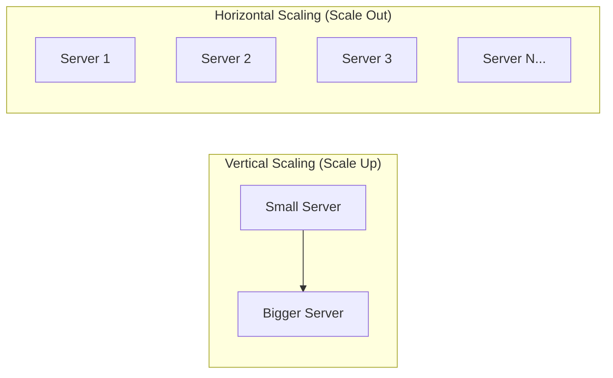
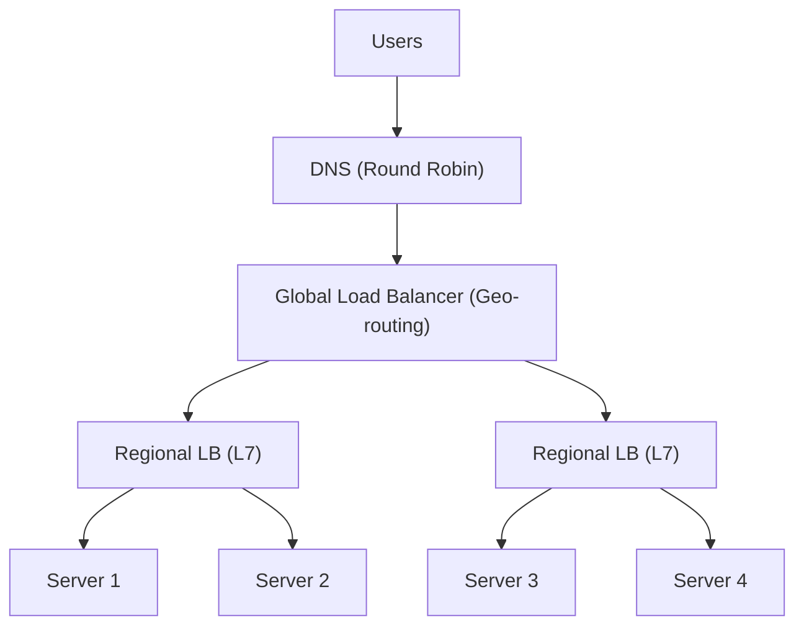
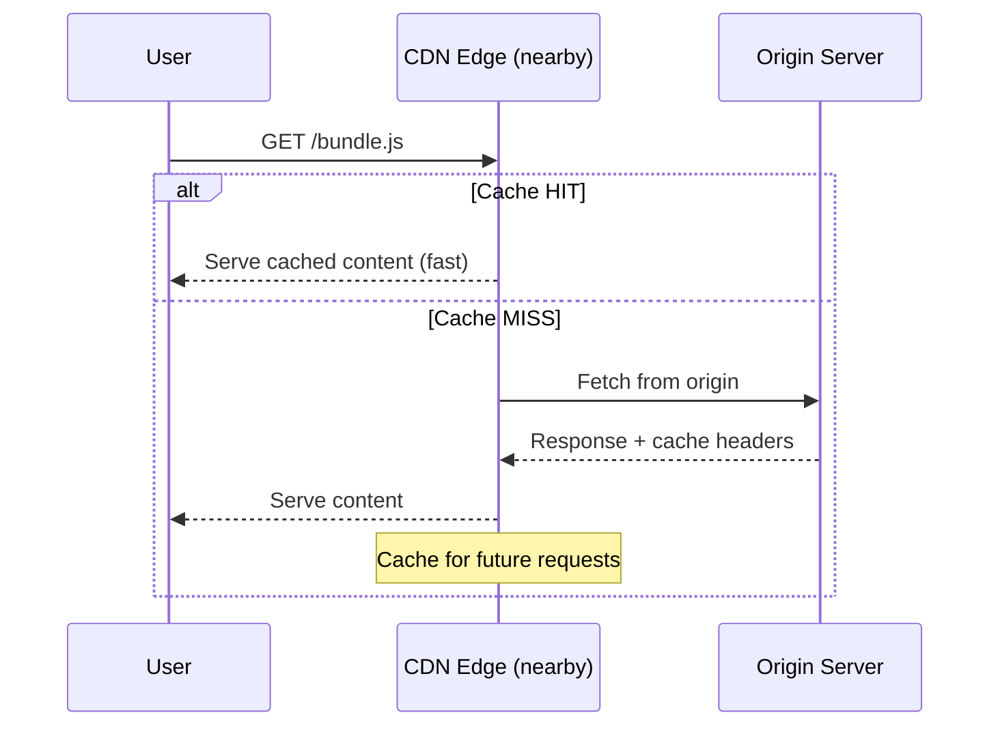
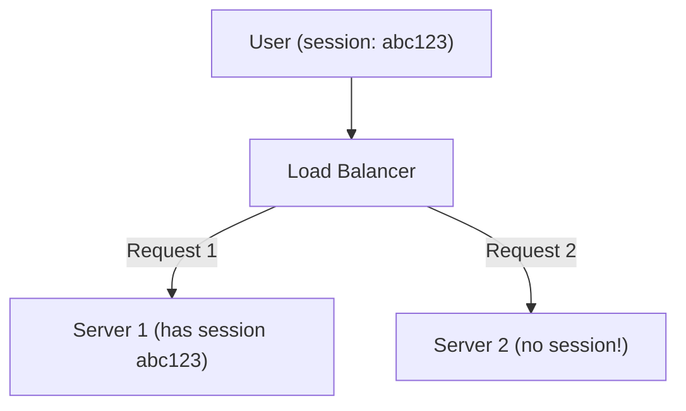
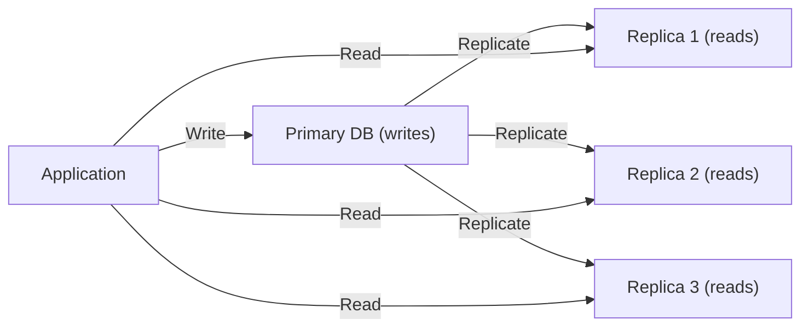
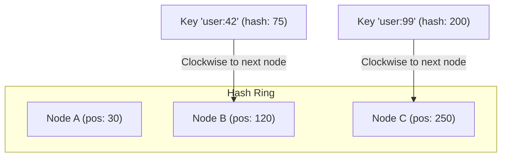

# Chapter 2: Scalability

> How systems grow from serving 100 users to 100 million — the patterns, strategies, and infrastructure that make it possible.

## Why This Matters for UI Architects

Scalability isn't just a backend concern. A UI architect must understand how frontend decisions impact system scalability — from CDN strategy and bundle splitting to client-side caching and connection management. When the backend scales horizontally, your frontend must handle load balancers, sticky sessions, and distributed state gracefully.

---

## Vertical vs Horizontal Scaling



| Aspect | Vertical (Scale Up) | Horizontal (Scale Out) |
|---|---|---|
| Approach | Bigger machine (more CPU, RAM) | More machines |
| Limit | Hardware ceiling | Virtually unlimited |
| Cost curve | Exponential (diminishing returns) | Linear |
| Complexity | Simple (no distributed systems) | Complex (coordination needed) |
| Downtime | Requires restart to upgrade | Zero-downtime with rolling deploys |
| Failure | Single point of failure | Fault tolerant |
| Best for | Databases (initially), simple apps | Stateless services, web servers |

**Rule of thumb:** Start vertical, go horizontal when you hit limits or need fault tolerance.

---

## Load Balancing

A load balancer distributes traffic across multiple servers, preventing any single server from becoming a bottleneck.

### Where Load Balancers Sit



### Layer 4 vs Layer 7

| Feature | L4 (Transport) | L7 (Application) |
|---|---|---|
| Operates on | TCP/UDP packets | HTTP requests |
| Speed | Faster (no packet inspection) | Slower (inspects headers, body) |
| Routing | IP + port only | URL path, headers, cookies |
| SSL termination | No | Yes |
| Use case | Raw throughput | Content-based routing |
| Examples | AWS NLB, HAProxy (TCP mode) | Nginx, AWS ALB, Envoy |

**UI Architect relevance:** L7 load balancers can route `/api/*` to backend servers and `/static/*` to asset servers. They can also handle WebSocket upgrades and sticky sessions for stateful connections.

### Load Balancing Algorithms

| Algorithm | How It Works | Best For |
|---|---|---|
| **Round Robin** | Rotate through servers sequentially | Identical servers, even load |
| **Weighted Round Robin** | Rotate with weights (2:1 ratio) | Mixed server capacities |
| **Least Connections** | Route to server with fewest active connections | Long-lived connections (WebSocket) |
| **Least Response Time** | Route to fastest-responding server | Heterogeneous performance |
| **IP Hash** | Hash client IP to consistent server | Session affinity without cookies |
| **Random** | Random selection | Simple, surprisingly effective |

### Health Checks

Load balancers must detect unhealthy servers:

- **Active health checks** — LB periodically pings `/health` endpoint
- **Passive health checks** — LB monitors response codes/timeouts from real traffic
- **Typical config:** Check every 10s, mark unhealthy after 3 failures, recover after 2 successes

---

## Content Delivery Networks (CDN)

A CDN caches and serves content from edge servers geographically close to users.

### How CDNs Work



### Push vs Pull CDN

| Type | How It Works | Pros | Cons | Best For |
|---|---|---|---|---|
| **Pull** | CDN fetches from origin on first request | Auto-managed, lazy | First request is slow (cache miss) | Dynamic, frequently updated content |
| **Push** | You upload content to CDN directly | Instant availability | Manual management | Static assets, build artifacts |

### CDN Strategy for UI Architects

**What to put on CDN:**
- JavaScript bundles (with content hashing: `main.a1b2c3.js`)
- CSS files
- Images and fonts
- Static HTML (for SSG/ISR pages)

**Cache headers you must understand:**

```
Cache-Control: public, max-age=31536000, immutable
```

- `public` — CDN and browsers can cache
- `max-age=31536000` — cache for 1 year (use with content-hashed filenames)
- `immutable` — don't revalidate, ever (the hash guarantees freshness)

For HTML documents (entry points):

```
Cache-Control: no-cache, must-revalidate
```

This ensures users always get the latest HTML, which points to the latest hashed assets.

**Cache invalidation strategies:**
- **Content hashing** — Change filename when content changes (preferred for assets)
- **TTL-based** — Set short TTL for HTML, long for hashed assets
- **Purge API** — Manually invalidate specific paths (emergency use)
- **Versioned paths** — `/v2/styles.css` (simple but crude)

---

## Stateless Design

Horizontal scaling requires statelessness — any server can handle any request.

### The Problem with State



If Server 1 stores session data in memory, and the LB routes the next request to Server 2, the user's session is lost.

### Solutions

1. **Externalize state** — Store sessions in Redis/Memcached (shared across servers)
2. **Client-side tokens** — Use JWTs that contain all session data (stateless auth)
3. **Sticky sessions** — LB routes same user to same server (temporary fix, not recommended)

**UI Architect approach:** Prefer client-side tokens (JWT in httpOnly cookies) for authentication. Store UI state in the browser (localStorage, IndexedDB) and sync via API. This makes your frontend truly stateless from the server's perspective.

---

## Database Scaling

### Replication



- **Purpose:** Handle more read traffic, provide redundancy
- **Trade-off:** Replication lag means reads may be slightly stale (eventual consistency)
- **Tip:** Route writes to primary, reads to replicas. For "read-your-own-writes" consistency, read from primary immediately after a write.

### Sharding (Horizontal Partitioning)

Split data across multiple databases, each holding a subset.

**Sharding strategies:**

| Strategy | How | Pros | Cons |
|---|---|---|---|
| **Range-based** | Users A-M → Shard 1, N-Z → Shard 2 | Simple, range queries work | Uneven distribution (hotspots) |
| **Hash-based** | hash(userId) % N = shard number | Even distribution | Range queries require scatter-gather |
| **Directory-based** | Lookup table maps key → shard | Flexible | Lookup table is a bottleneck |
| **Geo-based** | US data → US shard, EU → EU shard | Data locality, compliance | Cross-region queries are expensive |

### Consistent Hashing

When you add/remove servers in a hash-based system, `hash(key) % N` changes for almost every key. Consistent hashing minimizes remapping.



- Keys are mapped to positions on a virtual ring
- Each key is assigned to the next node clockwise
- Adding a node only remaps keys between the new node and its predecessor
- **Virtual nodes** — each physical node gets multiple positions on the ring, improving balance

**Used in:** Memcached, Cassandra, DynamoDB, CDN routing, distributed caches

---

## Auto-Scaling

Automatically adjust the number of servers based on demand.

### Scaling Policies

| Policy | Trigger | Example |
|---|---|---|
| **Target tracking** | Maintain a metric at target | Keep CPU at 60% |
| **Step scaling** | Thresholds trigger scaled steps | CPU > 70% → add 2, CPU > 90% → add 5 |
| **Scheduled** | Time-based | Scale up Mon-Fri 9am, down at 6pm |
| **Predictive** | ML-based forecasting | Scale before predicted traffic spike |

### Scaling Metrics

- **CPU utilization** — most common, but can be misleading for I/O-bound apps
- **Request count** — better for web servers
- **Queue depth** — best for worker processes
- **Custom metrics** — active WebSocket connections, concurrent users

### Cool-down Period

After scaling, wait before scaling again (typically 60-300 seconds). Prevents oscillation.

---

## Scaling the Frontend

As a UI architect, your scaling concerns are different:

### 1. Asset Delivery at Scale
- **CDN with edge caching** — serve JS/CSS/images from 200+ global PoPs
- **Content hashing** — enables infinite cache TTL (`main.abc123.js`)
- **Compression** — Brotli (20-30% smaller than gzip) for text assets

### 2. API Connection Scaling
- **Connection pooling** — HTTP/2 multiplexing (single TCP connection, multiple streams)
- **Request batching** — combine multiple API calls (GraphQL does this naturally)
- **Client-side caching** — reduce redundant API calls with stale-while-revalidate

### 3. Rendering at Scale
- **Static generation (SSG)** — pre-render pages at build time, serve from CDN
- **Incremental Static Regeneration (ISR)** — regenerate stale pages on demand
- **Edge rendering** — run SSR at CDN edge nodes (Cloudflare Workers, Vercel Edge)
- **Streaming SSR** — send HTML in chunks as data becomes available

### 4. Client-Side Resource Management
- **Code splitting** — load only the JS needed for the current page
- **Lazy loading** — defer loading below-the-fold content
- **Service workers** — cache assets locally, enable offline access
- **Web Workers** — offload heavy computation from the main thread

---

## Interview Tips

1. **Start with the bottleneck** — "The bottleneck here is read traffic, so I'd add read replicas and a cache layer before considering sharding."

2. **Know when NOT to scale** — Over-engineering for scale you don't have is a red flag. "At our current scale of 10K DAU, a single PostgreSQL instance handles this fine. I'd add read replicas at 100K DAU."

3. **Frontend scaling is cheap** — Static assets on a CDN can serve billions of requests. The frontend itself rarely needs horizontal scaling — it's the APIs and databases that bottleneck.

4. **Always mention monitoring** — "I'd set up auto-scaling with CloudWatch/Datadog alerts on P95 latency and error rate."

5. **Connect scaling to cost** — "Horizontal scaling is operationally complex. I'd exhaust vertical scaling first, then add caching before going horizontal."

---

## Key Takeaways

- Vertical scaling is simpler but has limits; horizontal scaling is unlimited but complex
- Load balancers distribute traffic — know L4 vs L7 and when to use each algorithm
- CDNs are critical for frontend performance — use content hashing + long TTLs for assets
- Stateless design is a prerequisite for horizontal scaling — externalize state to Redis or use JWTs
- Database scaling follows a progression: optimize queries → add indexes → read replicas → caching → sharding
- Consistent hashing minimizes data movement when adding/removing nodes
- Frontend scales differently: CDN for assets, code splitting for bundles, SSG/ISR for pages
- Auto-scaling should be metric-driven with appropriate cool-down periods
