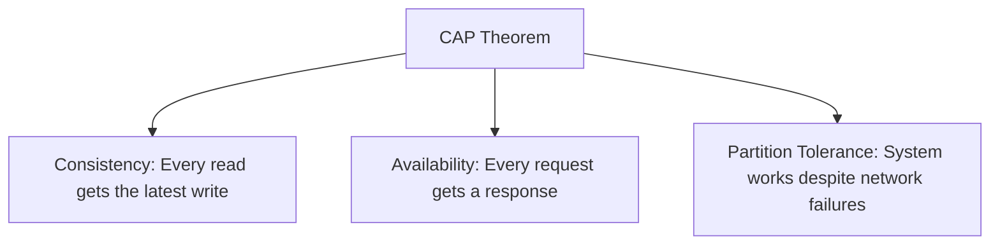
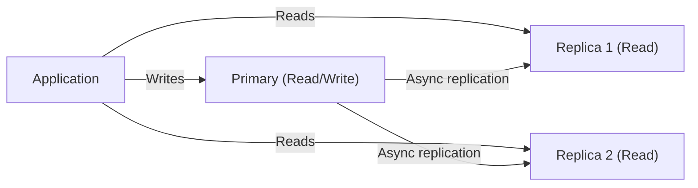

# Chapter 3: Databases

> Choosing the right database is one of the most impactful architectural decisions — get it right and the system scales naturally; get it wrong and you'll rewrite everything.

## Why This Matters for UI Architects

As a UI architect, you need to understand databases because they directly shape your API contracts, data models, and query patterns. The database choice determines whether you can do real-time subscriptions, full-text search, complex filtering, or geo-queries — all features your UI will expose to users.

---

## SQL vs NoSQL: The Fundamental Choice

### Relational Databases (SQL)

Data organized in **tables with rows and columns**, connected via foreign keys.

| Feature | Detail |
|---|---|
| Schema | Fixed, enforced (ALTER TABLE to change) |
| Query language | SQL (standardized, powerful) |
| Relationships | Native (JOINs) |
| Transactions | Full ACID |
| Scaling | Primarily vertical; horizontal via sharding (complex) |
| Examples | PostgreSQL, MySQL, SQL Server, Oracle |

**When to use SQL:**
- Data has clear relationships (users → orders → items)
- You need complex queries (JOINs, aggregations, window functions)
- Data integrity is critical (financial transactions, inventory)
- You need ACID transactions

### Non-Relational Databases (NoSQL)

Multiple data models — no one-size-fits-all.

| Type | Model | Examples | Best For |
|---|---|---|---|
| **Document** | JSON-like documents | MongoDB, Firestore, CouchDB | Flexible schema, nested data, content management |
| **Key-Value** | Simple key → value pairs | Redis, DynamoDB, Memcached | Caching, sessions, simple lookups |
| **Wide-Column** | Rows with dynamic columns | Cassandra, HBase, ScyllaDB | Time-series, IoT, write-heavy workloads |
| **Graph** | Nodes + edges | Neo4j, Amazon Neptune | Social networks, recommendations, fraud detection |
| **Search** | Inverted index | Elasticsearch, Solr, Meilisearch | Full-text search, log analysis, autocomplete |
| **Time-Series** | Timestamp-indexed | InfluxDB, TimescaleDB, Prometheus | Metrics, monitoring, analytics |

**When to use NoSQL:**
- Schema changes frequently (early-stage product, rapid iteration)
- Data is denormalized or nested (product catalog with varying attributes)
- You need horizontal scaling with simple access patterns
- Specific workload match (search → Elasticsearch, cache → Redis)

### Decision Matrix

```
Need ACID transactions?
├── Yes → SQL (PostgreSQL, MySQL)
└── No
    ├── Need flexible schema? → Document DB (MongoDB)
    ├── Need sub-ms lookups? → Key-Value (Redis)
    ├── Need full-text search? → Search engine (Elasticsearch)
    ├── Need relationship traversal? → Graph DB (Neo4j)
    ├── Need massive write throughput? → Wide-column (Cassandra)
    └── Need time-series analytics? → Time-series DB (TimescaleDB)
```

---

## ACID vs BASE

### ACID (SQL databases)

| Property | Meaning | Example |
|---|---|---|
| **Atomicity** | All or nothing — transaction fully completes or fully rolls back | Transfer $100: both debit and credit succeed, or neither does |
| **Consistency** | DB moves from one valid state to another | Balance can't go negative if constraint exists |
| **Isolation** | Concurrent transactions don't interfere | Two people buying the last item — only one succeeds |
| **Durability** | Committed data survives crashes | Power failure after commit → data is safe |

### BASE (NoSQL databases)

| Property | Meaning |
|---|---|
| **Basically Available** | System guarantees availability (may serve stale data) |
| **Soft state** | State may change over time without input (due to propagation) |
| **Eventually consistent** | Given enough time, all replicas converge to same value |

**Trade-off:** ACID gives you correctness guarantees but limits scale. BASE gives you scale and availability but requires your application to handle inconsistency.

---

## CAP Theorem

In a distributed system, you can only guarantee **two** of three properties during a network partition:



| Choice | Sacrifice | Example | Behavior During Partition |
|---|---|---|---|
| **CP** | Availability | MongoDB, HBase, Redis Cluster | Returns error rather than stale data |
| **AP** | Consistency | Cassandra, DynamoDB, CouchDB | Returns possibly stale data but always responds |
| **CA** | Partition tolerance | Single-node RDBMS | Not practical in distributed systems |

**Practical reality:** Network partitions *will* happen. So the real choice is CP vs AP. Most modern systems let you tune this per-operation (e.g., Cassandra's tunable consistency).

**UI Architect perspective:** If your frontend shows a "like count," eventual consistency is fine (AP). If it shows "account balance," you need strong consistency (CP). Design your UI to handle both — show optimistic updates for AP scenarios and loading states for CP scenarios.

---

## Indexing

Indexes speed up reads at the cost of slower writes and extra storage.

### B-Tree Index (Default)

The most common index type. A balanced tree structure that keeps data sorted.

```
                    [50]
                   /    \
              [20,30]   [70,80]
             /  |  \    /  |  \
          [10] [25] [35] [60] [75] [90]
```

- **Lookup:** O(log n)
- **Range queries:** Efficient (data is sorted)
- **Best for:** Equality checks (`WHERE id = 5`), range queries (`WHERE date > '2024-01-01'`)

### Hash Index

Hash function maps key directly to location.

- **Lookup:** O(1)
- **Range queries:** Not supported
- **Best for:** Exact match lookups (`WHERE email = 'user@example.com'`)

### Composite Index

Index on multiple columns. **Order matters.**

```sql
CREATE INDEX idx_user_status_date ON orders(user_id, status, created_at);
```

This index efficiently serves:
- `WHERE user_id = 5` (uses first column)
- `WHERE user_id = 5 AND status = 'active'` (uses first two)
- `WHERE user_id = 5 AND status = 'active' AND created_at > '2024-01-01'` (uses all three)

But NOT:
- `WHERE status = 'active'` (can't skip first column)
- `WHERE created_at > '2024-01-01'` (can't skip first two columns)

**This is the "leftmost prefix" rule.**

### Full-Text Index

For searching within text content. Uses inverted indexes (word → list of documents).

```sql
CREATE INDEX idx_search ON articles USING GIN(to_tsvector('english', title || ' ' || body));
```

For heavy search workloads, delegate to Elasticsearch or Meilisearch instead.

### Indexing Strategy

| Scenario | Index Type |
|---|---|
| Primary key lookup | B-tree (auto-created) |
| Filtering by status/type | B-tree on enum column |
| Date range queries | B-tree on timestamp |
| Email/username lookup | Hash or B-tree (unique) |
| Multi-column filter | Composite index (most selective first) |
| Full-text search | GIN/GiST or dedicated search engine |
| Geo-spatial queries | R-tree / GiST |

---

## Partitioning

Splitting a table's data into smaller, manageable pieces.

### Horizontal Partitioning (Sharding)

Split **rows** across partitions. Each partition has the same schema but different rows.

```
Users Table (100M rows)
├── Partition 1: user_id 1 - 25M       (Shard A)
├── Partition 2: user_id 25M - 50M     (Shard B)
├── Partition 3: user_id 50M - 75M     (Shard C)
└── Partition 4: user_id 75M - 100M    (Shard D)
```

### Vertical Partitioning

Split **columns** across tables. Common columns stay together, rarely-used or large columns move to separate tables.

```
users_core: id, name, email, created_at (frequently accessed)
users_profile: id, bio, avatar_url, preferences (occasionally accessed)
users_activity: id, last_login, login_count (analytics)
```

**UI Architect insight:** Vertical partitioning maps naturally to API design. Your user list endpoint returns `users_core` data. The profile page fetches `users_profile` on demand. This reduces payload size and improves perceived performance.

---

## Replication Patterns

### Single-Leader (Master-Slave)



- All writes go to one leader
- Replicas handle reads
- **Replication lag:** Replicas may be milliseconds to seconds behind
- **Failover:** If leader dies, promote a replica (can lose uncommitted writes)

### Multi-Leader

- Multiple nodes accept writes
- Conflict resolution needed (last-write-wins, merge, custom logic)
- Used for: multi-region deployments, collaborative editing

### Leaderless

- Any node accepts reads and writes
- Uses quorum: `W + R > N` guarantees consistency
  - N=3 nodes, W=2 (write to 2), R=2 (read from 2) → guaranteed to read latest write
- Examples: Cassandra, DynamoDB

---

## Denormalization

Intentionally duplicating data to avoid JOINs and speed up reads.

**Normalized (3NF):**

```
orders: id, user_id, total
users: id, name, email
-- Need JOIN to get order with user name
```

**Denormalized:**

```
orders: id, user_id, user_name, user_email, total
-- No JOIN needed, but user_name must be updated in two places
```

**When to denormalize:**
- Read-heavy workload (100:1 read/write ratio)
- JOIN performance is a bottleneck
- Acceptable to have slightly stale duplicated data
- NoSQL databases (no JOINs available)

**UI Architect relevance:** Denormalized APIs are faster for the frontend. Instead of making 3 API calls (user + orders + products), a denormalized endpoint returns everything in one response. This is exactly what GraphQL and BFF (Backend For Frontend) patterns solve.

---

## Choosing the Right Database

### Decision Framework

| Question | If Yes | If No |
|---|---|---|
| Structured data with relationships? | SQL (PostgreSQL) | Consider NoSQL |
| Need full ACID transactions? | SQL | BASE is acceptable |
| Schema changes frequently? | Document DB (MongoDB) | SQL with migrations |
| Massive write throughput needed? | Wide-column (Cassandra) | SQL handles most write loads |
| Need sub-millisecond reads? | Key-value (Redis) | B-tree index in SQL |
| Full-text search is core feature? | Search engine (Elasticsearch) | SQL full-text or LIKE |
| Graph relationships (friends-of-friends)? | Graph DB (Neo4j) | SQL with recursive CTEs |
| Time-series data (metrics, events)? | TimescaleDB, InfluxDB | SQL with partitioning |

### The Pragmatic Default

**Start with PostgreSQL.** It handles 90% of use cases:
- Relational data with ACID
- JSON columns for flexible schema (`jsonb`)
- Full-text search (basic)
- Geo-spatial queries (PostGIS)
- Time-series (with partitioning)
- Pub/sub (LISTEN/NOTIFY)

Add specialized databases only when PostgreSQL becomes the bottleneck for a specific workload.

---

## Interview Tips

1. **Don't just say "I'd use MongoDB"** — Explain *why*. "The schema is fluid — products have varying attributes. A document model avoids sparse columns and schema migrations during rapid iteration."

2. **Know the CAP trade-off for your choice** — "Cassandra is AP, so during a partition, reads may return stale data. For our feed use case, that's acceptable."

3. **Mention the migration path** — "We start with PostgreSQL. If search becomes a bottleneck, we add Elasticsearch alongside it, syncing via change data capture."

4. **Indexes are a common deep-dive** — Be ready to design indexes for given query patterns. Always mention the read/write trade-off.

5. **As a UI architect**, mention how DB choice affects the API layer: "With a document DB, our API can return nested objects directly. With SQL, we'd need JOINs or a BFF layer to aggregate."

---

## Key Takeaways

- SQL for structured, relational data with ACID needs; NoSQL for specific workloads (search, cache, time-series, graphs)
- CAP theorem: during partitions, choose consistency (CP) or availability (AP) — design your UI for both
- ACID guarantees correctness; BASE trades correctness for scalability
- Indexing is the single most impactful performance optimization — know B-tree, hash, and composite indexes
- Replication scales reads; sharding scales writes — use replication first, shard only when necessary
- Denormalization speeds reads at the cost of write complexity — matches well with read-heavy frontends
- Default to PostgreSQL, add specialized databases when a specific bottleneck demands it
