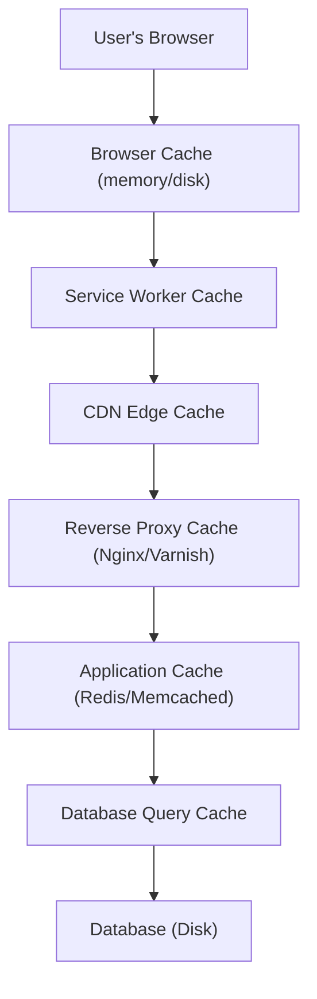
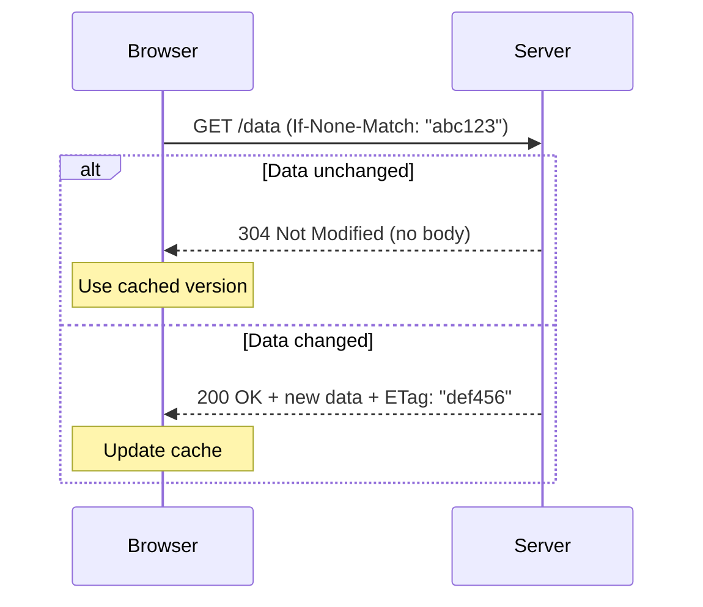
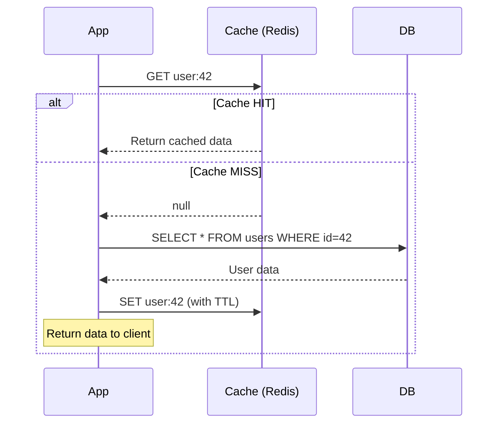
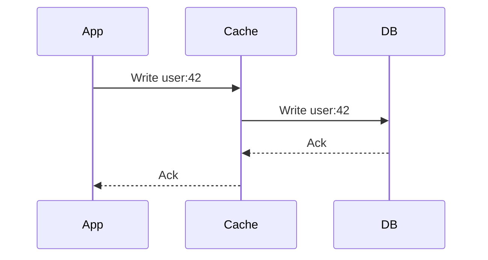
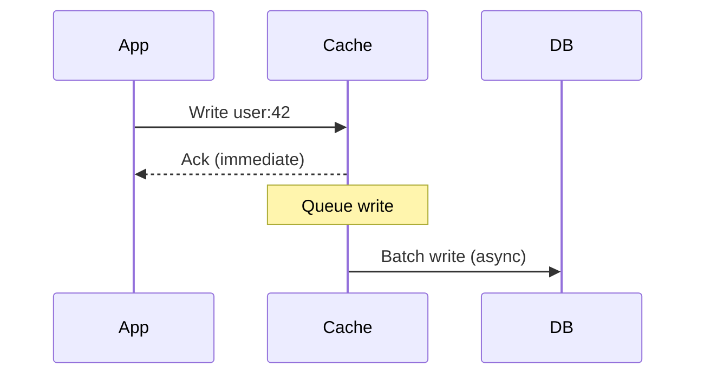
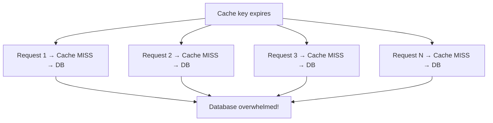

# Chapter 4: Caching

> The fastest request is the one you never make. Caching is the single most effective technique for reducing latency, lowering costs, and absorbing traffic spikes.

## Why This Matters for UI Architects

Caching exists at every layer of the stack, and a UI architect operates across most of them — from browser cache and service workers to CDN configuration and API response caching. Understanding caching deeply means you can design systems that feel instant to users while minimizing server load.

---

## Cache Layers: From Browser to Database



Each layer catches requests before they hit the next, more expensive layer.

| Layer | Latency | Scope | Controlled By |
|---|---|---|---|
| **Browser cache** | 0ms (memory), ~5ms (disk) | Single user | Cache-Control headers, you |
| **Service worker** | ~2ms | Single user | You (JS code) |
| **CDN edge** | ~20-50ms | All users in region | Cache headers + CDN config |
| **Reverse proxy** | ~1-5ms | All users on that server | Ops/Infra team |
| **Application cache** | ~1-5ms (Redis) | All users | Backend team |
| **DB query cache** | ~1ms | Per DB instance | DBA / auto |

### Browser Cache (Your Primary Weapon)

As a UI architect, the browser cache is your most impactful caching layer.

**Cache-Control header directives:**

```
Cache-Control: public, max-age=31536000, immutable
```

| Directive | Meaning |
|---|---|
| `public` | Any cache (CDN, proxy, browser) can store this |
| `private` | Only browser can cache (user-specific data) |
| `max-age=N` | Fresh for N seconds |
| `s-maxage=N` | CDN/proxy specific max-age (overrides max-age for shared caches) |
| `no-cache` | Cache it, but revalidate with server before using |
| `no-store` | Don't cache at all (sensitive data) |
| `immutable` | Never revalidate, even on reload |
| `stale-while-revalidate=N` | Serve stale for N seconds while fetching fresh copy |
| `must-revalidate` | Once stale, must revalidate (don't serve stale) |

**Optimal strategy for static assets:**

```
# Hashed assets (main.a1b2c3.js, styles.x7y8z9.css)
Cache-Control: public, max-age=31536000, immutable

# HTML entry point (index.html)
Cache-Control: no-cache

# API responses (user-specific)
Cache-Control: private, max-age=0, must-revalidate

# Semi-static API (product catalog)
Cache-Control: public, max-age=300, stale-while-revalidate=60
```

### ETag and Conditional Requests

When `max-age` expires, the browser can **revalidate** instead of re-downloading:



- **ETag:** Hash of response content, sent with response
- **If-None-Match:** Browser sends cached ETag, server checks if still valid
- **304 response:** No body, saves bandwidth
- **Last-Modified / If-Modified-Since:** Date-based alternative to ETag

### Service Worker Cache

Programmable cache layer that intercepts network requests:

```typescript
// Cache-first strategy (offline-capable)
self.addEventListener('fetch', (event) => {
  event.respondWith(
    caches.match(event.request).then((cached) => {
      return cached || fetch(event.request).then((response) => {
        const clone = response.clone();
        caches.open('v1').then((cache) => cache.put(event.request, clone));
        return response;
      });
    })
  );
});
```

**Common strategies:**

| Strategy | Behavior | Use For |
|---|---|---|
| **Cache First** | Check cache, fallback to network | Static assets, fonts |
| **Network First** | Try network, fallback to cache | API data, fresh content |
| **Stale While Revalidate** | Serve cache immediately, update in background | Semi-static content |
| **Network Only** | Always fetch from network | Real-time data, auth |
| **Cache Only** | Only serve from cache | Offline shell, pre-cached assets |

---

## Application-Level Caching Strategies

### Cache-Aside (Lazy Loading)

The most common pattern. Application manages the cache explicitly.



- **Pros:** Only caches what's actually requested, cache failure doesn't break the app
- **Cons:** Cache miss = 3 round trips (check cache, query DB, write cache), possible stale data

### Read-Through

Cache sits in front of DB. On miss, cache itself fetches from DB.

- **Pros:** Simpler application code (just talk to cache)
- **Cons:** Cache must know how to query DB, harder to implement custom logic

### Write-Through

Every write goes to cache AND database synchronously.



- **Pros:** Cache is always consistent with DB
- **Cons:** Higher write latency (two writes), caches data that may never be read

### Write-Behind (Write-Back)

Write to cache immediately, asynchronously flush to DB.



- **Pros:** Lowest write latency, can batch writes to DB
- **Cons:** Data loss risk if cache crashes before flushing, eventual consistency

### Strategy Comparison

| Strategy | Read Latency | Write Latency | Consistency | Complexity |
|---|---|---|---|---|
| Cache-Aside | Miss is slow | N/A (writes bypass cache) | May be stale | Low |
| Read-Through | Miss is slow | N/A | May be stale | Medium |
| Write-Through | Fast (always cached) | High (double write) | Strong | Medium |
| Write-Behind | Fast | Low (async) | Eventual | High |

---

## Cache Eviction Policies

When the cache is full, which items do you remove?

| Policy | Evicts | Best For |
|---|---|---|
| **LRU** (Least Recently Used) | Oldest accessed item | General purpose, most common |
| **LFU** (Least Frequently Used) | Least accessed item overall | Stable popularity distribution |
| **FIFO** (First In, First Out) | Oldest inserted item | Simple, predictable |
| **TTL** (Time To Live) | Expired items | Time-sensitive data |
| **Random** | Random item | Surprisingly effective, no tracking overhead |

**LRU** is the default choice in most systems (Redis, Memcached, browser cache).

**TTL** is often combined with LRU — items expire after a set time even if frequently accessed, preventing stale data from living forever.

---

## Cache Invalidation

> "There are only two hard things in Computer Science: cache invalidation and naming things." — Phil Karlton

### Invalidation Strategies

| Strategy | How | Pros | Cons |
|---|---|---|---|
| **TTL expiry** | Set time-to-live on cache entry | Simple, automatic | Data may be stale until TTL expires |
| **Event-driven** | Invalidate on write/update event | Near real-time freshness | Complex, need event system |
| **Version-based** | Append version to cache key (`user:42:v3`) | Simple, no race conditions | Must track versions |
| **Pub/Sub** | Publish invalidation message to all cache nodes | Works in distributed systems | Infrastructure overhead |

### Common Pitfalls

**1. Cache Stampede (Thundering Herd)**

When a popular cache key expires, hundreds of requests simultaneously hit the database.



**Solutions:**
- **Lock/Mutex:** First request acquires lock, others wait for cache fill
- **Stale-while-revalidate:** Serve stale data while one request refreshes
- **Probabilistic early expiry:** Randomly refresh before TTL (jitter)
- **Background refresh:** Proactively refresh popular keys before expiry

**2. Cache Penetration**

Requests for data that doesn't exist in DB (e.g., invalid IDs). Every request goes through cache to DB.

**Solutions:**
- Cache null results with short TTL (`user:999 → NULL, TTL=60s`)
- Bloom filter in front of cache (probabilistic check: "does this key possibly exist?")

**3. Cache Breakdown**

A single hot key expires and all traffic for that key hits DB.

**Solutions:**
- Never expire hot keys (refresh in background)
- Use a mutex/lock for that specific key

---

## Distributed Caching

### Redis vs Memcached

| Feature | Redis | Memcached |
|---|---|---|
| Data structures | Strings, lists, sets, hashes, sorted sets, streams | Strings only |
| Persistence | RDB snapshots, AOF log | None (volatile) |
| Replication | Built-in master-replica | None (use client-side sharding) |
| Cluster mode | Redis Cluster (auto-sharding) | Client-side consistent hashing |
| Pub/Sub | Yes | No |
| Lua scripting | Yes | No |
| Memory efficiency | Moderate | Better for simple key-value |
| Multi-threading | Single-threaded (6.0+ has I/O threads) | Multi-threaded |

**Default choice:** Redis (more versatile, better ecosystem)
**Choose Memcached when:** Simple key-value caching at scale with better memory efficiency

---

## Caching for UI Architects: Practical Patterns

### 1. API Response Caching

```typescript
// SWR (stale-while-revalidate) pattern in frontend
const { data, isLoading } = useSWR('/api/products', fetcher, {
  revalidateOnFocus: false,
  dedupingInterval: 60000, // 60s dedup
});
```

### 2. Optimistic UI Updates

Show the expected result immediately, cache the optimistic state, revert on failure:

```typescript
// Optimistic update pattern
async function likePost(postId: string) {
  // Immediately update UI (optimistic)
  updateCache(postId, (post) => ({ ...post, likes: post.likes + 1 }));

  try {
    await api.post(`/posts/${postId}/like`);
  } catch {
    // Revert on failure
    updateCache(postId, (post) => ({ ...post, likes: post.likes - 1 }));
    showError('Failed to like post');
  }
}
```

### 3. Prefetching

Cache data before the user needs it:

```typescript
// Prefetch on hover (link prefetching)
function ProductCard({ product }) {
  const prefetch = () => {
    queryClient.prefetchQuery(['product', product.id], () =>
      fetchProduct(product.id)
    );
  };

  return (
    <Link href={`/products/${product.id}`} onMouseEnter={prefetch}>
      {product.name}
    </Link>
  );
}
```

### 4. Normalized Client Cache

Store entities once, reference by ID (like Redux normalized state or Apollo Client):

```typescript
// Normalized cache structure
{
  users: {
    "u1": { id: "u1", name: "Alice" },
    "u2": { id: "u2", name: "Bob" }
  },
  posts: {
    "p1": { id: "p1", authorId: "u1", title: "Hello" }
  }
}
// Updating user "u1" automatically updates everywhere it's referenced
```

---

## Interview Tips

1. **Always specify TTL** — "I'd cache this with a 5-minute TTL. For a news feed, staleness of a few minutes is acceptable."

2. **Mention the invalidation strategy** — Caching without invalidation is incomplete. "On user profile update, I'd invalidate the cache key and publish an event for distributed cache nodes."

3. **Know the numbers** — Redis can handle ~100K ops/sec on a single node. Memcached can handle ~200K+. In-memory browser cache is essentially instant.

4. **Layer your caches** — "Static assets cached at CDN with immutable headers. API responses cached in Redis with 5-min TTL. Client-side cache with SWR for optimistic reads."

5. **Connect to UX** — "Stale-while-revalidate gives users instant responses while keeping data fresh in the background. The UI shows a subtle refresh indicator when revalidating."

---

## Key Takeaways

- Caching exists at every layer — browser, service worker, CDN, proxy, application, database
- Browser cache (via Cache-Control headers) is the highest-impact layer for UI architects
- Cache-aside is the most common server-side pattern; write-through for strong consistency
- LRU + TTL is the default eviction strategy; tune TTL based on data freshness requirements
- Cache invalidation is the hardest problem — use TTL as a safety net, event-driven for precision
- Guard against stampede (mutex/stale-while-revalidate), penetration (cache nulls), and breakdown (never-expire hot keys)
- Redis is the default distributed cache; Memcached for simple, high-throughput key-value
- Frontend caching patterns — SWR, optimistic updates, prefetching, normalized cache — directly improve perceived performance
