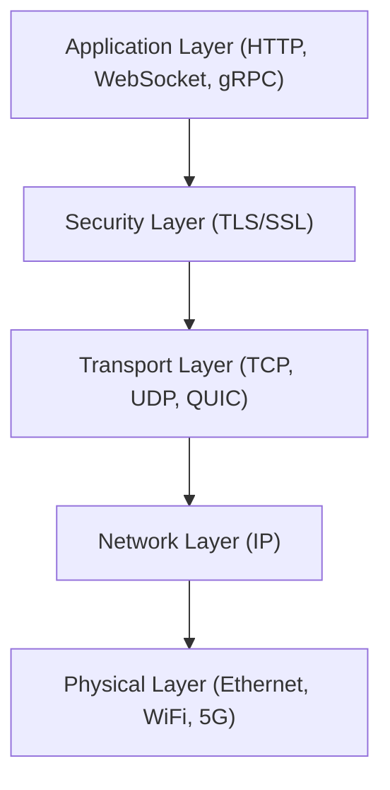
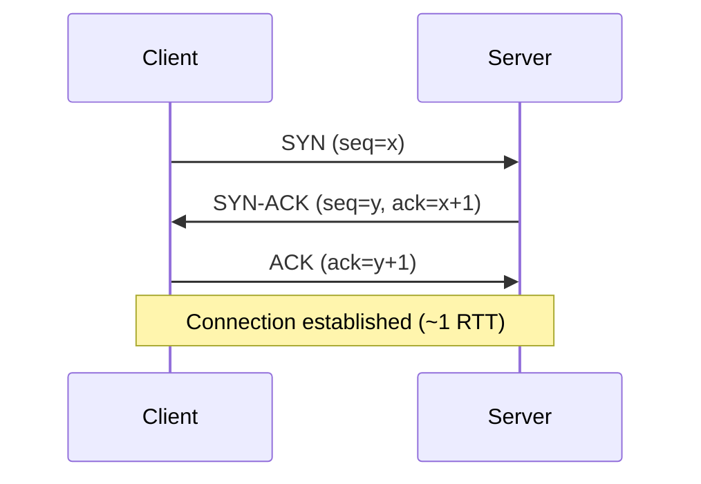
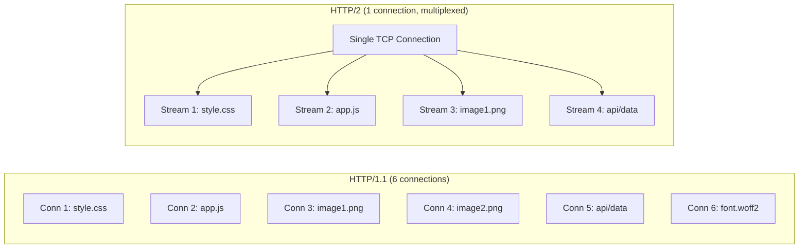
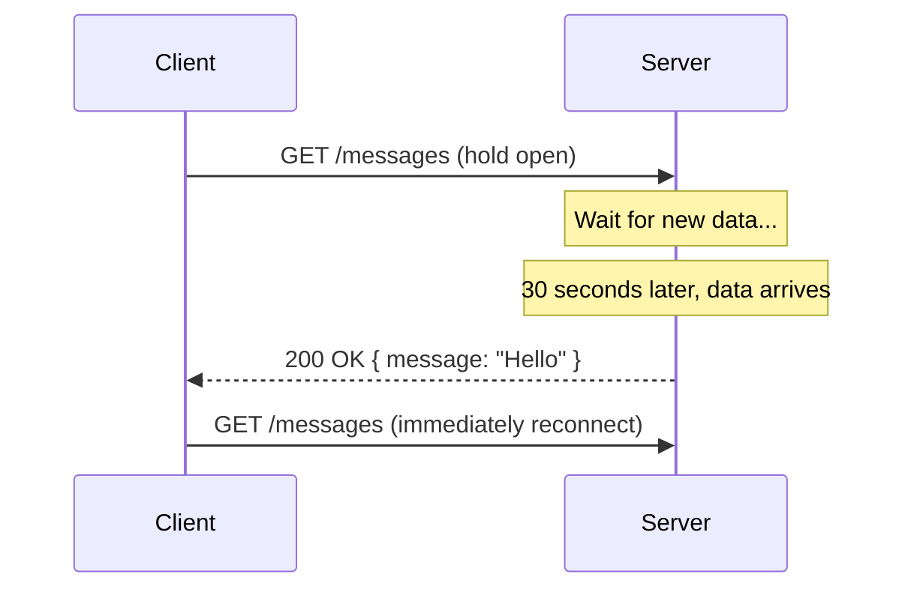
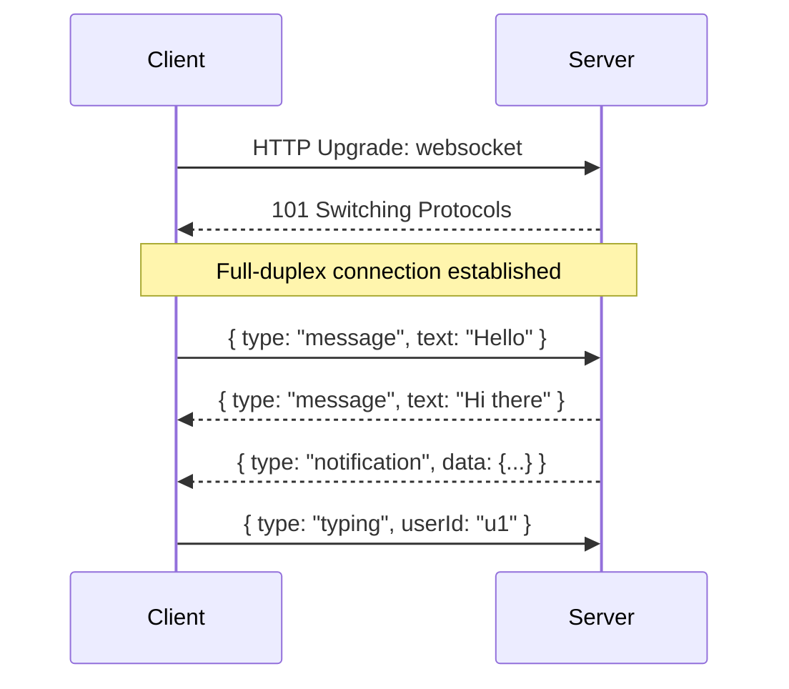
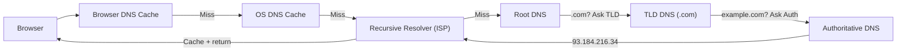

# Chapter 5: Networking & Protocols

> Understanding the wires beneath the web — every millisecond of latency your users feel starts with a protocol choice.

## Why This Matters for UI Architects

Every API call, WebSocket connection, asset download, and real-time update your UI makes travels over a network protocol. Choosing between REST and GraphQL, HTTP/2 and HTTP/3, WebSocket and SSE — these decisions directly affect performance, reliability, and user experience. A UI architect must speak fluently about protocols.

---

## The Network Stack (Simplified)



Your decisions as a UI architect primarily concern the **Application** and **Security** layers, but understanding Transport helps explain latency and reliability trade-offs.

---

## TCP vs UDP

| Feature | TCP | UDP |
|---|---|---|
| Connection | Connection-oriented (handshake) | Connectionless |
| Reliability | Guaranteed delivery, ordered | Best-effort, unordered |
| Flow control | Yes (sliding window) | No |
| Overhead | Higher (headers, acks, retransmits) | Minimal |
| Latency | Higher (handshake + acks) | Lower |
| Use cases | HTTP, WebSocket, email, file transfer | Video streaming, gaming, DNS, VoIP |

### TCP Three-Way Handshake



This handshake adds one round-trip time (RTT) before any data flows. On a 100ms RTT connection, that's 100ms of "nothing" before the first byte.

**With TLS (HTTPS), add another 1-2 RTTs** for the TLS handshake — totaling 200-300ms before data transfer begins.

---

## HTTP Evolution

### HTTP/1.1

- **One request per TCP connection** (or pipelining, which nobody uses due to head-of-line blocking)
- Browsers open 6 parallel connections per domain
- Workarounds: domain sharding, sprite sheets, inlining CSS/JS

**Head-of-Line (HOL) Blocking:** If the first request is slow, all queued requests on that connection wait.

### HTTP/2

Major upgrade solving HTTP/1.1's limitations:

| Feature | Benefit |
|---|---|
| **Multiplexing** | Multiple requests/responses over a single TCP connection, no HOL at HTTP layer |
| **Header compression** (HPACK) | Headers are compressed, reducing overhead for repeated headers |
| **Server push** | Server proactively sends resources before client requests them |
| **Stream prioritization** | Client hints which resources are most important |
| **Binary framing** | More efficient parsing than text-based HTTP/1.1 |



**Remaining problem:** TCP-level HOL blocking. If a TCP packet is lost, ALL streams on that connection stall while TCP retransmits.

### HTTP/3 (QUIC)

Built on **UDP** instead of TCP, using the QUIC protocol (designed by Google).

| Feature | Benefit |
|---|---|
| **No TCP HOL blocking** | Lost packets only affect their stream, not others |
| **0-RTT connection setup** | Combines transport + TLS handshake; repeat visits skip handshake entirely |
| **Connection migration** | Survives IP changes (WiFi → cellular) without reconnecting |
| **Built-in encryption** | TLS 1.3 mandatory, no unencrypted QUIC |

**UI Architect impact:**
- HTTP/3 eliminates the need for domain sharding hacks
- 0-RTT dramatically helps mobile users on slow connections
- Connection migration means fewer broken requests during network changes
- Most CDNs (Cloudflare, Akamai, Fastly) support HTTP/3 today

### HTTP Version Comparison

| Feature | HTTP/1.1 | HTTP/2 | HTTP/3 |
|---|---|---|---|
| Transport | TCP | TCP | QUIC (UDP) |
| Multiplexing | No (6 connections) | Yes | Yes |
| HOL blocking | HTTP + TCP | TCP only | None |
| Header compression | None | HPACK | QPACK |
| Connection setup | 2-3 RTTs (TCP+TLS) | 2-3 RTTs | 0-1 RTTs |
| Server push | No | Yes | Yes |
| Encryption | Optional | Practically required | Mandatory |

---

## Real-Time Communication Protocols

### Polling

Simplest approach: client periodically asks server for updates.

```
Client: GET /messages?since=timestamp   (every 5 seconds)
Server: 200 OK { messages: [] }         (usually empty)
```

- **Pros:** Simple, works everywhere, stateless
- **Cons:** Wasteful (most requests return nothing), latency = polling interval
- **Use when:** Low-frequency updates, simple systems, < 1000 clients

### Long Polling

Client sends request, server holds it open until there's data (or timeout).



- **Pros:** Near real-time, works through firewalls/proxies
- **Cons:** Server holds connections open (resource cost), reconnection overhead
- **Use when:** Need real-time but WebSocket isn't an option (legacy systems)

### Server-Sent Events (SSE)

Server pushes events to client over a single HTTP connection. **Unidirectional** (server → client only).

```typescript
// Server (Node.js)
res.writeHead(200, {
  'Content-Type': 'text/event-stream',
  'Cache-Control': 'no-cache',
  'Connection': 'keep-alive',
});

// Send events
res.write(`data: ${JSON.stringify({ type: 'update', value: 42 })}\n\n`);

// Client (Browser)
const source = new EventSource('/api/stream');
source.onmessage = (event) => {
  const data = JSON.parse(event.data);
  updateUI(data);
};
```

- **Pros:** Simple API (EventSource), auto-reconnect built in, works over HTTP/2
- **Cons:** Unidirectional (client can't send via SSE), text-only, limited to ~6 connections in HTTP/1.1
- **Use when:** Real-time feeds, notifications, live dashboards, stock tickers

### WebSocket

Full-duplex, bidirectional communication over a single TCP connection.



- **Pros:** True bidirectional, low latency, efficient (no HTTP overhead per message)
- **Cons:** Stateful (harder to scale), need heartbeat/reconnection logic, proxy/firewall issues
- **Use when:** Chat, collaborative editing, gaming, real-time dashboards with client interactions

### gRPC

Google's RPC framework using Protocol Buffers over HTTP/2.

| Feature | Detail |
|---|---|
| Serialization | Protocol Buffers (binary, compact) |
| Transport | HTTP/2 |
| Streaming | Unary, server streaming, client streaming, bidirectional |
| Code generation | Auto-generates client/server stubs from `.proto` files |
| Performance | 7-10x faster serialization vs JSON |

- **Pros:** Strongly typed, fast, streaming support, great for service-to-service
- **Cons:** Not natively supported in browsers (need gRPC-Web proxy), binary is harder to debug
- **Use when:** Microservice communication, high-performance internal APIs

### Protocol Comparison for Real-Time

| Feature | Polling | Long Polling | SSE | WebSocket | gRPC Stream |
|---|---|---|---|---|---|
| Direction | Client → Server | Client → Server | Server → Client | Bidirectional | Bidirectional |
| Latency | Polling interval | Near real-time | Real-time | Real-time | Real-time |
| Complexity | Trivial | Low | Low | Medium | High |
| Browser support | Universal | Universal | Very good | Very good | Needs proxy |
| Scalability | Poor (wasteful) | Moderate | Good | Moderate (stateful) | Good |
| Through proxies | Easy | Easy | Easy | Sometimes blocked | Needs HTTP/2 |

---

## DNS Resolution

Every request starts with DNS (Domain Name System) translating a hostname to an IP address.



**DNS performance tips for UI architects:**
- **dns-prefetch:** `<link rel="dns-prefetch" href="//api.example.com">`
- **preconnect:** `<link rel="preconnect" href="https://api.example.com">` (DNS + TCP + TLS)
- **Reduce DNS lookups:** Fewer domains = fewer DNS resolutions = faster page load
- **DNS TTL:** Lower TTL (60s) for faster failover; higher TTL (3600s) for fewer lookups

---

## TLS/SSL

Every HTTPS connection requires a TLS handshake to establish encryption.

### TLS 1.2 vs TLS 1.3

| Feature | TLS 1.2 | TLS 1.3 |
|---|---|---|
| Handshake RTTs | 2 RTTs | 1 RTT (0-RTT for repeat visits) |
| Cipher suites | Many (some insecure) | Only 5 (all secure) |
| Forward secrecy | Optional | Mandatory |
| Performance | Slower | Faster |

**TLS 1.3 with 0-RTT:** On repeat visits, the client can send encrypted data immediately with the first packet. This eliminates handshake latency entirely for returning users.

**UI Architect tip:** Always use TLS 1.3. The performance improvement (1 fewer RTT) is especially noticeable on mobile networks with 200ms+ RTTs.

---

## Connection Optimization

### Keep-Alive

Reuse TCP connections for multiple HTTP requests instead of opening a new connection each time.

```
Connection: keep-alive
Keep-Alive: timeout=30, max=100
```

Default in HTTP/1.1. Essential — a new TCP+TLS connection costs 2-3 RTTs.

### HTTP/2 Multiplexing

Single connection handles all requests/responses in parallel. No need for:
- Domain sharding
- Sprite sheets
- CSS/JS concatenation
- Inlining small assets

**Anti-patterns from HTTP/1.1 era that HURT HTTP/2 performance:**
- Domain sharding (creates more connections, loses multiplexing benefit)
- Bundling everything into one massive file (prevents cache granularity)

### Preload and Prefetch Hints

```html
<!-- Preload: fetch this resource immediately (current page needs it) -->
<link rel="preload" href="/fonts/Inter.woff2" as="font" crossorigin>

<!-- Prefetch: fetch this at low priority (future page might need it) -->
<link rel="prefetch" href="/next-page-data.json">

<!-- Preconnect: establish connection early -->
<link rel="preconnect" href="https://api.example.com">

<!-- Module preload: preload ES module -->
<link rel="modulepreload" href="/components/Dialog.js">
```

---

## Interview Tips

1. **Know the trade-offs** between real-time protocols: "For our notification system, I'd use SSE because it's server-to-client only, simpler than WebSocket, with built-in reconnection. WebSocket would be overkill since the client doesn't need to send real-time data."

2. **Mention HTTP versions** when discussing performance: "With HTTP/2, we don't need to bundle all JS into one file — multiplexing handles parallel downloads efficiently. Actually splitting into smaller chunks improves cache granularity."

3. **Quantify latency** impact: "A cold HTTP/1.1+TLS connection costs ~300ms on a 100ms RTT network. With HTTP/3 and 0-RTT, repeat visits eliminate this entirely."

4. **Connect to CDN strategy:** "We serve static assets from CDN edge nodes. DNS resolves to the nearest PoP, the edge terminates TLS, and serves cached content — total latency ~20ms vs ~200ms from origin."

5. **Show depth on WebSocket challenges:** "WebSocket connections are stateful, so we need sticky sessions or a pub/sub layer (Redis) for horizontal scaling. Each server publishes messages to Redis, and subscribers forward to their connected clients."

---

## Key Takeaways

- HTTP/2 multiplexes requests over a single connection — eliminates HTTP/1.1's workarounds
- HTTP/3 (QUIC over UDP) removes TCP's head-of-line blocking and adds 0-RTT connections
- Choose real-time protocols deliberately: SSE for server→client, WebSocket for bidirectional, polling for simplicity
- DNS resolution adds latency — use dns-prefetch and preconnect hints
- TLS 1.3 saves one RTT vs TLS 1.2 — always prefer it
- Connection optimization (keep-alive, multiplexing, preload hints) has direct UX impact
- gRPC is ideal for service-to-service; use REST or GraphQL for browser-facing APIs
- Every protocol choice has trade-offs — state them explicitly in interviews
