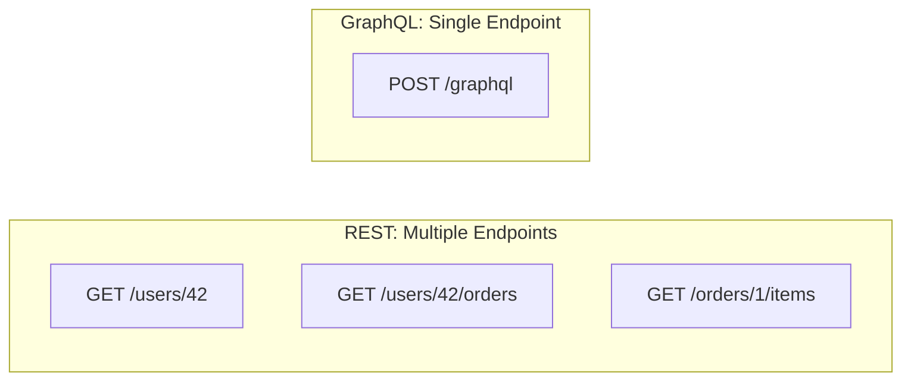
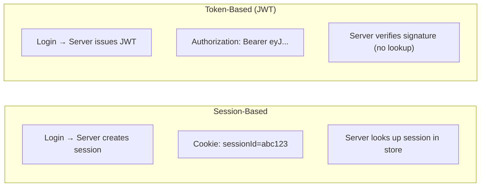
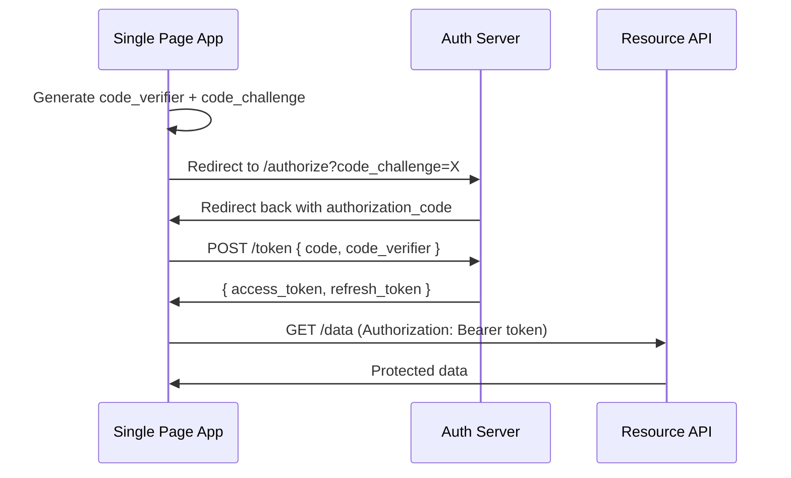
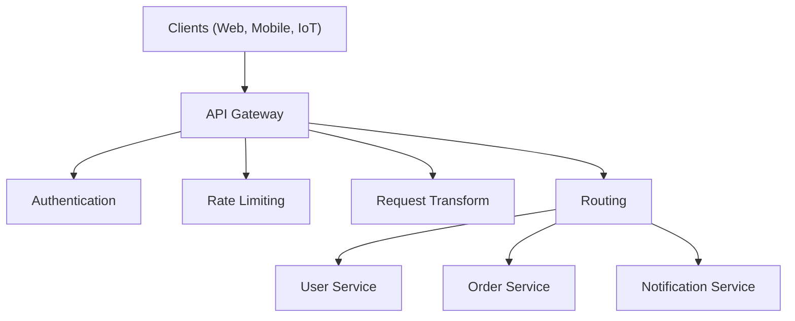
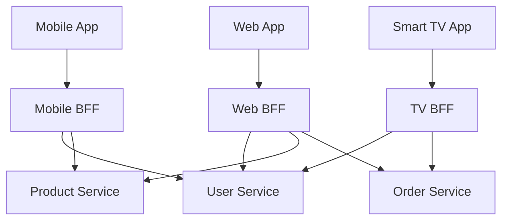

# Chapter 6: API Design

> The API is the contract between frontend and backend — a well-designed API makes the UI fast to build and easy to evolve; a poorly designed one creates endless workarounds.

## Why This Matters for UI Architects

As a UI architect, you are the **primary consumer** of APIs. You define what data the frontend needs, how it should be shaped, and how interactions flow. In many organizations, the UI architect drives API design through the Backend-for-Frontend (BFF) pattern or by collaborating directly with backend teams on contracts.

---

## REST: The Standard

REST (Representational State Transfer) is the most widely used API style. It models APIs around **resources** and uses HTTP methods as verbs.

### Core Principles

| Principle | Meaning | Example |
|---|---|---|
| **Resources** | Everything is a noun (resource) with a URL | `/users`, `/orders/42` |
| **HTTP methods** | Verbs define the operation | GET, POST, PUT, PATCH, DELETE |
| **Stateless** | Each request contains all needed information | Auth token in every request |
| **Uniform interface** | Consistent URL patterns and behaviors | Predictable, discoverable |
| **HATEOAS** | Responses include links to related actions | `{ "next": "/users?page=2" }` |

### HTTP Methods

| Method | Purpose | Idempotent | Safe | Example |
|---|---|---|---|---|
| **GET** | Read resource | Yes | Yes | `GET /users/42` |
| **POST** | Create resource | No | No | `POST /users` |
| **PUT** | Replace resource entirely | Yes | No | `PUT /users/42` |
| **PATCH** | Partial update | Yes* | No | `PATCH /users/42` |
| **DELETE** | Remove resource | Yes | No | `DELETE /users/42` |

**Idempotent** means calling it multiple times has the same effect as calling it once. `PUT /users/42 { name: "Alice" }` always results in the same state. `POST /users` creates a new user each time.

**UI Architect relevance:** Idempotency matters for retry logic. If a network request fails, you can safely retry idempotent requests (GET, PUT, DELETE) without side effects. POST requires idempotency keys.

### URL Design Best Practices

```
# Good
GET    /api/v1/users                    # List users
GET    /api/v1/users/42                 # Get user 42
POST   /api/v1/users                    # Create user
PUT    /api/v1/users/42                 # Update user 42
GET    /api/v1/users/42/orders          # User's orders (sub-resource)
POST   /api/v1/users/42/orders          # Create order for user

# Bad
GET    /api/v1/getUsers                 # Don't use verbs in URLs
POST   /api/v1/createUser              # Method IS the verb
GET    /api/v1/user/42                  # Use plural nouns
PUT    /api/v1/Users/42                 # Use lowercase
```

### Status Codes That Matter

| Code | Meaning | When To Use |
|---|---|---|
| **200** | OK | Successful GET, PUT, PATCH |
| **201** | Created | Successful POST (return Location header) |
| **204** | No Content | Successful DELETE |
| **301** | Moved Permanently | URL changed permanently (cached) |
| **304** | Not Modified | ETag/conditional request, use cached version |
| **400** | Bad Request | Invalid input (validation error) |
| **401** | Unauthorized | Missing or invalid authentication |
| **403** | Forbidden | Authenticated but not authorized |
| **404** | Not Found | Resource doesn't exist |
| **409** | Conflict | State conflict (duplicate, version mismatch) |
| **422** | Unprocessable Entity | Valid syntax but semantic error |
| **429** | Too Many Requests | Rate limited |
| **500** | Internal Server Error | Server bug |
| **502** | Bad Gateway | Upstream service failed |
| **503** | Service Unavailable | Server overloaded/maintenance |

### Response Structure

Consistent response envelope:

```json
{
  "data": {
    "id": "42",
    "name": "Alice",
    "email": "alice@example.com"
  },
  "meta": {
    "requestId": "req_abc123",
    "timestamp": "2025-01-15T10:30:00Z"
  }
}
```

Error response:

```json
{
  "error": {
    "code": "VALIDATION_ERROR",
    "message": "Email is required",
    "details": [
      { "field": "email", "message": "Must be a valid email address" }
    ]
  },
  "meta": {
    "requestId": "req_def456"
  }
}
```

---

## GraphQL: The Flexible Alternative

GraphQL lets clients request exactly the data they need — no more, no less.



### Core Concepts

**Schema (server defines what's available):**

```graphql
type User {
  id: ID!
  name: String!
  email: String!
  orders: [Order!]!
}

type Order {
  id: ID!
  total: Float!
  items: [OrderItem!]!
  createdAt: DateTime!
}

type Query {
  user(id: ID!): User
  users(page: Int, limit: Int): [User!]!
}

type Mutation {
  createUser(input: CreateUserInput!): User!
  updateUser(id: ID!, input: UpdateUserInput!): User!
}
```

**Query (client requests exactly what it needs):**

```graphql
query GetUserWithOrders {
  user(id: "42") {
    name
    email
    orders {
      id
      total
      items {
        name
        quantity
      }
    }
  }
}
```

One request, exact data shape, no over-fetching.

### REST vs GraphQL

| Aspect | REST | GraphQL |
|---|---|---|
| Endpoints | Multiple (one per resource) | Single (`/graphql`) |
| Data fetching | Server decides response shape | Client decides response shape |
| Over-fetching | Common (get all fields) | Eliminated (request exact fields) |
| Under-fetching | Common (need multiple calls) | Eliminated (nested queries) |
| Caching | HTTP caching (easy, URL-based) | Complex (POST requests, need client-side cache) |
| Versioning | URL or header versioning | Schema evolution (deprecate fields) |
| Learning curve | Low | Medium-High |
| Tooling | Universal | Specialized (Apollo, Relay, urql) |
| File uploads | Native (multipart) | Not built-in (need workarounds) |
| Real-time | Separate (WebSocket/SSE) | Subscriptions (built-in) |
| Error handling | HTTP status codes | Always 200, errors in response body |

### The N+1 Problem in GraphQL

```graphql
# This innocent query causes N+1 DB queries:
query {
  users {        # 1 query: SELECT * FROM users
    orders {     # N queries: SELECT * FROM orders WHERE user_id = ?
      items {    # N*M queries!
        name
      }
    }
  }
}
```

**Solution: DataLoader** — batches and deduplicates database calls within a single request.

```typescript
const orderLoader = new DataLoader(async (userIds) => {
  const orders = await db.query(
    'SELECT * FROM orders WHERE user_id IN (?)', [userIds]
  );
  return userIds.map(id => orders.filter(o => o.userId === id));
});
```

### When to Choose What

**Choose REST when:**
- Simple CRUD operations
- Strong HTTP caching is important
- Team is familiar with REST
- Public API (easier for third parties)

**Choose GraphQL when:**
- Multiple clients with different data needs (web, mobile, TV)
- Complex, nested data relationships
- Rapid UI iteration (frontend can change queries without backend changes)
- You're building a BFF layer

---

## Pagination

### Offset-Based (Traditional)

```
GET /api/users?page=3&limit=20
```

```json
{
  "data": [...],
  "pagination": {
    "page": 3,
    "limit": 20,
    "total": 1547,
    "totalPages": 78
  }
}
```

| Pros | Cons |
|---|---|
| Simple to implement | Slow on large datasets (OFFSET scans rows) |
| Jump to any page | Inconsistent when data changes (insertions shift pages) |
| Total count available | `COUNT(*)` can be expensive |

### Cursor-Based (Modern)

```
GET /api/users?limit=20&after=cursor_abc123
```

```json
{
  "data": [...],
  "pagination": {
    "hasNextPage": true,
    "endCursor": "cursor_def456"
  }
}
```

| Pros | Cons |
|---|---|
| Consistent (no skipped/duplicate items) | Can't jump to arbitrary page |
| Fast (uses index, no OFFSET scan) | No total count (without separate query) |
| Works well with real-time data | More complex client-side implementation |

**Decision:**
- **Table with page numbers** → Offset-based (user expects "Page 3 of 78")
- **Infinite scroll / feed** → Cursor-based (consistent, performant)

---

## API Versioning

| Strategy | Example | Pros | Cons |
|---|---|---|---|
| **URL path** | `/api/v1/users` | Clear, easy to route | URL changes, cache separation |
| **Query param** | `/api/users?version=2` | Optional | Easy to miss |
| **Header** | `Accept-Version: 2` | Clean URLs | Hidden, harder to test |
| **Content negotiation** | `Accept: application/vnd.api.v2+json` | RESTful | Verbose |

**Pragmatic default:** URL path versioning (`/api/v1/`). It's explicit, debuggable, and works well with CDN caching.

---

## Rate Limiting

Protect APIs from abuse and ensure fair usage.

### Common Algorithms

| Algorithm | How It Works | Pros | Cons |
|---|---|---|---|
| **Token Bucket** | Bucket fills at fixed rate, each request takes a token | Allows bursts, smooth | Token tracking overhead |
| **Leaky Bucket** | Requests processed at fixed rate, excess queued | Smooth output | Delays bursty traffic |
| **Fixed Window** | Count requests per time window (e.g., per minute) | Simple | Boundary spike (2× at window edge) |
| **Sliding Window Log** | Track each request timestamp, count in sliding window | Accurate | Memory-heavy |
| **Sliding Window Counter** | Weighted combo of current + previous window | Accurate + efficient | Slight approximation |

### Rate Limit Headers

```
HTTP/1.1 200 OK
X-RateLimit-Limit: 100
X-RateLimit-Remaining: 67
X-RateLimit-Reset: 1705312800
Retry-After: 30
```

**UI Architect responsibility:** Handle 429 responses gracefully:

```typescript
async function fetchWithRetry(url: string, retries = 3): Promise<Response> {
  const response = await fetch(url);

  if (response.status === 429) {
    const retryAfter = parseInt(response.headers.get('Retry-After') || '5');
    await new Promise(resolve => setTimeout(resolve, retryAfter * 1000));
    return fetchWithRetry(url, retries - 1);
  }

  return response;
}
```

---

## Authentication & Authorization

### Auth Patterns



| Aspect | Session-Based | JWT |
|---|---|---|
| Storage | Server-side (Redis/DB) | Client-side (cookie/header) |
| Stateful? | Yes (server maintains sessions) | No (self-contained token) |
| Scalability | Need shared session store | Scales easily (no server state) |
| Revocation | Easy (delete from store) | Hard (token valid until expiry) |
| Size | Small cookie (~20 bytes) | Large token (~800+ bytes) |
| CSRF risk | Yes (cookies auto-sent) | No (if in Authorization header) |
| XSS risk | Lower (httpOnly cookie) | Higher (if stored in localStorage) |

### OAuth 2.0 + PKCE (for SPAs)



**PKCE** (Proof Key for Code Exchange) prevents authorization code interception — essential for SPAs and mobile apps where client secrets can't be kept secret.

### Secure Token Storage

| Storage | XSS Safe | CSRF Safe | Recommendation |
|---|---|---|---|
| `localStorage` | No | Yes | Avoid for tokens |
| `sessionStorage` | No | Yes | Better, but still XSS vulnerable |
| httpOnly cookie | Yes | No (add CSRF token) | Best for access tokens |
| Memory (JS variable) | Yes | Yes | Best security, lost on refresh |

**Best practice for SPAs:**
1. Store access token in memory (short-lived, ~15 min)
2. Store refresh token in httpOnly secure cookie
3. On page load, use refresh token to get new access token
4. Add CSRF protection for cookie-based auth

---

## API Gateway

A single entry point that handles cross-cutting concerns for all APIs.



**Gateway responsibilities:**
- Authentication/Authorization
- Rate limiting
- Request/response transformation
- API composition (aggregate multiple services)
- Caching
- Logging and monitoring
- SSL termination
- Load balancing

**Examples:** Kong, AWS API Gateway, Nginx, Envoy, Traefik

---

## Backend for Frontend (BFF)

A dedicated backend that serves a specific frontend's needs.



**Why BFF?**
- Each frontend gets exactly the data it needs (no over/under-fetching)
- Frontend team owns the BFF, reducing cross-team dependencies
- Different clients have different performance constraints (mobile = less data)
- Can aggregate multiple microservice calls into a single API call

**UI Architect tip:** If you own a BFF (often in Node.js or the same language as the frontend), you control the API contract. This is where GraphQL often shines — as the BFF layer.

---

## Error Handling Patterns

### Consistent Error Schema

```typescript
interface ApiError {
  code: string;          // Machine-readable: "VALIDATION_ERROR"
  message: string;       // Human-readable: "Email is required"
  details?: ErrorDetail[];
  retryable: boolean;
  requestId: string;
}

interface ErrorDetail {
  field: string;
  code: string;
  message: string;
}
```

### Client-Side Error Handling Strategy

```typescript
async function apiCall<T>(url: string, options?: RequestInit): Promise<T> {
  const response = await fetch(url, options);

  if (!response.ok) {
    const error = await response.json();

    switch (response.status) {
      case 401:
        // Redirect to login or refresh token
        await refreshToken();
        return apiCall(url, options);
      case 429:
        // Rate limited — exponential backoff
        await backoff();
        return apiCall(url, options);
      case 500:
      case 502:
      case 503:
        // Server error — retry with backoff if retryable
        if (error.retryable) {
          await backoff();
          return apiCall(url, options);
        }
        throw new ServerError(error);
      default:
        throw new ApiError(error);
    }
  }

  return response.json();
}
```

---

## Interview Tips

1. **Design the API from the UI perspective** — "Based on this dashboard design, I need: a summary endpoint for the cards, a time-series endpoint for the chart, and a WebSocket for live updates. That's 2 REST calls on page load + 1 WS connection."

2. **Justify REST vs GraphQL** — "For this app with web and mobile clients needing different data shapes, I'd use GraphQL as a BFF layer. The mobile app fetches minimal fields while the web dashboard fetches everything."

3. **Always discuss pagination** — "For the activity feed, I'd use cursor-based pagination for consistent results during infinite scroll. For the admin user table, offset-based since admins expect page numbers."

4. **Show security awareness** — "Access tokens in memory, refresh tokens in httpOnly cookies, PKCE for the OAuth flow, and CSRF tokens for all state-changing requests."

5. **Mention error handling** — "Every API call has retry logic with exponential backoff for 5xx errors, graceful degradation for non-critical failures, and user-friendly error messages mapped from error codes."

---

## Key Takeaways

- REST is the pragmatic default; GraphQL excels when multiple clients need different data shapes
- Idempotency matters for retry safety — GET, PUT, DELETE are safe to retry; POST needs idempotency keys
- Cursor-based pagination for feeds/infinite scroll; offset-based for tables with page numbers
- URL path versioning (`/api/v1/`) is the most practical versioning strategy
- Rate limiting protects your API — handle 429 responses with exponential backoff
- Store tokens securely: access tokens in memory, refresh tokens in httpOnly cookies
- BFF pattern lets the frontend team own the API contract — especially powerful with GraphQL
- Consistent error responses with machine-readable codes enable robust client-side error handling
