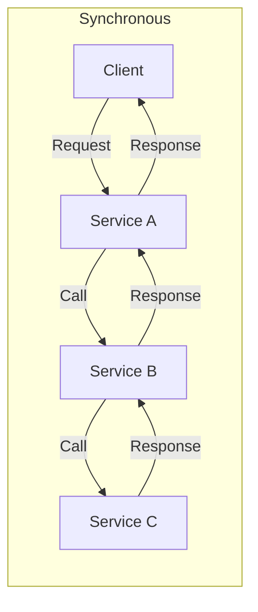
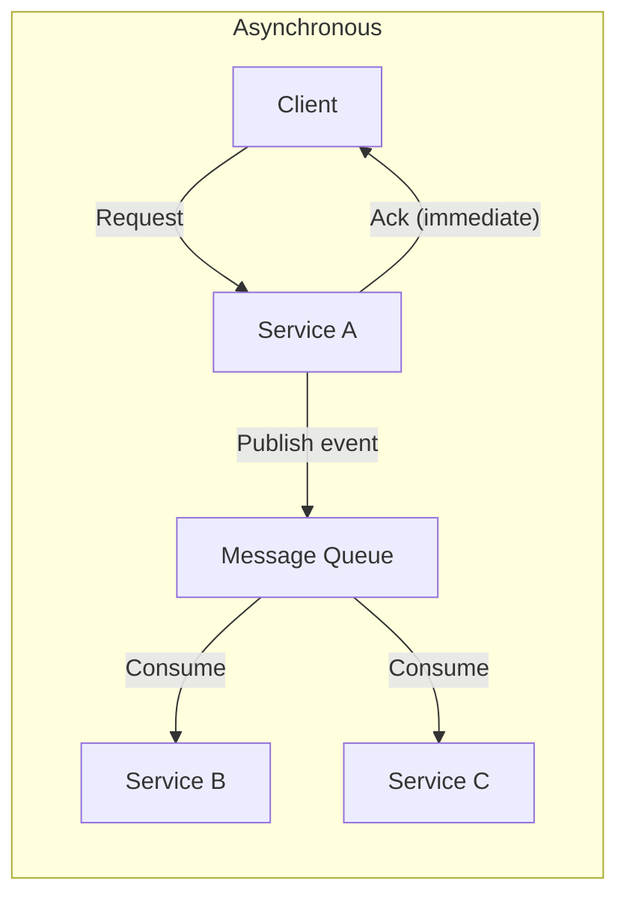
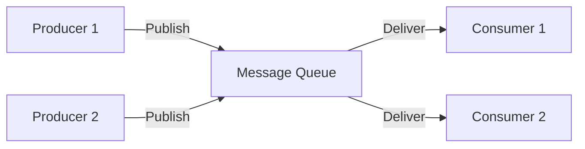
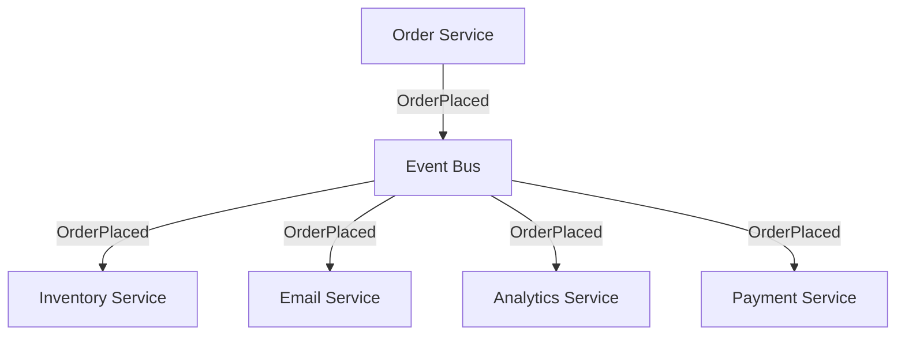
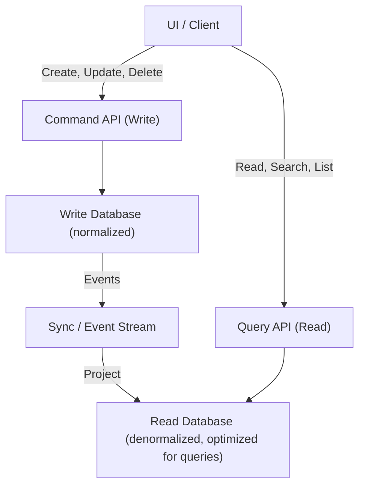
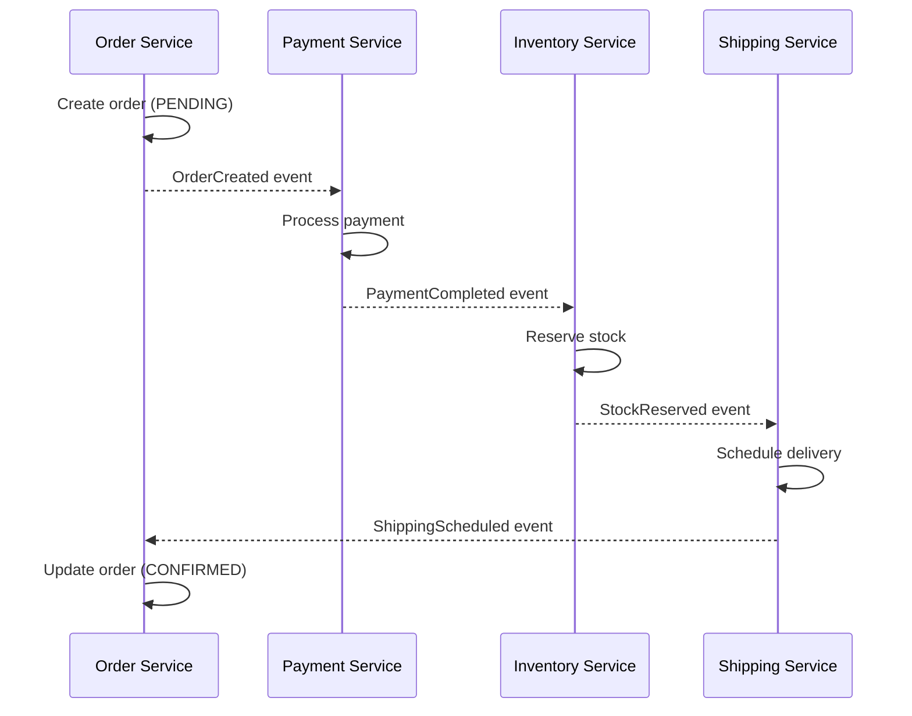
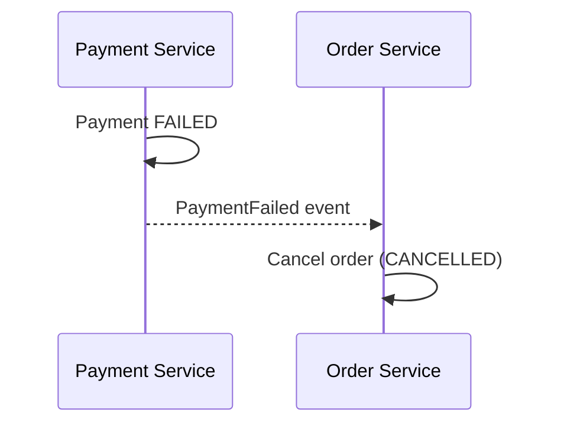
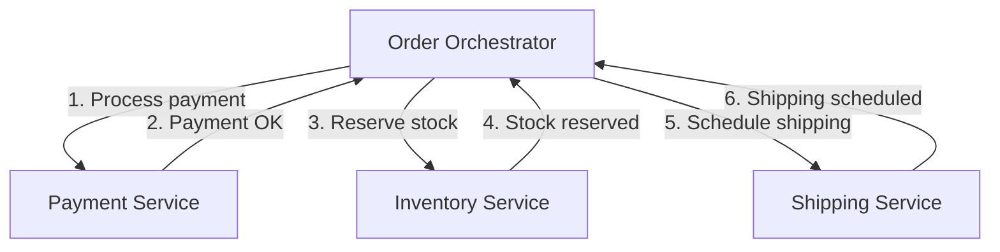
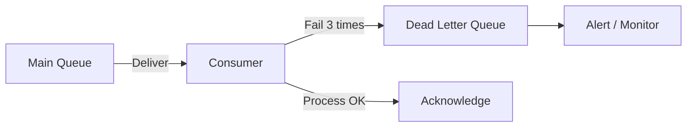
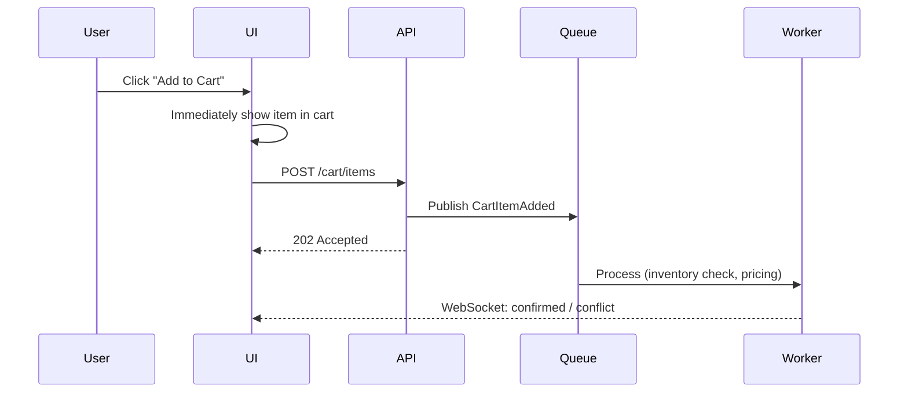

# Chapter 7: Messaging & Asynchronous Processing

> Not everything needs to happen immediately. Decoupling systems with message queues and async patterns enables scale, resilience, and responsiveness.

## Why This Matters for UI Architects

When a user clicks "Submit Order," they don't need to wait for the email to send, the inventory to update, and the analytics to record. The UI should respond instantly — "Order placed!" — while background systems handle the rest. Understanding async patterns lets you design UIs that feel fast while the system does heavy lifting asynchronously.

---

## Synchronous vs Asynchronous





| Aspect | Synchronous | Asynchronous |
|---|---|---|
| Response time | Sum of all service calls | Only the initial service |
| Coupling | Tight (A knows B knows C) | Loose (A publishes, consumers unknown) |
| Failure impact | Cascading (C fails → B fails → A fails) | Isolated (C fails, A already responded) |
| Complexity | Simple to understand | More complex (eventual consistency) |
| Debugging | Easy (follow the call chain) | Harder (distributed, delayed processing) |

---

## Message Queues

A message queue decouples producers (senders) from consumers (receivers).

### Core Concepts



**Key properties:**
- **Durability** — Messages persist to disk, survive crashes
- **Ordering** — Messages delivered in order (within a partition)
- **At-least-once delivery** — Messages delivered at least once (consumer must handle duplicates)
- **Backpressure** — If consumers are slow, messages queue up instead of overwhelming them

### Point-to-Point vs Pub/Sub

| Pattern | Behavior | Example |
|---|---|---|
| **Point-to-Point** | Each message consumed by exactly one consumer | Task queue (process one order) |
| **Pub/Sub** | Each message delivered to all subscribers | Event notifications (order placed → notify email, inventory, analytics) |

### Kafka vs RabbitMQ

| Feature | Apache Kafka | RabbitMQ |
|---|---|---|
| Model | Distributed log (append-only) | Traditional message broker |
| Ordering | Per-partition guaranteed | Per-queue guaranteed |
| Throughput | Millions of messages/sec | Thousands of messages/sec |
| Retention | Configurable (hours/days/forever) | Until consumed (or TTL) |
| Consumer model | Pull (consumers read at their pace) | Push (broker delivers to consumers) |
| Replay | Yes (consumers can re-read old messages) | No (once consumed, gone) |
| Routing | Topic-based, simple | Flexible (direct, topic, fanout, headers) |
| Use case | Event streaming, logs, analytics | Task queues, RPC, complex routing |

**When to use Kafka:** High-throughput event streaming, log aggregation, real-time analytics, event sourcing
**When to use RabbitMQ:** Task distribution, RPC, complex routing logic, lower throughput workloads

### Other Queue Systems

| System | Best For |
|---|---|
| **Amazon SQS** | Simple, managed queue (no ops overhead) |
| **Amazon SNS** | Managed pub/sub (fan-out notifications) |
| **Google Pub/Sub** | Managed, global pub/sub |
| **Redis Streams** | Lightweight streaming (already have Redis) |
| **NATS** | Lightweight, cloud-native messaging |

---

## Event-Driven Architecture

Instead of services calling each other directly, they communicate through events.



### Event Types

| Type | Purpose | Example |
|---|---|---|
| **Domain Event** | Something that happened in the business | `OrderPlaced`, `UserRegistered` |
| **Integration Event** | Cross-service communication | `PaymentCompleted` → Order service |
| **Command** | Request to do something | `ProcessPayment`, `SendEmail` |
| **Query** | Request for data | Rarely async (usually sync) |

### Event Schema

```json
{
  "eventId": "evt_abc123",
  "eventType": "OrderPlaced",
  "timestamp": "2025-01-15T10:30:00Z",
  "version": 1,
  "source": "order-service",
  "data": {
    "orderId": "ord_456",
    "userId": "usr_789",
    "total": 99.99,
    "items": [{ "productId": "p1", "quantity": 2 }]
  },
  "metadata": {
    "correlationId": "req_xyz",
    "traceId": "trace_000"
  }
}
```

**Always include:** `eventId` (deduplication), `eventType`, `timestamp`, `version` (schema evolution), `correlationId` (request tracing).

---

## CQRS (Command Query Responsibility Segregation)

Separate the read model from the write model.



**Why CQRS?**
- Read and write workloads have different scaling needs (reads >> writes)
- Read models can be denormalized and optimized for specific query patterns
- Each read model is a **projection** tailored for a specific UI view
- Write model stays normalized and maintains data integrity

**UI Architect perspective:** CQRS lets you have a read model perfectly shaped for each UI screen. The dashboard read model returns pre-aggregated stats. The search read model is an Elasticsearch index. The activity feed read model is a denormalized, time-sorted list. No more complex JOINs or client-side data transformation.

**Trade-off:** Eventual consistency between write and read models. The UI must handle the delay:

```typescript
// After a write, show optimistic update while read model catches up
async function createOrder(order: Order) {
  await api.post('/commands/create-order', order);

  // Optimistic: immediately show in UI
  addToLocalState(order);

  // Background: poll read model until it reflects the change
  pollUntilConsistent('/queries/orders', order.id);
}
```

---

## Event Sourcing

Instead of storing current state, store every event that led to the current state.

```
Traditional: user { name: "Alice", email: "alice@new.com" }

Event Sourced:
  1. UserCreated { name: "Alice", email: "alice@old.com" }
  2. EmailChanged { email: "alice@new.com" }
  3. (Current state = replay all events)
```

**Advantages:**
- Complete audit trail (who changed what, when)
- Time travel (rebuild state at any point in time)
- Event replay (fix bugs, build new projections from historical data)
- Natural fit with CQRS (events feed read model projections)

**Disadvantages:**
- Complex to implement (snapshots needed for performance)
- Event schema evolution is tricky (versioning)
- Querying current state requires replay (or materialized views)
- Not suitable for all domains (simple CRUD apps don't benefit)

---

## Saga Pattern

Manage distributed transactions across multiple services without a centralized transaction coordinator.

### The Problem

In a monolith: `BEGIN TRANSACTION → debit account → create order → reserve inventory → COMMIT`

In microservices: each service has its own database. No distributed transactions.

### Choreography Saga

Services react to events autonomously — no central coordinator.



**Compensation (rollback):** If payment fails:



### Orchestration Saga

A central orchestrator directs the workflow.



### Choreography vs Orchestration

| Aspect | Choreography | Orchestration |
|---|---|---|
| Coupling | Very loose | Orchestrator knows all steps |
| Complexity | Distributed (hard to see full flow) | Centralized (easy to understand) |
| Single point of failure | None | Orchestrator |
| Adding steps | Add new subscriber | Modify orchestrator |
| Best for | Simple flows, few steps | Complex flows, many steps |

---

## Dead Letter Queues (DLQ)

When a message repeatedly fails processing, move it to a dead letter queue instead of blocking the main queue.



**DLQ strategy:**
1. Set max retry count (e.g., 3 attempts with exponential backoff)
2. After max retries, move to DLQ
3. Alert ops team for investigation
4. Fix the issue, then replay messages from DLQ

---

## Delivery Guarantees

| Guarantee | Meaning | Trade-off |
|---|---|---|
| **At-most-once** | Message delivered 0 or 1 times | May lose messages (fastest) |
| **At-least-once** | Message delivered 1 or more times | May have duplicates (most common) |
| **Exactly-once** | Message delivered exactly 1 time | Most expensive, often impossible without idempotency |

**Practical approach:** Use at-least-once delivery + idempotent consumers.

```typescript
async function processPayment(event: PaymentEvent) {
  // Idempotency check: have we already processed this event?
  const existing = await db.findPayment(event.eventId);
  if (existing) return; // Already processed, skip

  await db.createPayment({
    eventId: event.eventId,
    orderId: event.data.orderId,
    amount: event.data.amount,
  });
}
```

---

## Backpressure

When producers are faster than consumers, the system must handle the imbalance.

### Strategies

| Strategy | How | Example |
|---|---|---|
| **Buffering** | Queue absorbs spikes | Kafka retains messages until consumers catch up |
| **Dropping** | Discard excess messages | Monitoring data (latest sample is enough) |
| **Throttling** | Slow down the producer | Rate limit API, return 429 |
| **Scaling** | Add more consumers | Auto-scale consumer group |

**UI Architect pattern:** When WebSocket pushes faster than the UI can render:

```typescript
// Throttle incoming real-time updates
const throttledUpdate = throttle((data) => {
  updateChart(data);
}, 100); // Max 10 updates/second to the UI

socket.on('metrics', throttledUpdate);
```

---

## Patterns for the UI Layer

### Optimistic Updates with Async Backend



### Event-Driven UI Updates

Instead of polling, subscribe to events:

```typescript
// Subscribe to order status changes
const eventSource = new EventSource('/api/orders/123/events');

eventSource.addEventListener('status_changed', (event) => {
  const { status, timestamp } = JSON.parse(event.data);
  updateOrderStatus(status); // PENDING → PROCESSING → SHIPPED
});

eventSource.addEventListener('error', () => {
  // Fallback to polling if SSE connection drops
  startPolling('/api/orders/123');
});
```

### Showing Async Progress

When operations take seconds to minutes:

```typescript
// Job status tracking
async function submitExport() {
  const { jobId } = await api.post('/exports', { format: 'csv' });

  // Show progress bar
  showProgress(0);

  const eventSource = new EventSource(`/api/jobs/${jobId}/progress`);
  eventSource.onmessage = (event) => {
    const { percent, status } = JSON.parse(event.data);
    showProgress(percent);

    if (status === 'completed') {
      eventSource.close();
      showDownloadLink(`/api/exports/${jobId}/download`);
    }
  };
}
```

---

## Interview Tips

1. **Explain why async** — "The user shouldn't wait 3 seconds for email + inventory + analytics to complete. We acknowledge immediately and process asynchronously. The UI shows 'Order placed!' while background services handle the rest."

2. **Know the trade-off** — "Async processing means eventual consistency. The user might not see their order in the list for a few seconds. We handle this with optimistic UI updates."

3. **Mention idempotency** — "With at-least-once delivery, consumers must be idempotent. We use the eventId as a deduplication key."

4. **Pick the right tool** — "For event streaming with replay, Kafka. For simple task queues, SQS or RabbitMQ. For lightweight pub/sub when we already have Redis, Redis Streams."

5. **Connect to the UI** — "We use SSE to push job progress to the UI. If the user refreshes, they can resume watching progress via the job ID stored in the URL."

---

## Key Takeaways

- Asynchronous processing decouples services, improves response times, and absorbs load spikes
- Message queues (Kafka, RabbitMQ, SQS) are the backbone of async communication
- Event-driven architecture replaces direct service calls with published events — loose coupling
- CQRS separates read and write models — each optimized for its workload, perfect for complex UIs
- Event sourcing stores events instead of state — full audit trail, time travel, replay capability
- Saga pattern manages distributed transactions — choreography for simple, orchestration for complex
- Dead letter queues catch failed messages — essential for reliability
- At-least-once + idempotent consumers is the practical standard for message delivery
- UI patterns: optimistic updates, event-driven subscriptions, and progress tracking make async feel instant
