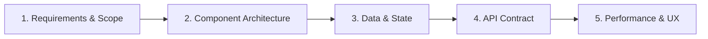
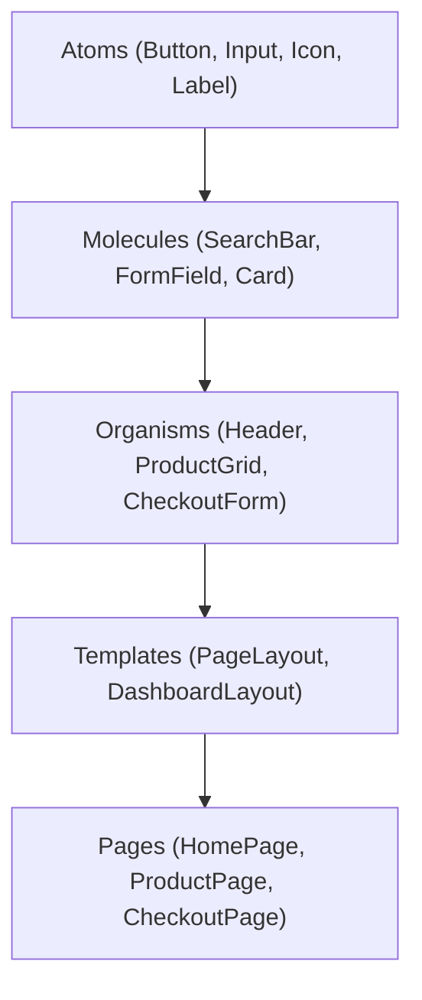
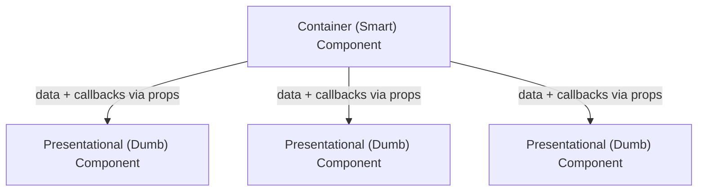
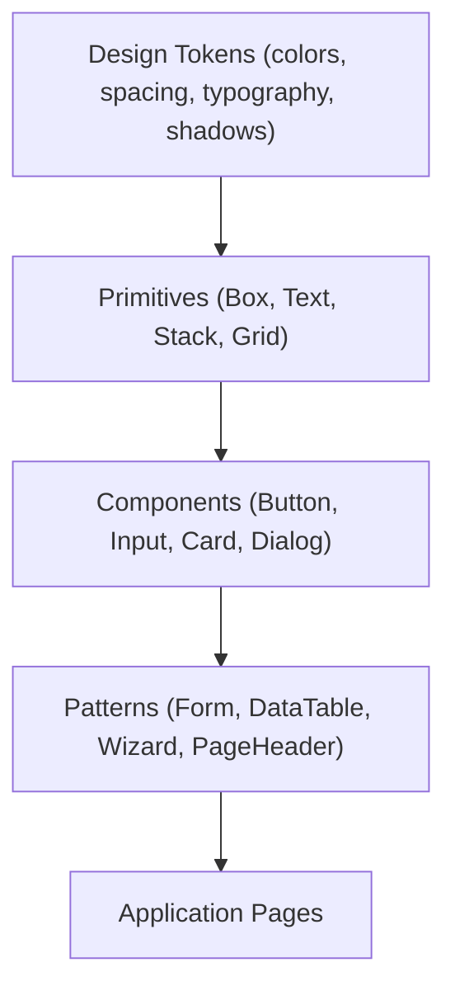
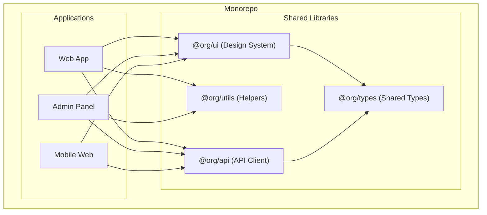

# Chapter 8: Frontend System Design

> Architecting the client layer — from component design patterns and design systems to monorepo strategies and module boundaries.

## Why This Matters for UI Architects

This is your core domain. Frontend system design interviews specifically test your ability to break down a complex UI into well-structured, maintainable, and scalable components. You must demonstrate mastery of component architecture, design systems, code organization, and the unique challenges of building large-scale client applications.

---

## How to Approach Frontend System Design Interviews

The framework from Chapter 1 adapts for frontend-specific interviews:



### Step 1: Requirements & Scope (3 min)

**Functional:**
- What are the core user flows?
- What UI elements are on each screen?
- What interactions are needed (drag-drop, real-time, offline)?

**Non-Functional:**
- Performance targets (LCP < 2.5s, INP < 200ms)
- Accessibility requirements (WCAG 2.1 AA)
- Browser/device support matrix
- SEO requirements
- Internationalization (i18n)

### Step 2: Component Architecture (10 min)

- Break the UI into a component tree
- Identify reusable vs page-specific components
- Define component interfaces (props, events, slots)
- Determine composition patterns

### Step 3: Data & State Management (10 min)

- What state lives where (server, global, local, URL)?
- How does data flow through the component tree?
- What's the caching/synchronization strategy?
- How do you handle optimistic updates?

### Step 4: API Contract (5 min)

- What endpoints does the UI need?
- Request/response shapes
- Real-time requirements (WebSocket, SSE)
- Error handling and loading states

### Step 5: Performance & UX Deep Dive (10 min)

- Rendering strategy (SSR, CSR, hybrid)
- Code splitting and lazy loading
- Perceived performance techniques
- Accessibility implementation
- Error boundaries and graceful degradation

---

## Component Architecture Patterns

### Atomic Design

Organize components in layers of increasing complexity:



| Level | Scope | Reusability | Example |
|---|---|---|---|
| **Atoms** | Single HTML element + styling | Universal | Button, Input, Badge, Avatar |
| **Molecules** | Small group of atoms working together | High | SearchBar (Input + Button), FormField (Label + Input + Error) |
| **Organisms** | Complex, distinct UI sections | Medium | Navbar, ProductCard, CommentThread |
| **Templates** | Page layout structure (no data) | High | DashboardLayout, AuthLayout |
| **Pages** | Templates with real data | None (unique) | /dashboard, /products/42 |

### Compound Components

Components that work together, sharing implicit state:

```typescript
// Usage — clean, declarative API
<Select value={selected} onChange={setSelected}>
  <Select.Trigger>
    <Select.Value placeholder="Choose..." />
  </Select.Trigger>
  <Select.Content>
    <Select.Item value="a">Option A</Select.Item>
    <Select.Item value="b">Option B</Select.Item>
  </Select.Content>
</Select>
```

The parent `Select` manages state; children access it via context. This pattern:
- Gives consumers control over rendering (composition over configuration)
- Keeps the API clean (no prop explosion)
- Used extensively by headless UI libraries (Radix, Headless UI, Angular CDK)

### Headless Components (Renderless)

Separate logic from presentation:

```typescript
// Headless hook — provides behavior, no UI
function useToggle(initial = false) {
  const [isOpen, setIsOpen] = useState(initial);
  return {
    isOpen,
    open: () => setIsOpen(true),
    close: () => setIsOpen(false),
    toggle: () => setIsOpen(prev => !prev),
  };
}

// Consumer controls all rendering
function CustomDropdown() {
  const { isOpen, toggle } = useToggle();
  return (
    <div>
      <button onClick={toggle}>Menu</button>
      {isOpen && <nav>...</nav>}
    </div>
  );
}
```

**Angular equivalent:** Directives + services that provide behavior; templates handle rendering.

### Container/Presentational (Smart/Dumb)



| Aspect | Container (Smart) | Presentational (Dumb) |
|---|---|---|
| Knows about | State, APIs, business logic | Only its props/inputs |
| Data | Fetches, transforms, provides | Receives via props |
| Reusability | Low (page-specific) | High (pure rendering) |
| Testing | Integration tests | Unit tests (easy) |
| Angular | Components with services | Components with @Input/@Output |

---

## Design Systems

A design system is a collection of reusable components, patterns, and guidelines that ensure consistency across an application or organization.

### Architecture of a Design System



### Design Tokens

The atomic values that define the visual language:

```css
/* Design tokens as CSS custom properties */
:root {
  /* Colors */
  --color-primary: oklch(0.65 0.25 260);
  --color-error: oklch(0.55 0.25 25);

  /* Spacing */
  --space-xs: 0.25rem;
  --space-sm: 0.5rem;
  --space-md: 1rem;
  --space-lg: 1.5rem;
  --space-xl: 2rem;

  /* Typography */
  --font-sans: 'Inter', system-ui, sans-serif;
  --font-size-sm: 0.875rem;
  --font-size-base: 1rem;
  --font-size-lg: 1.125rem;

  /* Shadows */
  --shadow-sm: 0 1px 2px oklch(0 0 0 / 0.05);
  --shadow-md: 0 4px 6px oklch(0 0 0 / 0.1);

  /* Radii */
  --radius-sm: 0.25rem;
  --radius-md: 0.5rem;
  --radius-lg: 1rem;
}
```

Tokens are platform-agnostic — the same values can generate CSS, iOS, Android, and Figma tokens.

### Component API Design Principles

1. **Consistent prop naming** — Use `size`, `variant`, `disabled` across all components
2. **Composition over configuration** — Prefer children/slots over massive prop objects
3. **Sensible defaults** — Components work with zero props
4. **Accessible by default** — ARIA attributes built into components
5. **Themeable** — Dark mode, custom brands, white-labeling via tokens

```typescript
// Good: Composable, consistent API
<Button variant="primary" size="md" disabled>
  <Icon name="save" />
  Save Changes
</Button>

// Bad: Configuration-heavy
<Button
  text="Save Changes"
  icon="save"
  iconPosition="left"
  type="primary"
  sizing="medium"
  isDisabled={true}
/>
```

### Popular Design System Approaches

| Approach | Examples | Pros | Cons |
|---|---|---|---|
| **Build your own** | Shopify Polaris, Atlassian ADS | Perfect fit for your needs | High investment |
| **Headless + styling** | Radix + Tailwind, Angular CDK | Full control over look & feel | More assembly required |
| **Opinionated library** | Material UI, Ant Design, PrimeNG | Fast to start, many components | Hard to customize deeply |
| **CSS framework** | Bootstrap, Tailwind | Quick, well-documented | Less interactive component logic |

**UI Architect recommendation:** For enterprise apps, headless component libraries (Radix, Angular CDK) + your own design tokens give the best balance of flexibility and consistency.

---

## Monorepo Strategies

Large-scale frontend projects often use monorepos to share code across apps and libraries.

### Monorepo Architecture



### Monorepo Tools

| Tool | Approach | Best For |
|---|---|---|
| **Nx** | Integrated, opinionated, task graph | Large enterprise monorepos |
| **Turborepo** | Lightweight, build caching | Medium monorepos, easy adoption |
| **Lerna** | Package publishing, versioning | Publishing npm packages |
| **pnpm workspaces** | Native package management | Simple shared dependencies |

### Module Boundaries

Clear boundaries prevent spaghetti imports:

```
# Enforce module boundaries (Nx example)
# @org/web-app can import from @org/ui but NOT from @org/admin-app

# Rule: Apps can import from libs, libs from other libs, apps never from apps
# Rule: Feature libs import from utility libs, not vice versa
```

**Layer structure:**

| Layer | Can Import | Example |
|---|---|---|
| **App** | Feature, UI, Utility, Data | `@org/web-app` |
| **Feature** | UI, Utility, Data | `@org/feature-dashboard` |
| **UI** | Utility | `@org/ui-components` |
| **Data** | Utility | `@org/data-api-client` |
| **Utility** | Nothing (leaf) | `@org/util-formatters` |

---

## Dependency Management

### Managing Third-Party Dependencies

| Strategy | How | When |
|---|---|---|
| **Lock file** | `package-lock.json` / `pnpm-lock.yaml` | Always — reproducible builds |
| **Pinned versions** | `"react": "18.2.0"` | Critical deps, avoid surprises |
| **Ranges** | `"lodash": "^4.17.0"` | Utilities, auto-patch updates |
| **Automated updates** | Dependabot / Renovate | Regular, automated PRs for updates |
| **Bundle analysis** | `webpack-bundle-analyzer`, `source-map-explorer` | Monthly review |

### Avoiding Dependency Bloat

```
# Check what you're actually importing
npx source-map-explorer dist/main.js

# Replace large libraries with smaller alternatives
moment.js (300KB) → date-fns (tree-shakeable) or dayjs (2KB)
lodash (70KB) → lodash-es (tree-shakeable) or native JS
```

**Rule of thumb:** Before adding a dependency, ask:
1. Can I write this in < 50 lines?
2. Does a smaller alternative exist?
3. Is it tree-shakeable?
4. How often is it maintained?

---

## Folder Structure for Large Apps

### Feature-Based (Recommended)

```
src/
├── features/
│   ├── auth/
│   │   ├── components/
│   │   ├── hooks/ (or services/ for Angular)
│   │   ├── utils/
│   │   ├── types.ts
│   │   └── index.ts (public API)
│   ├── dashboard/
│   │   ├── components/
│   │   ├── hooks/
│   │   └── index.ts
│   └── settings/
│       └── ...
├── shared/
│   ├── components/  (design system)
│   ├── hooks/
│   ├── utils/
│   └── types/
├── app/
│   ├── routes/
│   ├── layout/
│   └── providers/
└── assets/
```

**Why feature-based?**
- Co-location: related code lives together
- Clear ownership: each feature is a module
- Deletability: remove a feature by deleting its folder
- Scalability: add features without restructuring

### Angular-Specific (Module-Based)

```
src/app/
├── core/                  (singleton services, guards, interceptors)
│   ├── services/
│   ├── guards/
│   └── interceptors/
├── shared/                (reusable components, directives, pipes)
│   ├── components/
│   ├── directives/
│   └── pipes/
├── features/
│   ├── dashboard/         (standalone component or lazy module)
│   │   ├── components/
│   │   ├── services/
│   │   └── dashboard.routes.ts
│   └── settings/
└── app.routes.ts
```

---

## Interview Tips

1. **Start with the user flow** — "Let me sketch out the main user flows first: browse products → view details → add to cart → checkout. This tells me the page structure and component hierarchy."

2. **Draw the component tree** — "The ProductPage has a ProductHeader, ProductGallery, ProductInfo, and ReviewSection. ProductInfo contains AddToCart, PriceDisplay, and VariantSelector. Each is a focused, testable component."

3. **Discuss trade-offs in composition** — "I'd use compound components for the Select because consumers need rendering flexibility. But for Button, a simple prop-based API is cleaner since the variations are well-defined."

4. **Mention the design system** — "These components live in our design system library. Button, Input, Card are atoms used across all features. The ProductCard is an organism specific to the commerce feature."

5. **Show scalability thinking** — "With 20+ developers, I'd use Nx monorepo with enforced module boundaries. Feature teams own their modules and import from shared libs. CI only rebuilds affected projects."

---

## Key Takeaways

- Frontend system design follows: Requirements → Components → State → API → Performance
- Atomic design (atoms → molecules → organisms → templates → pages) creates a clear component hierarchy
- Compound components and headless patterns separate behavior from presentation
- Design systems ensure consistency — built on design tokens, composed from primitives upward
- Monorepos with enforced module boundaries scale to large teams
- Feature-based folder structure co-locates related code and enables clean deletability
- Dependency management is ongoing — audit bundle size, prefer tree-shakeable libraries
- Always start from user flows and work backward to component architecture
