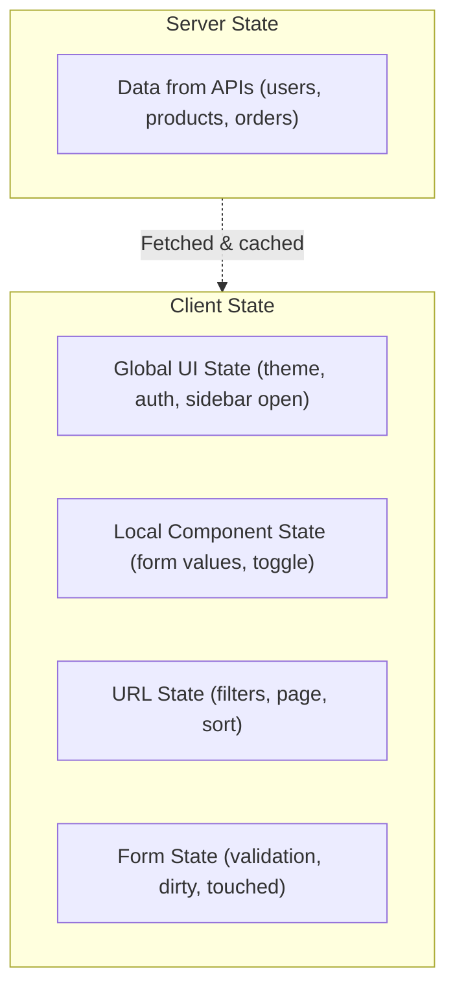
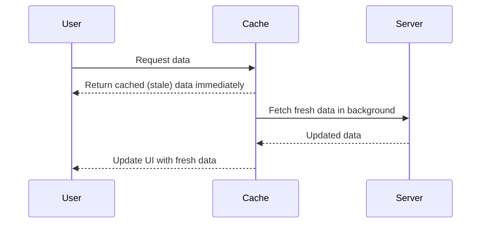
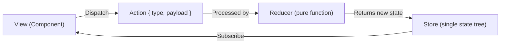
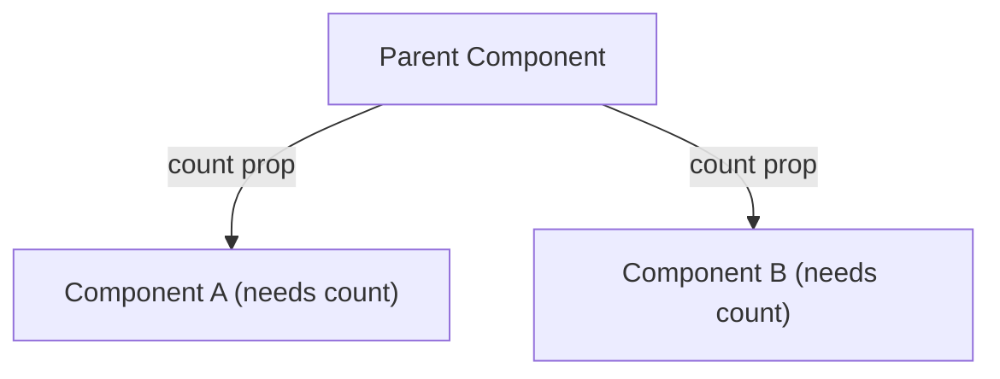
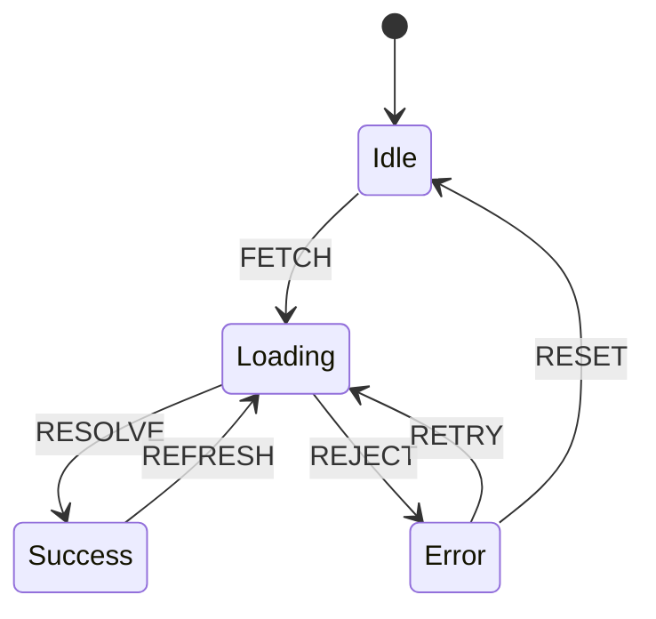
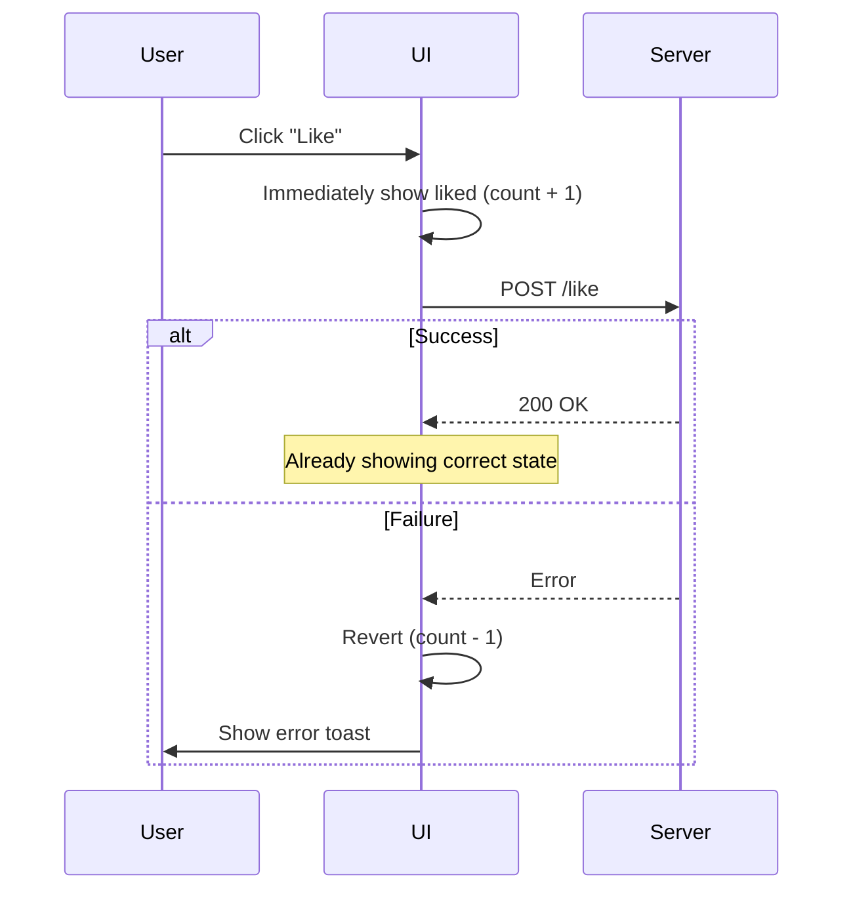

# Chapter 9: State Management

> Where data lives, how it flows, and how it stays consistent — the architecture decisions that determine whether a large app remains maintainable or collapses under its own complexity.

## Why This Matters for UI Architects

State management is arguably the hardest problem in frontend architecture. Choosing the wrong pattern leads to prop drilling, stale data bugs, unnecessary re-renders, and unmaintainable code. A UI architect must know when to use local state, global state, server state, or URL state — and how they interact.

---

## The State Landscape

Not all state is the same. Classifying state correctly is the first step to managing it well.



| State Type | What It Is | Lifecycle | Tools |
|---|---|---|---|
| **Server state** | Data owned by the server (DB records) | Cached copy, refreshed periodically | TanStack Query, SWR, Apollo Client, RTK Query |
| **Global UI state** | Shared across many components | App lifecycle | Redux, Zustand, NgRx, Signals, Context |
| **Local state** | Scoped to one component | Component lifecycle | useState, useReducer, Angular signals |
| **URL state** | Serialized in the URL | Persists across refreshes, shareable | Router params, query strings |
| **Form state** | Input values, validation, submission | Form lifecycle | React Hook Form, Formik, Angular Reactive Forms |

---

## Server State: The Most Important Category

80%+ of state in typical apps is **server state** — data fetched from APIs that you cache locally.

### The Problem with Manual Fetching

```typescript
// Naive approach — leads to many bugs
const [users, setUsers] = useState([]);
const [loading, setLoading] = useState(false);
const [error, setError] = useState(null);

useEffect(() => {
  setLoading(true);
  fetchUsers()
    .then(setUsers)
    .catch(setError)
    .finally(() => setLoading(false));
}, []);

// Missing: caching, deduplication, refetching, stale data,
// pagination, optimistic updates, error retry, race conditions
```

### Server State Libraries Solve This

```typescript
// TanStack Query — handles all the edge cases
const { data, isLoading, error, refetch } = useQuery({
  queryKey: ['users'],
  queryFn: fetchUsers,
  staleTime: 5 * 60 * 1000,     // Consider fresh for 5 minutes
  gcTime: 30 * 60 * 1000,       // Keep in cache for 30 minutes
  refetchOnWindowFocus: true,    // Refetch when user returns to tab
  retry: 3,                     // Retry failed requests
});
```

### What Server State Libraries Handle

| Feature | Without Library | With TanStack Query/SWR |
|---|---|---|
| Caching | Manual (often forgotten) | Automatic, configurable |
| Deduplication | Multiple identical requests | Single request, shared result |
| Background refetch | Manual polling | stale-while-revalidate |
| Optimistic updates | Complex manual logic | Built-in mutation callbacks |
| Pagination | Manual state management | Infinite queries, prefetching |
| Error retry | Manual with backoff | Configurable retry logic |
| Race conditions | Common bugs | Handled (request cancellation) |
| Devtools | None | Full cache inspection |

### Stale-While-Revalidate Pattern



This pattern gives users instant response (cached data) while ensuring freshness (background refetch). The user sees data immediately, and the UI silently updates if the data has changed.

---

## Global Client State

State shared across many unrelated components that isn't fetched from a server.

### When You Actually Need Global State

- **Authentication** — current user, permissions, token
- **Theme** — dark/light mode, color scheme
- **UI state** — sidebar collapsed, notification count, modal open
- **Feature flags** — enabled experiments
- **User preferences** — language, timezone

**Common mistake:** Putting server data (users, products) in global state (Redux/NgRx). Use server state libraries instead.

### Redux Pattern (Flux Architecture)



**Principles:**
1. Single source of truth (one store)
2. State is read-only (dispatch actions to change)
3. Changes via pure functions (reducers)

```typescript
// Redux Toolkit (modern Redux)
const counterSlice = createSlice({
  name: 'counter',
  initialState: { value: 0 },
  reducers: {
    increment: (state) => { state.value += 1; },
    decrement: (state) => { state.value -= 1; },
    incrementByAmount: (state, action) => {
      state.value += action.payload;
    },
  },
});
```

**Pros:** Predictable, time-travel debugging, great devtools, middleware
**Cons:** Boilerplate, indirection, steep learning curve

### Zustand (Lightweight Alternative)

```typescript
import { create } from 'zustand';

const useAuthStore = create((set) => ({
  user: null,
  isAuthenticated: false,
  login: (user) => set({ user, isAuthenticated: true }),
  logout: () => set({ user: null, isAuthenticated: false }),
}));

// Usage in any component
const { user, logout } = useAuthStore();
```

**Pros:** Minimal boilerplate, no provider needed, tiny bundle (1KB)
**Cons:** Less structure for large teams, fewer conventions

### Angular NgRx

```typescript
// NgRx follows the Redux pattern with RxJS
export const loadUsers = createAction('[Users] Load');
export const loadUsersSuccess = createAction(
  '[Users] Load Success',
  props<{ users: User[] }>()
);

export const usersReducer = createReducer(
  initialState,
  on(loadUsersSuccess, (state, { users }) => ({ ...state, users }))
);

// Effects for side effects
loadUsers$ = createEffect(() =>
  this.actions$.pipe(
    ofType(loadUsers),
    switchMap(() => this.userService.getAll().pipe(
      map(users => loadUsersSuccess({ users }))
    ))
  )
);
```

### Angular Signals (Modern Angular)

```typescript
// Angular 17+ signals — simpler reactive state
@Component({...})
export class CounterComponent {
  count = signal(0);
  doubled = computed(() => this.count() * 2);

  increment() {
    this.count.update(v => v + 1);
  }
}
```

**Signals are the future of Angular state management** — simpler than RxJS for most UI state, fine-grained reactivity, no zone.js dependency.

### Comparison Matrix

| Library | Bundle Size | Learning Curve | Devtools | Best For |
|---|---|---|---|---|
| **Redux Toolkit** | ~11KB | High | Excellent | Large teams, complex state |
| **Zustand** | ~1KB | Low | Good | Simple global state |
| **NgRx** | ~15KB | High | Excellent | Large Angular apps |
| **Angular Signals** | Built-in | Low | Developing | Angular component state |
| **Jotai** | ~3KB | Low | Good | Atomic state (bottom-up) |
| **Recoil** | ~20KB | Medium | Good | Graph-based dependencies |
| **MobX** | ~15KB | Medium | Good | Reactive, mutable state |

---

## Local Component State

State that belongs to a single component and its children.

### Rules for Local State

1. **Start local, lift only when needed** — Don't prematurelytthrow state into global stores
2. **Colocate with the component that uses it** — If only one component reads/writes it, keep it there
3. **Use the simplest tool** — `useState` / signals for simple values, `useReducer` for complex logic

### When to Lift State



Lift state to the nearest common ancestor when two sibling components need the same data. If the nearest common ancestor is far away, consider context or a state library.

### Derived State (Computed Values)

Never store what you can compute:

```typescript
// Bad: duplicated state that can go out of sync
const [items, setItems] = useState([]);
const [total, setTotal] = useState(0);
// Must remember to update total whenever items change

// Good: derive total from items
const [items, setItems] = useState([]);
const total = items.reduce((sum, item) => sum + item.price, 0);

// Angular signals
items = signal<Item[]>([]);
total = computed(() => this.items().reduce((sum, i) => sum + i.price, 0));
```

---

## URL State

State serialized in the URL — filters, pagination, sort order, search queries, selected tabs.

### Why URL State Matters

- **Shareable** — users can share or bookmark exact views
- **Back/forward** — browser navigation works naturally
- **Resumable** — refreshing preserves state
- **SEO** — search engines index different states

### Pattern: URL as Source of Truth

```typescript
// URL: /products?category=electronics&sort=price&page=2

function ProductList() {
  const searchParams = useSearchParams();

  const category = searchParams.get('category') || 'all';
  const sort = searchParams.get('sort') || 'relevance';
  const page = parseInt(searchParams.get('page') || '1');

  const { data } = useQuery({
    queryKey: ['products', { category, sort, page }],
    queryFn: () => fetchProducts({ category, sort, page }),
  });

  const updateFilter = (key: string, value: string) => {
    const params = new URLSearchParams(searchParams);
    params.set(key, value);
    params.set('page', '1'); // Reset page on filter change
    router.push(`?${params.toString()}`);
  };
}
```

**Rule:** If state should survive a page refresh, it belongs in the URL.

---

## Form State

Forms have unique state challenges: validation, dirty tracking, submission, and error handling.

### Form State Categories

| State | What | Example |
|---|---|---|
| **Values** | Current input values | `{ email: "a@b.com", name: "Alice" }` |
| **Touched** | Has the user interacted with this field? | `{ email: true, name: false }` |
| **Dirty** | Has the value changed from initial? | `{ email: true, name: false }` |
| **Errors** | Validation error messages | `{ email: "Invalid format" }` |
| **Submitting** | Is the form being submitted? | `true / false` |

### Controlled vs Uncontrolled

| Approach | How | Pros | Cons |
|---|---|---|---|
| **Controlled** | React state drives input values | Full control, validation on every keystroke | Re-renders on every keystroke |
| **Uncontrolled** | DOM manages input values, read on submit | Less re-renders, simpler | Less control over input state |
| **Angular Reactive Forms** | FormGroup/FormControl drive values | Full control, built-in validators | More setup |

**Library recommendation:**
- React: React Hook Form (uncontrolled, performant) or Formik (controlled, mature)
- Angular: Reactive Forms (built-in, powerful)

---

## State Machines

For complex UI flows with well-defined states and transitions.



### When to Use State Machines

- Multi-step wizards
- Authentication flows (logged out → logging in → logged in → error)
- Async operations with complex transitions
- Payment flows (idle → processing → success → refunding)
- Any UI with "impossible states" you want to prevent

```typescript
// XState example
const authMachine = createMachine({
  initial: 'loggedOut',
  states: {
    loggedOut: { on: { LOGIN: 'loggingIn' } },
    loggingIn: {
      invoke: { src: 'loginService' },
      on: {
        SUCCESS: 'loggedIn',
        FAILURE: 'error',
      },
    },
    loggedIn: { on: { LOGOUT: 'loggedOut' } },
    error: { on: { RETRY: 'loggingIn', RESET: 'loggedOut' } },
  },
});
```

**Key benefit:** Impossible states become impossible. You can't be "loading" and "error" simultaneously.

---

## Optimistic Updates

Show the expected result immediately, reconcile with the server later.



```typescript
// TanStack Query optimistic mutation
const likeMutation = useMutation({
  mutationFn: (postId) => api.likePost(postId),
  onMutate: async (postId) => {
    await queryClient.cancelQueries(['post', postId]);
    const previous = queryClient.getQueryData(['post', postId]);

    queryClient.setQueryData(['post', postId], (old) => ({
      ...old,
      likes: old.likes + 1,
      isLiked: true,
    }));

    return { previous };
  },
  onError: (err, postId, context) => {
    queryClient.setQueryData(['post', postId], context.previous);
    toast.error('Failed to like post');
  },
  onSettled: (data, err, postId) => {
    queryClient.invalidateQueries(['post', postId]);
  },
});
```

---

## Real-Time State Synchronization

When multiple users or tabs need the same data:

### Approaches

| Approach | Latency | Complexity | Use Case |
|---|---|---|---|
| **Polling** | Seconds | Low | Dashboard metrics |
| **Long polling** | Near real-time | Low | Notifications |
| **SSE** | Real-time | Medium | Live feeds, stock prices |
| **WebSocket** | Real-time | High | Chat, collaborative editing |
| **BroadcastChannel** | Instant (same browser) | Low | Cross-tab sync |

### Cross-Tab Synchronization

```typescript
// Sync auth state across tabs
const channel = new BroadcastChannel('auth');

// Tab A: user logs out
function logout() {
  clearSession();
  channel.postMessage({ type: 'LOGOUT' });
}

// Tab B: receives logout event
channel.onmessage = (event) => {
  if (event.data.type === 'LOGOUT') {
    clearSession();
    redirectToLogin();
  }
};
```

---

## Interview Tips

1. **Classify state first** — "Let me identify the state types: the product list is server state (TanStack Query), the filter selections are URL state (query params), the cart is global client state (Zustand), and the add-to-cart animation is local state."

2. **Defend your choice** — "I chose Zustand over Redux because we have minimal global state (theme, auth, cart). Redux's structure is overkill here and adds boilerplate without benefit."

3. **Show the data flow** — "Server state flows: API → TanStack Query cache → component via hook. On mutation, optimistic update → API call → cache invalidation → background refetch."

4. **Address edge cases** — "When the user likes a post and immediately navigates away, the mutation continues in the background. If it fails, we revert on their next visit via cache invalidation."

5. **Mention performance** — "Zustand only re-renders components that subscribe to the specific slice of state that changed. This avoids the re-render cascades that Context API causes."

---

## Key Takeaways

- Classify state correctly: server, global UI, local, URL, form — each has different tools and patterns
- Server state is 80% of your state — use TanStack Query/SWR, not Redux, for API data
- Global client state should be minimal (auth, theme, preferences) — Zustand or signals for simplicity, Redux/NgRx for complex enterprise apps
- URL state enables sharing, bookmarking, and back/forward — use it for filters, pagination, sort
- Start with local state, lift only when siblings need shared data
- Derived state should be computed, never stored separately
- State machines prevent impossible states — use for multi-step flows
- Optimistic updates make UIs feel instant — always include rollback logic
- Cross-tab sync via BroadcastChannel keeps state consistent across tabs
