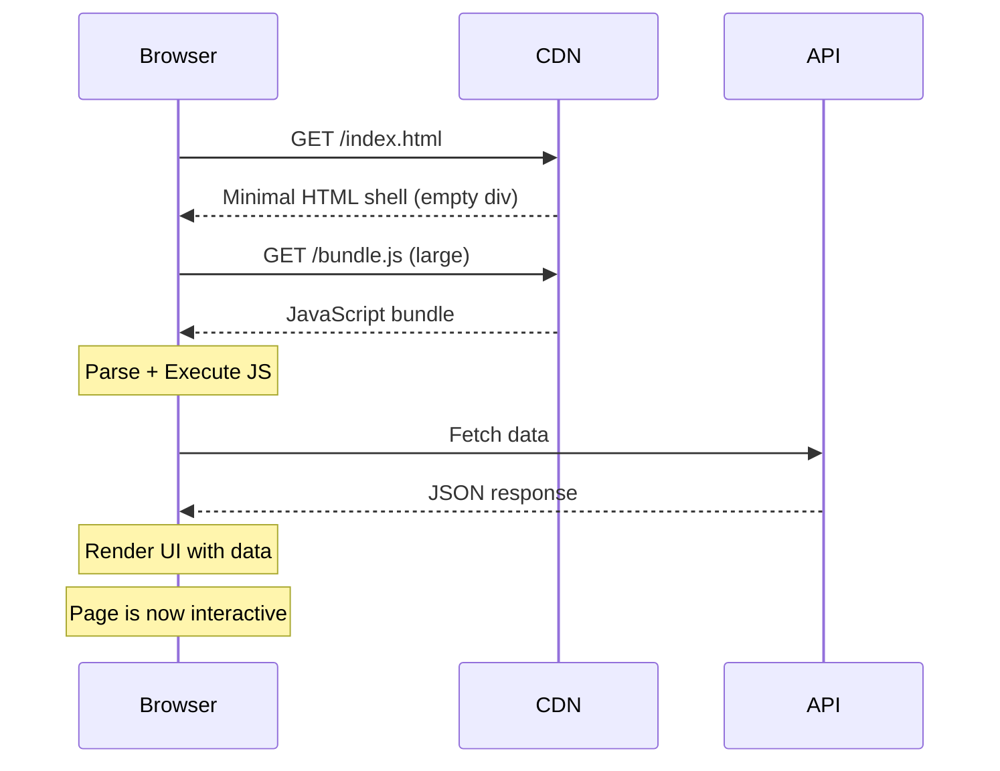
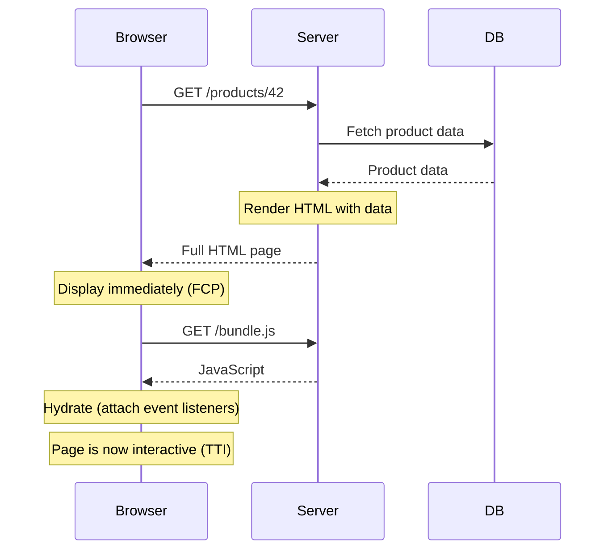
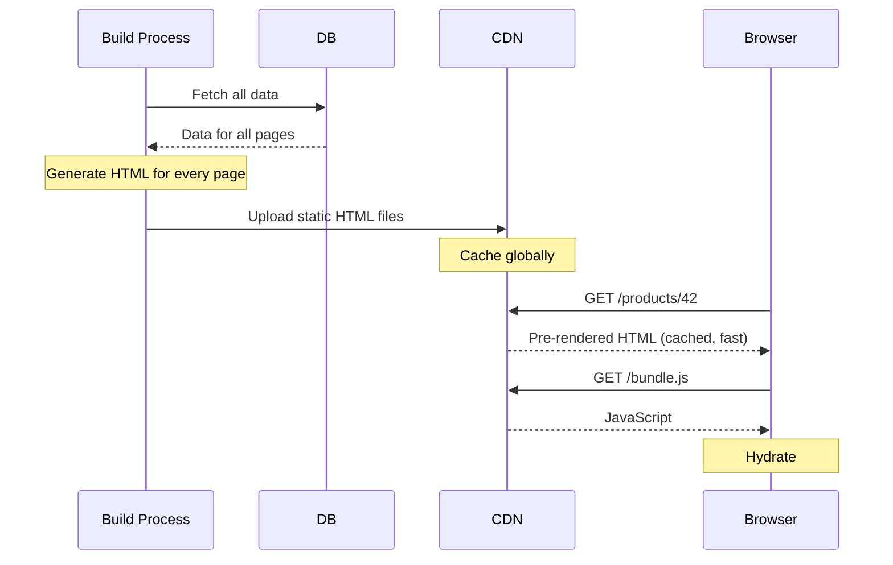
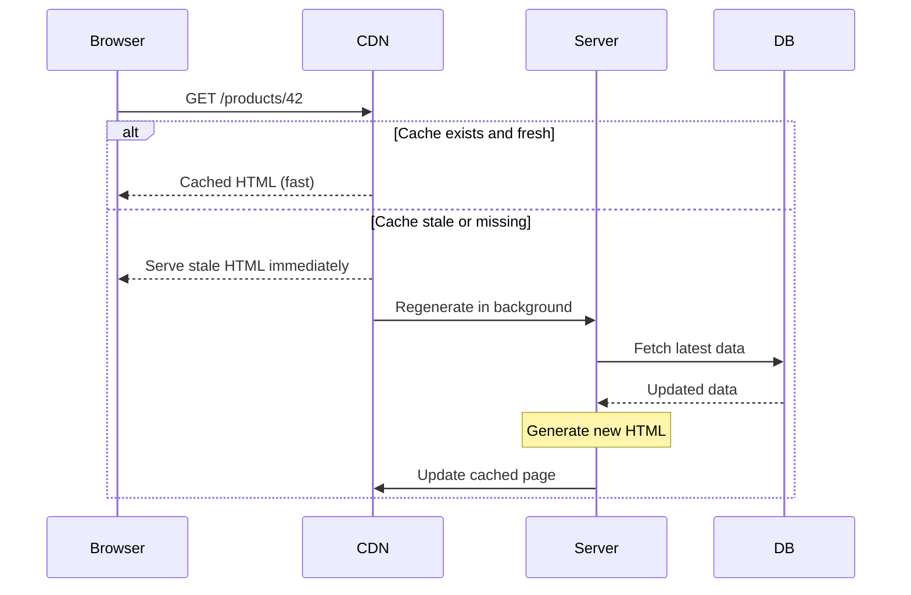
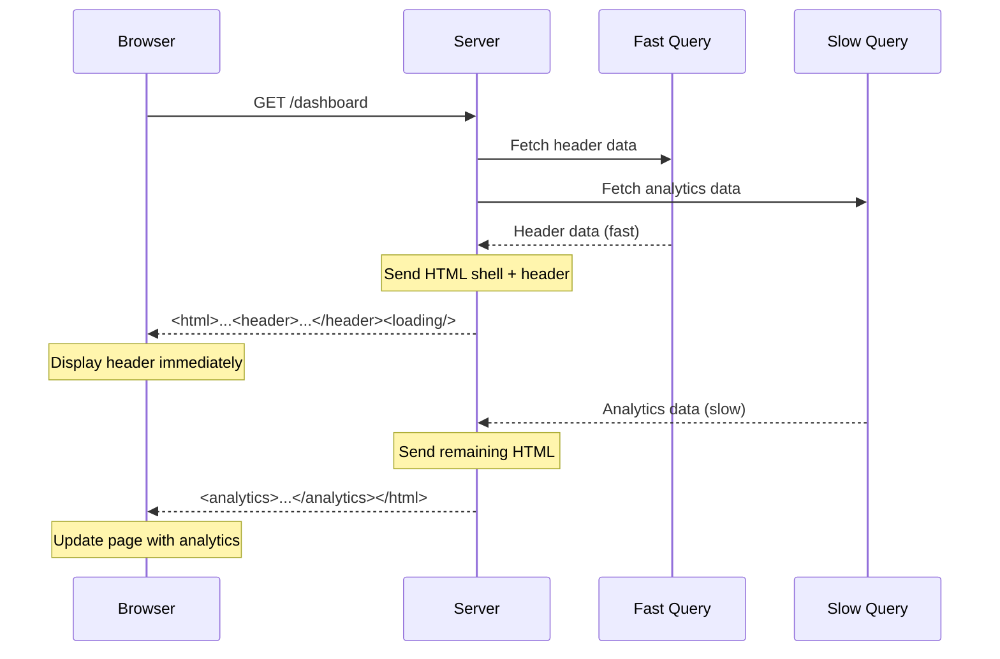
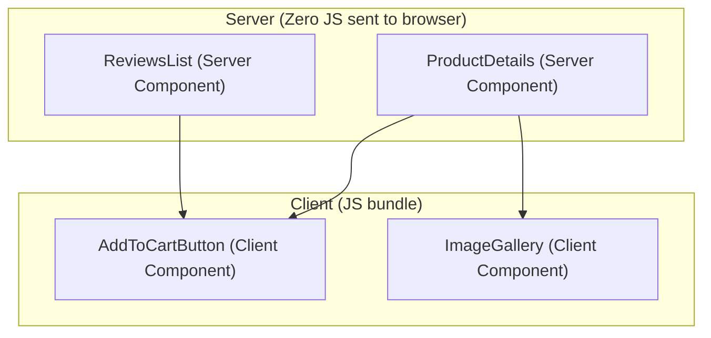
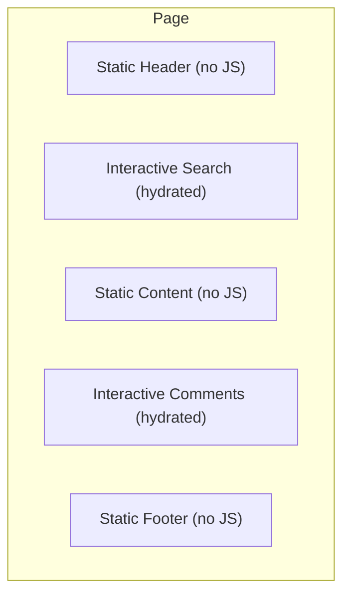
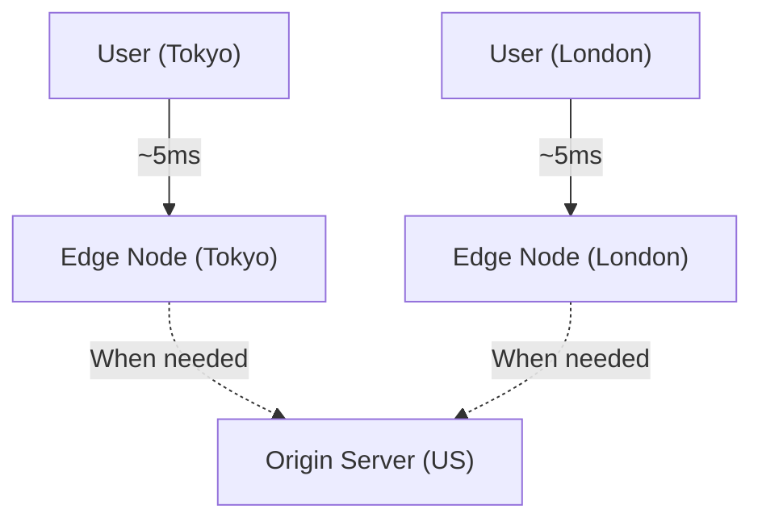

# Chapter 10: Rendering Strategies

> How and where your HTML is generated determines performance, SEO, interactivity, and infrastructure cost. Choosing the right rendering strategy is one of a UI architect's most consequential decisions.

## Why This Matters for UI Architects

Modern web frameworks offer a spectrum of rendering approaches. There is no "best" strategy — each makes different trade-offs between time-to-first-byte, interactivity, SEO, server cost, and caching. A UI architect must understand each option deeply and choose the right strategy per page or even per component.

---

## The Rendering Spectrum


---

## Client-Side Rendering (CSR)

The browser downloads a minimal HTML shell, then JavaScript renders everything.



**Timeline:**

```
|--Download HTML--|--Download JS--|--Parse/Execute JS--|--Fetch Data--|--Render--|
                                                                      ^ FCP/LCP
                                                                        (slow)
```

| Pros | Cons |
|---|---|
| Simple deployment (static files on CDN) | Slow First Contentful Paint (FCP) |
| Rich interactivity | Poor SEO (empty HTML for crawlers) |
| No server needed | Large JS bundles to download |
| Great for authenticated dashboards | White screen while JS loads |
| Cheap to host | Not accessible without JS |

**Best for:** Admin dashboards, authenticated apps behind login, highly interactive tools (Figma, Google Docs), single-page apps where SEO doesn't matter.

---

## Server-Side Rendering (SSR)

The server generates full HTML for each request. The browser receives ready-to-display content.



**Timeline:**

```
|--Server rendering--|--Download HTML--|--Display (FCP)--|--Download JS--|--Hydrate (TTI)--|
                                        ^ User sees content               ^ Page becomes interactive
```

| Pros | Cons |
|---|---|
| Fast FCP (full HTML arrives immediately) | Server cost (renders per request) |
| SEO-friendly (crawlers see full content) | TTFB depends on data fetching speed |
| Works without JavaScript (basic viewing) | Server is a bottleneck under load |
| Personalized per request | Can't be cached on CDN (dynamic) |
| | Hydration cost (download JS + attach listeners) |

**Best for:** E-commerce product pages, content sites with SEO needs, personalized pages (user-specific data in HTML), pages with frequently changing data.

---

## Static Site Generation (SSG)

Pages are pre-rendered at **build time**. The result is plain HTML files served from CDN.



| Pros | Cons |
|---|---|
| Fastest possible TTFB (CDN-cached) | Build time grows with page count |
| Cheapest hosting (static files) | Stale data until next build |
| Maximum reliability (no server) | Can't personalize per user |
| Perfect cache hit rates | Not suitable for frequently changing data |
| SEO-friendly | Rebuild needed for every content update |

**Best for:** Marketing pages, documentation, blogs, landing pages, any content that changes infrequently.

---

## Incremental Static Regeneration (ISR)

Hybrid of SSG and SSR — pages are statically generated but can be **regenerated on demand** without a full rebuild.



**How it works:**
1. Pages built at build time (like SSG)
2. Each page has a `revalidate` interval (e.g., 60 seconds)
3. After the interval, the next request triggers a background regeneration
4. Stale page is served immediately while new page generates
5. Once ready, the CDN updates the cached page

```typescript
// Next.js ISR
export async function generateStaticParams() {
  const products = await getTopProducts();
  return products.map((p) => ({ id: p.id }));
}

export const revalidate = 60; // Regenerate every 60 seconds

export default async function ProductPage({ params }) {
  const product = await getProduct(params.id);
  return <ProductDisplay product={product} />;
}
```

| Pros | Cons |
|---|---|
| CDN speed for most requests | Data can be stale up to revalidate interval |
| No full rebuild needed | More complex than pure SSG |
| Scales to millions of pages | Framework-specific (Next.js, Nuxt) |
| On-demand regeneration possible | First request after stale period is slightly delayed |

**Best for:** E-commerce catalogs, CMS-driven content, large sites with thousands of pages, anything that changes periodically but not in real-time.

---

## Streaming SSR

Send HTML in chunks as data becomes available, instead of waiting for everything.



**Key benefit:** The user sees content as soon as ANY data is ready, not after ALL data is ready.

```typescript
// React 18 Streaming SSR with Suspense
export default function Dashboard() {
  return (
    <div>
      <Header />  {/* Renders immediately */}
      <Suspense fallback={<Skeleton />}>
        <AnalyticsPanel />  {/* Streams in when data ready */}
      </Suspense>
      <Suspense fallback={<Skeleton />}>
        <RecentOrders />  {/* Streams in independently */}
      </Suspense>
    </div>
  );
}
```

| Pros | Cons |
|---|---|
| Faster perceived performance (progressive rendering) | More complex server infrastructure |
| No single slow query blocks the whole page | Harder to reason about rendering order |
| Works with Suspense boundaries | Not all frameworks support well |
| Better user experience for data-heavy pages | SEO bots may not wait for all chunks |

---

## React Server Components (RSC)

Components that run **only on the server** — their JavaScript is never sent to the browser.



**Server Components can:**
- Access the database directly (no API needed)
- Use server-only libraries (no bundle size impact)
- Read files, environment variables
- Render async (await in the component body)

**Server Components cannot:**
- Use state (useState, useReducer)
- Use effects (useEffect)
- Use browser APIs (window, document)
- Attach event handlers (onClick)

```typescript
// Server Component (default in Next.js App Router)
async function ProductPage({ params }) {
  const product = await db.products.findById(params.id); // Direct DB access
  const reviews = await db.reviews.findByProduct(params.id);

  return (
    <div>
      <h1>{product.name}</h1>
      <p>{product.description}</p>
      <AddToCartButton productId={product.id} />  {/* Client Component */}
      <ReviewsList reviews={reviews} />
    </div>
  );
}

// Client Component ('use client' directive)
'use client';
function AddToCartButton({ productId }) {
  const [added, setAdded] = useState(false);
  return (
    <button onClick={() => { addToCart(productId); setAdded(true); }}>
      {added ? 'Added!' : 'Add to Cart'}
    </button>
  );
}
```

| Pros | Cons |
|---|---|
| Dramatically smaller JS bundles | New mental model (server vs client boundary) |
| Direct server data access | Can't use state or effects |
| No data fetching waterfalls | Framework-specific (Next.js, some others) |
| Secure (secrets stay on server) | Ecosystem still maturing |

---

## Hydration Strategies

Hydration is the process of attaching JavaScript interactivity to server-rendered HTML.

### Full Hydration (Traditional)

The entire page is hydrated at once — all components become interactive simultaneously.

```
Server HTML → Download all JS → Execute all JS → Everything interactive
```

**Problem:** Large apps download and execute JavaScript for the ENTIRE page, even parts the user may never interact with.

### Progressive Hydration

Hydrate critical components first, defer the rest.

```
Server HTML → Hydrate above-the-fold → User scrolls → Hydrate below-the-fold
```

### Partial Hydration (Islands)

Only hydrate interactive components. Static content stays as plain HTML.



**Islands Architecture** (Astro framework):
- Each interactive component is an "island" in a sea of static HTML
- Only islands ship JavaScript
- Astro, Fresh (Deno), and 11ty use this approach

### Resumability (Qwik)

Instead of replaying component initialization (hydration), serialize the component state and event handlers into HTML. The browser resumes where the server left off — no re-execution.

```
Traditional: Server renders → Client downloads JS → Client re-executes everything (hydration)
Resumable: Server renders + serializes state → Client resumes instantly (no re-execution)
```

**Result:** Near-zero JavaScript on page load. JS loads lazily only when the user interacts.

### Hydration Comparison

| Strategy | JS Sent | Startup Cost | Best For |
|---|---|---|---|
| **Full hydration** | All JS | High | SPAs, highly interactive |
| **Progressive** | All JS (deferred) | Medium | Large pages, above-fold priority |
| **Partial (Islands)** | Only interactive JS | Low | Content sites with some interactivity |
| **Resumable** | Near zero initially | Near zero | Any (cutting-edge, Qwik-only) |

---

## Choosing the Right Strategy

### Decision Framework

```
Is the page content static and rarely changes?
├── Yes → SSG (or ISR if changes weekly)
│
├── Changes frequently but not per-user?
│   └── ISR (revalidate: 60-3600s)
│
├── Personalized per user?
│   ├── SEO important? → SSR (or Streaming SSR)
│   └── No SEO? → CSR (SPA)
│
└── Mix of static and dynamic?
    └── RSC (Server Components for static, Client Components for interactive)
```

### Per-Page Strategy (Real-World App)

| Page | Strategy | Why |
|---|---|---|
| Marketing/Landing | SSG | Static, SEO critical, max performance |
| Blog/Docs | SSG or ISR | Content changes periodically |
| Product listing | ISR (60s) | Changes frequently, SEO important |
| Product detail | ISR (300s) | Changes less often, SEO critical |
| Search results | SSR | Dynamic based on query, SEO useful |
| Dashboard | CSR | Authenticated, no SEO, highly interactive |
| Checkout | CSR or SSR | Authenticated, dynamic, interactive |
| Settings | CSR | Authenticated, no SEO |

---

## Edge Rendering

Run SSR at CDN edge nodes instead of a centralized server.



**Platforms:** Cloudflare Workers, Vercel Edge Functions, Deno Deploy, AWS Lambda@Edge

**Constraints:**
- Limited runtime (no Node.js, limited APIs)
- Short execution time limits (~50ms CPU time)
- Cold starts (though fast for edge runtimes)
- Limited to edge-compatible code

**Best for:** Personalization at the edge (A/B testing, geo-based content, auth checks), middleware, redirects.

---

## Interview Tips

1. **Don't say "SSR is always better"** — "I'd use SSG for the marketing pages (maximum performance, CDN-cached), SSR for the product pages (SEO + personalized recommendations), and CSR for the dashboard (authenticated, highly interactive, no SEO need)."

2. **Explain hydration cost** — "SSR gives fast FCP, but the page isn't interactive until hydration completes. For a large page, that can be 2-3 seconds of seeing content you can't click. Streaming SSR with Suspense boundaries helps by hydrating sections independently."

3. **Know the trade-offs quantitatively** — "SSG: TTFB ~20ms (CDN edge), SSR: TTFB ~200-500ms (server processing), CSR: TTFB ~50ms but FCP ~1-3s (waiting for JS)."

4. **Mention modern approaches** — "React Server Components let us keep expensive libraries server-side. A markdown renderer or syntax highlighter in a Server Component adds zero bytes to the client bundle."

5. **Connect to infrastructure cost** — "SSG is cheapest (static hosting). SSR requires servers that scale with traffic. ISR balances both — CDN-cached with periodic regeneration."

---

## Key Takeaways

- CSR for authenticated interactive apps; SSG for static content; SSR for SEO + dynamic; ISR for the sweet spot
- Streaming SSR eliminates the "slowest query blocks everything" problem — use Suspense boundaries
- React Server Components keep server-only code off the client bundle — massive JS savings
- Hydration has real cost — consider partial hydration (Islands) or resumability (Qwik) for content-heavy sites
- Choose rendering strategy per page, not per app — most real apps use a mix
- Edge rendering brings SSR latency close to CDN speeds but has runtime constraints
- ISR is often the best default for content that changes periodically — CDN speed with freshness
