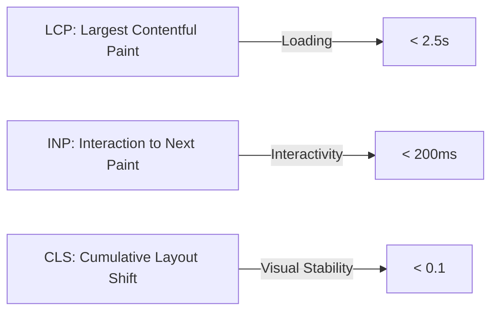
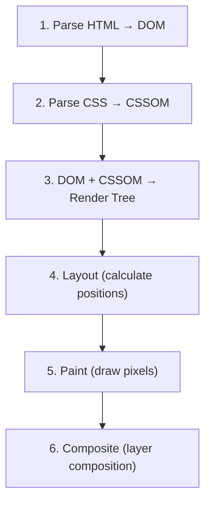
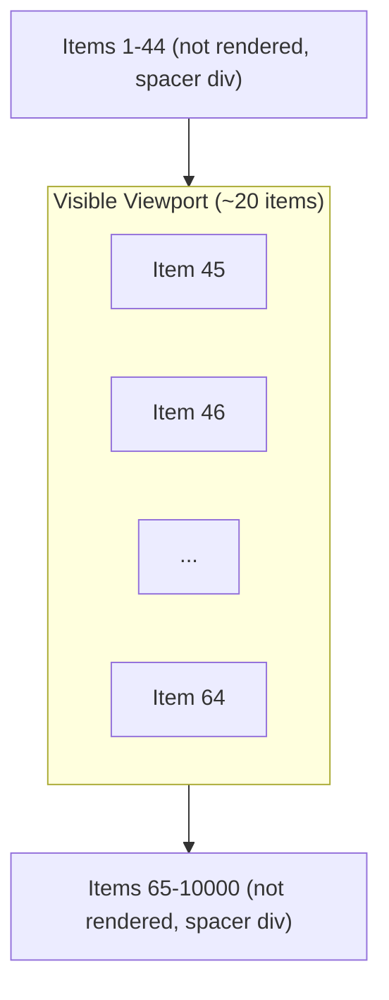

# Chapter 11: Performance Optimization

> Performance is not a feature — it's a constraint. Every 100ms of additional load time costs measurable business outcomes: conversions, engagement, and user satisfaction.

## Why This Matters for UI Architects

Performance is the UI architect's cross-cutting concern. It affects every decision — component design, rendering strategy, asset delivery, and state management. You'll be expected to know Core Web Vitals, diagnose bottlenecks, and implement solutions across the entire frontend stack.

---

## Core Web Vitals

Google's metrics for measuring real-world user experience. These directly impact search rankings.



### LCP (Largest Contentful Paint)

**What:** Time until the largest visible content element renders (hero image, heading, video poster).

**Target:** < 2.5 seconds

**Common causes of poor LCP:**
| Cause | Fix |
|---|---|
| Slow server response (TTFB) | CDN, edge rendering, caching |
| Render-blocking resources | Defer non-critical CSS/JS, inline critical CSS |
| Large images | Responsive images, WebP/AVIF, lazy loading |
| Client-side rendering | SSR or SSG for above-the-fold content |
| Slow resource loading | Preload LCP image, preconnect to origins |

**Quick wins:**

```html
<!-- Preload the LCP image -->
<link rel="preload" href="/hero.webp" as="image" fetchpriority="high">

<!-- Preconnect to API and CDN origins -->
<link rel="preconnect" href="https://api.example.com">
<link rel="preconnect" href="https://cdn.example.com">
```

### INP (Interaction to Next Paint)

**What:** Time from user interaction (click, tap, keypress) to the next visual update. Replaces FID (First Input Delay) — measures ALL interactions, not just the first.

**Target:** < 200ms

**Common causes of poor INP:**
| Cause | Fix |
|---|---|
| Long JavaScript tasks (> 50ms) | Break into smaller tasks, use `requestIdleCallback` |
| Heavy re-renders | Memoization, virtualization, fine-grained reactivity |
| Main thread blocking | Offload to Web Workers |
| Synchronous layout calculations | Avoid forced reflows, batch DOM reads/writes |

**Breaking up long tasks:**

```typescript
// Bad: blocks main thread for 500ms
function processLargeList(items: Item[]) {
  items.forEach(item => heavyComputation(item));
}

// Good: yield to main thread between chunks
async function processLargeList(items: Item[]) {
  const CHUNK_SIZE = 50;
  for (let i = 0; i < items.length; i += CHUNK_SIZE) {
    const chunk = items.slice(i, i + CHUNK_SIZE);
    chunk.forEach(item => heavyComputation(item));
    await yieldToMainThread();
  }
}

function yieldToMainThread() {
  return new Promise(resolve => setTimeout(resolve, 0));
}
```

### CLS (Cumulative Layout Shift)

**What:** Sum of all unexpected layout shifts during the page lifecycle. A shift happens when a visible element moves position without user action.

**Target:** < 0.1

**Common causes of poor CLS:**
| Cause | Fix |
|---|---|
| Images without dimensions | Always set `width` and `height` attributes |
| Ads/embeds without reserved space | Use `aspect-ratio` or min-height placeholders |
| Dynamic content insertion | Reserve space, use CSS `contain` |
| Web fonts causing FOUT | `font-display: optional` or preload fonts |
| Late-injecting banners | Reserve space in the layout |

```html
<!-- Always set dimensions to prevent layout shift -->

```

---

## Code Splitting

Send only the JavaScript needed for the current view.

### Route-Based Splitting

```typescript
// Next.js: automatic per-route splitting
// Each page in /app/ is a separate chunk

// React lazy loading:
const ProductPage = lazy(() => import('./pages/ProductPage'));
const CheckoutPage = lazy(() => import('./pages/CheckoutPage'));

function App() {
  return (
    <Suspense fallback={<PageSkeleton />}>
      <Routes>
        <Route path="/products/:id" element={<ProductPage />} />
        <Route path="/checkout" element={<CheckoutPage />} />
      </Routes>
    </Suspense>
  );
}
```

### Component-Based Splitting

```typescript
// Lazy load heavy components
const RichTextEditor = lazy(() => import('./RichTextEditor'));
const ChartLibrary = lazy(() => import('./Chart'));

function Dashboard() {
  return (
    <div>
      <MetricsCards />  {/* Loaded immediately */}
      <Suspense fallback={<ChartSkeleton />}>
        <ChartLibrary data={metrics} />  {/* Loaded on demand */}
      </Suspense>
    </div>
  );
}
```

### Angular Lazy Loading

```typescript
// Angular route-based lazy loading
const routes: Routes = [
  {
    path: 'dashboard',
    loadComponent: () => import('./dashboard/dashboard.component')
      .then(m => m.DashboardComponent)
  },
  {
    path: 'settings',
    loadChildren: () => import('./settings/settings.routes')
      .then(m => m.SETTINGS_ROUTES)
  }
];
```

---

## Image Optimization

Images are typically 50%+ of page weight. Optimizing them has the biggest impact on performance.

### Format Selection

| Format | Best For | Compression | Browser Support |
|---|---|---|---|
| **WebP** | Photos + transparency | 25-35% smaller than JPEG | 97%+ |
| **AVIF** | Photos (best compression) | 50% smaller than JPEG | 92%+ |
| **SVG** | Icons, logos, illustrations | Scalable, tiny for simple graphics | Universal |
| **PNG** | Screenshots, text-heavy images | Lossless | Universal |
| **JPEG** | Fallback for photos | Good compression, universal | Universal |

### Responsive Images

```html
<!-- Serve different sizes based on viewport -->


<!-- Modern format with fallback -->
<picture>
  <source srcset="/hero.avif" type="image/avif">
  <source srcset="/hero.webp" type="image/webp">
  
</picture>
```

### Lazy Loading

```html
<!-- Native lazy loading (below-the-fold images) -->


<!-- Eager load above-the-fold (LCP) images -->

```

**Rule:** Lazy load everything below the fold. Eagerly load the LCP element with high priority.

---

## Font Optimization

### Font Loading Strategies

| Strategy | Behavior | FOUT/FOIT | Best For |
|---|---|---|---|
| `font-display: swap` | Show fallback immediately, swap when loaded | FOUT (flash of unstyled text) | Body text |
| `font-display: optional` | Use font only if cached, skip otherwise | No flash | Performance-critical pages |
| `font-display: fallback` | Brief invisible period, then fallback | Brief FOIT | Headings |

```css
@font-face {
  font-family: 'Inter';
  src: url('/fonts/inter.woff2') format('woff2');
  font-display: swap;
  font-weight: 400;
}
```

### Font Optimization Checklist

- Use `woff2` format (best compression)
- Subset fonts (remove unused characters/languages)
- Preload critical fonts: `<link rel="preload" href="/font.woff2" as="font" crossorigin>`
- Use `font-display: swap` or `optional`
- Limit font variations (avoid loading 8 weights)
- Consider system font stack for maximum performance

```css
/* System font stack — zero download, instant rendering */
font-family: -apple-system, BlinkMacSystemFont, 'Segoe UI', Roboto,
             'Helvetica Neue', Arial, sans-serif;
```

---

## Critical Rendering Path

The sequence of steps the browser takes to render a page:



### Optimizing Each Step

**1. HTML Parsing:**
- Minimize DOM depth and node count
- Use semantic HTML (faster parsing)
- Avoid deeply nested structures

**2. CSS Parsing:**
- Inline critical CSS (above-the-fold styles)
- Defer non-critical CSS
- Remove unused CSS (PurgeCSS, Tailwind's JIT)

**3. Render Tree:**
- `display: none` elements excluded (no render cost)
- `visibility: hidden` included (still takes space)
- `content-visibility: auto` skips rendering off-screen content

**4. Layout:**
- Avoid layout thrashing (interleaving reads and writes)
- Use `transform` instead of `top`/`left` for animations
- `will-change: transform` hints for GPU acceleration

**5. Paint:**
- Promote animated elements to own layer: `will-change: transform`
- Use `contain: layout paint` to isolate repaint boundaries

```css
/* Isolate expensive components from triggering parent repaints */
.card-grid {
  contain: layout paint style;
  content-visibility: auto;
  contain-intrinsic-size: 0 500px;
}
```

---

## Virtual Scrolling

Render only visible items in long lists. Instead of rendering 10,000 DOM nodes, render ~20 visible ones and swap them as the user scrolls.



```typescript
// React example with @tanstack/react-virtual
function VirtualList({ items }) {
  const parentRef = useRef<HTMLDivElement>(null);

  const virtualizer = useVirtualizer({
    count: items.length,
    getScrollElement: () => parentRef.current,
    estimateSize: () => 50,
    overscan: 5,
  });

  return (
    <div ref={parentRef} style={{ height: '500px', overflow: 'auto' }}>
      <div style={{ height: virtualizer.getTotalSize() }}>
        {virtualizer.getVirtualItems().map((virtualRow) => (
          <div
            key={virtualRow.key}
            style={{
              position: 'absolute',
              top: virtualRow.start,
              height: virtualRow.size,
            }}
          >
            {items[virtualRow.index].name}
          </div>
        ))}
      </div>
    </div>
  );
}
```

**Angular:** Use `@angular/cdk/scrolling` with `CdkVirtualScrollViewport`.

**When to use:** Lists > 100 items, tables > 50 rows, any scrollable container with many items.

---

## Web Workers

Offload heavy computation from the main thread to prevent UI jank.

```typescript
// worker.ts
self.onmessage = (event) => {
  const { data } = event;
  const result = heavyComputation(data); // Runs off main thread
  self.postMessage(result);
};

// main thread
const worker = new Worker(new URL('./worker.ts', import.meta.url));
worker.postMessage(largeDataSet);
worker.onmessage = (event) => {
  updateUI(event.data); // Receives result without blocking UI
};
```

**Use cases:**
- Data processing (CSV parsing, JSON transformation)
- Image processing (filters, resizing)
- Search indexing (client-side full-text search)
- Cryptographic operations
- Complex calculations (financial models, scientific computing)

---

## Memory Leaks

Common sources of memory leaks in frontend apps:

| Source | Cause | Fix |
|---|---|---|
| **Event listeners** | Not removed on component unmount | Clean up in `useEffect` cleanup / `ngOnDestroy` |
| **Timers** | `setInterval` not cleared | Clear in cleanup function |
| **Closures** | Captured references prevent GC | Minimize closure scope |
| **Detached DOM nodes** | References kept to removed elements | Nullify references |
| **Subscriptions** | RxJS observables not unsubscribed | Use `takeUntil`, `async` pipe, or `DestroyRef` |
| **Global state** | State grows unbounded | Implement eviction/cleanup |

```typescript
// Angular: proper cleanup
@Component({...})
export class ChartComponent implements OnDestroy {
  private destroy$ = new Subject<void>();

  ngOnInit() {
    this.dataService.metrics$
      .pipe(takeUntil(this.destroy$))
      .subscribe(data => this.updateChart(data));
  }

  ngOnDestroy() {
    this.destroy$.next();
    this.destroy$.complete();
  }
}

// Modern Angular with DestroyRef
export class ChartComponent {
  private destroyRef = inject(DestroyRef);

  ngOnInit() {
    const sub = this.dataService.metrics$.subscribe(data =>
      this.updateChart(data)
    );
    this.destroyRef.onDestroy(() => sub.unsubscribe());
  }
}
```

---

## Bundle Analysis & Performance Budgets

### Bundle Analysis

```bash
# Webpack
npx webpack-bundle-analyzer dist/stats.json

# Source map explorer
npx source-map-explorer dist/main.*.js

# Lighthouse
npx lighthouse https://example.com --output=html
```

### Performance Budgets

Set limits and fail CI if exceeded:

| Metric | Budget | Rationale |
|---|---|---|
| Total JS (compressed) | < 200KB | Keeps parse/execute fast |
| Total CSS | < 50KB | Above this, inline critical CSS |
| LCP | < 2.5s | Core Web Vital threshold |
| INP | < 200ms | Core Web Vital threshold |
| CLS | < 0.1 | Core Web Vital threshold |
| First contentful paint | < 1.8s | Good user experience |
| Max image size | < 200KB | Prevents oversized images |

```json
// Lighthouse CI budget
{
  "ci": {
    "assert": {
      "assertions": {
        "categories:performance": ["error", { "minScore": 0.9 }],
        "largest-contentful-paint": ["error", { "maxNumericValue": 2500 }],
        "interactive": ["error", { "maxNumericValue": 3500 }],
        "resource-summary:script:size": ["error", { "maxNumericValue": 200000 }]
      }
    }
  }
}
```

---

## Perceived Performance Techniques

Sometimes making things *feel* fast matters more than making them *be* fast.

| Technique | How | Impact |
|---|---|---|
| **Skeleton screens** | Show layout placeholders while loading | Feels faster than a spinner |
| **Optimistic updates** | Show expected result before server confirms | Feels instant |
| **Prefetching** | Load next page data on hover/proximity | Instant page transitions |
| **Progressive loading** | Show low-res first, load full quality | Content visible earlier |
| **Instant navigation** | Cache previous pages, restore instantly | No loading between pages |
| **Animation during waits** | Subtle progress indicators | Distraction from wait time |

---

## Interview Tips

1. **Lead with metrics** — "I'd measure LCP, INP, and CLS using Lighthouse and Real User Monitoring. Our targets are LCP < 2.5s, INP < 200ms, CLS < 0.1."

2. **Prioritize by impact** — "The biggest wins are usually: optimize images (50% of page weight), code split routes (reduce initial JS), and add proper cache headers (eliminate repeat downloads)."

3. **Know the tools** — "I'd use Lighthouse CI in the pipeline to enforce performance budgets, Chrome DevTools Performance tab for profiling, and `web-vitals` library for real user data."

4. **Show depth on specific techniques** — "For a 10,000-row table, I'd use virtual scrolling — only rendering ~30 visible rows. This keeps DOM node count under 100 instead of 10,000, and INP stays under 50ms."

5. **Connect to business** — "Amazon found that every 100ms of latency costs 1% in sales. Our performance budget directly protects conversion rates."

---

## Key Takeaways

- Core Web Vitals (LCP, INP, CLS) are the primary performance metrics — know targets and fixes for each
- Code splitting per route is the minimum; split heavy components too
- Image optimization (WebP/AVIF, responsive, lazy loading) gives the biggest payload reduction
- Font loading strategy affects both performance and visual stability (CLS)
- Virtual scrolling is essential for long lists (> 100 items)
- Web Workers offload heavy computation from the main thread
- Memory leaks accumulate over time — always clean up subscriptions, listeners, and timers
- Performance budgets in CI prevent regression — set thresholds and fail builds that exceed them
- Perceived performance (skeletons, optimistic updates, prefetching) often matters more than raw speed
