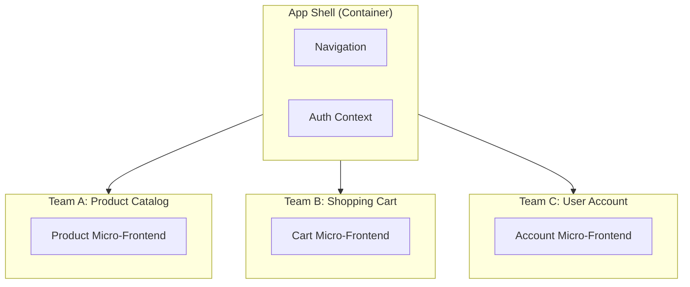
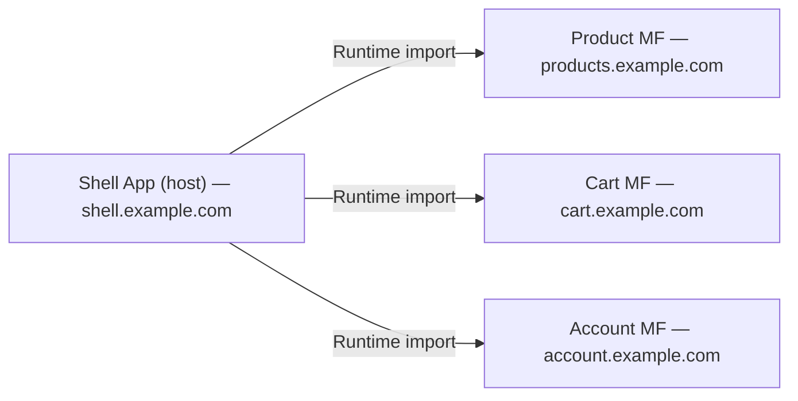
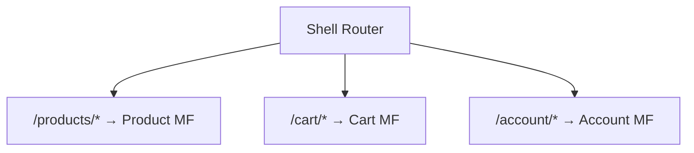
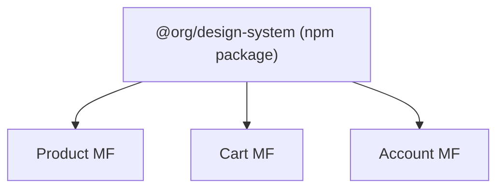

# Chapter 12: Micro-Frontends

> Breaking a monolithic frontend into independently deployable pieces — when the organizational benefit outweighs the technical complexity.

## Why This Matters for UI Architects

Micro-frontends are an organizational scaling strategy. When multiple teams work on a single frontend codebase, coordination overhead grows quadratically. Micro-frontends let teams own, develop, and deploy their slice of the UI independently. As a UI architect, you'll be asked to evaluate whether this pattern fits, and if so, how to implement it without destroying user experience.

---

## What Are Micro-Frontends?

Each team owns a vertical slice of the product — from UI to API to database.



**Key principles:**
1. **Independent development** — Each team has its own repo, CI/CD, tech stack
2. **Independent deployment** — Deploy without coordinating with other teams
3. **Team ownership** — End-to-end ownership of a business domain
4. **Isolation** — One micro-frontend's bug doesn't crash another

---

## Integration Approaches

### 1. Build-Time Integration (npm packages)

Each micro-frontend is published as an npm package, consumed by the shell at build time.

```json
{
  "dependencies": {
    "@org/product-catalog": "^2.1.0",
    "@org/shopping-cart": "^1.5.0",
    "@org/user-account": "^3.0.0"
  }
}
```

| Pros | Cons |
|---|---|
| Simple, familiar | NOT independently deployable (need shell rebuild) |
| Strong type safety | Version coordination required |
| Tree-shaking works | Defeats the main purpose of micro-frontends |

**Verdict:** Not true micro-frontends. Better for shared library distribution.

### 2. Runtime Integration via Module Federation

Webpack/Rspack Module Federation loads micro-frontends at runtime from different servers.



```typescript
// Shell (host) webpack config
new ModuleFederationPlugin({
  name: 'shell',
  remotes: {
    productApp: 'productApp@https://products.example.com/remoteEntry.js',
    cartApp: 'cartApp@https://cart.example.com/remoteEntry.js',
  },
  shared: ['react', 'react-dom'],
});

// Product micro-frontend webpack config
new ModuleFederationPlugin({
  name: 'productApp',
  filename: 'remoteEntry.js',
  exposes: {
    './ProductList': './src/components/ProductList',
    './ProductDetail': './src/components/ProductDetail',
  },
  shared: ['react', 'react-dom'],
});
```

```typescript
// Shell consuming the remote component
const ProductList = React.lazy(
  () => import('productApp/ProductList')
);

function App() {
  return (
    <Suspense fallback={<Skeleton />}>
      <ProductList />
    </Suspense>
  );
}
```

| Pros | Cons |
|---|---|
| True independent deployment | Complex webpack/build config |
| Runtime loading (no shell rebuild) | Version mismatches possible |
| Shared dependencies (single React copy) | Debugging across boundaries harder |
| Granular (expose specific components) | Extra network requests for remote entries |

### 3. iframe-Based

Each micro-frontend runs in its own iframe — complete isolation.

```html
<iframe src="https://products.example.com/catalog" />
<iframe src="https://cart.example.com/mini-cart" />
```

| Pros | Cons |
|---|---|
| Complete isolation (CSS, JS, DOM) | No shared styling (looks inconsistent) |
| Any tech stack per iframe | Poor performance (separate browser contexts) |
| Can't crash parent or siblings | Difficult cross-iframe communication |
| Security sandbox | Not responsive-friendly |
| | Accessibility challenges |

**Use when:** Embedding third-party widgets, legacy app integration, when isolation is mandatory.

### 4. Web Components

Micro-frontends packaged as custom HTML elements.

```typescript
// Product team defines their micro-frontend as a custom element
class ProductCatalog extends HTMLElement {
  connectedCallback() {
    const shadow = this.attachShadow({ mode: 'open' });
    // Render the micro-frontend inside shadow DOM
    renderApp(shadow, { category: this.getAttribute('category') });
  }

  disconnectedCallback() {
    // Cleanup
  }
}
customElements.define('product-catalog', ProductCatalog);
```

```html
<!-- Shell uses it like any HTML element -->
<product-catalog category="electronics"></product-catalog>
<shopping-cart></shopping-cart>
```

| Pros | Cons |
|---|---|
| Framework-agnostic (standard HTML) | Shadow DOM styling limitations |
| CSS isolation via Shadow DOM | Server-side rendering is complex |
| Works in any framework | Communication via attributes/events (limited) |
| Progressive enhancement | Hydration challenges |

### 5. Single-SPA

A framework that orchestrates multiple frontend applications on a single page.

```typescript
// Root config
import { registerApplication, start } from 'single-spa';

registerApplication({
  name: 'product-app',
  app: () => System.import('https://products.example.com/app.js'),
  activeWhen: ['/products'],
});

registerApplication({
  name: 'cart-app',
  app: () => System.import('https://cart.example.com/app.js'),
  activeWhen: ['/cart'],
});

start();
```

| Pros | Cons |
|---|---|
| Route-based micro-frontends | Learning curve |
| Framework-agnostic | Global CSS conflicts |
| Mature ecosystem | No built-in shared dependencies |
| Lifecycle management | Performance overhead |

### Approach Comparison

| Approach | Isolation | Independence | Shared State | Performance | Complexity |
|---|---|---|---|---|---|
| **npm packages** | None | Low | Easy | Best | Low |
| **Module Federation** | JS only | High | Via shared libs | Good | Medium |
| **iframes** | Complete | Complete | Hard (postMessage) | Poor | Low |
| **Web Components** | CSS (Shadow DOM) | High | Events/attributes | Good | Medium |
| **single-spa** | None (shared DOM) | High | Shared stores | Good | High |

---

## Shared Dependencies

The biggest challenge: multiple micro-frontends using the same library (React, Angular, lodash).

### Strategies

| Strategy | How | Trade-off |
|---|---|---|
| **Shared (singleton)** | Module Federation `shared` config with `singleton: true` | One version of React across all MFs; version mismatch risk |
| **Externals** | Load from CDN, all MFs use same global | Simple; coupling to specific version |
| **Duplicated** | Each MF bundles its own copy | Isolation; larger total bundle size |

**Best practice:** Share framework libraries (React, Angular) as singletons. Let utility libraries (lodash, date-fns) duplicate if versions differ — the size cost is usually acceptable.

---

## Cross-App Communication

Micro-frontends need to communicate (user logged in, item added to cart, navigation).

### Patterns

| Pattern | How | Best For |
|---|---|---|
| **Custom Events** | `window.dispatchEvent(new CustomEvent('cart:updated'))` | Loose coupling, simple data |
| **Shared Event Bus** | Publish/subscribe via a shared module | Moderate coupling |
| **URL/Router** | Navigate via URL changes | Page-level transitions |
| **Shared State** | Zustand/Redux store shared across MFs | Tight integration needs |
| **Props/Attributes** | Pass data via component props/attributes | Parent-child MF communication |

```typescript
// Custom Events pattern — loosely coupled
// Cart MF: dispatch event when item added
window.dispatchEvent(new CustomEvent('cart:item-added', {
  detail: { productId: '42', quantity: 1 }
}));

// Header MF: listen for cart updates
window.addEventListener('cart:item-added', (event: CustomEvent) => {
  updateCartBadge(event.detail);
});
```

---

## Routing

### Client-Side Routing



**Challenge:** Each micro-frontend has its own internal routing. The shell handles top-level routes, then delegates to the micro-frontend's router.

**Pattern:** Shell owns the base route, micro-frontend owns child routes.

```
Shell:     /products/*       → load Product MF
Product MF: /products/       → product list
            /products/:id    → product detail
            /products/:id/reviews → reviews
```

---

## When to Use Micro-Frontends

### Good Fit

- **Multiple autonomous teams** (5+ teams, 20+ developers on one frontend)
- **Independent release cycles** needed (team A deploys daily, team B weekly)
- **Different tech stacks** per team (legacy Angular + new React)
- **Organizational boundary** aligns with UI boundary (team per business domain)

### Bad Fit

- **Small team** (< 10 developers) — overhead isn't worth it
- **Tightly coupled features** (shared data model, intertwined UI)
- **Consistent UX is critical** — harder to maintain across MFs
- **Performance is top priority** — additional overhead from MF infrastructure
- **Greenfield project** — start with a monolith, split later if needed

### The "Monolith First" Rule

> Start with a well-structured monolith. Extract micro-frontends only when organizational pain demands it.

Most teams that adopt micro-frontends prematurely end up with distributed monolith problems: coordination overhead, version conflicts, and duplicated logic — without the benefits of independent deployment.

---

## Maintaining Consistency

### Shared Design System



All micro-frontends consume the same design system package. The design system team publishes updates; MF teams upgrade at their own pace (within a compatibility window).

### Shared Contracts

- **API types** — shared TypeScript interfaces for cross-MF communication
- **Event schemas** — documented custom event payloads
- **Route conventions** — agreed-upon URL patterns
- **Token naming** — consistent design token names

---

## Interview Tips

1. **Start with "why"** — "Micro-frontends solve an organizational problem: multiple teams need to ship independently. If we have 3 teams and a shared codebase, merge conflicts and release coordination become the bottleneck."

2. **Know the trade-offs** — "The cost is complexity: shared dependencies, cross-MF communication, routing, and maintaining UX consistency. For a team of 5, a well-structured monolith is simpler and faster."

3. **Recommend Module Federation** — "For most cases, I'd use Module Federation. It gives independent deployment, shared React/Angular, and component-level granularity without the isolation cost of iframes."

4. **Address consistency** — "We maintain a shared design system as an npm package. Each team imports from `@org/ui`. We have visual regression tests across all micro-frontends to catch inconsistencies."

5. **Know when NOT to** — "I've seen teams adopt micro-frontends too early and spend more time on infrastructure than features. The signal to split is when team coordination (not code complexity) becomes the bottleneck."

---

## Key Takeaways

- Micro-frontends solve organizational scaling (team independence), not technical scaling
- Module Federation is the most practical approach — runtime loading, shared dependencies, component-level granularity
- iframes for maximum isolation (legacy/third-party), web components for framework-agnostic scenarios
- Cross-MF communication: prefer Custom Events (loose coupling) over shared state (tight coupling)
- A shared design system is non-negotiable for visual consistency across micro-frontends
- Start with a monolith — extract micro-frontends only when team coordination becomes the bottleneck
- The overhead is real: build complexity, debugging across boundaries, performance cost, and version management
