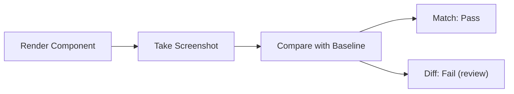
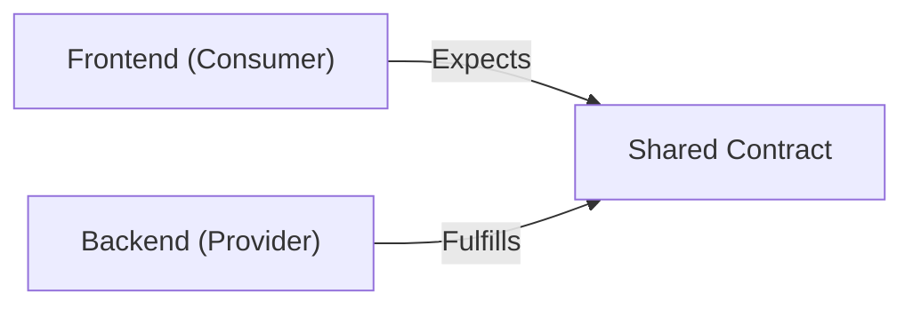
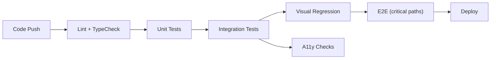

# Chapter 14: Testing & Quality

> A testing strategy isn't about writing more tests — it's about writing the right tests at the right level to maximize confidence while minimizing maintenance cost.

## Why This Matters for UI Architects

A UI architect defines the testing strategy for the entire frontend organization. You decide what to test, how to test it, and where in the CI pipeline each test runs. The wrong strategy leads to either false confidence (too few tests) or painful maintenance (too many brittle tests). The right strategy makes refactoring fearless and deployments boring.

---

## Testing Pyramid vs Testing Trophy

### Traditional Testing Pyramid

```
        /  E2E Tests  \          (Few, slow, expensive)
       / Integration    \        (Some, moderate speed)
      /   Unit Tests      \      (Many, fast, cheap)
     ‾‾‾‾‾‾‾‾‾‾‾‾‾‾‾‾‾‾‾‾‾
```

**Pyramid says:** Write mostly unit tests (fast, isolated), fewer integration tests, fewest E2E tests.

### Modern Testing Trophy (Preferred for Frontend)

```
        /    E2E    \              (Few critical paths)
       / Integration  \           (Most tests here)
      /   Unit Tests    \         (Logic-heavy utilities)
     /   Static Analysis  \       (TypeScript, ESLint)
     ‾‾‾‾‾‾‾‾‾‾‾‾‾‾‾‾‾‾‾‾‾
```

**Trophy says:** Most value comes from integration tests that test components as users interact with them. Unit tests for pure logic. Static analysis (TypeScript + linting) catches the most bugs for free.

**Why the shift?** Frontend unit tests that mock everything (DOM, APIs, state) give false confidence. A test that renders a component with its real children and simulates user interaction catches real bugs.

---

## Static Analysis (Free, Instant)

The highest ROI testing investment — catches bugs before code even runs.

### TypeScript

```typescript
// TypeScript catches this at compile time
function getUser(id: number): User {
  return fetch(`/api/users/${id}`); // Error: Promise<Response> is not User
}

// Prevents null reference errors
function greet(user: User | null) {
  return user.name; // Error: Object is possibly 'null'
}
```

**TypeScript strict mode catches:**
- Null/undefined reference errors
- Type mismatches
- Missing properties
- Incorrect function arguments
- Unreachable code

### ESLint

```javascript
// ESLint rules that prevent bugs
"rules": {
  "no-unused-vars": "error",
  "no-console": "warn",
  "react-hooks/rules-of-hooks": "error",
  "react-hooks/exhaustive-deps": "warn",
  "@typescript-eslint/no-explicit-any": "error",
  "@angular-eslint/no-lifecycle-call": "error"
}
```

### Impact

| Tool | Bugs Caught | Cost | Speed |
|---|---|---|---|
| TypeScript strict | ~40% of bugs | Zero (compile time) | Instant |
| ESLint | ~15% of bugs | Zero (lint time) | Instant |
| **Combined** | **~50% of bugs** | **Zero runtime cost** | **Instant feedback** |

---

## Unit Tests

Test individual functions, utilities, and pure logic in isolation.

### What to Unit Test

- **Pure functions** — formatters, validators, calculators, transformers
- **Custom hooks** (React) / **Services** (Angular) — business logic
- **Reducers / state machines** — state transitions
- **Utility modules** — date formatting, string manipulation, data processing

### What NOT to Unit Test

- **Implementation details** — internal state, private methods
- **Simple components** — a component that just renders props
- **Framework code** — don't test that React re-renders correctly
- **Third-party libraries** — don't test lodash's `debounce`

### Examples

```typescript
// Pure function — perfect for unit tests
function calculateDiscount(price: number, tier: 'silver' | 'gold' | 'platinum'): number {
  const rates = { silver: 0.05, gold: 0.10, platinum: 0.15 };
  return price * rates[tier];
}

// Test
describe('calculateDiscount', () => {
  it('applies 5% for silver tier', () => {
    expect(calculateDiscount(100, 'silver')).toBe(5);
  });

  it('applies 15% for platinum tier', () => {
    expect(calculateDiscount(200, 'platinum')).toBe(30);
  });
});
```

```typescript
// Angular service test
describe('CartService', () => {
  let service: CartService;

  beforeEach(() => {
    TestBed.configureTestingModule({ providers: [CartService] });
    service = TestBed.inject(CartService);
  });

  it('adds item and updates total', () => {
    service.addItem({ id: '1', name: 'Widget', price: 10, quantity: 2 });
    expect(service.items().length).toBe(1);
    expect(service.total()).toBe(20);
  });

  it('removes item and updates total', () => {
    service.addItem({ id: '1', name: 'Widget', price: 10, quantity: 1 });
    service.removeItem('1');
    expect(service.items().length).toBe(0);
    expect(service.total()).toBe(0);
  });
});
```

---

## Integration / Component Tests

Test components as users interact with them — render real components, simulate user actions, verify visible output.

### The Guiding Principle

> "The more your tests resemble the way your software is used, the more confidence they can give you." — Kent C. Dodds

### Testing Library Philosophy

- Query by what users see (text, labels, roles), not by implementation (class names, test IDs)
- Simulate real user interactions (click, type, select), not programmatic state changes
- Assert on visible output (what's on screen), not internal state

```typescript
// React: Integration test with Testing Library
import { render, screen, fireEvent, waitFor } from '@testing-library/react';

describe('LoginForm', () => {
  it('shows error on invalid credentials', async () => {
    server.use(
      http.post('/api/login', () => {
        return HttpResponse.json({ error: 'Invalid credentials' }, { status: 401 });
      })
    );

    render(<LoginForm />);

    fireEvent.change(screen.getByLabelText('Email'), {
      target: { value: 'user@example.com' },
    });
    fireEvent.change(screen.getByLabelText('Password'), {
      target: { value: 'wrong' },
    });
    fireEvent.click(screen.getByRole('button', { name: 'Sign In' }));

    await waitFor(() => {
      expect(screen.getByText('Invalid credentials')).toBeInTheDocument();
    });
  });

  it('redirects on successful login', async () => {
    server.use(
      http.post('/api/login', () => {
        return HttpResponse.json({ user: { name: 'Alice' } });
      })
    );

    render(<LoginForm />);

    fireEvent.change(screen.getByLabelText('Email'), {
      target: { value: 'alice@example.com' },
    });
    fireEvent.change(screen.getByLabelText('Password'), {
      target: { value: 'correct' },
    });
    fireEvent.click(screen.getByRole('button', { name: 'Sign In' }));

    await waitFor(() => {
      expect(screen.getByText('Welcome, Alice')).toBeInTheDocument();
    });
  });
});
```

```typescript
// Angular: Component test
describe('LoginComponent', () => {
  let component: LoginComponent;
  let fixture: ComponentFixture<LoginComponent>;
  let authService: jasmine.SpyObj<AuthService>;

  beforeEach(async () => {
    authService = jasmine.createSpyObj('AuthService', ['login']);

    await TestBed.configureTestingModule({
      imports: [LoginComponent, ReactiveFormsModule],
      providers: [{ provide: AuthService, useValue: authService }],
    }).compileComponents();

    fixture = TestBed.createComponent(LoginComponent);
    component = fixture.componentInstance;
    fixture.detectChanges();
  });

  it('disables submit button when form is invalid', () => {
    const button = fixture.nativeElement.querySelector('button[type="submit"]');
    expect(button.disabled).toBeTrue();
  });

  it('calls auth service on valid submission', () => {
    authService.login.and.returnValue(of({ user: { name: 'Alice' } }));

    component.form.setValue({ email: 'alice@test.com', password: 'password' });
    fixture.detectChanges();

    const button = fixture.nativeElement.querySelector('button[type="submit"]');
    button.click();

    expect(authService.login).toHaveBeenCalledWith('alice@test.com', 'password');
  });
});
```

### API Mocking with MSW (Mock Service Worker)

Mock at the network level — components use real fetch/HttpClient, MSW intercepts requests.

```typescript
import { setupServer } from 'msw/node';
import { http, HttpResponse } from 'msw';

const server = setupServer(
  http.get('/api/users', () => {
    return HttpResponse.json([
      { id: 1, name: 'Alice' },
      { id: 2, name: 'Bob' },
    ]);
  }),
  http.post('/api/users', async ({ request }) => {
    const body = await request.json();
    return HttpResponse.json({ id: 3, ...body }, { status: 201 });
  })
);

beforeAll(() => server.listen());
afterEach(() => server.resetHandlers());
afterAll(() => server.close());
```

**Why MSW?** It mocks at the network layer, not the module level. Your components use the real HTTP client (fetch, HttpClient), giving higher confidence than mocking axios or HttpClient directly.

---

## End-to-End (E2E) Tests

Test the full application in a real browser — frontend, API, database.

### When to Write E2E Tests

- **Critical user paths** — login, checkout, payment, signup
- **Complex multi-step flows** — wizards, multi-page forms
- **Integration with real APIs** — payment gateways, OAuth
- **Cross-browser verification** — if browser compatibility matters

### When NOT to Write E2E Tests

- Every edge case (too slow, too brittle)
- Simple CRUD operations (integration tests suffice)
- Visual styling (use visual regression tests instead)

### Playwright (Recommended)

```typescript
import { test, expect } from '@playwright/test';

test('user can complete checkout', async ({ page }) => {
  await page.goto('/products');

  await page.getByRole('button', { name: 'Add to Cart' }).first().click();
  await page.getByRole('link', { name: 'Cart' }).click();

  await expect(page.getByText('1 item')).toBeVisible();

  await page.getByRole('button', { name: 'Checkout' }).click();

  await page.getByLabel('Card Number').fill('4242424242424242');
  await page.getByLabel('Expiry').fill('12/25');
  await page.getByLabel('CVC').fill('123');

  await page.getByRole('button', { name: 'Pay Now' }).click();

  await expect(page.getByText('Order Confirmed')).toBeVisible();
});
```

### Cypress vs Playwright

| Feature | Cypress | Playwright |
|---|---|---|
| Browsers | Chrome, Firefox, Edge | Chrome, Firefox, Safari, Edge |
| Speed | Moderate | Fast (parallel by default) |
| API testing | Built-in | Built-in |
| Mobile emulation | Limited | Full support |
| Multi-tab/multi-domain | Limited | Full support |
| Language | JavaScript only | JS, Python, Java, .NET |
| Visual testing | Via plugins | Via comparison APIs |
| Network interception | Good | Excellent |

---

## Visual Regression Testing

Catch unintended visual changes by comparing screenshots.

### How It Works



### Tools

| Tool | Approach | Best For |
|---|---|---|
| **Chromatic** (Storybook) | Cloud-based, per-component | Design system components |
| **Percy** (BrowserStack) | Cloud-based, full-page | Full-page visual testing |
| **Playwright screenshots** | Self-hosted, E2E integration | E2E visual verification |
| **BackstopJS** | Self-hosted, configurable | Budget-conscious teams |

```typescript
// Playwright visual comparison
test('product card renders correctly', async ({ page }) => {
  await page.goto('/products/42');
  await expect(page.getByTestId('product-card')).toHaveScreenshot('product-card.png');
});
```

---

## Contract Testing

Verify the API contract between frontend and backend without running the full stack.



### Pact Testing

```typescript
// Frontend defines expected API behavior
const interaction = {
  state: 'user exists',
  uponReceiving: 'a request for user profile',
  withRequest: {
    method: 'GET',
    path: '/api/users/42',
    headers: { Accept: 'application/json' },
  },
  willRespondWith: {
    status: 200,
    body: {
      id: like(42),
      name: like('Alice'),
      email: like('alice@example.com'),
    },
  },
};
```

The contract is generated from frontend tests and verified against the backend. If the backend changes the response shape, the contract test fails before deployment.

---

## Accessibility Testing

### Automated A11y Testing

```typescript
// axe-core integration with Testing Library
import { axe, toHaveNoViolations } from 'jest-axe';

expect.extend(toHaveNoViolations);

test('form is accessible', async () => {
  const { container } = render(<LoginForm />);
  const results = await axe(container);
  expect(results).toHaveNoViolations();
});
```

```typescript
// Playwright with axe
import AxeBuilder from '@axe-core/playwright';

test('page is accessible', async ({ page }) => {
  await page.goto('/dashboard');
  const results = await new AxeBuilder({ page }).analyze();
  expect(results.violations).toEqual([]);
});
```

### A11y Testing Scope

| Automated (70%) | Manual (30%) |
|---|---|
| Missing alt text | Screen reader flow |
| Color contrast | Keyboard navigation usability |
| Missing labels | Focus management |
| ARIA attribute errors | Reading order |
| Heading hierarchy | Cognitive load |

Automated testing catches ~70% of accessibility issues. Manual testing (screen reader + keyboard) is needed for the rest.

---

## Testing Strategy for Large Apps

### Test Distribution

| Level | Coverage | Run When | Duration |
|---|---|---|---|
| **Static** (TypeScript + ESLint) | All code | Every save (IDE), every commit | Seconds |
| **Unit** | Utilities, services, pure logic | Every commit (CI) | 30 seconds |
| **Integration** | Components with behavior | Every PR (CI) | 2-5 minutes |
| **Visual** | Design system components | Every PR (CI) | 2-5 minutes |
| **E2E** | Critical paths (5-10 flows) | Pre-deploy, nightly | 10-20 minutes |
| **A11y** | All pages/components | Every PR (CI) | 1-2 minutes |

### CI Pipeline



---

## Interview Tips

1. **Describe your testing philosophy** — "I follow the testing trophy: TypeScript and ESLint catch 50% of bugs for free. Most tests are integration-level using Testing Library with MSW for API mocking. E2E covers only the 5-10 most critical user flows."

2. **Emphasize ROI** — "We test behaviors, not implementation. If we refactor a component's internal state management, the tests still pass because they test what the user sees and does, not how the component works internally."

3. **Mention test confidence** — "Our integration tests use MSW to mock at the network layer, so the real HTTP client runs. This catches issues that module-level mocks would miss."

4. **Know the trade-offs** — "E2E tests are slow and flaky in CI. We run the full suite nightly but only critical-path E2E on every deploy. Integration tests give us 90% of the confidence in 10% of the time."

5. **Connect to architecture** — "Our design system has Storybook with Chromatic for visual testing. Feature teams write integration tests for their components. E2E tests cover cross-feature user flows."

---

## Key Takeaways

- Testing trophy > testing pyramid for frontend: most value from integration tests
- Static analysis (TypeScript strict + ESLint) catches ~50% of bugs for free
- Unit test pure logic; integration test component behavior; E2E test critical paths
- Test user behavior, not implementation — query by role/label, not class names
- MSW (Mock Service Worker) mocks at the network layer for realistic integration tests
- Visual regression testing catches unintended CSS changes
- Accessibility testing should be automated (axe-core) + manual (screen reader)
- Contract testing (Pact) prevents frontend/backend API mismatches
- CI pipeline: lint → unit → integration → visual → a11y → E2E → deploy
