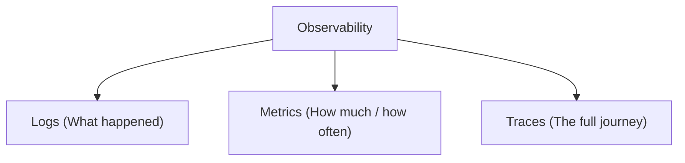
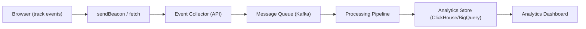
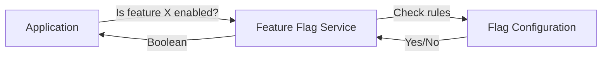
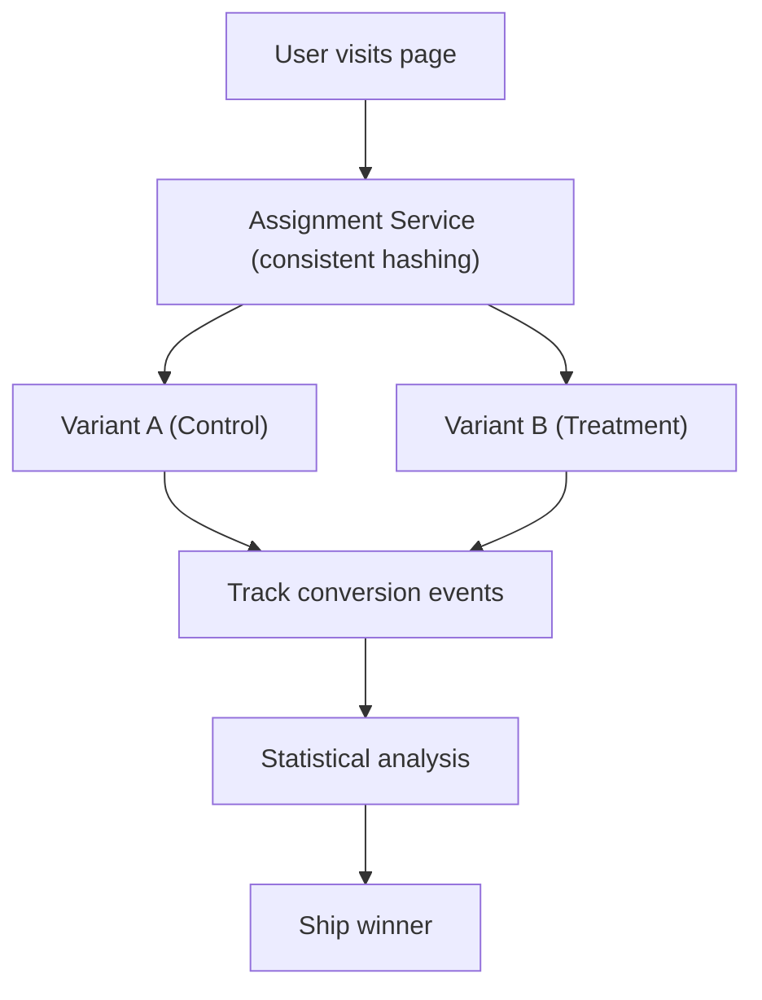

# Chapter 15: Observability

> You can't improve what you can't measure. Observability is how you understand what your application is doing in production — before users complain.

## Why This Matters for UI Architects

Frontend observability is frequently overlooked. Backend teams have mature monitoring, but frontend errors often go unnoticed — silently breaking for users while dashboards stay green. A UI architect must establish the observability strategy: error tracking, performance monitoring, analytics, and feature flags.

---

## The Three Pillars of Observability



| Pillar | What | Frontend Example | Tool |
|---|---|---|---|
| **Logs** | Discrete events with context | Error stack traces, user actions | Sentry, Datadog, LogRocket |
| **Metrics** | Aggregated numerical measurements | LCP p95, error rate, API latency | Datadog RUM, web-vitals, Prometheus |
| **Traces** | Request journey across services | Click → API call → response → render | OpenTelemetry, Datadog APM |

---

## Error Tracking

### Why Browser Errors Are Different

- Errors happen on **users' devices** — you can't SSH into their browser
- Environment varies: browser, OS, extensions, network, device
- Errors may be caused by **third-party scripts** (ads, analytics, chat widgets)
- Minified stack traces are unreadable without source maps

### Error Tracking Setup

```typescript
// Sentry — industry standard for error tracking
import * as Sentry from '@sentry/browser';

Sentry.init({
  dsn: 'https://...@sentry.io/...',
  environment: 'production',
  release: 'my-app@1.2.3',

  integrations: [
    Sentry.browserTracingIntegration(),
    Sentry.replayIntegration(),
  ],

  tracesSampleRate: 0.1,       // 10% of transactions for performance
  replaysSessionSampleRate: 0.1, // 10% of sessions recorded
  replaysOnErrorSampleRate: 1.0, // 100% of error sessions recorded
});
```

### Error Boundaries (React)

```typescript
class ErrorBoundary extends React.Component {
  state = { hasError: false };

  static getDerivedStateFromError(error) {
    return { hasError: true };
  }

  componentDidCatch(error, errorInfo) {
    Sentry.captureException(error, {
      extra: { componentStack: errorInfo.componentStack },
    });
  }

  render() {
    if (this.state.hasError) {
      return <ErrorFallback onRetry={() => this.setState({ hasError: false })} />;
    }
    return this.props.children;
  }
}

// Usage: wrap sections, not the whole app
<ErrorBoundary>
  <DashboardWidgets />
</ErrorBoundary>
```

### Angular Error Handler

```typescript
@Injectable()
export class GlobalErrorHandler implements ErrorHandler {
  constructor(private injector: Injector) {}

  handleError(error: unknown) {
    const errorService = this.injector.get(ErrorTrackingService);
    errorService.logError(error);

    // Don't swallow the error in development
    if (!environment.production) {
      console.error(error);
    }
  }
}

// Register globally
@NgModule({
  providers: [{ provide: ErrorHandler, useClass: GlobalErrorHandler }],
})
export class AppModule {}
```

### What to Capture with Each Error

| Data Point | Why |
|---|---|
| Stack trace (with source maps) | Where the error occurred |
| Browser + OS + device | Environment context |
| URL + route | What page the user was on |
| User ID (if authenticated) | Who was affected |
| Breadcrumbs (recent actions) | What the user did before the error |
| Network requests | API failures that may have caused the error |
| Console logs | Additional context |
| Session replay | Exactly what the user saw |

---

## Real User Monitoring (RUM)

Measure actual performance experienced by real users, not synthetic lab scores.

### Core Web Vitals Collection

```typescript
import { onLCP, onINP, onCLS } from 'web-vitals';

function sendMetric(metric) {
  navigator.sendBeacon('/api/metrics', JSON.stringify({
    name: metric.name,
    value: metric.value,
    rating: metric.rating,   // 'good' | 'needs-improvement' | 'poor'
    delta: metric.delta,
    id: metric.id,
    url: location.href,
    timestamp: Date.now(),
  }));
}

onLCP(sendMetric);
onINP(sendMetric);
onCLS(sendMetric);
```

### Key RUM Metrics

| Metric | What | Target | Why |
|---|---|---|---|
| **LCP** | Largest content paint | < 2.5s | Loading speed |
| **INP** | Interaction to next paint | < 200ms | Responsiveness |
| **CLS** | Cumulative layout shift | < 0.1 | Visual stability |
| **TTFB** | Time to first byte | < 800ms | Server/network speed |
| **FCP** | First contentful paint | < 1.8s | Perceived loading |
| **Error rate** | JS errors / page views | < 0.1% | Stability |
| **API latency (p95)** | 95th percentile API response | < 1s | Backend performance |

### Percentile Thinking

**Average hides problems.** If average LCP is 1.5s but p95 is 8s, 5% of users have a terrible experience.

```
p50 (median): 1.2s    — Half your users see this or better
p75: 2.0s              — 75% see this or better (Google's CWV threshold)
p95: 5.5s              — 5% of users wait this long
p99: 12s               — 1% have an awful experience (often mobile/slow networks)
```

**Always monitor p75 and p95**, not just averages.

### Segmentation

Break metrics by:
- **Device type** — mobile vs desktop (mobile is always worse)
- **Geography** — latency varies by region
- **Browser** — Safari vs Chrome can differ significantly
- **Connection speed** — 4G vs 3G vs WiFi
- **Page/Route** — which pages are slowest?
- **User segment** — new vs returning, free vs paid

---

## Synthetic Monitoring

Simulated tests that run from controlled environments on a schedule.

| Aspect | RUM | Synthetic |
|---|---|---|
| Data source | Real user sessions | Simulated, controlled |
| Environment | Varies wildly | Consistent (same device, network) |
| Coverage | Only pages users visit | Any page/flow you define |
| Variability | High (real-world conditions) | Low (reproducible) |
| Best for | Understanding real experience | Baseline, regression detection, uptime |

### Synthetic Tools

| Tool | Focus |
|---|---|
| **Lighthouse CI** | Performance auditing in CI pipeline |
| **WebPageTest** | Detailed waterfall analysis |
| **Pingdom / Uptime Robot** | Uptime and response time monitoring |
| **Datadog Synthetic** | Multi-step user flow monitoring |

### Lighthouse in CI

```yaml
# GitHub Actions
- name: Run Lighthouse
  uses: treosh/lighthouse-ci-action@v12
  with:
    urls: |
      https://staging.example.com/
      https://staging.example.com/products
    budgetPath: ./lighthouse-budget.json
    uploadArtifacts: true
```

---

## Structured Logging

### Frontend Logging Best Practices

```typescript
// Structured log format
interface LogEvent {
  level: 'debug' | 'info' | 'warn' | 'error';
  message: string;
  timestamp: string;
  context: {
    userId?: string;
    sessionId: string;
    route: string;
    action: string;
    duration?: number;
    metadata?: Record<string, unknown>;
  };
}

// Logger service
class Logger {
  private sessionId = generateSessionId();

  info(message: string, context?: Partial<LogEvent['context']>) {
    this.send({
      level: 'info',
      message,
      timestamp: new Date().toISOString(),
      context: {
        sessionId: this.sessionId,
        route: window.location.pathname,
        ...context,
      },
    });
  }

  private send(event: LogEvent) {
    // Batch and send via beacon (doesn't block navigation)
    navigator.sendBeacon('/api/logs', JSON.stringify(event));
  }
}
```

### User Action Breadcrumbs

Track what the user did leading up to an error:

```
[10:30:01] Navigation: /dashboard
[10:30:02] Click: "Export Report" button
[10:30:03] API: GET /api/reports/export → 200 (450ms)
[10:30:04] Click: "Download CSV"
[10:30:04] API: GET /api/reports/123/csv → 500 (2100ms)
[10:30:05] ERROR: Unhandled rejection: NetworkError
```

This timeline tells you *exactly* what happened before the error.

---

## Analytics Architecture

### Event Tracking Pattern

```typescript
// Define a typed analytics event schema
type AnalyticsEvent =
  | { name: 'page_view'; properties: { path: string; title: string } }
  | { name: 'product_viewed'; properties: { productId: string; category: string } }
  | { name: 'add_to_cart'; properties: { productId: string; price: number } }
  | { name: 'checkout_started'; properties: { cartTotal: number; itemCount: number } }
  | { name: 'purchase_completed'; properties: { orderId: string; total: number } };

// Type-safe tracking function
function track(event: AnalyticsEvent) {
  analyticsQueue.push({
    ...event,
    timestamp: Date.now(),
    sessionId: getSessionId(),
    userId: getUserId(),
  });
  flushIfNeeded();
}
```

### Analytics Architecture



**Key design decisions:**
- **Client-side batching** — don't send one request per event; batch every 5s or on page unload
- **sendBeacon** — guaranteed delivery even during page navigation
- **Queue-based pipeline** — decouple collection from processing
- **Columnar store** — ClickHouse or BigQuery for fast aggregation queries

---

## Feature Flags

Control which features are visible to which users without deploying new code.



### Use Cases

| Use Case | How |
|---|---|
| **Gradual rollout** | Enable for 10% → 50% → 100% of users |
| **A/B testing** | Show variant A to group 1, variant B to group 2 |
| **Kill switch** | Instantly disable a broken feature without deploying |
| **Beta access** | Enable for internal users or beta group |
| **Environment-specific** | Enabled in staging, disabled in production |

### Implementation Pattern

```typescript
// Feature flag hook
function useFeatureFlag(flagName: string): boolean {
  const { flags } = useContext(FeatureFlagContext);
  return flags[flagName] ?? false;
}

// Usage in component
function ProductPage() {
  const showNewCheckout = useFeatureFlag('new-checkout-flow');

  return (
    <div>
      <ProductDetails />
      {showNewCheckout ? <NewCheckoutForm /> : <LegacyCheckoutForm />}
    </div>
  );
}
```

### Feature Flag Tools

| Tool | Type | Best For |
|---|---|---|
| **LaunchDarkly** | SaaS | Enterprise, rich targeting |
| **Unleash** | Open source | Self-hosted, full control |
| **Flagsmith** | SaaS + Open source | Balanced features and cost |
| **Statsig** | SaaS | A/B testing + feature flags |
| **Environment variables** | DIY | Simple on/off flags |

---

## A/B Testing Infrastructure

### Architecture



**Key principles:**
- **Consistent assignment** — same user always sees the same variant (hash userId + experimentId)
- **Statistical significance** — don't declare a winner too early (run for 2+ weeks, sufficient sample)
- **Single change** — test one variable at a time for clear attribution
- **Guardrail metrics** — monitor that variant B doesn't hurt core metrics (error rate, latency)

---

## Alerting

### What to Alert On

| Alert | Threshold | Urgency |
|---|---|---|
| Error rate spike | > 1% of page views | Critical |
| LCP p95 degradation | > 4s for 5 minutes | High |
| API latency spike | p95 > 2s for 5 min | High |
| JavaScript bundle size increase | > 10% growth | Medium |
| Availability drop | < 99.9% | Critical |
| Feature flag error | Flag evaluation errors | High |

### Alert Fatigue Prevention

- **Alert on symptoms, not causes** — alert on "error rate > 1%", not "CPU > 80%"
- **Set appropriate thresholds** — too sensitive = alert fatigue, too loose = missed incidents
- **Aggregate** — one alert for "checkout broken" not 500 individual error alerts
- **Actionable** — every alert should have a runbook or clear next step
- **Route correctly** — frontend alerts to frontend on-call, not backend team

---

## Observability Dashboard Design

As a UI architect, you might design the observability dashboard itself:

### Key Dashboard Sections

| Section | Metrics | Update Frequency |
|---|---|---|
| **Health Overview** | Error rate, availability, active users | Real-time |
| **Core Web Vitals** | LCP, INP, CLS (p75, p95) by page | Every 5 minutes |
| **API Performance** | Latency (p50, p95, p99), error rate | Every minute |
| **User Impact** | Sessions with errors, frustrated users | Every 5 minutes |
| **Releases** | Deploy markers, error rate per version | On deploy |
| **Feature Flags** | Active experiments, variant distribution | Real-time |

---

## Interview Tips

1. **Show you care about production** — "Deploying isn't done until monitoring confirms it's healthy. I check error rates and Core Web Vitals after every deploy."

2. **Emphasize real user data** — "Lab tests (Lighthouse) set baselines, but RUM tells us what users actually experience. Our p75 LCP is 2.1s in lab but 3.8s in the field because of slow mobile networks."

3. **Mention specific tools** — "Sentry for error tracking with session replay, web-vitals library for CWV collection to Datadog RUM, Lighthouse CI in the pipeline with performance budgets."

4. **Connect to user impact** — "We track 'frustrated sessions' — sessions with 3+ errors or LCP > 5s. This metric directly correlates with churn. We reduced frustrated sessions from 8% to 2% by fixing our top 5 error sources."

5. **Discuss feature flags** — "Feature flags are essential for safe deployments. We roll out to 5% of users, monitor error rates and performance for 24 hours, then gradually increase to 100%."

---

## Key Takeaways

- Three pillars: logs (what happened), metrics (how much), traces (the full journey)
- Error tracking (Sentry) with source maps and session replay is non-negotiable for production
- RUM measures real user experience — monitor p75 and p95, not averages
- Synthetic monitoring (Lighthouse CI) catches regressions in the pipeline before users see them
- Structured logging with breadcrumbs provides context for debugging
- Feature flags enable safe rollouts, A/B testing, and kill switches
- Analytics should be type-safe, batched, and processed through a queue-based pipeline
- Alert on user-facing symptoms (error rate, latency) not internal metrics (CPU, memory)
- Observability is a culture — every feature should ship with monitoring from day one
