# Chapter 17: Authentication & Authorization

> Authentication proves **who you are**. Authorization decides **what you can do**. This chapter covers every major auth mechanism — from basic username/password to OAuth 2.0, OpenID Connect, SSO, and enterprise identity providers — plus the best Angular packages to implement them.

## Why This Matters for UI Architects

Every application needs auth. In interviews and real projects, you're expected to know the difference between OAuth 2.0 grant types, when to use SAML vs OIDC, how JWT works under the hood, and how to integrate with providers like Okta or Auth0. This chapter gives you the complete picture.

---

## Authentication Methods — The Big Picture

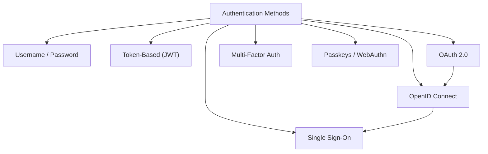

---

## 1. Username / Password Authentication

The simplest and most common method. User submits credentials, server validates, returns a session or token.

### Flow

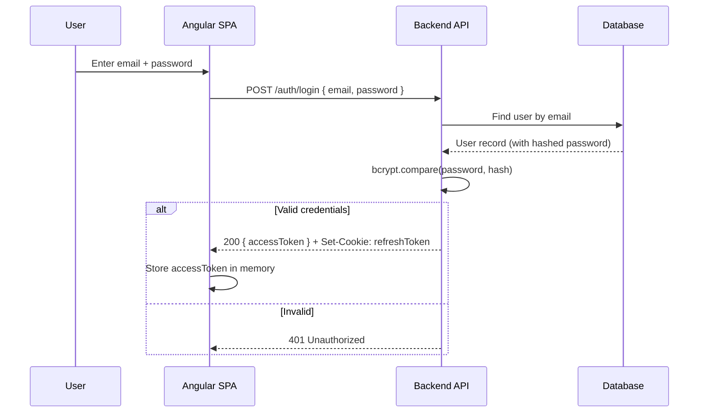

### Security Rules

| Rule | Why |
|---|---|
| Hash passwords with **bcrypt** or **argon2id** | Never store plaintext — rainbow table attacks |
| Enforce minimum password strength | Prevent brute-force with weak passwords |
| Rate-limit login attempts (5 per 15 min) | Prevent credential stuffing |
| Account lockout after N failures | Slow down brute-force |
| Never reveal "user not found" vs "wrong password" | Prevents user enumeration |
| Use HTTPS everywhere | Prevents credential sniffing |

---

## 2. JWT Deep Dive

### Structure

A JWT has three Base64URL-encoded parts separated by dots:

```
eyJhbGciOiJSUzI1NiJ9.eyJzdWIiOiIxMjM0NTY3ODkwIiwibmFtZSI6IkpvaG4ifQ.signature
  ──── Header ────    ──────────── Payload ─────────────    ─ Signature ─
```

```json
// Header
{
  "alg": "RS256",
  "typ": "JWT",
  "kid": "key-id-123"
}

// Payload (Claims)
{
  "sub": "user-123",           // Subject (user ID)
  "iss": "https://auth.app.com", // Issuer
  "aud": "https://api.app.com",  // Audience
  "exp": 1700000000,           // Expiration (Unix timestamp)
  "iat": 1699999100,           // Issued At
  "jti": "unique-token-id",    // JWT ID (for revocation)
  "role": "admin",             // Custom claim
  "permissions": ["user:read", "user:write"]
}
```

### Signing Algorithms

| Algorithm | Type | Key | Use Case |
|---|---|---|---|
| **HS256** | Symmetric | Single shared secret | Monoliths — same server signs and verifies |
| **RS256** | Asymmetric | Private key signs, public key verifies | Microservices — only auth server has private key |
| **ES256** | Asymmetric (ECDSA) | Smaller keys, same security | Mobile, IoT — smaller token size |
| **EdDSA** | Asymmetric (Ed25519) | Fastest verification | High-performance APIs |

**Rule of thumb:** Use RS256 for microservices (public keys can be distributed via JWKS endpoint). Use HS256 only for monoliths where the same server signs and verifies.

### JWKS (JSON Web Key Set)

In microservice architectures, the auth server publishes its public keys at a well-known URL:

```
GET https://auth.example.com/.well-known/jwks.json

{
  "keys": [
    {
      "kty": "RSA",
      "kid": "key-id-123",
      "use": "sig",
      "n": "0vx7agoebGcQ...",
      "e": "AQAB"
    }
  ]
}
```

Any service can fetch the public key and verify tokens **without sharing secrets**.

### Access Token vs Refresh Token

| | Access Token | Refresh Token |
|---|---|---|
| **Lifetime** | 15 minutes | 7 days |
| **Storage** | Memory (JS variable) | httpOnly Secure cookie |
| **Contains** | userId, role, permissions | Opaque string or JWT |
| **Sent via** | `Authorization: Bearer <token>` header | Cookie (auto-sent) |
| **Revocable** | Not easily (use blocklist) | Yes (DB record) |
| **Stateless** | Yes (self-contained) | No (server-side lookup) |

### Token Refresh Flow

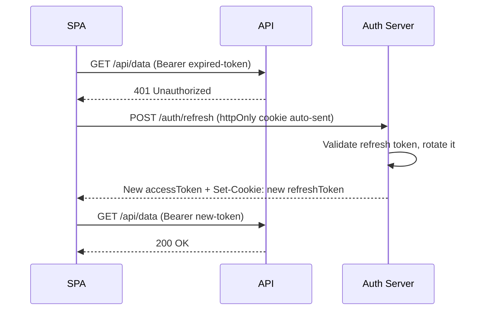

---

## 3. OAuth 2.0 — Complete Guide

OAuth 2.0 is an **authorization framework** — it lets a third-party app access a user's resources **without knowing their password**.

### Key Roles

| Role | What It Is | Example |
|---|---|---|
| **Resource Owner** | The user who owns the data | You (your Google account) |
| **Client** | The app requesting access | Your Angular SPA |
| **Authorization Server** | Issues tokens after user consent | Google OAuth, Okta, Auth0 |
| **Resource Server** | Hosts the protected API | Google Calendar API |

### OAuth 2.0 Grant Types

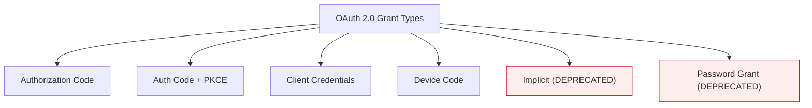

### Grant Type 1: Authorization Code (Server-Side Apps)

The most secure flow — for apps with a backend that can keep a **client secret**.

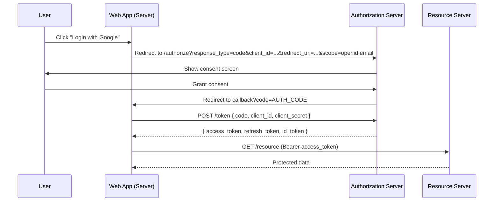

### Grant Type 2: Authorization Code + PKCE (SPAs & Mobile)

SPAs and mobile apps **cannot keep secrets**. PKCE (Proof Key for Code Exchange) solves this.

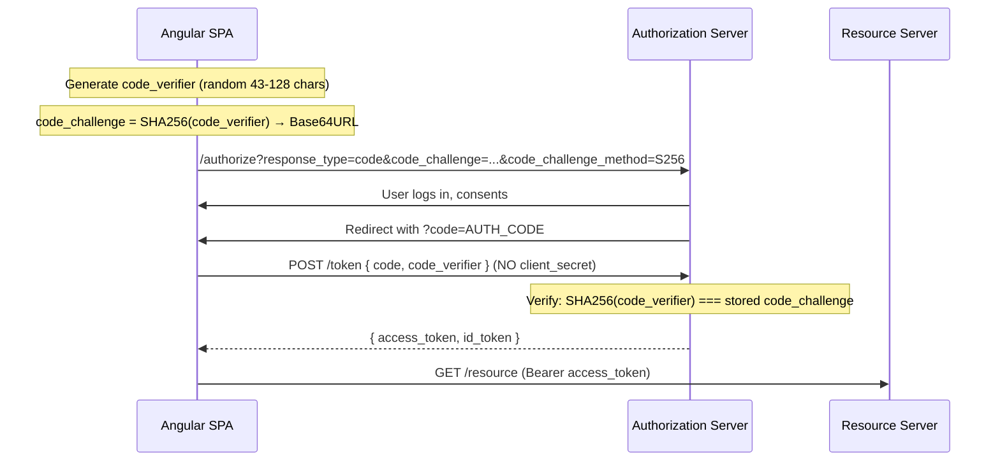

**Why PKCE works:** Even if an attacker intercepts the authorization code, they can't exchange it without the original `code_verifier` — which never left the browser.

### Grant Type 3: Client Credentials (Machine-to-Machine)

No user involved. Server authenticates itself to access another API.

```
POST /token
Content-Type: application/x-www-form-urlencoded

grant_type=client_credentials
&client_id=my-backend-service
&client_secret=secret123
&scope=api:read
```

**Use case:** Backend cron job calling another microservice, CI/CD pipelines.

### Grant Type 4: Device Code (Smart TVs, CLIs)

For devices with limited input (no browser).

```
1. Device shows: "Go to https://auth.app.com/device and enter code: ABCD-1234"
2. User opens URL on phone, enters code, logs in
3. Device polls auth server until user completes login
4. Auth server returns tokens to device
```

### Deprecated Grants

| Grant | Why Deprecated | Use Instead |
|---|---|---|
| **Implicit** | Token exposed in URL fragment (interceptable) | Auth Code + PKCE |
| **Resource Owner Password (ROPC)** | App sees user's password (defeats OAuth purpose) | Auth Code + PKCE |

---

## 4. OpenID Connect (OIDC)

OIDC is an **identity layer built on top of OAuth 2.0**. While OAuth 2.0 is about **authorization** (what can I access?), OIDC adds **authentication** (who am I?).

### OAuth 2.0 vs OIDC

| | OAuth 2.0 | OpenID Connect |
|---|---|---|
| **Purpose** | Authorization (access resources) | Authentication (prove identity) |
| **Returns** | Access token | Access token + **ID token** |
| **User info** | Not standardized | Standard `/userinfo` endpoint |
| **Scope** | Custom scopes | `openid`, `profile`, `email` |
| **Discovery** | None | `/.well-known/openid-configuration` |

### ID Token

The ID token is a JWT that contains identity claims:

```json
{
  "iss": "https://accounts.google.com",
  "sub": "110169484474386276334",
  "aud": "your-client-id.apps.googleusercontent.com",
  "exp": 1700000000,
  "iat": 1699999100,
  "nonce": "random-nonce-for-replay-protection",
  "email": "user@gmail.com",
  "email_verified": true,
  "name": "John Doe",
  "picture": "https://lh3.googleusercontent.com/..."
}
```

### OIDC Discovery

Every OIDC provider publishes a discovery document:

```
GET https://accounts.google.com/.well-known/openid-configuration

{
  "issuer": "https://accounts.google.com",
  "authorization_endpoint": "https://accounts.google.com/o/oauth2/v2/auth",
  "token_endpoint": "https://oauth2.googleapis.com/token",
  "userinfo_endpoint": "https://openidconnect.googleapis.com/v1/userinfo",
  "jwks_uri": "https://www.googleapis.com/oauth2/v3/certs",
  "scopes_supported": ["openid", "email", "profile"],
  "response_types_supported": ["code", "id_token", "code id_token"]
}
```

Angular auth libraries use this document to auto-configure themselves — you only provide the issuer URL.

---

## 5. Single Sign-On (SSO)

SSO allows a user to **log in once** and access multiple applications without re-entering credentials.

### How SSO Works

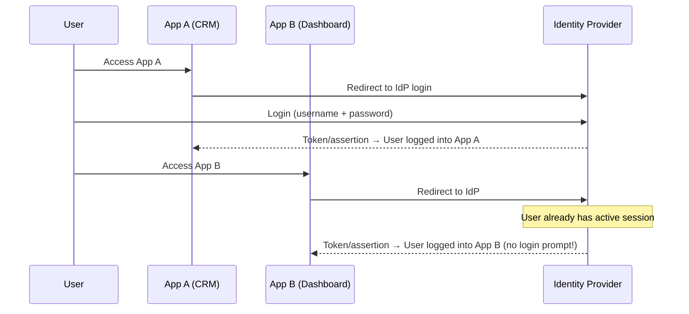

### SSO Protocols

| Protocol | Format | Best For | Example Providers |
|---|---|---|---|
| **OIDC** | JSON/JWT | Modern apps, SPAs, mobile | Okta, Auth0, Google, Azure AD |
| **SAML 2.0** | XML | Enterprise, legacy apps | ADFS, Okta, OneLogin, PingFederate |
| **CAS** | XML/JSON | Universities, legacy | Apereo CAS |

### SAML vs OIDC

| | SAML 2.0 | OpenID Connect |
|---|---|---|
| **Data format** | XML | JSON / JWT |
| **Token** | SAML Assertion (XML signed) | ID Token (JWT signed) |
| **Transport** | HTTP Redirect / POST | HTTP Redirect / REST |
| **Best for** | Enterprise SSO, legacy | Modern web & mobile apps |
| **Complexity** | High (XML parsing, signatures) | Low (JSON, standard HTTP) |
| **SPA support** | Poor (relies on server-side) | Excellent |
| **Mobile support** | Poor | Excellent |

**Modern recommendation:** Use OIDC for new projects. Use SAML only if integrating with enterprise systems that require it (many large corporations still use SAML with ADFS).

### SAML Flow (SP-Initiated)

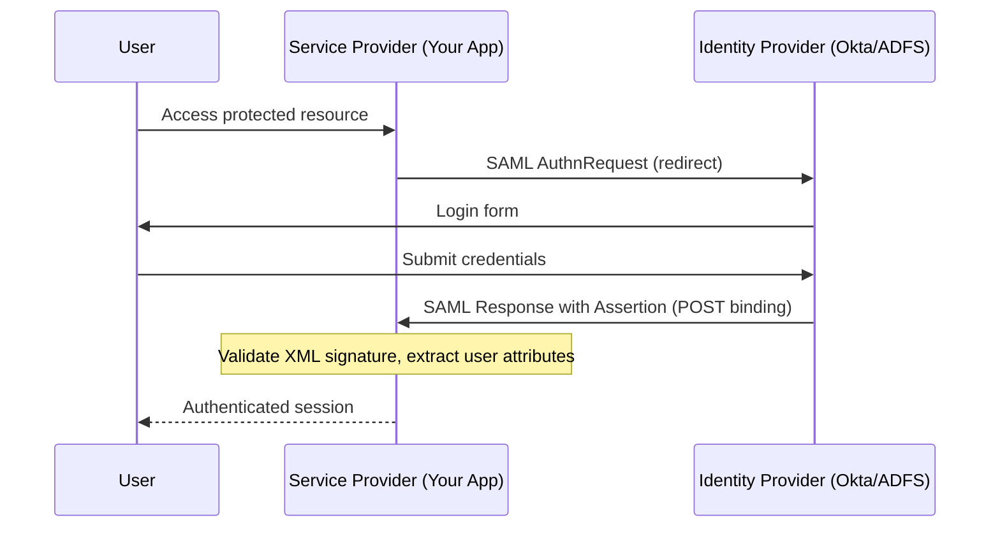

---

## 6. Identity Providers (IdPs)

### Comparison Matrix

| Provider | OIDC | SAML | MFA | Free Tier | Best For |
|---|---|---|---|---|---|
| **Okta** | Yes | Yes | Yes | 100 MAU (workforce) | Enterprise SSO, B2B |
| **Auth0** (by Okta) | Yes | Yes | Yes | 25k MAU | B2C apps, developer-friendly |
| **Azure AD / Entra ID** | Yes | Yes | Yes | Free with Azure | Microsoft ecosystem |
| **Google Identity** | Yes | No | Yes | Free (basic) | Consumer apps, Google login |
| **AWS Cognito** | Yes | Yes | Yes | 50k MAU free | AWS-native apps |
| **Firebase Auth** | Yes | No | Yes | Free (generous) | Quick prototypes, mobile |
| **Keycloak** | Yes | Yes | Yes | Free (self-hosted) | On-premise, full control |
| **SuperTokens** | Yes | No | Yes | Free (self-hosted) | Open-source, self-hosted |

### Okta

Enterprise-grade identity platform. Supports workforce identity (employees) and customer identity (CIAM).

```
Key features:
- Universal Directory (centralized user store)
- Adaptive MFA (risk-based authentication)
- Lifecycle management (provisioning/deprovisioning)
- API access management (OAuth 2.0 authorization server)
- 7000+ pre-built integrations (SAML & OIDC)
```

### Auth0

Developer-friendly identity platform (now part of Okta). Excellent for B2C.

```
Key features:
- Universal Login (hosted login page, customizable)
- Social connections (Google, GitHub, Apple, etc.)
- Passwordless (magic links, OTP)
- Actions (serverless hooks for custom logic)
- Organizations (multi-tenant B2B support)
- Attack protection (bot detection, brute-force, breached passwords)
```

### Azure AD / Entra ID

Microsoft's cloud identity service. Native to Microsoft 365 and Azure.

```
Key features:
- Seamless with Microsoft 365, Teams, Azure
- Conditional Access policies (device, location, risk-based)
- B2B collaboration (invite external users)
- B2C identity (consumer-facing apps)
- MSAL libraries for all platforms
```

### Keycloak (Open Source)

Self-hosted identity and access management. Full control, no vendor lock-in.

```
Key features:
- OIDC + SAML 2.0 support
- Identity brokering (federate with external IdPs)
- User federation (LDAP, Active Directory)
- Fine-grained authorization
- Admin console UI
- Runs in Docker / Kubernetes
```

---

## 7. Multi-Factor Authentication (MFA)

### Factor Categories

| Factor | Type | Examples |
|---|---|---|
| **Something you know** | Knowledge | Password, PIN, security questions |
| **Something you have** | Possession | Phone (OTP), hardware key (YubiKey), authenticator app |
| **Something you are** | Biometric | Fingerprint, face recognition, iris scan |

### MFA Methods Compared

| Method | Security | UX | Phishing Resistant |
|---|---|---|---|
| **SMS OTP** | Low | Easy | No (SIM swapping, interception) |
| **Email OTP** | Low | Easy | No (email compromise) |
| **TOTP (Authenticator app)** | Medium | Moderate | No (can be phished in real-time) |
| **Push notification** | Medium | Best | Partial (prompt bombing) |
| **Hardware key (FIDO2/WebAuthn)** | Highest | Moderate | Yes |
| **Passkeys** | Highest | Best | Yes |

### TOTP (Time-Based One-Time Password)

Used by Google Authenticator, Authy, Microsoft Authenticator.

```
1. Server generates a secret key (Base32 encoded)
2. User scans QR code into authenticator app
3. Both server and app compute: HMAC-SHA1(secret, floor(time / 30))
4. Result → 6-digit code, valid for 30 seconds
5. Server accepts current code ± 1 window (to handle clock drift)
```

### FIDO2 / WebAuthn (Passkeys)

The future of authentication — no passwords, phishing-proof.

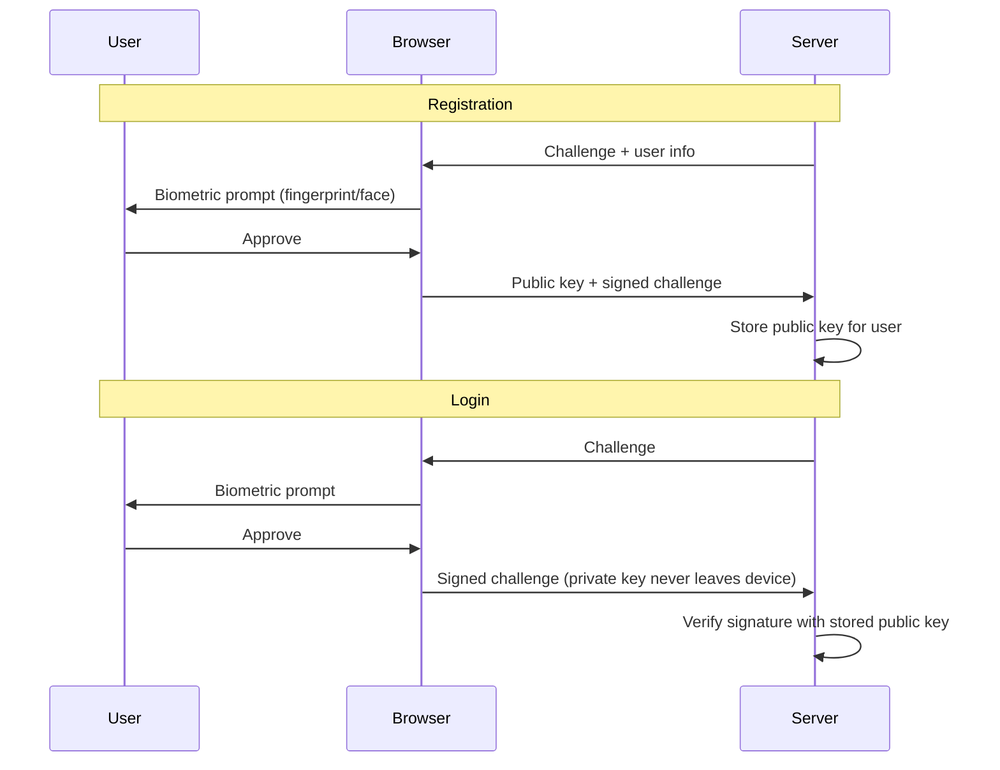

---

## 8. Session-Based vs Token-Based Authentication

| Criteria | Session-Based | Token-Based (JWT) |
|---|---|---|
| **State** | Server stores session in memory/Redis | Stateless — token contains all info |
| **Storage** | Session ID in cookie | Token in memory + refresh in cookie |
| **Scalability** | Needs shared session store (Redis) | Any server can verify (public key) |
| **Revocation** | Instant (delete session) | Hard (short expiry + blocklist) |
| **Cross-domain** | Difficult (cookie same-origin) | Easy (token in header) |
| **Mobile** | Difficult | Easy |
| **CSRF risk** | Yes (cookie auto-sent) | No (manual header) |
| **XSS risk** | Lower (httpOnly cookie) | Higher if token in localStorage |
| **Best for** | Server-rendered apps, admin panels | SPAs, mobile apps, microservices |

### When to Use What

```
Session-Based:
  ✓ Traditional server-rendered apps (Express + EJS, Rails)
  ✓ Admin dashboards needing instant revocation
  ✓ Simple monolithic architectures

Token-Based (JWT):
  ✓ Single Page Applications (Angular, React, Vue)
  ✓ Mobile app backends
  ✓ Microservice architectures
  ✓ Cross-domain / cross-origin APIs
  ✓ Third-party API access
```

---

## 9. Angular Auth — Packages & Implementation

### Package Comparison

| Package | IdP Support | OIDC | OAuth 2.0 | PKCE | SSO | Stars |
|---|---|---|---|---|---|---|
| **angular-oauth2-oidc** | Any OIDC provider | Yes | Yes | Yes | Yes | 1.9k+ |
| **@auth0/auth0-angular** | Auth0 only | Yes | Yes | Yes | Yes | 400+ |
| **@okta/okta-angular** | Okta only | Yes | Yes | Yes | Yes | 100+ |
| **@azure/msal-angular** | Azure AD only | Yes | Yes | Yes | Yes | 400+ |
| **@angular/fire** (auth) | Firebase only | Yes | Yes | No | No | 7k+ |

### Recommendation

| Scenario | Package |
|---|---|
| **Provider-agnostic** (Google, Okta, Keycloak, any OIDC) | `angular-oauth2-oidc` |
| **Auth0 as your IdP** | `@auth0/auth0-angular` |
| **Okta as your IdP** | `@okta/okta-angular` |
| **Microsoft / Azure AD** | `@azure/msal-angular` |
| **Firebase / Google-only** | `@angular/fire` auth module |
| **Custom backend (username/password + JWT)** | No package needed — use `HttpClient` + interceptors |

### angular-oauth2-oidc (Provider-Agnostic)

The most flexible choice — works with any OIDC-compliant provider.

```typescript
// app.config.ts
import { provideOAuthClient } from 'angular-oauth2-oidc';
import { provideHttpClient } from '@angular/common/http';

export const appConfig: ApplicationConfig = {
  providers: [
    provideHttpClient(),
    provideOAuthClient(),
  ]
};
```

```typescript
// auth.config.ts
import { AuthConfig } from 'angular-oauth2-oidc';

export const authConfig: AuthConfig = {
  issuer: 'https://your-idp.okta.com/oauth2/default',
  clientId: 'your-client-id',
  redirectUri: window.location.origin + '/callback',
  postLogoutRedirectUri: window.location.origin,
  scope: 'openid profile email',
  responseType: 'code',               // Authorization Code flow
  usePkce: true,                       // PKCE enabled
  showDebugInformation: false,
  requireHttps: true,
};
```

```typescript
// auth.service.ts
@Injectable({ providedIn: 'root' })
export class AuthService {
  private oauthService = inject(OAuthService);
  private router = inject(Router);

  isAuthenticated = signal(false);
  userProfile = signal<Record<string, unknown> | null>(null);

  constructor() {
    this.oauthService.configure(authConfig);
    this.oauthService.setupAutomaticSilentRefresh();

    this.oauthService.events.subscribe(event => {
      this.isAuthenticated.set(this.oauthService.hasValidAccessToken());
    });
  }

  async init(): Promise<void> {
    await this.oauthService.loadDiscoveryDocumentAndTryLogin();
    this.isAuthenticated.set(this.oauthService.hasValidAccessToken());

    if (this.isAuthenticated()) {
      const profile = await this.oauthService.loadUserProfile();
      this.userProfile.set(profile as Record<string, unknown>);
    }
  }

  login(): void {
    this.oauthService.initCodeFlow();
  }

  logout(): void {
    this.oauthService.logOut();
  }

  get accessToken(): string {
    return this.oauthService.getAccessToken();
  }

  get identityClaims(): Record<string, unknown> {
    return this.oauthService.getIdentityClaims();
  }
}
```

```typescript
// APP_INITIALIZER to bootstrap auth before app loads
// app.config.ts
import { APP_INITIALIZER } from '@angular/core';

function initAuth(authService: AuthService) {
  return () => authService.init();
}

export const appConfig: ApplicationConfig = {
  providers: [
    provideHttpClient(),
    provideOAuthClient(),
    {
      provide: APP_INITIALIZER,
      useFactory: initAuth,
      deps: [AuthService],
      multi: true,
    },
  ]
};
```

### @auth0/auth0-angular

```typescript
// app.config.ts
import { provideAuth0 } from '@auth0/auth0-angular';

export const appConfig: ApplicationConfig = {
  providers: [
    provideHttpClient(),
    provideAuth0({
      domain: 'your-tenant.auth0.com',
      clientId: 'your-client-id',
      authorizationParams: {
        redirect_uri: window.location.origin,
        audience: 'https://your-api.example.com',
        scope: 'openid profile email',
      },
      httpInterceptor: {
        allowedList: [
          { uri: 'https://your-api.example.com/*' }
        ]
      }
    }),
  ]
};
```

```typescript
// component using Auth0
@Component({
  template: `
    @if (auth.isAuthenticated$ | async) {
      <p>Welcome, {{ (auth.user$ | async)?.name }}</p>
      <button (click)="auth.logout({ logoutParams: { returnTo: origin } })">
        Logout
      </button>
    } @else {
      <button (click)="auth.loginWithRedirect()">Login</button>
    }
  `
})
export class NavComponent {
  auth = inject(AuthService);
  origin = window.location.origin;
}
```

### @azure/msal-angular (Azure AD / Entra ID)

```typescript
// app.config.ts
import {
  MsalModule, MsalGuard, MsalInterceptor, MsalRedirectComponent
} from '@azure/msal-angular';
import { PublicClientApplication, InteractionType } from '@azure/msal-browser';

export const appConfig: ApplicationConfig = {
  providers: [
    provideHttpClient(withInterceptorsFromDi()),
    importProvidersFrom(
      MsalModule.forRoot(
        new PublicClientApplication({
          auth: {
            clientId: 'your-client-id',
            authority: 'https://login.microsoftonline.com/your-tenant-id',
            redirectUri: window.location.origin,
          },
          cache: { cacheLocation: 'sessionStorage' },
        }),
        {
          interactionType: InteractionType.Redirect,
          authRequest: { scopes: ['user.read'] },
        },
        {
          interactionType: InteractionType.Redirect,
          protectedResourceMap: new Map([
            ['https://graph.microsoft.com/v1.0/*', ['user.read']],
          ]),
        }
      )
    ),
    { provide: HTTP_INTERCEPTORS, useClass: MsalInterceptor, multi: true },
  ]
};
```

### Custom JWT (No IdP — Username/Password)

When you own the backend and don't use an external IdP, you don't need any auth library. Use Angular's built-in `HttpClient` with functional interceptors.

```typescript
// Covered in Angular chapter 07 — Security & Auth
// Key pieces:
// 1. AuthService — stores accessToken in signal, calls /auth/login
// 2. authInterceptor — attaches Bearer token to requests
// 3. tokenRefreshInterceptor — handles 401, refreshes token
// 4. authGuard — protects routes
// 5. roleGuard — checks user role before allowing access
```

See **Angular Step by Step → Chapter 07** for complete implementation with interceptors, guards, and token refresh.

---

## 10. Auth Architecture for SPAs

### Recommended Architecture

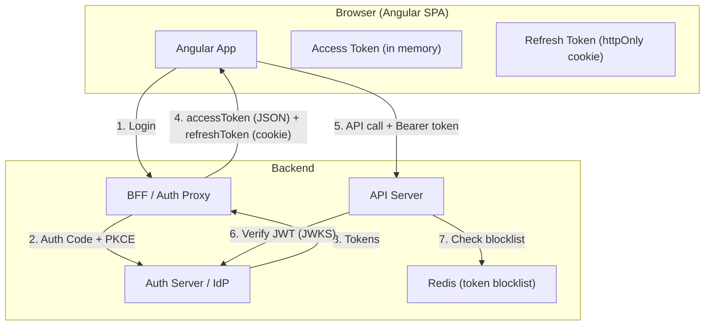

### Backend-for-Frontend (BFF) Pattern

For maximum security, the SPA never talks to the IdP directly. A lightweight backend proxy handles the OAuth flow:

```
Benefits:
- Client secret stays on the server (never exposed to browser)
- Refresh tokens managed server-side
- Reduces CSRF/XSS attack surface
- Can add additional security headers
- Simplifies SPA code (no OAuth library needed in frontend)

Trade-off:
- Additional infrastructure (backend proxy)
- Latency (extra hop)
```

### Silent Refresh vs Refresh Tokens

| Strategy | How | Pros | Cons |
|---|---|---|---|
| **Silent refresh (iframe)** | Hidden iframe loads auth page, gets new token | No refresh token needed | Blocked by third-party cookie policies |
| **Refresh token rotation** | httpOnly cookie with refresh token | Works with all browsers | Requires backend cookie handling |

**Modern recommendation:** Use refresh token rotation. Silent refresh via iframe is increasingly broken by browser privacy features (Safari ITP, Chrome third-party cookie deprecation).

---

## 11. Common Auth Flows — Decision Tree

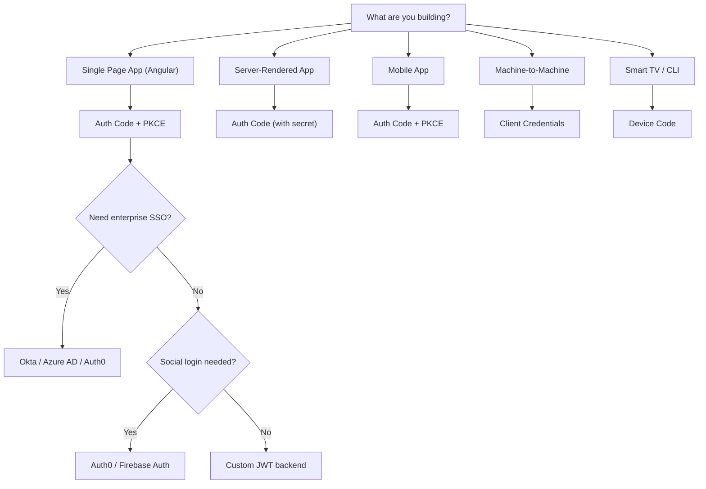

---

## 12. Security Best Practices Summary

| Practice | Details |
|---|---|
| **Use PKCE for SPAs** | Never use Implicit grant — it's deprecated |
| **Short-lived access tokens** | 15 minutes max |
| **httpOnly cookies for refresh tokens** | Never localStorage |
| **Rotate refresh tokens** | Issue new one on each use, detect reuse |
| **Validate JWT claims** | Check `iss`, `aud`, `exp`, `nbf` |
| **Use RS256 in microservices** | Verify with public key, no shared secrets |
| **HTTPS everywhere** | Tokens over HTTP = stolen tokens |
| **Implement MFA** | Especially for admin/privileged accounts |
| **Use CSP headers** | Prevent XSS-based token theft |
| **Consider BFF pattern** | Keep OAuth complexity off the client |
| **Plan for token revocation** | Short expiry + server-side blocklist for emergencies |
| **Log auth events** | Login, logout, failed attempts, token refresh — for audit |

---

## Interview Tips

1. **Know the OAuth 2.0 flows** — "For our Angular SPA, I use Authorization Code + PKCE. The SPA generates a code_verifier, hashes it to a code_challenge, and sends it with the auth request. After the user authenticates, the auth server returns an authorization code. The SPA exchanges the code + original code_verifier for tokens. Even if the code is intercepted, it's useless without the verifier."

2. **Explain OIDC vs OAuth** — "OAuth 2.0 is about authorization — it gives you an access token to call APIs. OpenID Connect adds an identity layer — it gives you an ID token (JWT) with user claims like email and name. If you need to know who the user is, you need OIDC."

3. **SSO architecture** — "We use Okta as our IdP with OIDC. Users log in once to Okta, and all our internal apps (Angular dashboard, admin portal, reporting tool) accept the same session. We configured each app as an OIDC client in Okta with its own client ID and redirect URI."

4. **Token storage strategy** — "Access tokens live in memory (a signal in our AuthService). Refresh tokens are in httpOnly Secure SameSite=Strict cookies — JavaScript can't access them. If the page refreshes, we call the /refresh endpoint. If the refresh token is expired, the user re-authenticates."

5. **Choosing an IdP** — "For enterprise B2B with SAML requirements, Okta or Azure AD. For consumer-facing B2C with social logins, Auth0 or Firebase. For full control and no vendor lock-in, Keycloak self-hosted. For a simple custom backend, just implement JWT with bcrypt yourself."

---

## Key Takeaways

- **OAuth 2.0** is for authorization (accessing resources); **OIDC** adds authentication (proving identity)
- **Auth Code + PKCE** is the only recommended flow for SPAs — never use Implicit
- **SSO** lets users log in once for multiple apps — use OIDC for modern apps, SAML for enterprise legacy
- **JWT** structure: Header.Payload.Signature — use RS256 for microservices, HS256 for monoliths
- **Identity providers** (Okta, Auth0, Azure AD) handle the hard parts — use them instead of building from scratch
- **MFA** adds a second factor — FIDO2/WebAuthn (passkeys) is the most secure and phishing-resistant
- For Angular: **angular-oauth2-oidc** is the best provider-agnostic choice; use vendor SDKs for specific IdPs
- Store access tokens in **memory**, refresh tokens in **httpOnly cookies** — never localStorage
- Consider the **BFF pattern** for maximum SPA security — keep OAuth on the server side
